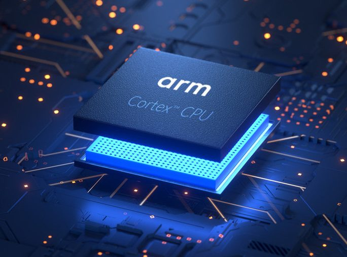

# ARM y la Computación Distribuida

**Carrera:** Ingeniería en Sistemas Computacionales

**Materia:** Lenguaje de Interfaz

**Institución:** Instituto Tecnológico de Tijuana

---

## Información del estudiante

**Nombre:** Medina Torres Jesús Geovanny

**Número de control:** 23212012

**Horario:** 16:00 pm 

---

## Introducción

La evolución de la computación ha llevado a la necesidad de sistemas capaces de procesar grandes cantidades de información de forma simultánea. La computación distribuida surge como respuesta a esta necesidad, permitiendo que múltiples dispositivos trabajen en conjunto para resolver un mismo problema.

Dentro de este contexto, la arquitectura ARM ha cobrado gran relevancia debido a su eficiencia energética, bajo consumo de recursos y adaptabilidad a distintos entornos tecnológicos. Actualmente, ARM no solo está presente en teléfonos móviles, sino también en servidores, centros de datos, sistemas embebidos y dispositivos del Internet de las Cosas (IoT).

El objetivo de esta investigación es analizar la relación entre la arquitectura ARM y la computación distribuida, explicando por qué esta arquitectura se ha convertido en una de las principales opciones para infraestructuras modernas.

---

## Arquitectura ARM

ARM (Advanced RISC Machine) es una arquitectura de procesadores basada en el modelo RISC (Reduced Instruction Set Computer). Este modelo se caracteriza por utilizar un conjunto reducido de instrucciones simples que pueden ejecutarse rápidamente, a diferencia de las arquitecturas CISC que utilizan instrucciones más complejas.

Entre sus características principales se encuentran:

* Bajo consumo energético
* Menor generación de calor
* Mayor eficiencia por watt
* Tamaño reducido de los procesadores
* Capacidad de integración en dispositivos pequeños

Estas propiedades hacen que los procesadores ARM sean ideales para dispositivos portátiles y sistemas que requieren funcionamiento continuo.

---

## Comparación entre Arquitecturas de Procesador

| Característica            | ARM (RISC)                                       | x86 (CISC)                                      |
| ------------------------- | ------------------------------------------------ | ----------------------------------------------- |
| Tipo de instrucciones     | Simples y reducidas                              | Complejas                                       |
| Consumo energético        | Bajo                                             | Alto                                            |
| Generación de calor       | Baja                                             | Alta                                            |
| Uso común                 | Dispositivos móviles, IoT, servidores eficientes | Computadoras personales y laptops tradicionales |
| Eficiencia por watt       | Muy alta                                         | Media                                           |
| Escalabilidad en clusters | Alta                                             | Media                                           |
| Aplicaciones en nube      | Edge computing y microservidores                 | Servidores tradicionales                        |
| Costo operativo           | Menor                                            | Mayor                                           |

La eficiencia energética de ARM permite utilizar más nodos con menor consumo eléctrico, lo que lo hace especialmente adecuado para sistemas distribuidos a gran escala.

---

## Computación Distribuida

La computación distribuida consiste en un sistema donde múltiples computadoras independientes trabajan juntas como si fueran una sola. Cada nodo del sistema realiza una parte del procesamiento y comparte resultados con los demás nodos mediante una red de comunicación.

Ejemplos de computación distribuida incluyen:

* Servicios en la nube
* Redes peer-to-peer
* Sistemas de microservicios
* Blockchain
* Clusters de servidores

Las principales ventajas son:

* Escalabilidad
* Alta disponibilidad
* Tolerancia a fallos
* Mejor rendimiento

---

## Relación entre ARM y la Computación Distribuida

La arquitectura ARM se ha vuelto especialmente importante en la computación distribuida debido a su eficiencia energética. En un sistema distribuido existen decenas, cientos o incluso miles de nodos, por lo que el consumo eléctrico total se convierte en un factor crítico.

Un servidor tradicional basado en arquitecturas x86 consume considerablemente más energía que múltiples nodos ARM trabajando en paralelo. Debido a esto, empresas tecnológicas han comenzado a implementar servidores ARM en centros de datos.

Además, ARM es fundamental en el crecimiento del Internet de las Cosas (IoT), donde millones de dispositivos pequeños se conectan a redes distribuidas para recolectar y procesar datos.

Ejemplos actuales incluyen:

* Raspberry Pi en clusters educativos
* Servidores ARM en la nube
* Dispositivos inteligentes conectados
* Sistemas de edge computing

---

## Aplicación en Lenguaje de Interfaz

El lenguaje de interfaz se relaciona con la forma en que el software interactúa con el hardware. En sistemas distribuidos con procesadores ARM, el software debe optimizar la comunicación entre nodos, el manejo de memoria y el uso eficiente de recursos.

Las interfaces de bajo nivel permiten:

* Comunicación entre dispositivos
* Control de periféricos
* Gestión de sensores
* Interacción con sistemas operativos ligeros (Linux embebido)

Esto es especialmente importante en dispositivos IoT donde el hardware tiene recursos limitados.

---

## Conclusión

La arquitectura ARM ha pasado de ser exclusiva de dispositivos móviles a convertirse en una pieza clave dentro de la computación distribuida. Su eficiencia energética, bajo costo y escalabilidad la hacen ideal para sistemas modernos que requieren operación continua y gran capacidad de procesamiento.

La computación distribuida continuará creciendo junto con tecnologías como la nube, el edge computing y el Internet de las Cosas, donde ARM desempeñará un papel fundamental al permitir infraestructuras más eficientes y sostenibles.

---

## Referencias

* Arm Ltd. (s. f.). *ARM architecture overview*. Arm | The architecture for the digital world. https://www.arm.com/architecture

* Patterson, D. A., & Hennessy, J. L. (2021). *Computer organization and design ARM edition: The hardware/software interface* (2nd ed.). Morgan Kaufmann.

* Tanenbaum, A. S., & Van Steen, M. (2017). *Distributed systems: Principles and paradigms* (3rd ed.). Pearson.

* Amazon Web Services. (2023). *AWS Graviton processors*. AWS Documentation. https://aws.amazon.com/ec2/graviton/

* Barroso, L. A., Clidaras, J., & Hölzle, U. (2018). *The datacenter as a computer: An introduction to the design of warehouse-scale machines* (3rd ed.). Morgan & Claypool.

* Raspberry Pi Foundation. (s. f.). *Raspberry Pi documentation*. https://www.raspberrypi.com/documentation/

* Hennessy, J. L., & Patterson, D. A. (2019). A new golden age for computer architecture. *Communications of the ACM, 62*(2), 48–60. https://doi.org/10.1145/3282307

* Shi, W., Cao, J., Zhang, Q., Li, Y., & Xu, L. (2016). Edge computing: Vision and challenges. *IEEE Internet of Things Journal, 3*(5), 637–646. https://doi.org/10.1109/JIOT.2016.2579198
