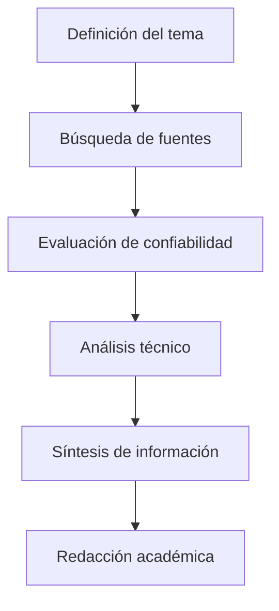
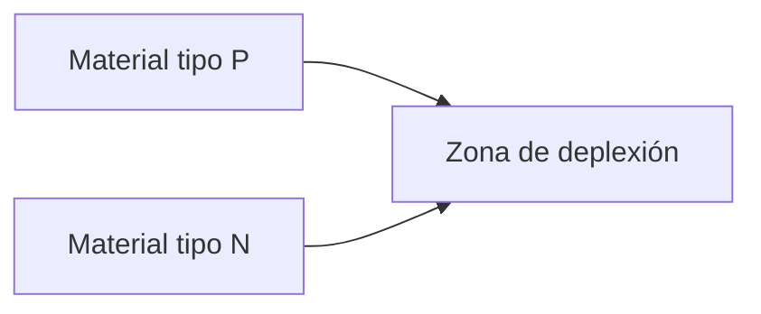
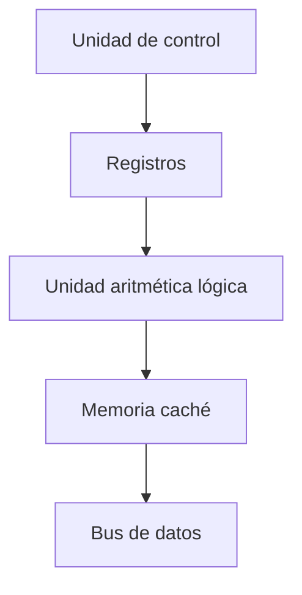
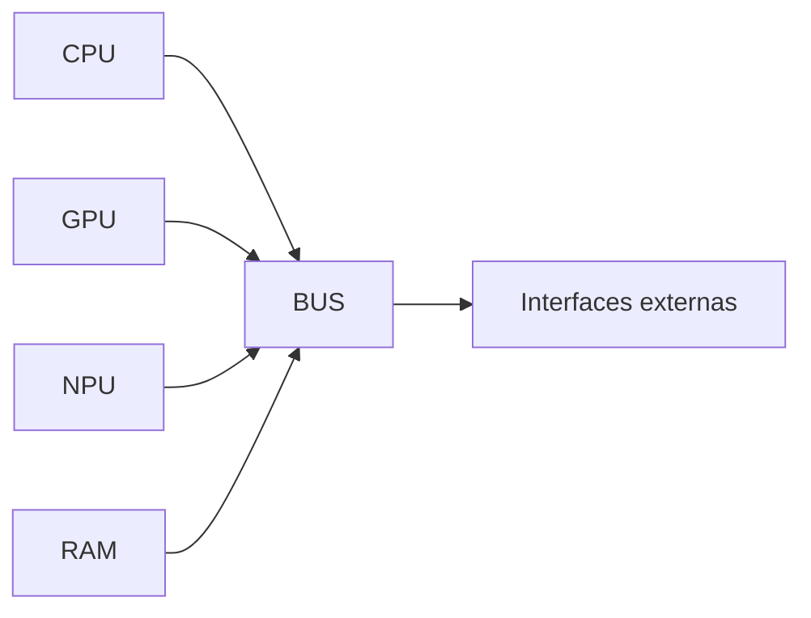

# Evolución de ARM64 y su Impacto en la Computación Moderna

---

## Resumen

La arquitectura ARM64 representa uno de los avances más significativos en el diseño moderno de procesadores debido a su eficiencia energética, escalabilidad y capacidad de integración en sistemas complejos. Este trabajo analiza la evolución de dicha arquitectura, su relación con la fabricación avanzada de semiconductores, su impacto industrial y su relevancia en el futuro de la computación. Se abordan conceptos técnicos fundamentales, innovaciones recientes, aplicaciones reales y una discusión crítica sobre su papel frente a otras arquitecturas emergentes.

---

## Palabras clave
ARM64, semiconductores, arquitectura de procesadores, SoC, eficiencia energética, RISC, computación moderna

---

## Introducción

La computación moderna se encuentra en constante evolución impulsada por la miniaturización de transistores y la optimización de arquitecturas de procesamiento. Dentro de este contexto, la arquitectura ARM64 (también conocida como AArch64) ha emergido como una de las soluciones tecnológicas más relevantes del siglo XXI. Su adopción en dispositivos móviles, servidores, sistemas embebidos y supercomputadoras demuestra su versatilidad y eficiencia.

El presente trabajo tiene como propósito analizar la arquitectura ARM64 desde una perspectiva técnica y documental, evaluando su evolución histórica, sus características internas, su impacto en la industria tecnológica y su relación con los avances en la fabricación de semiconductores.

---

## Metodología de la investigación 

El desarrollo de este trabajo se basa en el análisis de fuentes técnicas especializadas, incluyendo:

- manuales oficiales de arquitectura ARM
- artículos académicos indexados
- reportes técnicos de fabricantes de semiconductores
- libros especializados en arquitectura de computadoras

El método aplicado consiste en:

Este enfoque permite garantizar validez científica, rigor técnico y coherencia analítica.

---

## Fundamentos de semiconductores

Los semiconductores son materiales cuya conductividad eléctrica puede modificarse mediante procesos físicos y químicos controlados. Constituyen la base de todos los dispositivos electrónicos modernos.

### Tipos de semiconductores

| Tipo | Característica | Aplicación |
|-----|----------------|-----------|
| Tipo N | Exceso de electrones | Transistores |
| Tipo P | Deficiencia de electrones | Diodos |
| Intrínseco | Material puro | Investigación |
#

Figura 1 Semiconductores
---

### Unión PN

Esta unión permite controlar el flujo de corriente eléctrica y constituye la base de los circuitos integrados.

---

## Evolución de la fabricación de chips

La miniaturización de transistores ha sido el factor clave en el crecimiento del rendimiento computacional.

| Año | Nodo tecnológico |
|----|----------------|
| 1990 | 800 nm |
| 2000 | 180 nm |
| 2010 | 45 nm |
| 2020 | 7 nm |
| 2024 | 3 nm |

A menor tamaño de transistor:

- mayor densidad de procesamiento  
- menor consumo energético  
- menor generación de calor  
- mayor velocidad  

Figura 1.1 Evolocuion de transistores
---

## Arquitectura ARM64

ARM64 es una arquitectura de conjunto de instrucciones de 64 bits basada en el modelo RISC (Reduced Instruction Set Computing). Su diseño se centra en la eficiencia energética y la simplicidad de ejecución.

### Características técnicas

| Propiedad | Descripción |
|--------|-------------|
| Tipo | RISC |
| Tamaño | 64 bits |
| Registros | 31 registros generales |
| Pipeline | Profundo y optimizado |
| Consumo energético | Bajo |
| Escalabilidad | Alta |

---

### Estructura interna simplificada

---

## Filosofía RISC y eficiencia

Las arquitecturas RISC se caracterizan por ejecutar instrucciones simples en un solo ciclo de reloj. Esto reduce la complejidad del hardware y aumenta la eficiencia.

Ventajas principales:

- menor consumo energético
- mayor rendimiento por watt
- menor disipación térmica
- mayor duración de batería

---

## System on Chip (SoC)

Un SoC integra múltiples componentes en un solo chip físico.

| Componente | Función |
|-----------|--------|
| CPU | Procesamiento |
| GPU | Gráficos |
| NPU | Inteligencia artificial |
| Controladores | Periféricos |
| Memoria caché | Acceso rápido |

---

### Diagrama SoC

---

## Aplicaciones actuales de ARM64

| Sector | Uso |
|------|-----|
| Dispositivos móviles | Smartphones |
| Centros de datos | Servidores cloud |
| Computadoras personales | Chips Apple Silicon |
| Automotriz | Sistemas autónomos |
| IoT | Sensores inteligentes |

---

## Innovaciones recientes

### Chiplets
Arquitectura modular que divide un procesador en múltiples módulos interconectados.

### Aceleradores de IA
Unidades especializadas que procesan redes neuronales con gran eficiencia.

### Empaquetado 3D
Permite apilar chips verticalmente para mejorar rendimiento y reducir latencia.

---

## Virtualización e interoperabilidad

ARM64 incorpora extensiones de virtualización que permiten ejecutar múltiples sistemas operativos sobre un mismo hardware físico.

Beneficios:

- aislamiento de sistemas
- seguridad mejorada
- optimización de recursos
- eficiencia en centros de datos

---

## Comparación con otras arquitecturas

| Arquitectura | Ventaja | Desventaja |
|-------------|--------|-----------|
| ARM | Bajo consumo | Licencia propietaria |
| x86 | Compatibilidad histórica | Alto consumo |
| RISC-V | Arquitectura abierta | Ecosistema joven |

---

Figura 1.3 Chips
---

## Impacto industrial

La adopción de ARM ha transformado el panorama tecnológico global.

Ejemplos:

- Apple migró de Intel a ARM en computadoras personales.
- Amazon desarrolla procesadores ARM para sus servidores.
- Qualcomm domina el mercado móvil con chips ARM.

---

## Discusión crítica

A pesar de su éxito, ARM enfrenta retos importantes:

- competencia de arquitecturas abiertas
- dependencia de fabricantes
- transición de software legado

No obstante, su eficiencia energética y escalabilidad la posicionan como una arquitectura dominante en el futuro.

---

## Ética tecnológica y sostenibilidad

La eficiencia energética de ARM contribuye a reducir el consumo eléctrico global, especialmente en centros de datos. Esto implica menor impacto ambiental y reducción de emisiones de carbono.

Además, el diseño optimizado de hardware permite prolongar la vida útil de los dispositivos electrónicos, disminuyendo residuos tecnológicos.

---

## Conclusión

La arquitectura ARM64 constituye uno de los pilares fundamentales de la computación contemporánea. Su diseño eficiente, su capacidad de integración y su adaptabilidad a múltiples entornos la convierten en una tecnología estratégica para el desarrollo tecnológico global.

El análisis documental realizado demuestra que la evolución de los semiconductores y de las arquitecturas de procesamiento seguirá siendo el motor principal de la innovación informática en las próximas décadas.

---

## Referencias 

Arm Ltd. (2024). AArch64 architecture overview. https://developer.arm.com

Arm Ltd. (2024). What is ARM architecture? https://www.arm.com

IBM. (2023). What is a semiconductor? https://www.ibm.com/topics/semiconductors

Synopsys. (2023). Semiconductor manufacturing process. https://www.synopsys.com

Massachusetts Institute of Technology. (2023). Computer architecture course materials. https://ocw.mit.edu
