# El Rol de ARM en la Revolución del IoT y la Computación Distribuida

## 1. Análisis de Fundamentos

Para entender el impacto de ARM, primero debemos contextualizar el **IoT** según las fuentes líderes:

* **Definición (AWS):** El IoT no es solo "conectar cosas", sino una red de objetos físicos con sensores y software que intercambian datos. El valor estratégico reside en el **procesamiento de esos datos**.
* **El Rol de ARM:** Actúa como el motor de ejecución dentro de estos dispositivos. Según *Software Guru*, ARM es el estándar debido a su diseño enfocado en la **eficiencia energética**.

### Familias de Procesadores ARM

| Familia | Aplicación Principal | Ejemplo de Uso |
| --- | --- | --- |
| **Cortex-M** | Microcontroladores de ultra bajo consumo. | Sensores de humedad, wearables. |
| **Cortex-R** | Sistemas de tiempo real (deterministas). | Frenos ABS, control de motores. |
| **Cortex-A** | Sistemas operativos complejos (Linux/Android). | Gateways industriales, cámaras inteligentes. |

---

## 2. Computación en el Borde (Edge Computing)

La computación distribuida permite que el procesamiento ocurra cerca de la fuente de datos, reduciendo la dependencia de la nube.

* **Reducción de Latencia:** Decisiones críticas en milisegundos (ej. drones o maquinaria industrial) sin esperar el viaje de ida y vuelta al servidor.
* **Optimización de Banda:** Se procesa la información localmente y solo se envía lo relevante (metadatos) a la nube, en lugar de flujos de datos crudos.
* **Privacidad Local:** Los datos sensibles se analizan en el chip, cumpliendo con normativas de seguridad sin exponer información privada en la red.

---

## 3. Computación Inteligente: IA en el Silicio

La evolución hacia el **TinyML** permite ejecutar modelos de Machine Learning en dispositivos de recursos limitados.

> **Innovaciones Clave:**
> * **Helium y Neon:** Extensiones que aceleran el procesamiento de señales (DSP) y algoritmos de IA directamente en el hardware.
> * **NPUs (Ethos):** Unidades dedicadas exclusivamente a redes neuronales, permitiendo que sensores a batería reconozcan patrones de voz o imágenes.
> 
> 

---

## 4. Pilares del Dominio de ARM

¿Por qué ARM es el eje central de este sector frente a x86 u otras arquitecturas?

1. **Eficiencia (Performance per Watt):** Vital para dispositivos que dependen de baterías o *energy harvesting* (recolección de energía ambiental).
2. **Escalabilidad:** Un ecosistema unificado que abarca desde un sensor de temperatura (M0) hasta una estación base 5G (Cortex-A).
3. **Modelo de Licenciamiento:** Al no fabricar chips, sino licenciar el diseño, ARM permite que empresas (Apple, Samsung, NXP) personalicen soluciones para nichos específicos (médico, automotriz, agrícola).
 Diagrama:

```mermaid
graph TD
%% Estilos personalizados
classDef title fill:#f39c12,stroke:#e67e22,stroke-width:4px,color:#fff,font-size:18px,font-weight:bold,rx:15px,ry:15px;
classDef families fill:#3498db,stroke:#2980b9,stroke-width:2px,color:#fff,rx:8px,ry:8px;
classDef edge fill:#2ecc71,stroke:#27ae60,stroke-width:2px,color:#fff,rx:8px,ry:8px;
classDef ai fill:#9b59b6,stroke:#8e44ad,stroke-width:2px,color:#fff,rx:8px,ry:8px;
classDef pillars fill:#e74c3c,stroke:#c0392b,stroke-width:2px,color:#fff,rx:8px,ry:8px;
classDef nodeBase fill:#ecf0f1,stroke:#bdc3c7,stroke-width:2px,color:#2c3e50,font-weight:bold;

Core["🧠 ARM en la Revolución del IoT<br/>y Computación Distribuida"]:::title

Core --> Fam["1️⃣ Familias de Procesadores"]:::nodeBase
Core --> Edg["2️⃣ Edge Computing"]:::nodeBase
Core --> AIML["3️⃣ IA en el Silicio"]:::nodeBase
Core --> Pil["4️⃣ Pilares del Dominio"]:::nodeBase

%% Familias
Fam --> M["<b>Cortex-M</b><br/>🔋 Ultra bajo consumo<br/><i>Ej: Wearables, Sensores</i>"]:::families
Fam --> R["<b>Cortex-R</b><br/>⏱️ Tiempo Real<br/><i>Ej: Frenos ABS, Motores</i>"]:::families
Fam --> A["<b>Cortex-A</b><br/>💻 Sistemas Complejos<br/><i>Ej: Gateways, SO completos</i>"]:::families

%% Edge
Edg --> Lat["⚡ <b>Reducción de Latencia</b><br/>Decisiones en milisegundos"]:::edge
Edg --> Band["🌐 <b>Optimización de Banda</b><br/>Solo se envían metadatos"]:::edge
Edg --> Priv["🔒 <b>Privacidad Local</b><br/>Análisis seguro en el chip"]:::edge

%% IA
AIML --> Hel["🚀 <b>Helium y Neon</b><br/>Aceleración DSP para IA"]:::ai
AIML --> NPU["🤖 <b>NPUs Ethos</b><br/>Redes neuronales dedicadas"]:::ai

%% Pilares
Pil --> Eff["⚡ <b>Eficiencia</b><br/>Performance per Watt"]:::pillars
Pil --> Sca["📈 <b>Escalabilidad</b><br/>Desde Sensores hasta 5G"]:::pillars
Pil --> Lic["📜 <b>Licenciamiento</b><br/>Diseños a medida (Apple, NXP)"]:::pillars
```

