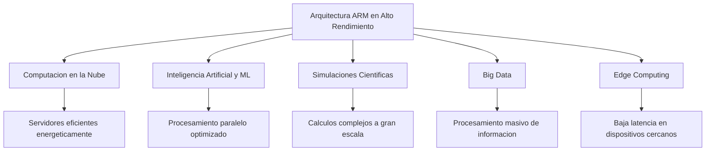

# ARM en Aplicaciones de Alto Rendimiento con Bajo Consumo

**Nombre: Orendain Camacho Diego Alejandro**

**Número de Control: 23212034**

**Hora: 5PM**

**Fecha: 17 de febrero de 2026**

# Introducción 

El crecimiento acelerado de la inteligencia artificial, la computación en la nube y el procesamiento masivo de datos ha incrementado la demanda de sistemas de alto rendimiento. Sin embargo, este aumento de capacidad computacional también implica un mayor consumo energético.

En este contexto, la arquitectura ARM ha ganado relevancia no solo en dispositivos móviles, sino también en aplicaciones de alto rendimiento donde se requiere maximizar el desempeño sin elevar significativamente el consumo de energía. Su enfoque en eficiencia por watt la convierte en una alternativa estratégica frente a arquitecturas tradicionales.

## ¿Qué es ARM?

ARM es una arquitectura de procesadores basada en el modelo RISC (Reduced Instruction Set Computing), desarrollada por Arm Holdings.

El modelo RISC utiliza instrucciones simples y optimizadas, lo que permite:

 - Mayor eficiencia energética 
 - Ejecución rápida de instrucciones 
 - Diseño escalable 
 - Alto rendimiento por watt

ARM no fabrica directamente los chips, sino que licencia su arquitectura a distintas compañías para que diseñen procesadores adaptados a diferentes necesidades, incluyendo servidores y sistemas de alto rendimiento.
 
 

## Arquitectura ARM orientada al alto rendimiento

Aunque ARM es conocida por su bajo consumo en dispositivos móviles, en los últimos años ha evolucionado para competir en entornos de alto rendimiento.

**Algunas características clave incluyen:**

 - Arquitectura multinúcleo escalable
- Soporte para virtualización
- Extensiones SIMD (NEON y SVE)
- Diseño optimizado para paralelismo

La extensión SVE (Scalable Vector Extension) permite procesar grandes volúmenes de datos en paralelo, lo cual es fundamental en aplicaciones científicas e inteligencia artificial.

## ARM en servidores y centros de datos

La arquitectura ARM ha sido adoptada por empresas tecnológicas para reducir costos energéticos en centros de datos.

Un ejemplo importante es Amazon Web Services, que desarrolló los procesadores Graviton basados en ARM para su infraestructura en la nube. Estos procesadores están diseñados para ofrecer alto rendimiento con menor consumo energético comparado con alternativas tradicionales.

También empresas como Microsoft y Google han explorado soluciones basadas en ARM para mejorar la eficiencia de sus servicios en la nube.

La eficiencia energética en centros de datos es crítica, ya que el consumo eléctrico representa uno de los principales costos operativos.

## ARM en supercomputación
ARM también ha ingresado al sector de supercomputación. Un caso destacado es el superordenador Fugaku, desarrollado en Japón, basado en procesadores ARM con extensiones SVE.

Fugaku demostró que la arquitectura ARM puede competir en aplicaciones científicas de alto rendimiento, manteniendo una eficiencia energética superior en comparación con otras arquitecturas.

Esto confirma que ARM no solo es adecuada para dispositivos móviles, sino también para sistemas de cómputo intensivo.

## Ventajas energéticas frente a otras arquitecturas

**Comparada con arquitecturas tradicionales como x86, ARM ofrece:**

 - Mayor rendimiento por watt Permite ejecutar más operaciones por
   unidad de energía consumida.
 - Menor generación de calor Reduce la necesidad de sistemas de
   enfriamiento complejos.
 - Escalabilidad eficiente Permite integrar múltiples núcleos
   manteniendo eficiencia energética.
 - Reducción de costos operativos En centros de datos, menor consumo
   energético implica menor gasto eléctrico y menor impacto ambiental.

Sin embargo, el rendimiento depende del tipo de carga de trabajo y la optimización del software.

# Aplicaciones reales
**La arquitectura ARM en alto rendimiento se utiliza en:**
- Servicios de computación en la nube
- Inteligencia artificial y aprendizaje automático
- Simulaciones científicas
- Análisis masivo de datos (Big Data)
- Edge computing

Gracias a su eficiencia energética, permite escalar el rendimiento sin aumentar proporcionalmente el consumo eléctrico.

## Diagrama 

## Conclusión
La arquitectura ARM ha evolucionado más allá del mercado móvil para posicionarse como una alternativa viable en aplicaciones de alto rendimiento. Su diseño basado en RISC, junto con extensiones vectoriales y arquitecturas multinúcleo, permite competir en servidores, centros de datos y supercomputación.

El principal aporte de ARM en este ámbito es su alto rendimiento por watt, lo que la convierte en una opción estratégica frente al creciente consumo energético del sector tecnológico.

En un entorno donde la eficiencia energética es cada vez más importante, ARM representa una solución equilibrada entre potencia de procesamiento y sostenibilidad operativa.

## Referencias
Arm. (s. f.). Architecture overview. https://www.arm.com

Amazon Web Services. (s. f.). AWS Graviton Processors. https://aws.amazon.com

Wikipedia. (s. f.). Fugaku (supercomputer). https://es.wikipedia.org/wiki/Fugaku

IONOS México. (s. f.). Arquitectura ARM. 

