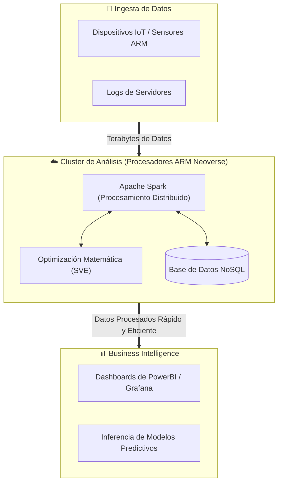

  <h1>⚡ Arquitectura ARM en Aplicaciones de Análisis de Datos</h1>
  
  
    

  
  
  
  

 

> **Resumen:** La arquitectura **ARM (Advanced RISC Machines)**, tradicionalmente conocida por dominar el mercado de dispositivos móviles y sistemas embebidos debido a su bajo consumo de energía, ha dado un salto masivo hacia los centros de datos y el análisis a gran escala. Esta transición está redefiniendo cómo las empresas procesan grandes volúmenes de datos en la nube.

---

## 📑 Tabla de Contenidos
1. [Contexto: El Ascenso de ARM en el Centro de Datos](#1-contexto-el-ascenso-de-arm-en-el-centro-de-datos)
2. [Ventajas de ARM para el Análisis de Datos](#2-ventajas-de-arm-para-el-análisis-de-datos)
3. [Casos de Uso y Ecosistema de Software](#3-casos-de-uso-y-ecosistema-de-software)
4. [Comparativa: ARM vs. x86](#4-comparativa-arm-vs-x86-en-análisis-de-datos)
5. [Arquitectura y Flujo de Procesamiento](#5-arquitectura-y-flujo-de-procesamiento)
6. [Desafíos y Consideraciones](#6-desafíos-y-consideraciones)
7. [Conclusión](#conclusión)

---

## 1. Contexto: El Ascenso de ARM en el Centro de Datos

Durante décadas, la arquitectura x86 (Intel/AMD) dominó el análisis de datos corporativo. Sin embargo, con el crecimiento exponencial de los datos y el aumento masivo de los costos energéticos, la industria comenzó a buscar alternativas más eficientes. 

Hoy en día, los gigantes de la nube han desarrollado su propio silicio basado en ARM, demostrando que pueden manejar cargas de trabajo intensivas, compitiendo e incluso superando a x86 en la métrica de **rendimiento por vatio**:
* 🟠 **AWS:** Familia Graviton (2, 3 y 4).
* 🟢 **Google Cloud:** Axion (recientemente anunciado).
* 🔵 **Microsoft Azure:** Cobalt 100.
* ⚫ **Independientes:** Ampere Altra y NVIDIA Grace.

---

## 2. Ventajas de ARM para el Análisis de Datos

La adopción de ARM en el ecosistema de *Big Data* y *Data Analytics* se debe a cuatro pilares fundamentales:

* 🔋 **Eficiencia Energética y Sostenibilidad (Green Computing):** Al usar un conjunto de instrucciones reducido (RISC), los núcleos ARM ejecutan tareas con mucho menos consumo eléctrico. Esto es crucial para reducir la huella de carbono de las granjas de servidores que procesan terabytes de datos 24/7.
* 💰 **Reducción del TCO (Costo Total de Propiedad):** Los proveedores de la nube ofrecen instancias basadas en ARM a un costo significativamente menor (frecuentemente entre un **20% y un 40% más barato**) frente a instancias x86 de capacidad equivalente.
* 🚀 **Rendimiento Predecible:** Muchos procesadores ARM para servidores están diseñados con un enfoque de "un solo hilo por núcleo" (*single-thread per core*). Esto evita los cuellos de botella generados por la compartición de recursos del Hyper-Threading tradicional.
* 📡 **Análisis en el Edge (Edge Analytics):** Dado que ARM domina los dispositivos de Internet de las Cosas (IoT), estandarizar la arquitectura desde el sensor hasta la nube permite procesar datos en el origen, reduciendo la latencia masivamente.

---

## 3. Casos de Uso y Ecosistema de Software

El ecosistema de software, impulsado por el movimiento *Cloud Native*, ha madurado rápidamente para soportar `ARM64` (también conocido como `aarch64`):

### 🐘 Big Data y Procesamiento Distribuido
* **Apache Spark y Hadoop:** Cuentan con soporte nativo. Ejecutar clústeres masivos de Spark en instancias ARM acelera los procesos ETL a una fracción del costo.
* **Data Streaming:** Plataformas como **Apache Kafka** y **Redpanda** aprovechan la alta cantidad de núcleos de ARM para manejar millones de eventos por segundo con baja latencia.

### 🗄️ Bases de Datos NoSQL y Búsqueda
Los sistemas que manejan grandes volúmenes de datos en memoria o documentos no estructurados brillan en esta arquitectura:
* **Elasticsearch / OpenSearch:** Búsqueda y análisis de logs en tiempo real.
* **MongoDB y Cassandra:** Bases de datos de altísima concurrencia.
* **Redis:** Procesamiento en memoria ultrarrápido con menor gasto energético.

### 🧠 Inferencia de Machine Learning
Aunque las GPUs dominan el entrenamiento, las CPUs ARM son cada vez más utilizadas para la **inferencia** (servir el modelo en producción). Bibliotecas como TensorFlow y PyTorch incluyen optimizaciones específicas (como instrucciones SVE) para ARM.

---

## 4. Comparativa: ARM vs. x86 en Análisis de Datos

| Característica | ⚡ Arquitectura ARM (`arm64`) | ⚙️ Arquitectura x86 (`amd64`) |
| :--- | :--- | :--- |
| **Paradigma** | RISC (Instrucciones Reducidas) | CISC (Instrucciones Complejas) |
| **Eficiencia Energética** | Muy alta (Líder en rendimiento/vatio) | Moderada a Baja |
| **Costo en la Nube** | Bajo (Instancias nativas más económicas) | Moderado / Alto |
| **Compatibilidad Legacy** | En crecimiento continuo (requiere refactorizar a veces) | Total y estándar en la industria |
| **Gestión de Hilos** | Generalmente 1 hilo por núcleo físico (Mayor aislamiento) | Hyper-threading (2 hilos por núcleo físico) |

---

## 5. Arquitectura y Flujo de Procesamiento

El siguiente diagrama ilustra cómo fluyen los datos en un entorno nativo moderno basado en procesadores ARM:

6. Desafíos y Consideraciones
A pesar de sus enormes beneficios, migrar pipelines de datos a ARM conlleva ciertos retos que deben planificarse:

Dependencias y Software Legacy: Herramientas antiguas o binarios compilados en C/C++ específicamente para x86 pueden no ejecutarse en ARM sin emulación (como Rosetta en Mac o QEMU en Linux), lo cual degrada severamente el rendimiento.

Pipelines CI/CD (Contenedores): Los ingenieros de datos deben adaptar sus flujos de integración continua para compilar imágenes de Docker multi-arquitectura (usando herramientas como docker buildx), soportando tanto arm64 como amd64.

Mantenimiento de Entornos Mixtos: Durante una migración gradual, los equipos tendrán que mantener clústeres híbridos (nodos x86 y ARM conviviendo), lo que requiere una configuración avanzada en orquestadores como Kubernetes mediante Taints y Tolerations.

Conclusión
La arquitectura ARM ha dejado de ser exclusiva del ecosistema móvil para consolidarse como una fuerza disruptiva en el procesamiento masivo de datos. Para cargas de trabajo nativas de la nube basadas en software de código abierto (Spark, Kafka, bases de datos NoSQL), ARM ofrece una ventaja competitiva indiscutible en ahorro de costos e impacto ambiental.
