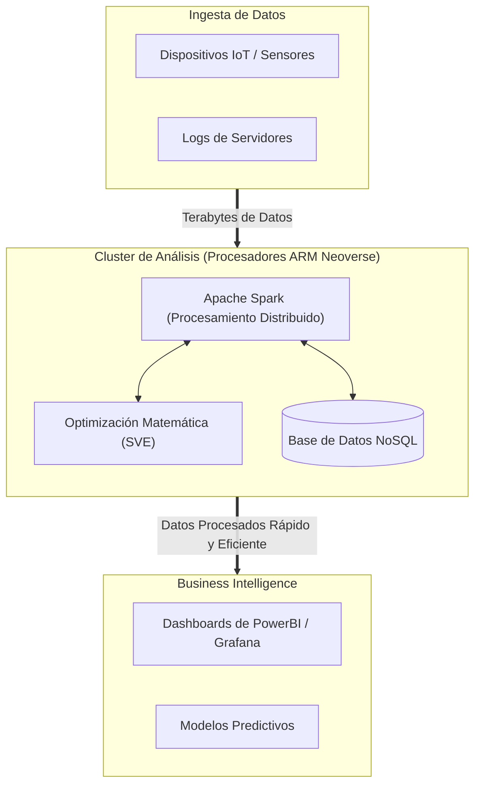

#  Arquitectura ARM en Aplicaciones de Análisis de Datos

La arquitectura **ARM (Advanced RISC Machines)**, tradicionalmente conocida por dominar el mercado de dispositivos móviles y sistemas integrados debido a su bajo consumo de energía, ha dado un salto masivo hacia los centros de datos y el análisis a gran escala. Esta transición está redefiniendo cómo las empresas procesan grandes volúmenes de datos.

---

##  Tabla de Contenidos
1. [Contexto: El Ascenso de ARM en el Centro de Datos](#1-contexto-el-ascenso-de-arm-en-el-centro-de-datos)
2. [Ventajas de ARM para el Análisis de Datos](#2-ventajas-de-arm-para-el-análisis-de-datos)
3. [Casos de Uso y Ecosistema de Software](#3-casos-de-uso-y-ecosistema-de-software)
4. [Comparativa: ARM vs. x86 en Análisis de Datos](#4-comparativa-arm-vs-x86-en-análisis-de-datos)
5. [Desafíos y Consideraciones](#5-desafíos-y-consideraciones)
6. [Conclusión](#conclusión)

---

## 1. Contexto: El Ascenso de ARM en el Centro de Datos

Durante décadas, la arquitectura x86 (Intel/AMD) dominó el análisis de datos corporativo. Sin embargo, con el crecimiento exponencial de los datos y el aumento de los costos energéticos, la industria comenzó a buscar alternativas. Procesadores como **AWS Graviton**, **Ampere Altra** y **NVIDIA Grace** han demostrado que ARM puede manejar cargas de trabajo intensivas, compitiendo e incluso superando a x86 en la métrica de rendimiento por vatio.

---

## 2. Ventajas de ARM para el Análisis de Datos

La adopción de ARM en el ecosistema de *Big Data* y *Data Analytics* se debe a tres pilares fundamentales:

*  **Eficiencia Energética Superior:** Al usar un conjunto de instrucciones reducido (RISC), los núcleos ARM ejecutan tareas con mucho menos consumo eléctrico. Esto es crucial en granjas de servidores que procesan terabytes de datos 24/7.
*  **Reducción del TCO (Costo Total de Propiedad):** Proveedores de la nube (como AWS, GCP y Azure) ofrecen instancias basadas en ARM a un costo significativamente menor (frecuentemente entre un 20% y un 40% más barato) en comparación con instancias x86 equivalentes.
*  **Aislamiento y Escalabilidad de Núcleos:** Muchos procesadores ARM para servidores están diseñados con un enfoque de "un solo hilo por núcleo" (*single-thread per core*), lo que evita los cuellos de botella del Hyper-Threading y ofrece un rendimiento más predecible en bases de datos y motores de análisis.
*  **Análisis en el Edge (Edge Analytics):** Dado que ARM domina los dispositivos de Internet de las Cosas (IoT), permite realizar análisis de datos complejos directamente en el origen de los datos (el Edge), reduciendo la latencia y los costos de transferencia hacia la nube.

---

## 3. Casos de Uso y Ecosistema de Software

El ecosistema de software para análisis de datos ha madurado rápidamente para soportar `ARM64`:

### A. Ecosistema Big Data (Hadoop y Spark)
Apache Spark y Hadoop ahora cuentan con soporte nativo para ARM. Empresas que ejecutan clústeres masivos de Spark en instancias de AWS Graviton han reportado un procesamiento de datos más rápido a una fracción del costo, ideal para procesos ETL (Extracción, Transformación y Carga) masivos.

### B. Bases de Datos NoSQL y Búsqueda
Sistemas distribuidos que manejan grandes volúmenes de datos no estructurados funcionan excepcionalmente bien en ARM:
* **Elasticsearch / OpenSearch:** Búsqueda y análisis de logs en tiempo real.
* **MongoDB y Cassandra:** Bases de datos NoSQL de alta concurrencia.
* **Redis:** Procesamiento de datos en memoria ultrarrápido.

### C. Inferencia de Machine Learning
Aunque las GPUs dominan el entrenamiento de modelos, las CPUs ARM son cada vez más utilizadas para la **inferencia** (aplicar el modelo a datos nuevos). Optimizaciones recientes en bibliotecas como TensorFlow y PyTorch para la arquitectura ARM permiten un análisis predictivo más económico.

---

## 4. Comparativa: ARM vs. x86 en Análisis de Datos

| Característica | Arquitectura ARM | Arquitectura x86 |
| :--- | :--- | :--- |
| **Conjunto de Instrucciones** | RISC (Reducido) | CISC (Complejo) |
| **Consumo Energético** | Muy bajo (Alta eficiencia) | Alto (Menor eficiencia por vatio) |
| **Costo en la Nube** | Bajo (Ej. instancias AWS Graviton) | Moderado / Alto |
| **Madurez de Software Legacy**| En crecimiento continuo | Totalmente maduro y estandarizado |
| **Densidad de Núcleos** | Muy alta (hasta 128+ núcleos reales) | Moderada (depende de Hyper-Threading) |

---
## Flujo de Procesamiento de Datos en Nodos ARM

## 5. Desafíos y Consideraciones

A pesar de sus beneficios, migrar aplicaciones de análisis de datos a ARM conlleva ciertos retos:

1. **Compatibilidad de Software (Legacy):** Herramientas antiguas, bibliotecas compiladas específicamente para x86 o software propietario pueden no ejecutarse en ARM sin emulación (lo cual degrada el rendimiento) o refactorización de código.
2. **Imágenes de Contenedores:** Los ingenieros de datos deben asegurar la creación de imágenes de Docker/Kubernetes *multi-arquitectura* (soportando tanto `arm64` como `amd64`) para evitar fallos en los pipelines de CI/CD.
3. **Dependencias de Terceros:** Aunque las herramientas principales (Python, Java, Go) soportan ARM, algunos paquetes específicos de ciencia de datos (como versiones antiguas de librerías en C/C++) pueden requerir compilación manual.

---

## Conclusión

La arquitectura ARM ya no es solo para teléfonos móviles; se ha consolidado como una fuerza disruptiva en el análisis de datos. Para cargas de trabajo nativas de la nube basadas en contenedores de código abierto (como Spark, Kafka o Elasticsearch), ARM ofrece una ventaja competitiva indiscutible en términos de costo y eficiencia energética. La decisión de migrar dependerá principalmente de las dependencias de software heredado de cada organización.
