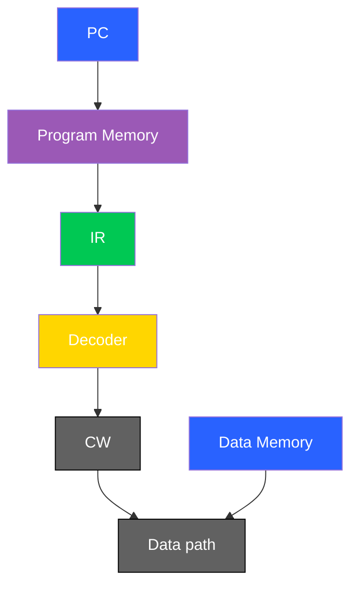

---

Materia: Lenguajes de Interfaz.

Profesor: Rene Solis Reyes.

Unidad: 1

Alumno: Gonzalez Cristobal Omar.

Actividad: 1.3 Investigación.

Título: ARM en dispositivos inteligentes del hogar

Fecha: Martes 17 de febrero de 2026.

---

# ARM en dispositivos inteligentes del hogar

### Resumen

La arquitectura ARM es un diseño de procesadores basado en el modelo RISC, destacada por su bajo consumo de energía y su eficiencia. Estas características la han convertido en una de las tecnologías más utilizadas en dispositivos inteligentes del hogar.
Equipos como televisores inteligentes, cámaras, bombillas, asistentes de voz y refrigeradores emplean ARM por su buen rendimiento, escalabilidad y rentabilidad. Aunque presenta algunos desafíos como la fragmentación y la necesidad de una correcta optimización, ARM es un componente clave en el funcionamiento y desarrollo del hogar inteligente.

---

### Introducción

En los últimos años, el avance de la tecnología ha permitido la integración de dispositivos inteligentes en el hogar, facilitando tareas cotidianas y mejorando la comodidad, la seguridad y la conectividad. Estos dispositivos, que forman parte del llamado hogar inteligente o Internet de las Cosas (IoT), requieren procesadores eficientes que les permitan funcionar de manera continua sin un alto consumo energético.

En este contexto, la arquitectura ARM ha adquirido un papel fundamental debido a su diseño eficiente, su bajo consumo de energía y su capacidad de adaptarse a distintos niveles de complejidad. Gracias a estas características, ARM se ha convertido en una de las principales bases tecnológicas de dispositivos como televisores inteligentes, cámaras de seguridad y asistentes de voz.

La presente investigación analiza qué es la arquitectura ARM, su importancia en el entorno doméstico, los principales dispositivos que la utilizan, así como sus ventajas y desventajas en el desarrollo del hogar inteligente.

---

### ¿Qué es la arquitectura ARM?

La arquitectura ARM es un diseño de procesadores basado en el modelo RISC, lo que significa que utiliza un conjunto reducido de instrucciones para trabajar de forma más eficiente. Puede funcionar en sistemas de 32 y 64 bits y fue desarrollada por ARM Holdings a finales de los años 80.

Con el tiempo, ARM se convirtió en una de las arquitecturas más utilizadas en dispositivos electrónicos debido a su bajo consumo de energía y su tamaño reducido. Gracias a estas características, se usa en microprocesadores presentes en muchos dispositivos de uso cotidiano que no requieren un alto nivel de procesamiento.

---

### Importancia de la arquitectura ARM en dispositivos inteligentes del hogar

Los chips basados en la arquitectura ARM se caracterizan por su bajo consumo de energía y alta eficiencia, lo cual es fundamental en dispositivos inteligentes del hogar que permanecen encendidos durante largos periodos o funcionan con batería. Esta eficiencia permite ofrecer un buen rendimiento sin gastar demasiada energía.
Además del ahorro energético, ARM destaca por su tamaño reducido y su facilidad de integración en dispositivos compactos, lo que resulta ideal para sensores, cámaras, asistentes inteligentes y otros equipos del hogar conectado. Estas características han convertido a ARM en la arquitectura preferida no solo en teléfonos móviles, sino también en dispositivos IoT y tecnología wearable.

---

### Principales dispositivos del hogar que usan arquitectura ARM

1. Televisores inteligentes: Incorporan procesadores ARM para ejecutar el sistema operativo, aplicaciones de streaming y funciones de conectividad. Su capacidad de procesamiento permite una experiencia fluida, mientras que su eficiencia energética ayuda a mantener un consumo moderado durante largos periodos de uso.

2. Bombillas inteligentes: Utilizan microcontroladores ARM de bajo consumo para gestionar la conexión inalámbrica y controlar funciones como encendido, intensidad y cambio de color. Su eficiencia permite que operen continuamente sin requerir un alto gasto energético.

3. Cámaras de seguridad: Integran procesadores ARM para procesar video, detectar movimiento y administrar la conexión a la red. Además, pueden incluir funciones de seguridad como cifrado de datos, lo que protege la información transmitida.

4. Asistentes de voz: Incorporan procesadores ARM capaces de ejecutar sistemas embebidos, procesar comandos de voz y coordinar otros dispositivos del hogar. Su eficiencia permite un funcionamiento constante sin un consumo excesivo de energía.

5. Refrigeradores inteligentes: Integran procesadores ARM para controlar pantallas digitales, sensores internos y conectividad a internet. Esto permite la automatización de funciones y el monitoreo remoto con un consumo energético optimizado.

---

### Seguridad

Los procesadores ARM incorporan distintas funciones de seguridad diseñadas para proteger la información y el funcionamiento del dispositivo. Una de las más importantes es TrustZone, una tecnología que permite dividir el sistema en dos entornos separados: uno seguro y otro normal. De esta manera, las aplicaciones y datos sensibles se mantienen aislados de aquellas partes del sistema que podrían ser vulnerables.

Además de TrustZone, los chips ARM pueden incluir arranque seguro, lo que garantiza que el dispositivo solo ejecute software autorizado desde el momento en que se enciende. También cuentan con funciones de criptografía, tanto mediante software como mediante hardware dedicado, y mecanismos de almacenamiento seguro de claves, lo que protege la información y las comunicaciones del sistema.

---

### Ventajas

1. Eficiencia energética y bajo consumo: ARM está diseñada para consumir poca energía gracias a su modelo RISC, que utiliza menos instrucciones y reduce el gasto energético. Esto es ideal para dispositivos que permanecen encendidos o funcionan con batería.

2. Alto rendimiento por vatio: Ofrece un buen equilibrio entre potencia y consumo, permitiendo que los dispositivos inteligentes realicen sus funciones sin gastar demasiada energía.

3. Escalabilidad y flexibilidad: ARM dispone de diferentes tipos de núcleos (Cortex-M, Cortex-R y Cortex-A) que se adaptan a distintos niveles de complejidad, desde sensores simples hasta dispositivos más avanzados.

4. Amplio ecosistema de desarrollo: Cuenta con gran soporte de software y herramientas, lo que facilita el desarrollo y mejora continua de dispositivos inteligentes.

5. Rentabilidad en dispositivos del hogar: Su menor costo permite a los fabricantes integrar tecnología inteligente en productos como cámaras, cerraduras o routers sin aumentar demasiado el precio final.

---

### Desventajas

1. Preocupaciones de seguridad: Aunque los procesadores ARM incluyen funciones de seguridad, no están libres de vulnerabilidades. En dispositivos inteligentes del hogar, como cámaras o cerraduras conectadas a internet, es necesario mantener actualizaciones y medidas de protección constantes para evitar posibles riesgos.

2. Gestión térmica en modelos de alto rendimiento: ARM es eficiente en consumo energético, pero en dispositivos más complejos, como televisores inteligentes o equipos con mayor procesamiento, puede generarse calor que debe controlarse adecuadamente para garantizar estabilidad y buen funcionamiento.

3. Fragmentación del ecosistema: Existen muchos fabricantes que diseñan sus propios chips basados en ARM. Esto puede provocar diferencias en hardware y compatibilidad, lo que complica el desarrollo de software que funcione igual en todos los dispositivos inteligentes del hogar.

4. Múltiples versiones de la arquitectura: ARM cuenta con diferentes versiones (como ARMv7 o ARMv8), lo que puede dificultar que un mismo software sea totalmente compatible entre distintos dispositivos domésticos.

5. Mayor complejidad en el desarrollo: Para aprovechar correctamente el rendimiento de ARM, se requiere un desarrollo bien optimizado. Si el software no está bien diseñado, el dispositivo puede no rendir al máximo, lo que afecta su desempeño en el entorno del hogar inteligente.

---

### Conclusión

Después de analizar la arquitectura ARM en el contexto del hogar inteligente, se puede concluir que su éxito se debe principalmente a su eficiencia energética y a su alto rendimiento por vatio, lo que permite que los dispositivos funcionen de manera continua sin un consumo excesivo de energía.

También destaca su enfoque en la seguridad, especialmente con tecnologías como TrustZone, que separa entornos seguros y no seguros dentro del sistema. Sin embargo, esto no significa que los dispositivos estén libres de vulnerabilidades, ya que la seguridad depende también de una correcta implementación y mantenimiento.

En conjunto, ARM se consolida como una arquitectura fundamental en el desarrollo y expansión de los dispositivos inteligentes del hogar.

---

### Referencias

Delgado, A. (2020, 2 octubre). ¿Qué es ARM y para qué se usa? Geeknetic. https://www.geeknetic.es/ARM/que-es-y-para-que-sirve

AACam. (2025, 26 diciembre). El impresionante legado de ARM: la arquitectura detrás de tus dispositivos móviles. AyacNet México. https://ayacnet.com/el-impresionante-legado-de-arm-la-arquitectura-detras-de-tus-dispositivos-moviles/

Arm Ltd. (s. f.). Smart home. Arm | The Architecture For The Digital World. https://www.arm.com/markets/smart-homes#Technologies

Otero, E. (2025, 15 marzo). ¿Dónde se usan los procesadores ARM? Profesional Review. https://www.profesionalreview.com/2025/03/15/donde-se-usan-los-procesadores-arm/

Gonzalez, C. (2023, 28 septiembre). Tutorial sobre cómo implementar una cerradura inteligente con componentes de Holtek. Anatronic S.A. https://anatronic.com/tutorial-sobre-como-implementar-una-cerradura-inteligente-con-componentes-de-holtek/

admin@Cranes Varsity. (2025, 22 julio). Top 5 Features That Make ARM Architecture Ideal for IoT Devices - Cranes Varsity. Cranes Varsity. https://cranesvarsity.com/top-5-features-that-make-arm-architecture-ideal-for-iot-devices/#:~:text=Given%20that%20IoT%20devices%20manage,that%20are%20tailored%20to%20ARM.

Shelley, D. (2024, 26 agosto). Careful - Arm Processors present problems - BVA Technology Services. Bva Technology Services. https://www.bvainc.com/2024/08/26/careful-arm-processors-present-problems/

GeeksforGeeks. (2025, julio 15). Advantages and Disadvantages of ARM processor. GeeksforGeeks. https://www.geeksforgeeks.org/computer-organization-architecture/advantages-and-disadvantages-of-arm-processor/
