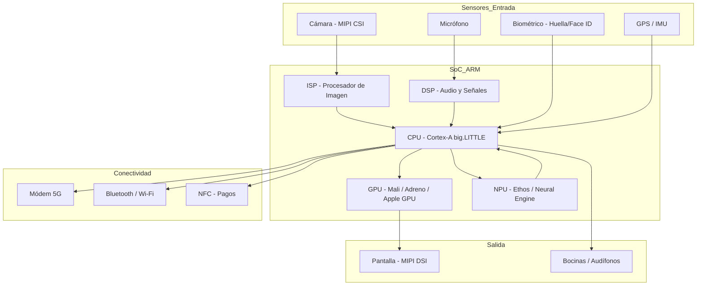

# ARM en Dispositivos Portátiles Avanzados

## Información del Estudiante

- **Nombre:** Vallejo Garcia Axel Gael  
- **Horario:** 4:00 PM  
- **Título del tema:** ARM en dispositivos portátiles avanzados  

---

## Introducción

En la última década, los dispositivos portátiles han evolucionado de simples teléfonos y reproductores de música a poderosas herramientas computacionales capaces de ejecutar inteligencia artificial, capturar video 8K, rastrear biometría en tiempo real y conectarse a redes 5G, todo desde la palma de la mano.

La arquitectura ARM ha sido el motor detrás de esta revolución. Gracias a su filosofía RISC, su excepcional eficiencia energética y su ecosistema de IP cores altamente escalable, ARM domina el mercado de los procesadores móviles: más del 95% de los smartphones del mundo utilizan chips basados en ARM.

Los procesadores de la familia **Cortex-A** y las soluciones **System on Chip (SoC)** como el Apple A-series, Qualcomm Snapdragon y Samsung Exynos son los responsables de que un teléfono moderno pueda ejecutar tareas que hace quince años requerían una computadora de escritorio.

Estos dispositivos demandan no solo potencia de procesamiento, sino también gestión térmica avanzada, seguridad biométrica, aceleración por hardware para IA y multimedia, y una autonomía de batería capaz de durar todo un día de uso intensivo.

---

## Fundamentos de la Arquitectura ARM en Dispositivos Portátiles

### Filosofía RISC Aplicada a la Movilidad

La arquitectura ARM se basa en RISC (Reduced Instruction Set Computer), lo que significa que cada instrucción es simple y ejecutable en un solo ciclo de reloj. Esta filosofía tiene un impacto directo en la portabilidad:

- **Menor consumo energético:** Instrucciones simples requieren menos transistores activos por operación.
- **Menor generación de calor:** Un chip que disipa poco calor no necesita ventiladores ni disipadores grandes.
- **Mayor densidad de integración:** Permite meter más núcleos y más funciones en un chip pequeño.

A diferencia de Intel x86 (CISC), donde una instrucción puede desencadenar docenas de microoperaciones internas, ARM hace que cada instrucción valga exactamente lo que promete, lo que es vital cuando la fuente de energía es una batería de 4,000 mAh.

---

### La Arquitectura big.LITTLE y DynamIQ

Una de las innovaciones más importantes de ARM para dispositivos portátiles es la arquitectura **big.LITTLE**, introducida en 2011 y evolucionada a **DynamIQ** en 2017.

El principio es heterogéneo: combinar núcleos de alto rendimiento con núcleos de alta eficiencia en un mismo chip:

- **Núcleos "big" (Cortex-A7x series):** Alta frecuencia, alto rendimiento para tareas exigentes como videojuegos o edición de video.
- **Núcleos "LITTLE" (Cortex-A5x series):** Baja frecuencia, bajo consumo para tareas ligeras como notificaciones, música en fondo o navegación simple.

El sistema operativo, junto con el hardware scheduler, migra las tareas entre los tipos de núcleos de forma transparente para el usuario. El resultado es un dispositivo que responde rápido cuando se necesita y ahorra batería cuando no.

**Ejemplo real:** El Snapdragon 8 Gen 3 de Qualcomm utiliza una configuración 1+5+2: un núcleo prime Cortex-X4, cinco núcleos de rendimiento Cortex-A720 y dos núcleos de eficiencia Cortex-A520.

---

### Familias Cortex en Dispositivos Portátiles

ARM divide sus diseños en tres perfiles. En el contexto portátil, los más relevantes son:

1. **Cortex-A (Application)**  
   El núcleo del smartphone. Ejecuta sistemas operativos completos como Android e iOS.  
   Maneja aplicaciones, interfaz gráfica, conectividad y servicios en segundo plano.  
   Ejemplos: Cortex-A720, Cortex-A55, Cortex-X4 (núcleo prime).

2. **Cortex-M (Microcontrolador)**  
   Presente en wearables como smartwatches y fitness trackers.  
   Gestiona sensores biométricos, pantallas pequeñas y conectividad BLE con consumo mínimo.  
   Ejemplos: Apple Watch usa núcleos derivados de Cortex-M para su sensor siempre activo.

3. **Cortex-R (Real-Time)**  
   Utilizado en módems 5G y controladores de almacenamiento UFS dentro del SoC.  
   Garantiza latencias predecibles en la transmisión de datos.

---

### Arquitectura de Registros ARM en Contexto Portátil

ARM (en su versión de 64 bits, AArch64) define un conjunto de registros optimizado para el procesamiento intensivo:

- **Registros de Propósito General (X0 – X30):**  
  31 registros de 64 bits. Son la base del rendimiento de aplicaciones como cámaras, navegadores y juegos.

- **Registros Especiales:**
  - **SP (Stack Pointer):** Maneja la pila de llamadas, fundamental para el multitasking del sistema operativo.
  - **LR (Link Register / X30):** Guarda la dirección de retorno en llamadas a funciones, clave en el rendimiento de apps.
  - **PC (Program Counter):** Dirección de la instrucción actual. No es directamente accesible en AArch64, lo que mejora la seguridad.
  - **PSTATE:** Registro de estado del procesador; controla el nivel de privilegio de ejecución (EL0 a EL3).

- **Registros SIMD/NEON (V0 – V31):**  
  128 bits cada uno. Son fundamentales para el procesamiento de señales de cámara, audio con cancelación de ruido y aceleración de redes neuronales ligeras.

---

## El SoC: Corazón del Dispositivo Portátil Moderno

### ¿Qué es un System on Chip?

Un SoC (System on Chip) integra en un solo dado de silicio todo lo necesario para que un dispositivo portátil funcione:

- Núcleos CPU (Cortex-A/X)
- GPU (Mali, Adreno, Apple GPU)
- NPU (Neural Processing Unit) para IA
- Módem (5G/4G/Wi-Fi/Bluetooth)
- ISP (Image Signal Processor) para la cámara
- Motor de criptografía por hardware
- Controlador de memoria LPDDR5
- Controlador de almacenamiento UFS 4.0

**Ejemplos de SoCs ARM líderes en el mercado:**

| SoC | Fabricante | CPU ARM | Proceso |
|---|---|---|---|
| Apple A17 Pro | Apple | Cortex-X personalizado | 3nm TSMC |
| Snapdragon 8 Gen 3 | Qualcomm | Cortex-X4 + A720 + A520 | 4nm TSMC |
| Exynos 2400 | Samsung | Cortex-X4 | 4nm Samsung |
| Dimensity 9300 | MediaTek | Cortex-X4 x4 | 4nm TSMC |

---

### La NPU: ARM e Inteligencia Artificial en el Bolsillo

Una de las adiciones más importantes a los SoCs modernos es la **Neural Processing Unit (NPU)**, diseñada específicamente para ejecutar operaciones de redes neuronales (multiplicaciones matriciales, convoluciones) con mínimo consumo.

ARM ofrece el diseño **Ethos** como IP core de NPU, usado en varios SoCs Android. Apple integra su propio Neural Engine desde el A11 Bionic (2017).

**Casos de uso de la NPU en portátiles:**
- Reconocimiento facial y biométrico en tiempo real.
- Mejora computacional de fotografía (HDR, bokeh, reducción de ruido).
- Traducción de idiomas offline.
- Asistentes de voz con procesamiento local (privado, sin nube).
- Detección de caídas en smartwatches.

---

## Gestión Energética Avanzada

### Voltage and Frequency Scaling (DVFS)

Uno de los mecanismos más importantes para la autonomía de batería en ARM es el **Dynamic Voltage and Frequency Scaling**:

- El procesador ajusta dinámicamente su voltaje y frecuencia según la carga de trabajo.
- Bajo carga ligera (lectura, música): frecuencia baja, voltaje reducido → mínimo consumo.
- Bajo carga alta (juego, grabación de video): frecuencia máxima, voltaje elevado → máximo rendimiento.

Este mecanismo es gestionado por el kernel del sistema operativo (Android/iOS) en conjunto con el hardware del SoC.

### Modos de Bajo Consumo (Power Islands)

Los SoCs ARM modernos dividen el chip en **islas de poder** (power islands): regiones que pueden ser apagadas completamente cuando no se usan. Por ejemplo:

- El bloque de la cámara se apaga cuando la app de cámara está cerrada.
- El módem 5G reduce su potencia en reposo.
- Los núcleos "big" se desactivan en standby, dejando solo los núcleos LITTLE activos.

---

## Comunicación y Conectividad

Los dispositivos portátiles modernos integran múltiples protocolos de comunicación, todos coordinados por el SoC ARM:

- **5G/LTE:** Módem integrado en el SoC (Snapdragon X70, Apple T5G).
- **Wi-Fi 7 (802.11be):** Conectividad de alta velocidad en redes locales.
- **Bluetooth 5.3/LE Audio:** Conexión con audífonos, wearables y accesorios.
- **NFC:** Pagos móviles y transferencia de datos de corto alcance.
- **MIPI:** Interfaz estándar para conectar la cámara y la pantalla al SoC (MIPI CSI-2 y MIPI DSI).
- **USB4/Thunderbolt:** En tabletas y dispositivos avanzados para conectividad externa de alta velocidad.

---

## Otros Puntos Importantes

### Rendimiento Gráfico: La GPU Integrada

Los SoCs ARM integran GPUs de alto rendimiento diseñadas para pantallas con resolución QHD+ y refresh rates de 144Hz:

- **Mali (ARM):** IP core de GPU propio de ARM, usado en Exynos y Dimensity.
- **Adreno (Qualcomm):** Diseño propietario de Qualcomm derivado de tecnología AMD.
- **Apple GPU:** Completamente personalizado por Apple, líder en rendimiento por watt.

Estas GPUs también aceleran tareas de machine learning y procesamiento de imagen junto con la NPU.

### Dispositivos Portátiles Más Allá del Smartphone

ARM no se limita al teléfono. Su presencia en el ecosistema portátil es más amplia:

- **Smartwatches:** Apple Watch (W-series + S-series), Galaxy Watch (Exynos W).
- **Tabletas:** iPad (Apple M-series basada en ARM), Galaxy Tab (Snapdragon).
- **Laptops:** MacBook Air/Pro con Apple M1/M2/M3/M4 (ARM puro), Snapdragon X Elite para Windows on ARM.
- **Consolas portátiles:** Nintendo Switch usa un Nvidia Tegra basado en ARM Cortex-A57.
- **Audífonos y wearables:** AirPods Pro (chip H2 basado en ARM), Galaxy Buds.

### Futuro de ARM en Dispositivos Portátiles

- **On-device AI más poderosa:** Los modelos de lenguaje pequeños (SLMs) como Phi-3-mini y Gemini Nano ya se ejecutan directamente en el dispositivo sin necesidad de nube.
- **ARM v9 y Scalable Vector Extension (SVE2):** Mejora drástica en el rendimiento de procesamiento vectorial para IA y multimedia.
- **Integración de DRAM en el package (3D stacking):** Reducir la latencia de acceso a memoria es el próximo gran salto.
- **Chips personalizados:** Más fabricantes (Google con Tensor, Amazon con Graviton portátil) diseñarán sus propios chips ARM para diferenciarse.

---

## Flujo de Procesamiento en un Dispositivo Portátil ARM

---

## Referencias Bibliográficas

- Profesional Review. (2025). *ARM: Qué es y para qué sirven sus procesadores*.  
  Recuperado de: [https://www.profesionalreview.com/guias/arm-que-es-y-para-que-sirven/](https://www.profesionalreview.com/guias/arm-que-es-y-para-que-sirven/)

- Qualcomm Technologies. (2025). *Snapdragon 8 Gen 3 Mobile Platform Technical Brief*.  
  Recuperado de: [https://www.qualcomm.com/products/mobile/snapdragon/smartphones/snapdragon-8-series-mobile-platforms](https://www.qualcomm.com/products/mobile/snapdragon/smartphones/snapdragon-8-series-mobile-platforms)

- Apple Inc. (2024). *Apple Silicon Overview: A-series and M-series chips*.  
  Recuperado de: [https://developer.apple.com/documentation/apple-silicon](https://developer.apple.com/documentation/apple-silicon)

- ARM Ltd. (2025). *ARM en tecnologías de consumo: Wearables*.  
  Recuperado de: [https://www.arm.com/markets/consumer-technologies/wearables](https://www.arm.com/markets/consumer-technologies/wearables)

---
