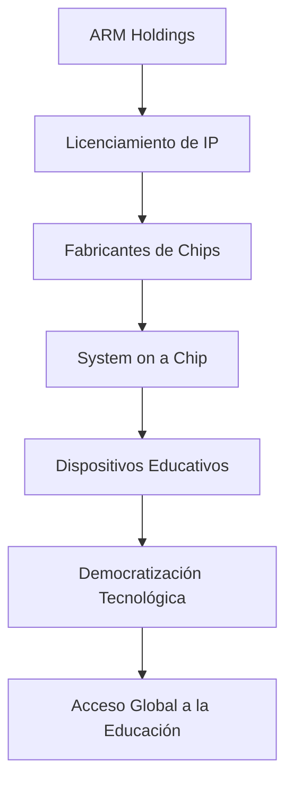

# Impacto de la Arquitectura ARM en la Democratización Tecnológica y la Educación

**Autor:** Garcia Rodriguez Marcos Daniel  
**Materia:** Lenguajes e Interfaces  
**Fecha:**  Febrero, 2026  

---

## 📑 Resumen Ejecutivo (Abstract)
La presente investigación analiza el papel fundamental de la arquitectura ARM (Advanced RISC Machine) en la reducción de la brecha digital y la democratización del acceso a la tecnología. A diferencia de las arquitecturas tradicionales x86, el modelo de negocio de propiedad intelectual (IP) de ARM y su eficiencia energética (Performance-per-Watt) han permitido la proliferación de dispositivos de bajo costo y alto rendimiento. Se examina técnicamente la arquitectura ARM64 (AArch64), el diseño de *System on a Chip* (SoC) y casos de estudio específicos como Raspberry Pi, demostrando cómo estas tecnologías han transformado la educación técnica a nivel global.

---

## 1. Introducción: El Paradigma RISC
La computación moderna ha estado históricamente dividida entre dos filosofías de diseño de conjuntos de instrucciones: CISC (*Complex Instruction Set Computing*) y RISC (*Reduced Instruction Set Computing*).

Mientras que la arquitectura x86 (dominante en PCs de escritorio) se basa en CISC, ARM se fundamenta en RISC. Esta distinción es crucial para entender su impacto educativo:

* **Simplicidad del Hardware:** Al utilizar un conjunto de instrucciones reducido y optimizado, los procesadores ARM requieren menos transistores para funciones básicas.
* **Eficiencia Térmica:** Menor cantidad de transistores activos implica menor generación de calor y consumo energético, eliminando la necesidad de sistemas de refrigeración costosos (ventiladores) en dispositivos educativos.

### 1.1 Evolución hacia ARM64 (AArch64)
La introducción de la arquitectura de 64 bits (ARMv8-A y posteriores) marcó un hito técnico. A diferencia de sus predecesores de 32 bits, **AArch64** ofrece:
* **Espacio de direccionamiento virtual:** Permite gestionar más de 4GB de RAM, esencial para cargas de trabajo modernas en educación (virtualización, compilación de software).
* **Registros de Propósito General:** Aumenta a 31 registros de 64 bits (X0-X30), reduciendo la necesidad de acceder a la memoria principal (RAM), lo que acelera el procesamiento y reduce el consumo de energía.

---
## 📊 Diagrama de Flujo del Ecosistema ARM

## 2. El Modelo de Negocio como Motor de Democratización
A diferencia de Intel, que diseña y fabrica sus propios chips (modelo IDM - *Integrated Device Manufacturer*), ARM Holdings opera bajo un modelo de **Licenciamiento de Propiedad Intelectual (IP)**.

### 2.1 Desacoplamiento de Diseño y Fabricación
ARM no fabrica chips; vende los planos (diseños lógicos) a terceros. Esto ha generado un ecosistema competitivo donde múltiples fabricantes innovan sobre la misma base:

1.  **Licenciamiento:** Empresas como Broadcom, Qualcomm, Samsung o Apple licencian los núcleos (Cores) de ARM.
2.  **Integración (SoC):** Estos fabricantes integran el CPU ARM con otros componentes (GPU, NPU, Módems, controladores I/O) en una sola pastilla de silicio, creando un *System on a Chip* (SoC).
3.  **Fabricación:** El diseño final se envía a *foundries* (fábricas) como TSMC o GlobalFoundries.

**Impacto en la Democratización:**
Este modelo reduce drásticamente las barreras de entrada. No es necesario tener una fábrica de billones de dólares para diseñar un chip educativo. Esto ha bajado los precios de los procesadores de cientos de dólares a menos de $10 USD por unidad en volúmenes altos, haciendo viable la creación de computadoras ultra-económicas.

---

## 3. Arquitectura de Hardware y Educación: Casos de Estudio

### 3.1 Raspberry Pi y el Ordenador de Placa Única (SBC)
El caso más paradigmático de la democratización tecnológica impulsada por ARM es la fundación Raspberry Pi.
* **El Problema:** La educación en ciencias de la computación se estaba volviendo teórica debido al alto costo del hardware x86 y el miedo a dañar equipos costosos.
* **La Solución ARM:** Utilizando un SoC Broadcom (basado en núcleos ARM Cortex-A), se logró crear una computadora completa por $35 USD (y modelos Zero por $5 USD).
* **Impacto Técnico:** Permite a los estudiantes interactuar directamente con pines GPIO (*General Purpose Input/Output*), aprendiendo no solo programación de alto nivel (Python), sino también electrónica y arquitectura de computadores a nivel físico.

### 3.2 BBC micro:bit y los Sistemas Embebidos
Para la educación primaria y secundaria, la arquitectura ARM Cortex-M (serie de microcontroladores) ha sido vital. Dispositivos como el **BBC micro:bit** utilizan procesadores ARM de 32 bits de consumo ultra bajo.
* **Relevancia:** Introduce a los estudiantes al concepto de *Bare-metal programming* y sistemas de tiempo real sin la complejidad de un sistema operativo completo.

---

## 4. Innovaciones Tecnológicas y Futuro

### 4.1 Eficiencia Energética y Sostenibilidad
En regiones con infraestructura eléctrica inestable o costosa, la eficiencia de ARM es un factor de inclusión digital. Un laboratorio de computación basado en arquitectura ARM consume aproximadamente un **10-15% de la energía** requerida por un laboratorio tradicional de torres x86.
> **Dato Técnico:** Un procesador ARM moderno puede entregar un rendimiento aceptable para ofimática y programación web con un TDP (*Thermal Design Power*) de menos de 5 Watts.

### 4.2 IA en el Borde (Edge AI) y NPUs
Las nuevas iteraciones de la arquitectura ARM (ARMv9) incluyen extensiones vectoriales como SVE (*Scalable Vector Extension*) y la integración de **NPUs (Neural Processing Units)** en el SoC.
Esto permite la "democratización de la Inteligencia Artificial": los estudiantes pueden entrenar y ejecutar modelos de *Machine Learning* (como reconocimiento de imágenes) localmente en dispositivos de bajo costo, sin depender de costosos servicios en la nube ni de una conexión a internet de alta velocidad.

---

## 5. Conclusiones
La arquitectura ARM ha trascendido su rol original en dispositivos móviles para convertirse en el pilar de la democratización tecnológica educativa. A través de su eficiencia energética inherente a la arquitectura RISC y su modelo de negocio de licenciamiento abierto, ARM ha permitido:
1.  La reducción drástica de costos de hardware ($5 - $35 USD).
2.  El acceso a computación de propósito general en regiones en vías de desarrollo.
3.  La innovación continua mediante la integración de SoCs personalizados para la educación.

El futuro de la educación técnica dependerá de la capacidad de integrar estas arquitecturas eficientes con nuevas tendencias como la Inteligencia Artificial en el borde, preparando a los estudiantes no solo como consumidores de tecnología, sino como creadores que comprenden el funcionamiento profundo del hardware que utilizan.

---

## 6. Referencias Bibliográficas

1.  **Arm Ltd.** (2025). *Arm Architecture Reference Manual for A-profile architecture*. Documentación Oficial Técnica.
2.  **Upton, E., & Halfacree, G.** (2016). *Raspberry Pi User Guide*. Wiley.
3.  **Furber, S.** (2017). *Microprocessors: the engines of the digital age*. Proceedings of the Royal Society A.
4.  **Hennessy, J. L., & Patterson, D. A.** (2019). *Computer Architecture: A Quantitative Approach*. Morgan Kaufmann.
5.  **Foundation, R. P.** (2024). *Democratizing technology: The impact of low-cost computing in education*. Raspberry Pi Press.

---

