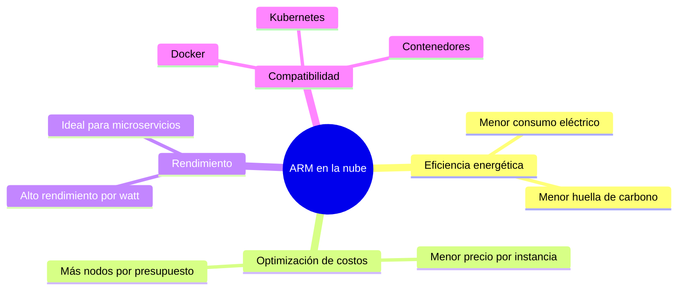

# Tecnologías Emergentes en Computación

**Pineda Gomez Ricardo Alejandro**  
**Fecha:** 24 de febrero de 2026

## ARM en la nube y servicios escalables

### 1. Introducción

En los últimos años, la arquitectura **ARM (Advanced RISC Machine)** ha ganado gran relevancia en el ámbito de la computación en la nube. Tradicionalmente utilizada en dispositivos móviles por su bajo consumo energético, ARM ahora compite directamente con arquitecturas como x86 en centros de datos, gracias a su eficiencia, rendimiento por watt y capacidad de escalabilidad.

La integración de ARM en infraestructuras cloud representa una evolución significativa en la optimización de costos, eficiencia energética y rendimiento en servicios digitales modernos.

---

### 2. ¿Qué es ARM?

ARM es una arquitectura basada en el modelo **RISC (Reduced Instruction Set Computing)**.

| Característica | Descripción |
|---|---|
| Conjunto de instrucciones | Reducido (RISC), operaciones simples por ciclo |
| Eficiencia energética | Menor consumo vs arquitecturas CISC como x86 |
| Diseño del procesador | Simplificado, menos transistores por instrucción |
| Rendimiento por watt | Alto, ideal para centros de datos y dispositivos móviles |

Estas características la hacen ideal para entornos donde el consumo energético y la eficiencia son factores críticos, como los centros de datos.

---

### 3. ARM en la nube

Grandes proveedores de servicios en la nube han incorporado procesadores ARM en su infraestructura:

| Proveedor | Solución ARM | Casos de uso destacados |
|---|---|---|
| Amazon Web Services | Graviton (v1, v2, v3, v4) | Microservicios, bases de datos, contenedores |
| Microsoft Azure | Instancias Cobalt 100 | Cargas de trabajo generales, apps web |
| Google Cloud | VMs con Ampere Altra | Kubernetes, procesamiento distribuido |

Estas soluciones permiten ejecutar aplicaciones en servidores ARM con ventajas como:

- Menor costo por hora de uso.
- Reducción en consumo energético.
- Mejor rendimiento en cargas de trabajo específicas (microservicios, contenedores, aplicaciones web, bases de datos ligeras).

---

### 4. Servicios escalables en la nube

La escalabilidad es una característica fundamental del cloud computing. Se refiere a la capacidad de un sistema para adaptarse a cambios en la demanda de recursos.

Existen dos tipos principales:

#### Escalabilidad vertical
- Aumenta los recursos de una sola máquina (más CPU, más RAM).
- Fácil de implementar.
- Limitada por el hardware disponible.

#### Escalabilidad horizontal
- Añade más instancias o servidores.
- Ideal para arquitecturas distribuidas.
- Mayor tolerancia a fallos.

Los procesadores ARM favorecen la escalabilidad horizontal debido a su eficiencia y menor costo por instancia, permitiendo desplegar múltiples nodos sin incrementar excesivamente el gasto energético.

---

### 5. Beneficios de ARM en servicios escalables

1. **Eficiencia energética**  
   Reduce el consumo eléctrico en centros de datos.

2. **Optimización de costos**  
   Menor precio por instancia comparado con alternativas tradicionales.

3. **Alto rendimiento por watt**  
   Excelente relación entre potencia y consumo.

4. **Ideal para microservicios y contenedores**  
   Compatible con tecnologías como Docker y Kubernetes.

5. **Sostenibilidad**  
   Menor huella de carbono en infraestructuras cloud.

---

### 6. Casos de uso comunes

- Aplicaciones web de alto tráfico.
- Servicios de streaming.
- Plataformas SaaS.
- Microservicios basados en contenedores.
- Procesamiento de datos distribuido.
- Edge computing.

---

### 7. Desafíos y limitaciones

Aunque ARM ofrece múltiples ventajas, también presenta algunos retos:

- Compatibilidad de software heredado.
- Necesidad de recompilar aplicaciones.
- Algunas herramientas aún optimizadas principalmente para x86.

Sin embargo, el ecosistema ARM está creciendo rápidamente, reduciendo estas barreras con el tiempo.

---

### 8. Conclusión

La adopción de ARM en la nube representa una transformación importante en la infraestructura tecnológica moderna. Gracias a su eficiencia energética, reducción de costos y capacidad de escalabilidad, se ha convertido en una opción atractiva para empresas que buscan optimizar sus servicios cloud.

A medida que más proveedores adopten esta arquitectura y el software continúe adaptándose, ARM probablemente jugará un papel clave en el futuro de la computación en la nube y los servicios escalables.

## Referencias

- :contentReference[oaicite:0]{index=0}. (2023). *Arm architecture overview*. Recuperado de https://www.arm.com/architecture

- :contentReference[oaicite:1]{index=1}. (2023). *AWS Graviton processors*. Recuperado de https://aws.amazon.com/ec2/graviton/

- AWS Graviton. (2023). *Performance and cost optimization with Graviton*. Amazon Web Services Documentation.

- :contentReference[oaicite:3]{index=3}. (2023). *Azure virtual machines on Arm architecture*. Recuperado de https://azure.microsoft.com/

- :contentReference[oaicite:4]{index=4}. (2023). *Arm-based workloads on Google Cloud*. Recuperado de https://cloud.google.com/

- Hennessy, J. L., & Patterson, D. A. (2019). *Computer Architecture: A Quantitative Approach* (6th ed.). Morgan Kaufmann.

- Marinescu, D. C. (2017). *Cloud Computing: Theory and Practice*. Morgan Kaufmann.
