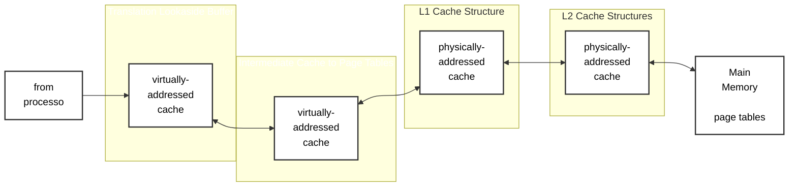
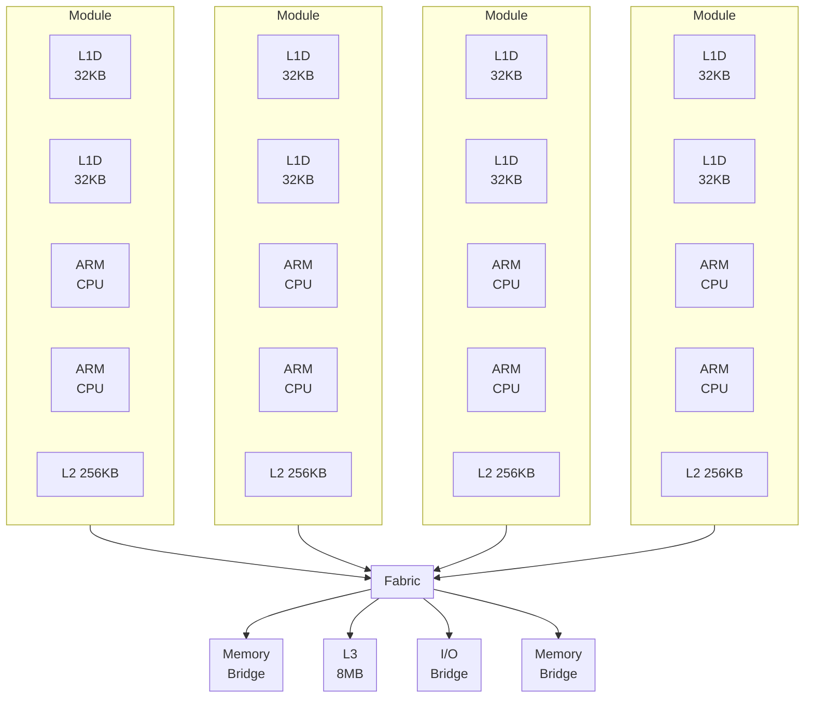
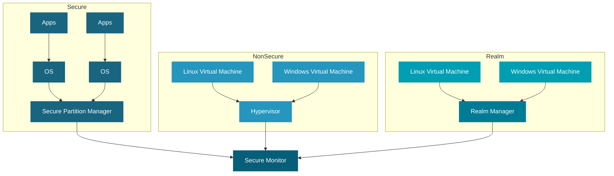
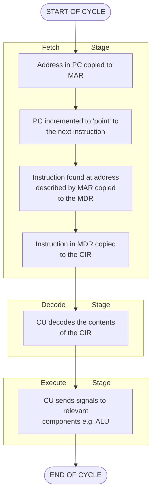
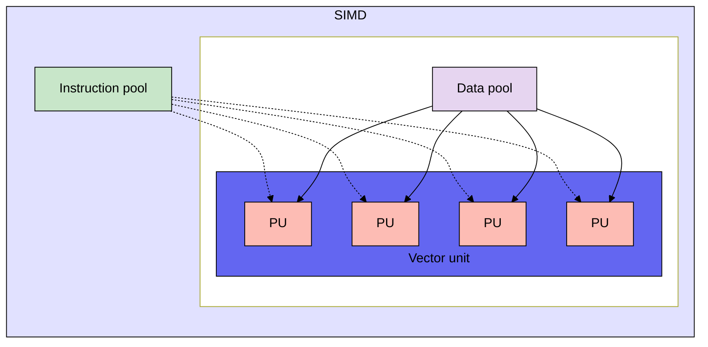

## ARM en plataformas de videojuegos móviles

  

	
---

## Información Académica

**Alumno:** Christopher Angel Molina Cano  
**Número de Control:** 23212022                          
**Asignatura:** Lenguajes de Interfaz  
**Horario:** 4:00 PM  
**Docente:** RENE SOLIS REYES  
**Fecha de Entrega:** 17 de febrero de 2026  

---

## Resumen

¿Qué es ARM?

La arquitectura ARM es la base tecnológica en la mayor parte de los dispositivos móviles como como los smartphones, tablets y los sistemas embebidos. Está arquitectura se encuentra basada en el modelo RISC (Reduced Instruction Set Computing); está caracterizada por ser eficiente energéticamente, tener un diseño compacto y ser escalable, lo que la vuelve en una solución ideal para plataformas que necesitan alto rendimiento junto a un bajo consumo de energía.

En el área de los juegos móviles, donde se necesita de un equilibrio entre rendimiento gráfico, procesamiento y la autonomía de batería es necesario que los procesadores ARM trabajen de forma eficiente.

En el siguiente trabajo busca analizar la arquitectura ARM, algunas de sus características, ciertas ventajas que tiene sobre otras arquitecturas tradicionales como x86, así como su impacto en el desarrollo y ejecución de videojuegos móviles; además, se exploran las aplicaciones en dispositivos de alto rendimiento y su evolución hacia sectores como la computación en la nube y el alto rendimiento (HPC).

---

## Introducción 

La arquitectura ARM (Advanced RISC Machine) fue desarrollada por Acorn Computers en la década de 1980 y posteriormente fue licenciada por ARM Holdings; desde entonces se ha ido consolidando como una de las arquitecturas de procesadores más usadas en los dispositivos móviles. Su diseño se basa en el paradigma RISC (Reduced Instruction Set Computing), el cual emplea un conjunto reducido y simplificado de instrucciones que facilita una ejecución más rápida y eficiente en comparación con otras arquitecturas. Gracias a ello, ARM prioriza la eficiencia energética y el rendimiento térmico, diferenciándose de arquitecturas como x86.

Estas características la han impulsado a ser adoptada masivamente en smartphones y tablets, donde se necesita la potencia de cálculo, gráficos y el consumo de batería es esencial. En el área de los videojuegos móviles, ARM garantiza experiencias fluidas y sostenibles, lo que permite que los dispositivos soporten títulos cada vez más complejos sin comprometer la autonomía del usuario.

---

## Marco teórico: Arquitectura ARM

**Arquitectura RISC:** 

La arquitectura ARM se encuentra fundamentada en el paradigma RISC (Reduced Instruction Set Computing), está arquitectura es caracterizada por usar un conjunto reducido y simplificado de instrucciones. Gracias a esto se puede hacer una ejecución mucho más rápida y eficiente, con el menor consumo de energía, así como también una mayor facilidad de implementación si lo comparamos con arquitecturas más complejas como CISC. Es debido a estás características que la arquitectura ARM se ha vuelto la base en la mayoría de los procesadores móviles actuales.

**Evolución de la arquitectura ARM en el gaming móvil**

La evolución de la arquitectura ARM ha sido un factor clave en el crecimiento del rendimiento en videojuegos móviles. No solo se ha incrementado la potencia, sino que también se han añadido mejoras estructurales en seguridad, paralelismo y procesamiento multimedia.

**ARMv7 (32 bits)**

- Presente en generaciones anteriores de smartphones.
- Limitado a direccionamiento de memoria menor a 4GB.
- Suficiente para juegos móviles básicos.

**Jerarquía de Memoria y Flujo de Traducción de Direcciones (MMU/TLB) en ARMv7.**

**ARMv8 (64 bits)**

- Introduce soporte completo de 64 bits.
- Mayor capacidad de memoria.
- Mejor rendimiento en cálculos complejos.
- Mejora del IPC.
- Incorporación formal de extensiones SIMD (NEON).

**Arquitectura Multinúcleo, Jerarquía de Caché L1/L2/L3 y Coherencia de Datos en ARMv8.**

**ARMv9**

- Mejora en seguridad (Confidential Compute Architecture).
- Mejoras en rendimiento de IA.
- Mayor optimización para cargas multinúcleo.
- Preparación para ray tracing móvil.

**Modelo de Seguridad Arm CCA (Confidential Compute Architecture) y Aislamiento de Realms en Armv9.**

**Comparativa ARM vs. x86 en videojuegos móviles**

Para comprender las diferencias claves entre ARM frente a otras arquitecturas como la x86 (que es usada principalmente por fabricantes como Intel y AMD), se deben comparar las características técnicas claves.

La arquitectura ARM se encuentra basada en el paradigma RISC (instrucciones simples y eficientes), por otro lado, la arquitectura x86 usa a CISC (donde las instrucciones son más complejas y pesadas). Debido a esto la arquitectura x86 no es la ideal para entorno móviles, en donde el consumo de energía y la disipación térmica son limitados, esta diferencia resulta esencial al analizar las arquitecturas para dispositivos móviles.

| Característica               | ARM                      | x86                                    |
| ---------------------------- | ------------------------ | -------------------------------------- |
| Tipo de arquitectura         | RISC                     | CISC                                   |
| Consumo energético           | Muy bajo                 | Más alto                               |
| Rendimiento por watt         | Alto                     | Medio                                  |
| IPC (promedio móvil)         | Alto en diseños modernos | Alto, pero con mayor consumo           |
| Frecuencia típica            | Moderada                 | Alta                                   |
| Diseño multinúcleo eficiente | Sí (big.LITTLE)          | Sí, pero menos enfocado a bajo consumo |
| Dominio en móviles           | Sí (casi total)          | Muy limitado                           |

**Diagrama Comparativo: ARM vs x86**

**Interpretación**

Aunque los procesadores x86 tienen la capacidad de ofrecer un alto rendimiento bruto, se caracterizan por un alto consumo energético y generación de calor, lo que vuelve a esta arquitectura la menos adecuada para dispositivos como smartphones.  Por el contrario, ARM:

- Mantiene alto IPC sin necesidad de frecuencias extremas.
- Prioriza rendimiento por watt.
- Usa arquitecturas heterogéneas como big.LITTLE.
- Tiene un diseño optimizado para espacios térmicos reducidos.

Gracias a estos motivos, ARM domina el mercado de videojuegos móviles, mientras que x86 continúa siendo esencial en PCs y consolas tradicionales.

**Núcleos Cortex:**

ARM organiza sus procesadores en familias de núcleos Cortex las cuales se encuentran adaptadas a distintos usos:

- **Cortex-A:** Se enfoca en un alto rendimiento, está presente en smartphones y tablets capaces de ejecutar sistemas operativos completos y aplicaciones exigentes como videojuegos.
- **Cortex-R:** Se encuentra orientada a sistemas en tiempo real usados en automoción y telecomunicaciones.
- **Cortex-M:** Posee bajo consumo y es empleado en microcontroladores y dispositivos IoT.

Gracias a esta variedad en los núcleos,  los fabricantes como Qualcomm, Apple Inc. y MediaTek diseñar SoCs (System on Chip) ajustados a distintos mercados.

**big.LITTLE:** 

La arquitectura big.LITTLE combina núcleos de alto rendimiento con otros de bajo consumo dentro del mismo procesador. Según la exigencia de la tarea, el sistema activa unos u otros para equilibrar potencia y gasto energético.

En videojuegos móviles esto resulta clave: cuando el juego exige más rendimiento, entran en acción los núcleos potentes; en tareas ligeras, se prioriza el ahorro de batería sin afectar demasiado la experiencia.

**Jerarquía de memoria y su impacto en videojuegos móviles**

Los procesadores ARM modernos incorporan varios niveles de memoria caché organizados de forma jerárquica. La caché L1 es la más rápida y se encuentra directamente asociada a cada núcleo; almacena datos e instrucciones que se utilizan con mayor frecuencia. La caché L2, ligeramente más grande y un poco más lenta, actúa como intermediaria entre la L1 y niveles superiores. Finalmente, muchos SoCs incluyen una caché L3 compartida entre los núcleos de alto rendimiento, lo que facilita el intercambio eficiente de datos en cargas multinúcleo.

En videojuegos móviles, esta organización permite reducir considerablemente la latencia al acceder a información crítica como:

- Datos de físicas y detección de colisiones.
- Estados de inteligencia artificial.
- Variables de renderizado y sincronización de cuadros.

Cuando estos datos permanecen en caché y no necesitan solicitarse constantemente desde la memoria RAM (que es más lenta), se logra una ejecución más estable y se reduce la probabilidad de caídas abruptas en la tasa de FPS. Esto es especialmente importante en títulos exigentes, donde múltiples sistemas del juego se ejecutan de forma simultánea.

**Pipeline y ejecución paralela en núcleos ARM**

Otro componente clave del rendimiento es el pipeline interno del procesador. Los núcleos ARM modernos utilizan arquitecturas superescalares con múltiples etapas de ejecución. Esto significa que una instrucción no se ejecuta de principio a fin en un solo paso, sino que se divide en varias fases (como búsqueda, decodificación y ejecución), permitiendo que diferentes instrucciones se encuentren en distintas etapas al mismo tiempo.

Este diseño incrementa el rendimiento sin necesidad de elevar excesivamente la frecuencia del reloj, lo cual sería perjudicial para el consumo energético y la temperatura. En el contexto del gaming móvil, el pipeline eficiente permite procesar cálculos constantes —como físicas, animaciones y lógica de juego— de manera continua y fluida.

Además, los procesadores ARM actuales incorporan técnicas como ejecución fuera de orden (out-of-order execution), que reorganiza dinámicamente las instrucciones para aprovechar mejor los recursos del núcleo. Esto mejora el IPC (instrucciones por ciclo), lo cual es crucial cuando se busca mantener rendimiento sostenido bajo carga prolongada.

**Algoritmo del Ciclo de Instrucción en el Pipeline ARM**

**Extensiones NEON y procesamiento SIMD en videojuegos**

Un aspecto fundamental pero a menudo poco mencionado es el uso de extensiones SIMD como NEON en procesadores ARM. SIMD (Single Instruction, Multiple Data) permite que una sola instrucción procese múltiples datos en paralelo, lo que resulta extremadamente útil en operaciones matemáticas repetitivas.

En videojuegos móviles, NEON se utiliza ampliamente para:

- Cálculos vectoriales en motores 3D.
- Transformaciones geométricas.
- Procesamiento de audio.
- Sistemas de partículas.
- Animaciones complejas.

Gracias a estas extensiones, un solo núcleo puede ejecutar múltiples operaciones simultáneamente sin requerir mayor frecuencia de reloj. Esto contribuye a un mejor rendimiento por watt y reduce la necesidad de incrementar la carga térmica del dispositivo.

**Arquitectura de procesamiento paralelo SIMD (Single Instruction, Multiple Data).**

**SoC y GPU integrada**

Un System on Chip (SoC) integra en un único chip la CPU, la GPU, la memoria y otros componentes esenciales. Gracias a esto, los dispositivos pueden ser más compactos y eficientes en consumo energético. En la práctica, el SoC es el centro de funcionamiento de smartphones y tablets actuales.

- Qualcomm Snapdragon: combina núcleos ARM Cortex con GPUs Adreno. Suele encontrarse en muchos dispositivos Android, especialmente en gamas altas, donde busca un balance entre potencia y eficiencia.
- Apple (serie A y M): utiliza núcleos basados en ARM junto con su propia Apple GPU, diseñada específicamente para su ecosistema. Esta integración permite optimizar el rendimiento gráfico sin descuidar la autonomía.
- MediaTek Dimensity: emplea configuraciones Cortex con GPUs Mali. Se enfoca en ofrecer un buen equilibrio entre costo y desempeño, sobre todo en la gama media y algunos modelos de gama alta.

Las GPUs integradas como —Adreno, Mali o Apple GPU— se encargan del procesamiento gráfico en tiempo real. Con el tiempo han evolucionado lo suficiente como para mover juegos cada vez más complejos en dispositivos móviles, manteniendo un equilibrio razonable entre calidad visual y consumo energético.

---

### Desarrollo 

### ARM y rendimiento en videojuegos

Para entender cómo influye la arquitectura ARM en los videojuegos móviles, primero hay que observar qué ocurre cuando un juego está en ejecución. En ese momento, el procesador no solo abre la aplicación: también coordina múltiples tareas al mismo tiempo.

Entre ellas se encuentran los cálculos físicos, la inteligencia artificial, la detección de colisiones y la lógica interna del juego. Además, la CPU debe comunicarse constantemente con la GPU para que cada imagen aparezca correctamente en pantalla.

- ### Frecuencia de CPU

La frecuencia del procesador se mide en GHz y representa la cantidad de ciclos que un núcleo puede ejecutar por segundo. En términos simples, una mayor frecuencia permite realizar más operaciones en menos tiempo.

Sin embargo, en videojuegos móviles no solo importa la cifra máxima anunciada por el fabricante. Lo realmente relevante es cuánto tiempo puede mantenerse esa frecuencia sin que el dispositivo se sobrecaliente.

Cuando la carga aumenta, el procesador eleva su frecuencia para responder con mayor rapidez. Si la temperatura sube demasiado, el sistema reduce automáticamente esa velocidad para proteger el hardware. Por eso, en móviles suele ser más importante el rendimiento sostenido que el rendimiento pico.

- ### Núcleos de alto rendimiento

Los procesadores ARM emplean una arquitectura heterogénea. Esto significa que dentro del mismo chip conviven núcleos orientados al alto rendimiento y otros diseñados para consumir menos energía.

**En los los videojuegos:**

- Los núcleos de alto rendimiento se ocupan de tareas exigentes como la física avanzada o la lógica principal.
- Los núcleos de eficiencia gestionan procesos secundarios, por ejemplo tareas del sistema o servicios en segundo plano.

Esta distribución permite usar solo la energía necesaria en cada momento. El resultado es una experiencia fluida sin un desgaste excesivo de batería.

- ### Multithreading

Los juegos modernos dividen su trabajo en varios hilos de ejecución, práctica conocida como multithreading. En lugar de depender de un único núcleo, diferentes partes del sistema pueden trabajar al mismo tiempo.

**Por ejemplo:**

- Un hilo puede encargarse del renderizado.

- Otro de la física.

- Otro del sonido.

- Otro de la inteligencia artificial.

Al contar con múltiples núcleos, la arquitectura ARM facilita que estas tareas se ejecuten en paralelo. Lo que reduce el tiempo de espera y ayuda a mantener una tasa de FPS mucho más estable siempre y cuando el juego esté bien optimizado.

- ### IPC (Instrucciones por ciclo)

El IPC indica cuántas instrucciones puede ejecutar un núcleo en cada ciclo del reloj reflejando mejor la eficacia del procesador.

Dos CPUs pueden operar a la misma frecuencia, pero si una puede ejecutar más instrucciones por ciclo entonces ofrecerá mejor rendimiento en tareas complejas. En los videojuegos móviles un IPC alto significa que puede manejar cálculos constantes sin la necesidad de aumentar demasiado la frecuencia beneficiando también contribuye al ahorro energético.

### GPU en ARM para videojuegos

En un juego móvil la GPU se encarga de generar los gráficos que aparecen en pantalla mientrás que la CPU dedica a gestionar la lógica así como las decisiones internas también la GPU procesa a las texturas, sombras, iluminación y efectos visuales.

- ### Mali vs Adreno vs Apple GPU

Dentro del ecosistema ARM predominan tres tipos de GPU en dispositivos móviles:

1. Mali (diseñada por ARM)
2. Adreno (utilizada en procesadores Qualcomm)
3. GPU de Apple (integrada en chips propios de Apple)

Cada una presenta diferencias en rendimiento y eficiencia energética. Algunas priorizan estabilidad térmica; otras buscan mayor potencia gráfica. En consecuencia, la elección de GPU influye directamente en la calidad visual y la estabilidad de los FPS.

- ### Soporte para Vulkan y OpenGL ES

Las APIs gráficas actúan como intermediarias entre el juego y el hardware, son el medio por el cual el software envía instrucciones a la GPU.

En dispositivos ARM móviles, las más utilizadas son OpenGL ES y Vulkan.

**OpenGL ES**

Es el estándar tradicional en videojuegos móviles se destaca por su amplia compatibilidad y facilidad de implementación.

Sin embargo parte de la gestión de recursos se realiza automáticamente lo que puede generar mayor carga en la CPU. Por ejemplo en juegos exigentes, esto puede traducirse en mayor consumo energético.

**Vulkan**

Vulkan es una API más moderna y de bajo nivel, tiene como objetivo principal ofrecer un mayor control sobre el hardware y reducir la sobrecarga del procesador.

En arquitectura ARM, sus ventajas incluyen:

1. Menor carga en la CPU.

2. Mejor aprovechamiento del multithreading.

3. Mayor eficiencia energética.

4. Reducción de latencia en el renderizado.

También permite que varios núcleos trabajen en paralelo para preparar comandos gráficos para aprovechar de mejor manera la arquitectura multinúcleo típica de los procesadores ARM modernos.
Esto ayuda en videojuegos exigentes ya que permite obtener FPS más estables, mayor rendimiento sostenido, menor generación de calor y una mayor duración de batería en comparación con APIs más antiguas.

Debido a que la arquitectura ARM está diseñada para eficiencia energética y procesamiento multinúcleo, se ve beneficiada del uso de Vulkan. Ya que reduce la intervención innecesaria de la CPU, el sistema dispone de más recursos para tareas críticas del juego y mantener mejor equilibrio térmico.

Debido a esto, varios títulos móviles actuales incluyen soporte para Vulkan como opción predeterminada en dispositivos compatibles.

- ### Motores gráficos y optimización para ARM

Los motores gráficos modernos están diseñados considerando las características de los procesadores ARM, especialmente el uso de múltiples núcleos y APIs de bajo nivel.

**Unity**

Unity es uno de los motores más utilizados en el entorno móvil. Su arquitectura permite adaptarse a procesadores ARM mediante:

1. Sistema de Jobs (C# Job System) se encarga de dividir las tareas en múltiples hilos ligeros que pueden distribuirse entre los núcleos de alto rendimiento y eficiencia.
2. Uso de Burst Compiler para optimizar el código C# en instrucciones de bajo nivel altamente eficientes, mejorando el IPC.
3. Render Pipeline optimizado (URP): Esta diseñado específicamente para dispositivos móviles para reducir la carga en GPU.
4. Soporte para Vulkan: disminuye overhead en CPU y mejora el aprovechamiento multinúcleo.

Gracias a estas optimizaciones, puede mantener FPS estables incluso bajo limitaciones térmicas.

**Unreal Engine**

Unreal Engine también ha evolucionado para el entorno móvil ARM:

1. Renderizado multihilo.
2. Mobile Forward Renderer, optimizado para GPUs móviles.
3. Escalado dinámico de resolución.
4. Soporte para Vulkan y optimización específica para GPUs Adreno y Mali.
5. Implementación progresiva de ray tracing móvil limitado en dispositivos compatibles.

En general, Unreal tiende a priorizar calidad visual, mientras que Unity suele enfocarse en versatilidad y rendimiento equilibrado.

**Flujo Multithreading (Unity en ARM)**

 

- ### Ray tracing móvil

El ray tracing es una técnica dedicada a simular el comportamiento real de la luz para producir reflejos e iluminación más realistas. En el pasado fue exclusivo de computadoras de escritorio; recientemente, ciertos procesadores móviles están comenzando a incorporar soporte limitado para esta tecnología. Aunque el ray tracing necesita de un alto consumo energético y mayor generación de calor, por lo que la implementación en móviles todavía está en proceso de optimización.

- ### Consumo energético y térmico

Uno de los factores más importantes en videojuegos móviles no es solo la potencia, sino cuánto tiempo puede mantenerse sin afectar la temperatura ni la batería.

**Diagrama: Rendimiento por Watt en ARM**

- ### Thermal throttling

El thermal throttling sucede cuando un procesador reduce su velocidad de forma automática con el fin de evitar el sobrecalentamiento. Lo que en sesiones largas de juego termina provocando que los FPS disminuyan con el tiempo.

Esto explica por qué ciertos dispositivos al inicio de una partida proporcionan un alto rendimiento, pero al pasar los minutos, el rendimiento presenta una caída.

- ### Eficiencia energética

La arquitectura ARM se encuentra diseñada con el propósito de obtener el máximo rendimiento por cada watt de energía consumida. Lo que significa realizar la mayor cantidad de trabajo usando la cantidad menor de energía posible.

La eficiencia en dispositivos móviles es fundamental, porque la batería es limitada y el espacio para la térmica es reducido.

**Rendimiento por watt en SoCs ARM**

El rendimiento por watt es la relación entre la potencia de cálculo y la energía consumida. Esto en videojuegos móviles es el indicador más importante que la potencia bruta.

Un SoC ARM logra alta eficiencia combinando:

- Alto IPC: Más trabajo por ciclo.

- Frecuencias moderadas: Menor generación de calor.

- Núcleos heterogéneos (big.LITTLE): Activación dinámica según carga.

- Fabricación avanzada (nm reducidos): Menor fuga energética.

ARM utiliza esto para maximizar el rendimiento sostenido sin aumentar excesivamente el consumo.

Esto es importante en los videojuegos, ya que evita el thermal throttling temprano, mantiene FPS estables, reduce degradación térmica y mejora duración de batería. En contraste con arquitecturas que están orientadas a alto rendimiento bruto, suelen depender de frecuencias más elevadas, lo que termina incrementando el consumo energético y la generación de calor.

**Diagrama: Rendimiento por Watt en ARM**

- ### Impacto en sesiones largas de juego

En situaciones donde el tiempo de juego sea prolongado es fundamental combinar la eficiencia energética, el diseño de núcleos heterogéneos y la optimización térmica para que el dispositivo móvil pueda mantener una experiencia estable. Por lo que se vuelve importante contar con un procesador eficiente que garantice buenos resultados en los primeros minutos del juego así como mantener un rendimiento constante durante toda la sesión, evitando caídas bruscas de FPS y sobrecalentamiento excesivo.

--- 

## Evidencia y Soporte

Para comprender de la mejor manera cómo la arquitectura ARM influye en el rendimiento real de los videojuegos móviles, a continuación se presentan comparaciones técnicas de tres procesadores representativos de distintas gamas:

1. Snapdragon 8 Gen 2: SoC de gama alta de Qualcomm.

2. Apple A17 Pro: SoC de Apple con GPU integrada de alto rendimiento.

3. Dimensity 9200 — SoC premium enfocado en eficiencia energética y potente capacidad gráfica. 

Esta comparación está basada en datos de benchmarks y pruebas reales disponibles en sitios especializados como puntuaciones de rendimiento gráfico, tasa de cuadros por segundo en tests y el comportamiento general bajo carga.

Se utilizan principalmente datos del benchmark 3DMark Wild Life / Wild Life Extreme:

**Rendimiento gráfico**

Se usan los datos del benchmark 3DMark Wild Life / Wild Life Extreme diseñado para evaluar el rendimiento de la GPU en dispositivos móviles bajo cargas gráficas exigentes.

| Procesador         | 3DMark Wild Life Extreme (Score) | FPS promedio | Enfoque GPU           |
| ------------------ | -------------------------------- | ------------ | --------------------- |
| Snapdragon 8 Gen 2 | ~3700–3900 pts                   | ~22–25 FPS   | Adreno 740            |
| Apple A17 Pro      | ~3600–4000 pts*                  | ~23–27 FPS   | Apple GPU (6 núcleos) |
| Dimensity 9200     | ~3300–3500 pts                   | ~20–23 FPS   | Mali-G715             |

*Puede variar según el dispositivo*

- Cada uno de los procesadores supera los 20 FPS en una prueba gráfica muy exigente.
- Snapdragon 8 Gen 2 y A17 Pro muestran rendimiento similar en carga extrema.
- Dimensity 9200 queda ligeramente por debajo, pero es competitivo.

**Interpretación**

Estos resultados muestran que los tres SoC basados en arquitectura ARM son capaces de ejecutar juegos pesados en configuraciones altas con tasas de cuadros estables. Aunque el benchmark muestra FPS cercanos a 25 en pruebas extremas, en juegos reales que estén optimizados como los juegos AAA móviles pueden alcanzar configuraciones cercanas a 60 FPS, dependiendo del motor gráfico y del sistema de refrigeración del dispositivo.

**Rendimiento de CPU**

Para complementar el análisis gráfico, también se consideran también resultados de Geekbench 6, que mide el rendimiento del procesador en tareas de un solo núcleo y múltiples núcleos.

| Procesador         | Single-Core | Multi-Core |
| ------------------ | ----------- | ---------- |
| Snapdragon 8 Gen 2 | ~1500       | ~5100      |
| Apple A17 Pro      | ~2900       | ~7200      |
| Dimensity 9200     | ~1450       | ~4700      |

**Interpretación**

El Apple A17 Pro posee una ventaja significativa en la parte del rendimiento por núcleo, lo que se traduce en más instrucciones por ciclo y también una implementación altamente optimizada de la arquitectura ARM.

También Snapdragon 8 Gen 2 y Dimensity 9200 usan configuraciones híbridas, lo que significa que usan núcleos de alto rendimiento y núcleos de eficiencia, de manera que permiten equilibrar potencia y consumo energético. Debido a este diseño, la carga puede distribuirse entre múltiples hilos gracias a APIs modernas como Vulkan, lo que la vuelve ideal para juegos móviles.

Esto muestra que el alto rendimiento en videojuegos no depende solo de la GPU, sino también de la eficiencia del procesador y su capacidad de manejar múltiples tareas simultáneamente.

**Rendimiento sostenido (Stress Test)**

| Procesador         | Estabilidad 3DMark Stress Test | Interpretación                 |
| ------------------ | ------------------------------ | ------------------------------ |
| Snapdragon 8 Gen 2 | ~85–90%                        | Buena gestión térmica          |
| Apple A17 Pro      | ~90–95%                        | Muy alta estabilidad           |
| Dimensity 9200     | ~75–85%                        | Puede reducir frecuencia antes |

**Interpretación**

El porcentaje de la estabilidad se encarga de indicar que el rendimiento máximo se mantiene tras aproximadamente 20 minutos de carga gráfica intensa. 

Por ejemplo:

Si un chip al inicio obtiene 4000 puntos y después de 20 minutos obtiene 3600, la estabilidad sería 90%.

Estos datos son importantes, ya que en videojuegos largos el fenómeno de thermal throttling puede provocar caídas de FPS si el procesador reduce su frecuencia para controlar la temperatura.

En esta tabla se puede ver que el Apple A17 Pro muestra la mayor estabilidad, mientras que Snapdragon mantiene un equilibrio sólido entre potencia y control térmico y Dimensity 9200 puede presentar una reducción más notable bajo carga prolongada.

**Consumo energético**

| Procesador         | Eficiencia energética | Impacto en sesiones largas          |
| ------------------ | --------------------- | ----------------------------------- |
| Snapdragon 8 Gen 2 | Alta                  | Buen equilibrio rendimiento/consumo |
| Apple A17 Pro      | Muy alta              | Mantiene FPS con menor degradación  |
| Dimensity 9200     | Alta                  | Puede calentar más en carga extrema |

**Interpretación**

La arquitectura ARM se caracteriza por su enfoque en eficacia energética debido a su diseño RISC y a la combinación de núcleos de alto rendimiento y eficiencia. 

Bajo este contexto:

- Apple se destaca por su alto rendimiento por watt.

- Snapdragon ofrece un balance adecuado entre la potencia gráfica y autonomía.

- Mientrás que Dimensity prioriza eficiencia, aunque puede presentar mayor variación térmica bajo carga extrema.

Este equilibrio es esencial en videojuegos móviles ya que un mayor consumo energético implica mayor generación de calor y la posible reducción de rendimiento en sesiones prolongadas.

**Análisis general**

Los anteriores resultados muestran que los procesadores con arquitectura ARM mantienen eficiencia energética así como un rendimiento competitivo en cargas gráficas exigentes. 

Gracias a un diseño multinúcleo, alto IPC en implementaciones personalizadas, GPUs integradas avanzadas y soporte para APIs modernas como Vulkan permiten que los dispositivos móviles ejecuten videojuegos complejos con estabilidad y eficiencia.

Esto confirma que la arquitectura ARM no está limitada a tareas básicas o de bajo consumo, sino que es capaz de soportar entornos de alto rendimiento como el gaming móvil moderno.

---

### Conclusión

La arquitectura ARM se ha convertido en el pilar del los dispositivos móviles gracias a su eficiencia energética y su buen rendimiento por watt. Lo que la diferencia de arquitecturas como x86 que está más orientadas al rendimiento bruto en equipos de escritorio, por otro lado ARM está pensada para equilibrar potencia, consumo y temperatura en los dispositivos móviles, ese equilibrio es fundamental. De modo que la arquitectura ARM busca facilitar la comunicación  directa entre el CPU y GPU buscando reducir la latencia y a mantener un rendimiento más estable durante sesiones prolongadas de juego. 

Además motores gráficos como Unity y Unreal Engine se han ido adaptando al ecosistema aprovechando el paralelismo multinúcleo y las APIs modernas como Vulkan para poder distribuir mejor la carga de trabajo. De esta manera los SoCs actuales no solo ofrecen potencia gráfica competitiva, sino que también un comportamiento más estable cuando el dispositivo está bajo carga continua.

Es por estos motivos que ARM domina el mercado móvil gracias a que su enfoque que prioriza la eficiencia y el rendimiento sostenido, elementos que son la clave para los videojuegos móviles actuales y para los que seguirán apareciendo en el futuro.

---

## Bibliografía

## Referencias

[1] GeeksforGeeks, “ARM processor and its Features,” Jul. 15, 2025. [En línea]. Disponible: https://www.geeksforgeeks.org/computer-organization-architecture/arm-processor-and-its-features/

[2] Assured Systems, “What is an ARM processor?” Feb. 12, 2025. [En línea]. Disponible: https://www.assured-systems.com/faq/what-is-an-arm-processor/

[3] Isaac, “ARM Cortex-R y Cortex-M: qué son, diferencias y cuándo elegir cada uno,” Hardware Libre, Sep. 26, 2025. [En línea]. Disponible: https://www.hwlibre.com/arm-cortex-r-y-cortex-m-que-son-diferencias-y-cuando-elegir-cada-uno/

[4] Faces Of IT, “Mali-G1-Ultra vs Adreno 840 vs Apple A18 Pro Specs Comparison,” Aug. 17, 2025. [En línea]. Disponible: https://www.faceofit.com/mali-g1-ultra-vs-adreno-840-vs-apple-a18-pro-specs-comparison/

[5] Wikipedia, “ARM big.LITTLE,” Jan. 13, 2026. [En línea]. Disponible: https://es.wikipedia.org/wiki/ARM_big.LITTLE

[6] Wikipedia, “Arquitectura ARM,” Jan. 23, 2026. [En línea]. Disponible: https://es.wikipedia.org/wiki/Arquitectura_ARM

[7] Arm Ltd., “big.LITTLE: Balancing Power Efficiency and Performance.” [En línea]. Disponible: https://www.arm.com/technologies/big-little

[8] Unity Technologies, “Job system overview,” Unity Documentation. [En línea]. Disponible: https://docs.unity3d.com/2022.2/Documentation/Manual/JobSystemOverview.html

[9] ARM Developer Blog, “Vulkan vs OpenGL ES on ARM GPUs,” 2022. [En línea]. Disponible: https://developer.arm.com

[10] A. Patel, “Desktop-Quality Ray-Traced Gaming and Intelligent AI Performance on Mobile with New Arm Mali G1-Ultra GPU,” Arm Newsroom, Sep. 10, 2025. [En línea]. Disponible: https://newsroom.arm.com/blog/arm-mali-g1-ultra-gpu-gaming-ai

[11] “Comparative review of multicore architectures: Intel, AMD, and ARM in the modern computing era,” MDPI, Oct. 25. [En línea]. Disponible: https://www.mdpi.com/2674-0729/4/4/44

[12] ARM Developer Blog, “Initial comparison of Vulkan API vs OpenGL ES API on ARM,” Oct. 20, 2016. [En línea]. Disponible: https://developer.arm.com/community/arm-community-blogs/b/mobile-graphics-and-gaming-blog/posts/initial-comparison-of-vulkan-api-vs-opengl-es-api-on-arm

[13] A. Overvoorde, “Overview - Vulkan tutorial.” [En línea]. Disponible: https://vulkan-tutorial.com/Overview

[14] NanoReview.net, “Snapdragon 8 Gen 2 vs Dimensity 9200: tests and benchmarks.” [En línea]. Disponible: https://nanoreview.net/en/soc-compare/qualcomm-snapdragon-8-gen-2-vs-mediatek-dimensity-9200

[15] A. Sha, “Snapdragon 8 Gen 3 vs Apple A17 Pro: The Battle of the Titans,” Beebom, Oct. 15, 2025. [En línea]. Disponible: https://beebom.com/snapdragon-8-gen-3-vs-apple-a17-pro/

[16] T. Agarwal, “MediaTek Dimensity 9200: Architecture, Working & Its Applications,” ElProCus, Aug. 29, 2025. [En línea]. Disponible: https://www.elprocus.com/mediatek-dimensity-9200/

[17] K. Hinum, “Apple A17 Pro Processor - Benchmarks and Specs,” Notebookcheck, Sep. 27, 2023. [En línea]. Disponible: https://www.notebookcheck.net/Apple-A17-Pro-Processor-Benchmarks-and-Specs.756287.0.html

[18] IIES, “ARMv8 Architecture Explained: A Beginner's Guide,” [En línea]. Disponible: https://iies.in/blog/introduction-to-armv8/. [Accedido: 20-feb-2026]

[19] IIES, “ARMv7 vs ARMv8: 32-bit vs 64-bit ARM Architectures Explained,” [En línea]. Disponible: https://iies.in/blog/differences-between-armv7-vs-armv8/. [Accedido: 20-feb-2026]

[20] Equipo editorial de IONOS, “Armv9: arquitectura de CPU adecuada para IA,” abr. 09, 2025. [En línea]. Disponible: https://www.ionos.mx/digitalguide/servidores/know-how/armv9/. [Accedido: 20-feb-2026]

[21] Isaac, “¿Qué es la pipeline?,” ene. 20, 2025. [En línea]. Disponible: https://www.profesionalreview.com/2025/01/20/que-es-la-pipeline/. [Accedido: 20-feb-2026]

[22] J. A. Castillo, “Qué es la memoria caché L1, L2 y L3 y cómo funciona,” mayo 02, 2019. [En línea]. Disponible: https://www.profesionalreview.com/2019/05/02/memoria-cache-l1-l2-y-l3/. [Accedido: 20-feb-2026]

---

