# ARM EN REDES 5G Y TELECOMUNICACIONES
----------
**Autor:** DYLAN ALEXIS PADILLA  
----------

## 1. Introducción

Cuando pensamos en ARM, probablemente lo primero que nos viene a la mente son los teléfonos móviles. Y tiene sentido: prácticamente todos los smartphones del mundo funcionan con procesadores ARM. Sin embargo, esta tecnología está protagonizando una transformación silenciosa pero revolucionaria en un área que afecta nuestra vida cotidiana de formas que quizás no imaginamos: las redes de telecomunicaciones.

El 5G no es solo "internet más rápido en el celular". Es una tecnología que está cambiando la forma en que se conectan ciudades inteligentes, vehículos autónomos, fábricas, hospitales y millones de dispositivos que conforman el Internet de las Cosas. Y detrás de esta transformación, ARM está emergiendo como una pieza clave.

Esta investigación explora cómo ARM, conocida por su presencia en dispositivos móviles, está redefiniendo las redes 5G y las telecomunicaciones. Veremos qué hace especial a esta arquitectura, cómo está siendo implementada, y por qué representa una innovación importante para el futuro de las comunicaciones globales.

----------

## 2. ¿Qué es ARM y Por Qué Importa?

ARM no fabrica chips. En su lugar, diseña la arquitectura o "planos" que otros fabricantes usan para crear procesadores. Es como si ARM diseñara los planos de una casa y diferentes constructores (Samsung, Qualcomm, Apple, entre otros) construyeran casas basadas en esos planos, cada uno con sus propias personalizaciones.

### El Modelo de Negocio ARM

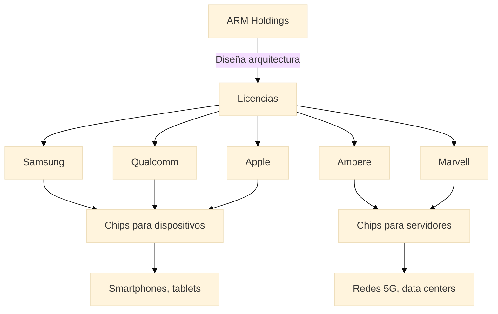

La filosofía de ARM se basa en la simplicidad. Sus procesadores siguen el principio **RISC (Reduced Instruction Set Computing)**, que significa que ejecutan instrucciones simples pero muy eficientemente. Es como usar una navaja suiza perfectamente diseñada en lugar de una caja de herramientas completa: hace menos cosas, pero las hace extremadamente bien.

### Comparación ARM vs x86

| Característica | ARM | x86 (Intel/AMD) |
|----------------|-----|-----------------|
|**Filosofía de diseño**  | RISC - Instrucciones simples | CISC - Instrucciones complejas | 
|**Consumo energético**  | Muy bajo (2-10 watts típico) | Moderado a alto (15-200 watts) | 
|**Eficiencia**  | Alta operaciones/watt | Media operaciones/watt | 
|**Uso tradicional**  | Móviles, embebidos | Servidores, PCs | 
|**Adopción en 5G**  | Crecimiento rápido | Dominancia tradicional |

----------

## 3. De los Teléfonos a las Redes: La Evolución de ARM

Durante años, ARM dominó el mundo móvil mientras que las redes de telecomunicaciones funcionaban principalmente con procesadores de arquitectura x86. Esto tenía sentido: las redes necesitaban mucha potencia de procesamiento, y x86 había sido el estándar en servidores durante décadas.

### Línea de Tiempo: Evolución de ARM en Telecomunicaciones

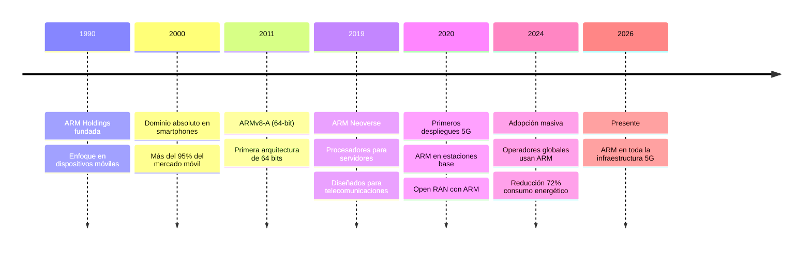

Sin embargo, algo comenzó a cambiar. ARM empezó a desarrollar procesadores más potentes, diseñados específicamente para servidores y telecomunicaciones. La familia de procesadores **Neoverse** nació con este propósito: llevar la eficiencia de ARM al mundo de la infraestructura de red.

Al mismo tiempo, la llegada del 5G planteó nuevos desafíos que ARM estaba en una posición única para resolver.

----------

## 4. Las Redes 5G: Un Nuevo Desafío

Para entender por qué ARM es relevante en 5G, primero necesitamos comprender qué hace al 5G tan diferente de las generaciones anteriores.

### Las Tres Promesas del 5G

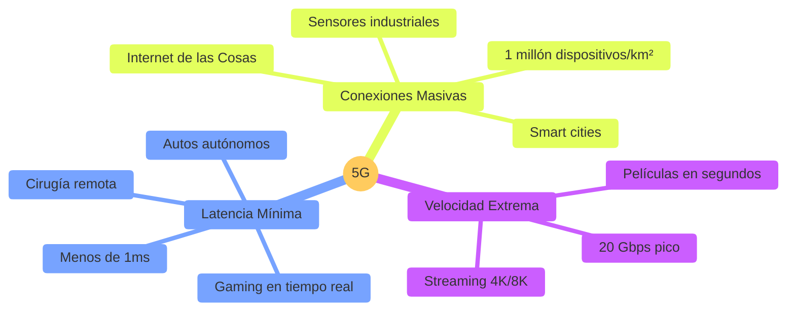

El 5G promete tres cosas principales:

-   **Velocidad extrema:** Descarga de películas en segundos, no minutos.
-   **Latencia mínima:** Respuesta casi instantánea, crucial para autos autónomos o cirugías remotas.
-   **Conexiones masivas:** Millones de dispositivos conectados simultáneamente en un área pequeña.

### El Costo del 5G: Consumo Energético

Pero estas capacidades vienen con un precio: el 5G consume mucha más energía que el 4G.

| Generación | Consumo por Estación Base | Estaciones Necesarias | Consumo Total | 
|------------|---------------------------|----------------------|---------------| 
|**4G LTE**| 800-1,200 watts | Baseline (1x) | 1x |
|**5G**| 2,500-4,000 watts | 3-5x más densidad | 7-15x mayor |

Una estación base 5G puede consumir hasta tres veces más electricidad que una 4G. Y como se necesitan más estaciones base para cubrir la misma área, el consumo energético total se multiplica.

Además, el 5G requiere procesar cantidades masivas de datos en tiempo real. Aquí es donde ARM entra en juego.

----------

## 5. ARM en la Infraestructura 5G

Una red 5G no es solo antenas. Es un ecosistema complejo que incluye múltiples capas de infraestructura.

### Arquitectura de Red 5G con ARM

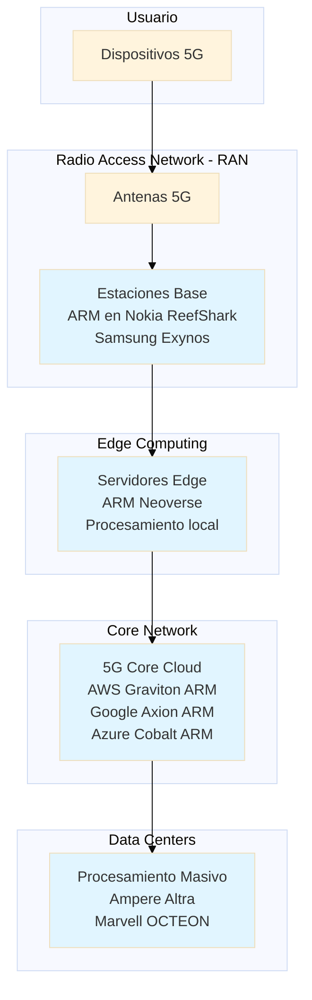

### 5.1. En las Antenas y Estaciones Base

Las estaciones base 5G son como pequeños centros de cómputo. Deben procesar señales de radio complejas, gestionar múltiples conexiones simultáneas, y hacerlo todo consumiendo la menor energía posible.

Fabricantes como **Nokia** y **Samsung** están incorporando procesadores basados en ARM en sus equipos 5G. El chipset **ReefShark de Nokia**, por ejemplo, usa tecnología ARM y ha sido desplegado en cientos de miles de estaciones base alrededor del mundo. La razón principal: consume significativamente menos energía que las alternativas tradicionales.

### 5.2. En los Centros de Datos y la Nube

Las redes 5G dependen fuertemente de la computación en la nube. Muchas funciones que antes estaban en equipos físicos dedicados ahora se ejecutan como software en servidores.

#### Proveedores Cloud con Procesadores ARM

| Proveedor | Procesador ARM | Ventaja Principal |
|-----------|----------------|-------------------| 
|  **Amazon AWS**  | Graviton 2/3/4 | 40% mejor precio-rendimiento | 
|  **Google Cloud**  | Axion | Eficiencia energética superior | 
|  **Microsoft Azure**  | Cobalt 100 | Integración con servicios Azure |
 |  **Oracle Cloud**  | Ampere Altra | Escalabilidad masiva |

Operadores de telecomunicaciones como **NTT DOCOMO** en Japón han reportado reducciones de hasta **72% en consumo energético** al migrar sus sistemas 5G a servidores ARM.

### 5.3. En el Borde de la Red (Edge Computing)

Una de las promesas del 5G es el **"edge computing"** o computación en el borde. La idea es simple: en lugar de enviar todos los datos a un centro de datos lejano, se procesan cerca de donde se generan. Esto reduce la latencia y hace posibles aplicaciones en tiempo real.

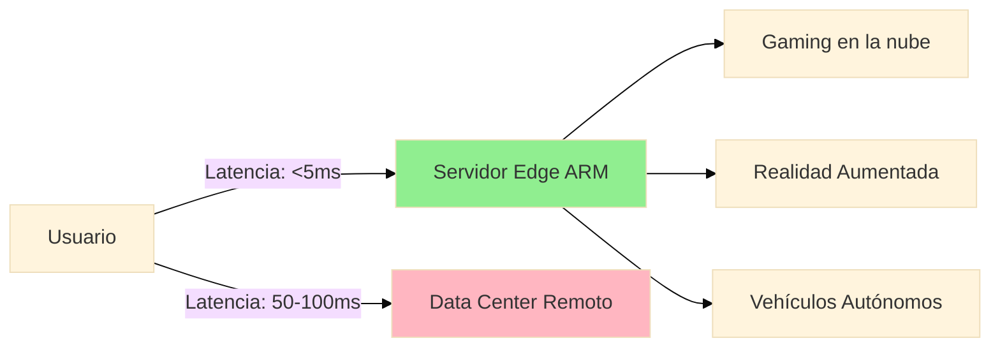

Para el edge computing, la eficiencia energética es crucial porque estos pequeños centros de procesamiento pueden estar en lugares donde el espacio y la energía son limitados. ARM, con su bajo consumo, es una opción natural para estos escenarios.

----------

## 6. La Innovación: Open RAN

Tradicionalmente, cuando un operador de telecomunicaciones quería construir una red, compraba todo el equipo de un mismo fabricante (Nokia, Ericsson, Huawei, etc.). Todo estaba integrado y funcionaba junto, pero también significaba que el operador quedaba "atrapado" con ese proveedor.

### Redes Tradicionales vs Open RAN

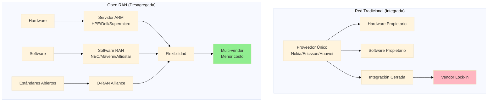

**Open RAN** (Red de Acceso Radio Abierta) está cambiando este modelo. La idea es simple pero poderosa: **separar el hardware del software** y usar estándares abiertos que permitan mezclar y combinar equipos de diferentes fabricantes.

Imagina que pudieras comprar las antenas de un fabricante, los servidores de otro, y el software de un tercero, y todo funcionara perfectamente junto. Eso es Open RAN.

### El Rol de ARM en Open RAN

¿Dónde entra ARM en esto? Los servidores de propósito general basados en ARM se están convirtiendo en la base de muchas implementaciones Open RAN. En lugar de usar equipos especializados y costosos, los operadores pueden usar servidores comerciales con procesadores ARM, ejecutar el software de red en ellos, y obtener mayor flexibilidad y menores costos.

**Componentes típicos de una implementación Open RAN con ARM:**

| Componente | Ejemplo de Producto | Función |
 |------------|---------------------|---------|
 |  **Servidor**  | HPE ProLiant RL300 con Ampere Altra | Hardware base |
 |  **Procesador**  | ARM Neoverse N1/N2 (80-128 núcleos) | Procesamiento general | 
 |  **Acelerador**  | Qualcomm X100 5G RAN | Funciones Layer 1 (FFT, codificación) |
 |  **Software RAN**  | NEC Open vRAN, Mavenir | Funciones de red virtualizadas |
 |  **Orquestación**  | Red Hat OpenShift, Kubernetes | Gestión de contenedores |

Compañías como **Vodafone**, **Dish Network** en Estados Unidos, y **Rakuten** en Japón están explorando o implementando Open RAN con ARM. Esto representa un cambio fundamental en cómo se construyen las redes de telecomunicaciones.

----------

## 7. ¿Por Qué ARM Está Ganando Terreno?

Hay tres razones principales por las que ARM está creciendo en importancia para las redes 5G:

### 7.1. Eficiencia Energética

Esta es la ventaja más clara. Los procesadores ARM pueden realizar el mismo trabajo que procesadores x86 tradicionales pero consumiendo significativamente menos energía.

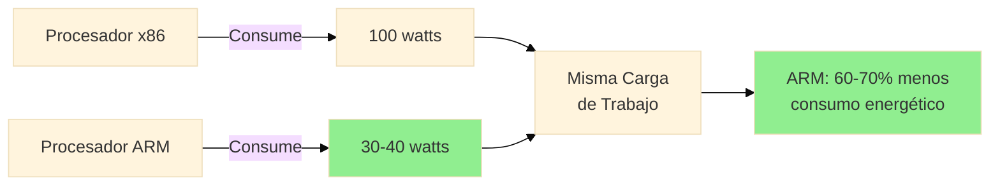

En una industria donde millones de dispositivos funcionan 24/7, esto se traduce en:

-   ✅ Facturas de electricidad más bajas
-   ✅ Menor necesidad de sistemas de refrigeración
-   ✅ Menor huella de carbono

### Impacto Ambiental

Operadores de telecomunicaciones en todo el mundo están bajo presión para reducir su impacto ambiental. ARM les ayuda a cumplir estos objetivos sin sacrificar rendimiento.

| Métrica | Impacto ARM |
|---------|-------------|
|  **Reducción consumo**  | 60-72% menos electricidad |
|  **Ahorro CO₂**  | 15-20 millones toneladas/año (proyección 2030) |
|  **Refrigeración**  | 30-50% menos infraestructura HVAC |

### 7.2. Costos Más Accesibles

Los servidores basados en ARM generalmente cuestan menos que sus equivalentes x86. Además, como ARM no fabrica los chips directamente, hay múltiples proveedores compitiendo (Amazon, Ampere, Marvell, Qualcomm, etc.), lo que mantiene los precios competitivos.

#### Análisis de TCO (Total Cost of Ownership)

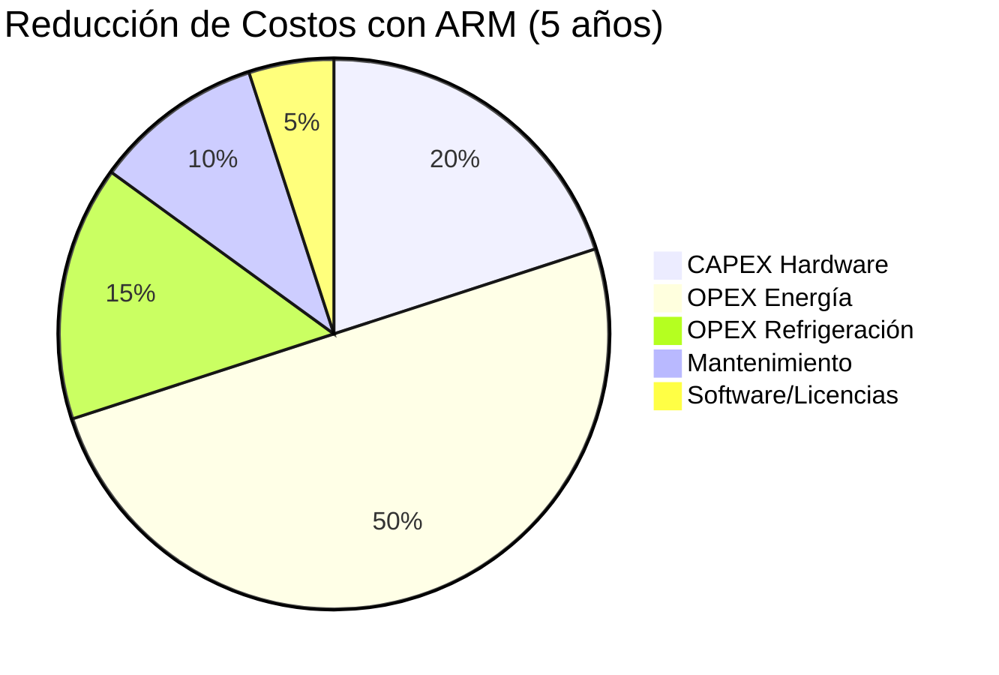

Esto es especialmente importante para operadores más pequeños o en mercados emergentes, que ahora pueden acceder a tecnología de punta sin inversiones prohibitivas.

### 7.2. Costos Más Accesibles

Los servidores basados en ARM generalmente cuestan menos que sus equivalentes x86. Además, como ARM no fabrica los chips directamente, hay múltiples proveedores compitiendo (Amazon, Ampere, Marvell, Qualcomm, etc.), lo que mantiene los precios competitivos.

#### Análisis de TCO (Total Cost of Ownership)

Esto es especialmente importante para operadores más pequeños o en mercados emergentes, que ahora pueden acceder a tecnología de punta sin inversiones prohibitivas.

### 7.3. Flexibilidad y Opciones

El modelo de licenciamiento de ARM permite a diferentes fabricantes crear sus propias versiones de procesadores ARM. Esto significa más opciones para los operadores de red y menos dependencia de un solo proveedor.

**Ecosistema de Proveedores ARM:**

| Fabricante | Producto | Aplicación Principal |
|------------|----------|---------------------|
| Ampere Computing | Ampere Altra Max | Servidores cloud y 5G Core |
| Marvell | OCTEON 10 Fusion | Estaciones base, DPUs |
| Qualcomm | X100 5G RAN | Aceleradores Open RAN |
| NVIDIA | BlueField-3 DPU | Procesamiento de datos |
| AWS | Graviton 3/4 | Cloud computing |

En el contexto de Open RAN, esto es particularmente valioso: los operadores pueden elegir el hardware que mejor se adapte a sus necesidades específicas.

---

## 8. Casos Reales: Quién Está Usando ARM

No estamos hablando de teoría o experimentos de laboratorio. ARM ya está funcionando en redes 5G reales alrededor del mundo:

### Mapa de Adopción Global

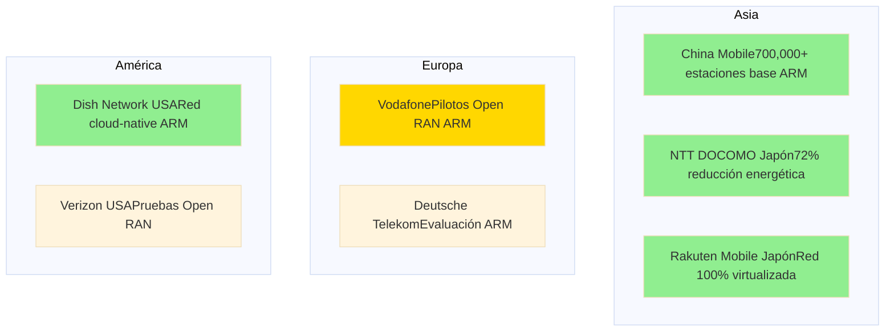

### Casos de Éxito Detallados

#### 🇨🇳 China Mobile
- **Red 5G más grande del mundo**
- Más de 700,000 estaciones base
- Muchas usando equipos con procesadores ARM
- Cobertura nacional completa

#### 🇪🇺 Vodafone
- Evaluando soluciones Open RAN basadas en ARM en Europa
- Pilotos completados en Reino Unido y Alemania
- Objetivo: Reducción 35-45% TCO

#### 🇺🇸 Dish Network
- Construyó red 5G desde cero
- Arquitectura cloud-native con servidores ARM (AWS Graviton)
- Primera red 5G standalone completamente virtualizada en USA

#### 🇯🇵 NTT DOCOMO
- **Reducción del 72% en consumo energético**
- Migración a instancias AWS Graviton2 (ARM)
- Ahorro estimado: $15 millones USD/año

#### 🇯🇵 Rakuten Mobile
- Una de las primeras redes 5G completamente virtualizadas
- Mezcla de hardware que incluye ARM
- Reducción 40% CAPEX, 30% OPEX vs redes tradicionales

---

## 9. El Impacto de ARM en la Industria

La adopción de ARM en telecomunicaciones está generando cambios que van más allá de la tecnología:

### Transformaciones Clave

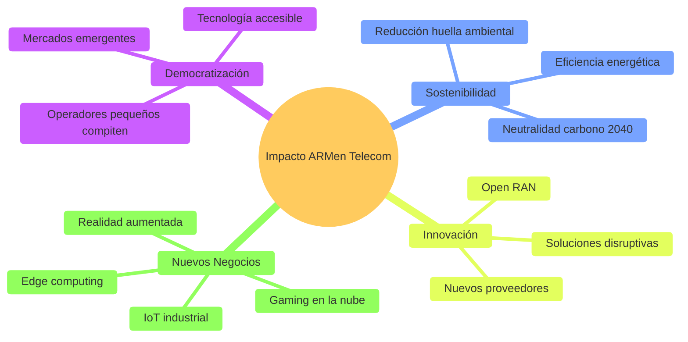

#### 🌍 Democratización del Acceso

Operadores más pequeños pueden ahora competir con los gigantes, usando tecnología de punta sin inversiones masivas. Esto está particularmente impactando:

- Mobile Virtual Network Operators (MVNOs)
- Operadores regionales
- Mercados emergentes en África, Asia y Latinoamérica

#### ♻️ Sostenibilidad

La reducción en consumo energético ayuda a la industria a cumplir objetivos ambientales. Operadores como **Vodafone** y **Deutsche Telekom** han comprometido neutralidad de carbono para 2040, y ARM es parte de cómo planean lograrlo.

**Objetivos de Sostenibilidad de la Industria:**

| Operador | Meta Neutralidad Carbono | Estrategia ARM |
|----------|-------------------------|----------------|
| Vodafone | 2040 | Open RAN ARM, reducción consumo |
| Deutsche Telekom | 2040 | Migración a servidores ARM |
| Telefónica | 2040 | Edge computing eficiente |
| Orange | 2040 | Infraestructura virtualizada ARM |

#### 🚀 Innovación Acelerada

Con Open RAN y ARM, nuevos jugadores pueden entrar al mercado más fácilmente, creando soluciones innovadoras que antes eran imposibles.

#### 💼 Nuevos Modelos de Negocio

La eficiencia de ARM está habilitando **edge computing**, lo que permite a los operadores ofrecer nuevos servicios:

- 🎮 **Gaming en la nube** con latencia ultra-baja
- 🥽 **Realidad aumentada/virtual** para consumidores
- 🏭 **Aplicaciones industriales** con procesamiento local
- 🚗 **Vehículos autónomos** con comunicación V2X
- 🏥 **Telemedicina** y cirugía remota

### Comparación de Generaciones

| Aspecto | Redes 4G Tradicionales | Redes 5G con ARM |
|---------|------------------------|------------------|
| **Arquitectura** | Hardware propietario integrado | Desagregada, virtualizada |
| **Flexibilidad** | Limitada, vendor lock-in | Alta, multi-vendor |
| **Eficiencia energética** | Baseline | 60-72% mejor |
| **TCO (5 años)** | Baseline | 35-45% reducción |
| **Innovación** | Lenta, controlada por vendors | Rápida, ecosistema abierto |
| **Sostenibilidad** | Alta huella carbono | Camino a neutralidad carbono |

---

## 10. El Futuro: Hacia 6G y Más Allá

Si ARM está transformando el 5G, su papel en el futuro de las telecomunicaciones parece aún más prometedor.

### Roadmap hacia el 6G

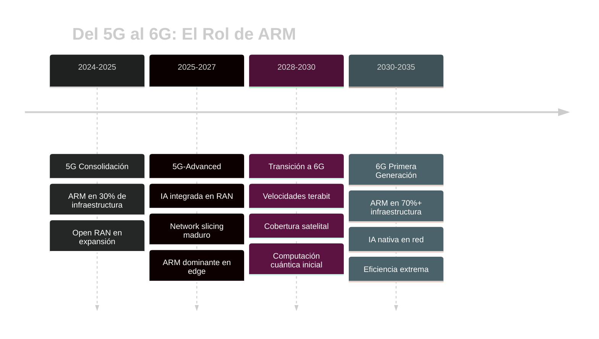

El 6G, que se espera para alrededor de **2030**, promete ser aún más ambicioso que el 5G:

### Características Esperadas del 6G

| Característica | 5G Actual | 6G Proyectado |
|----------------|-----------|---------------|
| **Velocidad pico** | 20 Gbps | 1 Tbps (1000 Gbps) |
| **Latencia** | 1 ms | 0.1 ms (100 microsegundos) |
| **Conexiones** | 1 millón/km² | 10 millones/km² |
| **Eficiencia energética** | Baseline | 10-100x mejor |
| **Cobertura** | Terrestre | Terrestre + satelital global |
| **Aplicaciones clave** | eMBB, URLLC, mMTC | Hologramas, realidad mixta, IA ubicua |

ARM está posicionándose para este futuro:

### Preparación de ARM para 6G

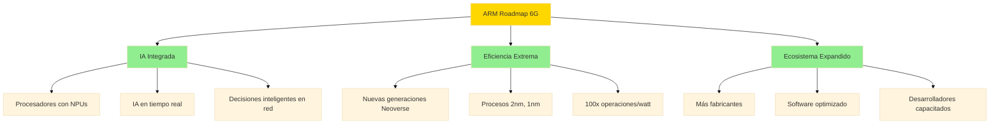

#### 🤖 Inteligencia Artificial en la Red

ARM está desarrollando procesadores con capacidades de IA integradas, permitiendo que las redes tomen decisiones inteligentes en tiempo real.

**Aplicaciones de IA en Redes con ARM:**
- Optimización automática de tráfico
- Predicción de congestión
- Detección de anomalías y seguridad
- Gestión energética inteligente
- Network slicing dinámico

#### ⚡ Mayor Eficiencia

Cada nueva generación de procesadores ARM es más eficiente, algo crucial considerando que las redes futuras procesarán cantidades de datos astronómicas.

**Proyección de Mejoras:**

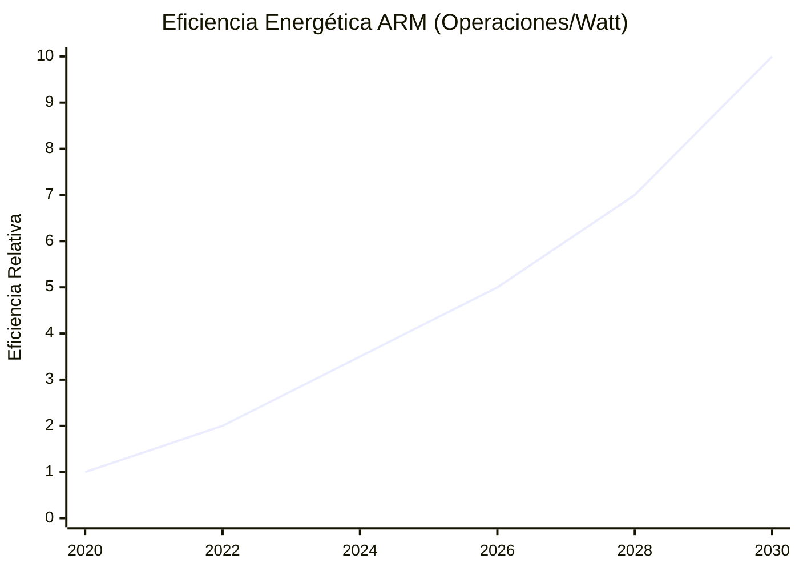

#### 🌐 Ecosistema en Expansión

- **Más fabricantes** están adoptando ARM
- **Más software** está siendo optimizado para ARM
- **Más desarrolladores** están aprendiendo a trabajar con esta arquitectura

### Tendencias Emergentes

También hay tendencias interesantes en el horizonte:

- 📡 **Convergencia telecomunicaciones-cloud:** ARM presente en ambos mundos
- 🔗 **Edge computing ubicuo:** ARM ideal para despliegues distribuidos
- 🌱 **Sostenibilidad crítica:** Eficiencia energética como factor decisivo
- 🧬 **Integración con IA/ML:** Procesamiento inteligente distribuido
- 🛰️ **Redes no terrestres:** Satélites LEO con ARM para cobertura global

---

## 11. Conclusiones

ARM está escribiendo un nuevo capítulo en la historia de las telecomunicaciones. Lo que comenzó como una arquitectura dominante en teléfonos móviles ahora está transformando la infraestructura que hace posible nuestras comunicaciones globales.

### Puntos Clave de la Investigación

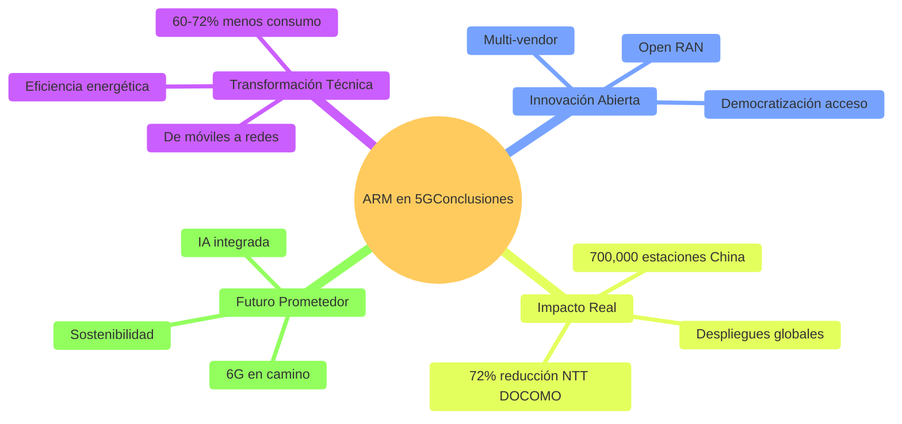

La innovación que representa ARM no es solo técnica. Es también una innovación en modelos de negocio, sostenibilidad y democratización del acceso a tecnología avanzada. Open RAN, impulsado en gran parte por ARM, está rompiendo barreras que existían desde hace décadas en la industria de telecomunicaciones.

### Impacto Cuantificable

| Métrica | Impacto ARM |
|---------|-------------|
| **Eficiencia energética** | 60-72% reducción consumo |
| **TCO (5 años)** | 35-45% reducción costos |
| **Adopción global** | 30%+ infraestructura 5G actual |
| **Estaciones base** | 700,000+ solo en China Mobile |
| **Ahorro CO₂ proyectado** | 15-20 millones ton/año para 2030 |
| **Operadores adoptando** | Vodafone, NTT DOCOMO, Dish, Rakuten, etc. |

El impacto es tangible y creciente. Desde China hasta Europa, desde Japón hasta Estados Unidos, operadores de todos los tamaños están adoptando ARM. No porque sea una moda, sino porque ofrece ventajas reales: menor consumo energético, costos más bajos, y mayor flexibilidad.

### Lecciones para Ingenieros de Sistemas

Para nosotros como futuros ingenieros en sistemas, entender esta transformación es crucial:

1. **La innovación viene de la simplicidad:** ARM demuestra que hacer las cosas más simples y eficientes supera a la complejidad.

2. **Sostenibilidad ≠ Sacrificio de rendimiento:** Se puede ser más eficiente energéticamente sin perder capacidades.

3. **Estándares abiertos generan innovación:** Open RAN muestra cómo la apertura acelera el progreso tecnológico.

4. **Ecosistemas diversos son más resilientes:** Múltiples proveedores ARM crean un mercado más competitivo y saludable.

### Reflexión Final

El futuro de las telecomunicaciones será más **distribuido**, más **inteligente** y más **eficiente**. Y ARM estará en el centro de esa transformación. Para quienes estudiamos ingeniería de sistemas, esta es nuestra oportunidad de ser parte de este cambio, de aprender estas tecnologías, y de contribuir a construir las redes que conectarán el mundo de mañana.

La revolución silenciosa de ARM en las telecomunicaciones apenas comienza. Y promete ser una de las transformaciones tecnológicas más importantes de nuestra generación.

---

## 12. Referencias

1. **Arm Limited.** (2025). *Powering the Future of Telco & Networking Infrastructure*. Disponible en: https://www.arm.com/markets/computing-infrastructure/telco-networking

2. **Arm Limited.** (2025). *Scalable Computing Infrastructure and Networking for AI and Edge*. Disponible en: https://www.arm.com/markets/5g

3. **Chandrasekaran, P.** (2023). *Building Sustainable 5G Network Infrastructure at Scale*. Arm Newsroom. Disponible en: https://newsroom.arm.com/blog/building-sustainable-5g-networks

4. **Bergey, C.** (2021). *Enabling the dynamic 5G infrastructure with Arm-based solutions*. Arm Company News. Disponible en: https://www.arm.com/company/news/2021/06/enabling-the-dynamic-5g-infrastructure

5. **NEC Corporation.** (2024). *NEC, Arm, Qualcomm, Red Hat, and HPE demonstrate Open vRAN using Arm-based CPUs*. Press Release. Disponible en: https://www.nec.com/en/press/202402/global_20240221_02.html

6. **Arm Limited.** (2024). *Sustainable Network Infrastructure: Optimizing Efficiency, Fueling AI Innovation*. Arm Newsroom. Disponible en: https://newsroom.arm.com/blog/sustainable-network-infrastructure

7. **VIAVI Solutions.** (2025). *Implementación de redes 5G*. Disponible en: https://www.viavisolutions.com/es-es/soluciones/implementacion-de-redes-5g

8. **Digi International.** (2025). *¿Qué es la arquitectura de red 5G?*. Disponible en: https://es.digi.com/blog/post/5g-network-architecture

9. **Software Radio Systems.** (2024). *SRS showcases 5G RAN deployments on AMD, ARM and Intel at MWC 2024*. Disponible en: https://srs.io/5g-showcase-mwc-2024/

10. **GSMA Intelligence.** (2026). *The Mobile Economy 2026*. GSMA Association.

11. **O-RAN Alliance.** (2024). *O-RAN Architecture Description*. Disponible en: https://www.o-ran.org/specifications

12. **Marvell Technology.** (2025). *Data Processing Units (DPU)*. Disponible en: https://www.marvell.com/products/data-processing-units.html
