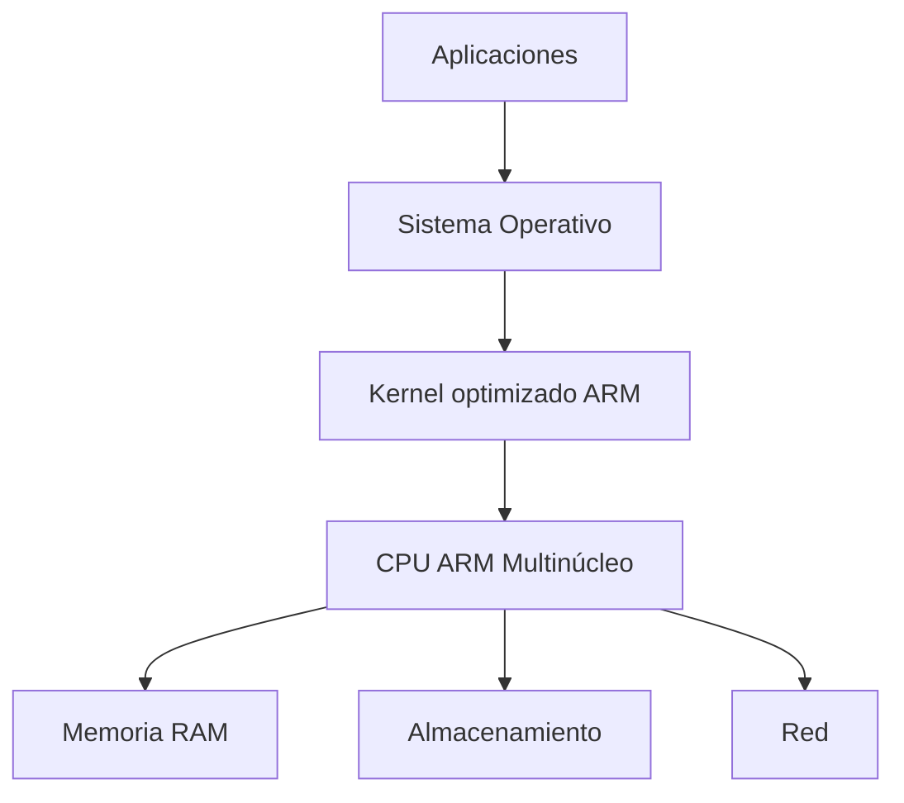
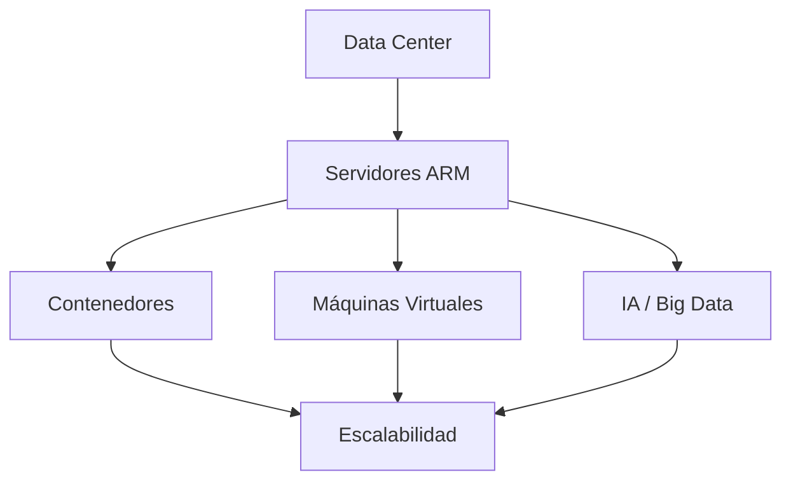

# 🖥️ ARM en Servidores: Alternativa Eficiente en Data Centers
---

## 📌 Introducción

El crecimiento acelerado de los servicios en la nube, la virtualización y las arquitecturas distribuidas ha transformado la infraestructura de los centros de datos modernos. Tradicionalmente, los servidores han utilizado procesadores basados en arquitectura **x86**; sin embargo, la necesidad de mejorar la eficiencia energética y reducir costos operativos ha impulsado la adopción de nuevas alternativas, entre ellas la arquitectura **ARM**.

Actualmente, ARM ha dejado de ser exclusiva de dispositivos móviles para convertirse en una opción competitiva en entornos empresariales y de alto rendimiento, especialmente en cargas de trabajo paralelizables.

---

## ⚙️ ¿Qué es ARM?

ARM (Advanced RISC Machine) es una arquitectura basada en el modelo **RISC (Reduced Instruction Set Computing)**, diseñada para ejecutar instrucciones simples de forma eficiente, logrando un alto rendimiento con bajo consumo energético.

A diferencia de arquitecturas como x86 (CISC), ARM utiliza un conjunto de instrucciones reducido, lo que permite diseños más simples, eficientes y escalables.

### 🧩 Características principales

- Arquitectura RISC  
- Bajo consumo energético  
- Alto rendimiento por watt  
- Diseño escalable  
- Soporte para múltiples núcleos  
- Amplio soporte en Linux y entornos cloud  

---

## 🧠 Comparación Arquitectónica: RISC vs CISC

| Característica | RISC (ARM) | CISC (x86) |
|---------------|-----------|-----------|
| Instrucciones | Simples y rápidas | Complejas |
| Consumo energético | Bajo | Mayor |
| Hardware | Más simple | Más complejo |
| Eficiencia | Alta | Media |
| Rendimiento en paralelo | Muy alto | Alto |

---

## ☁️ ARM en el Entorno de Servidores

Durante décadas, la arquitectura x86 dominó el mercado debido a su compatibilidad. Sin embargo, el auge del cloud computing y la necesidad de eficiencia han favorecido la adopción de ARM.

Empresas como AWS, Oracle y Microsoft han comenzado a implementar procesadores ARM en sus centros de datos para mejorar el rendimiento y reducir costos.

---

## 📊 Comparación ARM vs x86

| Característica        | ARM              | x86 (Intel/AMD) |
|----------------------|------------------|-----------------|
| Arquitectura         | RISC             | CISC            |
| Consumo energético   | Bajo             | Medio/Alto      |
| Rendimiento por watt | Alto             | Medio           |
| Compatibilidad       | En crecimiento   | Muy amplia      |
| Costos operativos    | Más bajos        | Más altos       |
| Escalabilidad        | Alta             | Media           |

---

## 🏗️ Arquitectura de un Servidor ARM

---

## 🔄 Flujo de Procesamiento en ARM

---

## 🚀 Ventajas de ARM en Data Centers

### ⚡ Eficiencia Energética
Los procesadores ARM consumen menos energía, lo que reduce significativamente:

- Costos eléctricos  
- Generación de calor  
- Sistemas de refrigeración  

### 📈 Alto Rendimiento por Watt
ARM ofrece un excelente balance entre rendimiento y consumo energético, ideal para:

- Microservicios  
- Contenedores  
- Aplicaciones web  
- Cloud computing  

### 🧩 Escalabilidad
Los procesadores ARM modernos cuentan con múltiples núcleos, lo que permite:

- Procesamiento paralelo eficiente  
- Mejor rendimiento en cargas distribuidas  

### 💰 Reducción del TCO (Total Cost of Ownership)

| Factor | Impacto de ARM |
|-------|--------------|
| Energía | Menor consumo |
| Refrigeración | Menor costo |
| Hardware | Mayor eficiencia |
| Operación | Reducción general |

---

## 🏢 Casos Reales de Implementación

| Empresa | Tecnología ARM | Beneficio |
|--------|--------------|----------|
| AWS | Graviton | Menor costo por instancia |
| Oracle Cloud | Ampere Altra | Alto rendimiento |
| Microsoft Azure | ARM experimental | Optimización cloud |

---

## ⚠️ Desafíos de ARM

A pesar de sus ventajas, ARM enfrenta algunos retos:

- Compatibilidad con software legado  
- Migración desde x86  
- Necesidad de recompilar aplicaciones  
- Ecosistema aún en desarrollo  

---

## 🔮 Tendencias Futuras

El uso de ARM en servidores continuará creciendo debido a:

- Expansión del cloud computing  
- Optimización de cargas paralelas  
- Integración con inteligencia artificial  
- Nuevas tecnologías de fabricación (5nm, 3nm)  

### 📊 Proyección del mercado

| Año | Uso de ARM en servidores |
|----|-------------------------|
| 2020 | Bajo |
| 2023 | Medio |
| 2026 | Alto |
| 2030 | Dominante (proyección) |

---

## 🧠 Modelo de Arquitectura Moderna

---

## 📌 Conclusión

La arquitectura ARM se ha consolidado como una alternativa eficiente para centros de datos modernos. Su enfoque en el rendimiento por watt, la escalabilidad y la eficiencia energética la posiciona como una solución clave para el futuro del cómputo en la nube.

Aunque aún enfrenta desafíos en compatibilidad, su crecimiento en el sector empresarial indica una transición hacia infraestructuras más sostenibles, eficientes y optimizadas para cargas modernas.

---

## 📚 Bibliografía

- IONOS. (2025). *Servidores ARM*. https://www.ionos.es  
- ARM Ltd. (2023). *ARM Architecture Reference Manual*. https://developer.arm.com  
- AWS. (2026). *Graviton Case Study*. https://aws.amazon.com  
- TechRadar. (2025). *ARM vs x86 en Data Centers*. https://www.techradar.com  
- M247 Global. (2025). *ARM in Data Centers*. https://www.m247global.com  

---
