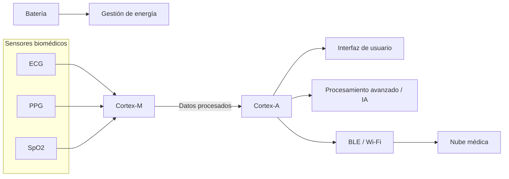
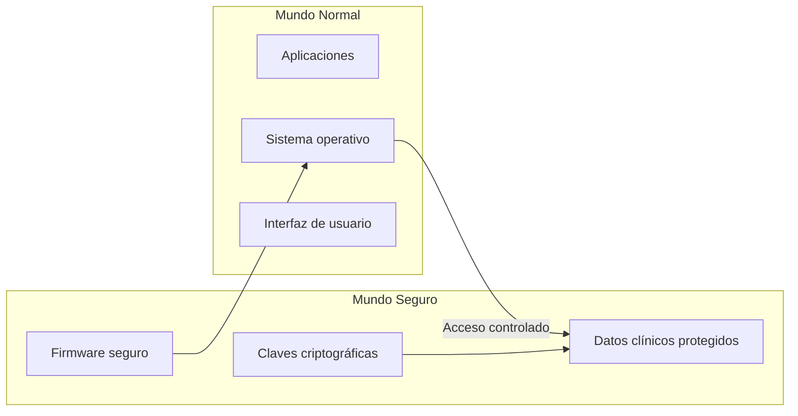
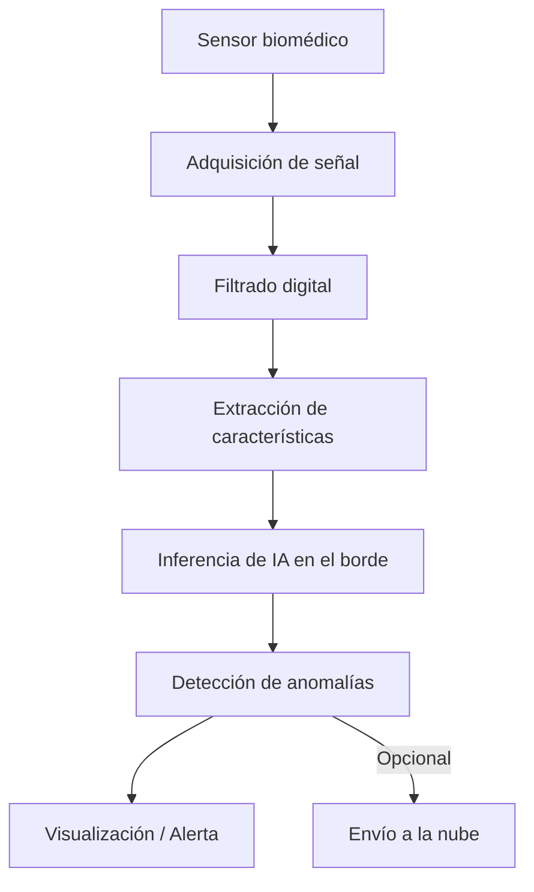

# ARM en wearables y tecnología médica #

## Introducción ##

# ARM en Wearables y Tecnología Médica

## Introducción

## Desarrollo ##
La arquitectura ARM (Advanced RISC Machine) constituye una de las plataformas de procesamiento más relevantes en sistemas embebidos, dispositivos móviles y tecnologías portátiles. Basada en el paradigma RISC (Reduced Instruction Set Computer), prioriza eficiencia energética, simplicidad estructural y alto rendimiento por vatio consumido.

Desde su origen en la década de 1980 como proyecto de Acorn Computers en el Reino Unido, ARM evolucionó hacia un modelo de licenciamiento global adoptado por fabricantes como Qualcomm, Apple, STMicroelectronics, NXP y Texas Instruments. Actualmente es la arquitectura predominante en dispositivos alimentados por batería, especialmente en wearables y equipos médicos portátiles.

Este documento analiza la arquitectura ARM desde una perspectiva técnica y examina su impacto en la industria de dispositivos médicos y tecnologías de monitoreo portátil.

Comparacion directa: 
| Característica            | Cortex-A (Application)                         | Cortex-M (Microcontroller)                    |
|---------------------------|------------------------------------------------|-----------------------------------------------|
| Propósito principal       | Aplicaciones complejas y de alto nivel         | Control, sensores y tiempo real               |
| Tipo de dispositivo       | Smartwatches avanzados, gateways médicos       | Wearables médicos, sensores biométricos       |
| Consumo energético        | Medio a alto                                   | Muy bajo                                      |
| Rendimiento               | Alto                                           | Bajo a medio                                  |
| Sistema operativo         | Linux, Android                                 | RTOS o bare-metal                             |
| Gestión de memoria        | MMU (Memory Management Unit)                   | MPU (Memory Protection Unit)                  |
| Tiempo real               | No determinista                                | Determinista                                  |
| Arranque                  | Lento (segundos)                               | Instantáneo (milisegundos)                    |
| Complejidad del SoC       | Alta                                           | Baja                                          |
| Tamaño del silicio        | Mayor                                          | Muy reducido                                  |
| Multinúcleo               | Sí                                             | Generalmente no                               |
| Procesamiento de IA       | IA avanzada en el borde                        | IA ligera (TinyML)                            |
| Ejemplos de tareas        | Interfaces gráficas, análisis de datos         | ECG, PPG, SpO₂, control de sensores           |
| Uso en tecnología médica  | Análisis complejo y conectividad               | Monitoreo continuo y adquisición de señales   |

> Arquitectura heterogénea basada en ARM para wearables médicos, donde núcleos Cortex-M gestionan sensores en tiempo real y núcleos Cortex-A realizan procesamiento avanzado e interacción con el usuario.

Además, extensiones como ARM TrustZone permiten implementar entornos de ejecución seguros, fundamentales en dispositivos médicos donde la integridad y confidencialidad de los datos clínicos son requisitos regulatorios.

> Separación de entornos mediante ARM TrustZone, garantizando la integridad del firmware y la confidencialidad de los datos médicos.

Los wearables modernos —como smartwatches, bandas de actividad y dispositivos de monitoreo continuo— dependen de arquitecturas ARM para integrar múltiples funciones en un solo sistema en chip (SoC). Estos dispositivos combinan sensores biométricos, conectividad inalámbrica (Bluetooth Low Energy, Wi-Fi), procesamiento local y almacenamiento de datos.
Empresas como Apple, Qualcomm y Nordic Semiconductor desarrollan SoCs basados en ARM que permiten:
- Procesamiento en tiempo real de frecuencia cardíaca y variabilidad del pulso.

- Implementación de algoritmos de detección de arritmias.

- Monitoreo de oxigenación sanguínea.
---

## Fundamentos Técnicos de ARM

La arquitectura ARM se basa en el modelo RISC, que reduce la complejidad del conjunto de instrucciones para optimizar consumo energético y eficiencia de ejecución.

### Comparación RISC vs CISC

Un ejemplo industrial relevante es el Apple Watch, cuyo procesador está basado en arquitectura ARM personalizada. Este dispositivo puede realizar electrocardiogramas y detectar ritmos cardíacos irregulares, demostrando cómo la eficiencia energética y capacidad de cómputo de ARM permiten aplicaciones médicas avanzadas en formatos portátiles.
Asimismo, investigaciones académicas han demostrado la implementación de redes neuronales optimizadas sobre microcontroladores ARM Cortex-M para el análisis de señales biomédicas en tiempo real, lo que reduce la dependencia de la nube y disminuye la latencia en diagnósticos preventivos.

> Flujo de procesamiento local de señales biomédicas en dispositivos ARM, permitiendo análisis en tiempo real y reducción de latencia mediante edge computing.

En el ámbito médico, los dispositivos portátiles y sistemas embebidos requieren alta confiabilidad, seguridad funcional y cumplimiento normativo. La arquitectura ARM es ampliamente utilizada en:
- Monitores portátiles de signos vitales.

- Bombas de infusión inteligentes.

- Dispositivos de monitoreo continuo de glucosa.

- Equipos de diagnóstico portátil.

- Sistemas implantables con control digital.
| Característica | RISC (ARM) | CISC |
|---------------|------------|------|
| Tamaño de instrucciones | Fijo | Variable |
| Complejidad | Baja | Alta |
| Consumo energético | Bajo | Mayor |
| Número de transistores | Menor | Mayor |
| Generación de calor | Reducida | Más elevada |

Estas características permiten a ARM operar con menor disipación térmica, aspecto crítico en dispositivos portátiles y médicos.

---

## Familias de Procesadores ARM en Wearables

### Cortex-M vs Cortex-A

| Característica | Cortex-M | Cortex-A |
|---------------|----------|----------|
| Tipo | Microcontrolador | Procesador de aplicaciones |
| Consumo energético | Ultra bajo | Moderado |
| Uso típico | Sensores biométricos | Interfaces gráficas y SO embebidos |
| Ejemplos | ECG, PPG, SpO₂ | Smartwatches avanzados |

## Conclusión ##
- **Cortex-M**: Ideal para procesamiento en tiempo real de señales biomédicas.
- **Cortex-A**: Utilizado en dispositivos con sistemas operativos como Linux embebido o Android.

---

## Seguridad y Protección de Datos

La extensión **ARM TrustZone** permite entornos de ejecución seguros, fundamentales en dispositivos médicos donde la confidencialidad e integridad de datos clínicos son requisitos regulatorios.

Esto es relevante en el cumplimiento de normativas como:

- ISO 13485
- IEC 62304
- FDA (21 CFR Part 820)

---

## Aplicaciones en Wearables

Los dispositivos modernos integran sistemas en chip (SoC) basados en ARM que combinan:

- Sensores biométricos
- Conectividad Bluetooth Low Energy
- Wi-Fi
- Procesamiento local
- Edge computing

### Ejemplo Industrial

El Apple Watch emplea un procesador basado en arquitectura ARM personalizada. Permite realizar:

- Electrocardiogramas
- Detección de arritmias
- Monitoreo de oxigenación sanguínea

---

## Aplicaciones en Tecnología Médica

| Aplicación | Función |
|------------|----------|
| Monitores portátiles | Seguimiento de signos vitales |
| Bombas de infusión | Administración controlada de fármacos |
| Monitores de glucosa | Control continuo en pacientes diabéticos |
| Dispositivos implantables | Regulación cardíaca y neurológica |

La eficiencia energética permite operación prolongada sin recarga frecuente, crucial en monitoreo continuo.

---

## Inteligencia Artificial en el Borde (Edge AI)

Procesadores ARM modernos incorporan extensiones para aceleración de IA, permitiendo:

- Diagnósticos preliminares
- Detección temprana de anomalías
- Análisis predictivo local
- Reducción de latencia

Esto disminuye dependencia de la nube y mejora privacidad de datos.

---

## Tendencias Futuras

La evolución hacia ARMv9 y la integración con 5G e Internet of Medical Things (IoMT) fortalecerán redes corporales inteligentes (Body Area Networks), permitiendo monitoreo continuo interconectado.

Se anticipa una transición hacia dispositivos médicos más autónomos, predictivos y personalizados.

---

## Conclusión

La arquitectura ARM se ha consolidado como base tecnológica de wearables y dispositivos médicos modernos gracias a su eficiencia energética, escalabilidad y capacidad de integración en sistemas compactos.

Su convergencia con inteligencia artificial y conectividad avanzada impulsa una transformación estructural en la medicina preventiva, favoreciendo sistemas más autónomos, accesibles y orientados al monitoreo continuo del paciente.

## Referencias

- Arm Ltd. (2024). *Wearables – Arm®*. Recuperado de https://www.arm.com/markets/consumer-technologies/wearables

- Informatec Digital. (2026, 9 de febrero). *Qué es la arquitectura ARM en ordenadores y por qué importa*. Recuperado de https://informatecdigital.com/que-es-la-arquitectura-arm-en-ordenadores-y-por-que-importa/

- Magouyrk, C. (2021, 25 de mayo). *Arm-based cloud computing is the next big thing: Introducing Arm on Oracle Cloud Infrastructure*. Recuperado de https://blogs.oracle.com/cloud-infrastructure/arm-based-cloud-computing-is-the-next-big-thing-introducing-arm-on-oracle-cloud-infrastructure

- Oracle. (s. f.). *¿Qué es Arm?* Recuperado de https://www.oracle.com/latam/cloud/compute/arm/what-is-arm/

- Red Hat. (2022, 21 de julio). *What is an ARM processor?* Recuperado de https://www.redhat.com/es/topics/linux/what-is-arm-processor
