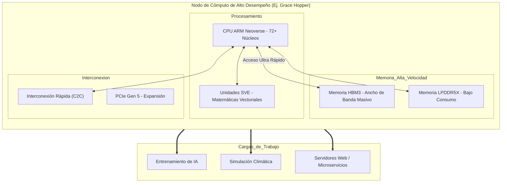

# ARM-y-computacion-de-alto-desempeno-eficiente

##  Información del Estudiante

- Nombre: Ernesto Ezequiel Rivera Calderon
- Horario: 4:00 PM
- Título del tema: ARM y computación de alto desempeño eficiente

---

##  Introducción

Durante mucho tiempo, cuando pensábamos en "computación de alto desempeño" (HPC) o supercomputadoras, la única opción lógica parecían ser los procesadores x86 de Intel o AMD. Eran los reyes indiscutibles de la potencia bruta. Sin embargo, en los últimos años ha ocurrido un cambio de paradigma fascinante: la arquitectura ARM, famosa por hacer que nuestros teléfonos consuman poca batería, ha empezado a conquistar los servidores y las supercomputadoras.

La razón principal de este cambio no es solo la velocidad, sino la **eficiencia energética**. Los centros de datos modernos consumen cantidades masivas de electricidad y generan muchísimo calor. Aquí es donde ARM brilla: ofrece un "rendimiento por watt" muy superior.

En esta investigación exploraré cómo una arquitectura diseñada para móviles escaló hasta crear la supercomputadora más rápida del mundo (en su momento), Fugaku, y cómo gigantes como Amazon y NVIDIA están apostando todo a ARM para el futuro de la nube y la Inteligencia Artificial.

---

##  ¿Por qué ARM en Alto Desempeño?

### El Problema de la Energía (Power Wall)
Para entender por qué ARM es relevante en HPC, primero entendí el problema actual. Los procesadores tradicionales (CISC/x86) son muy potentes, pero consiguen esa potencia a base de mucha energía. En un centro de datos con miles de servidores, esto se traduce en:
1. **Costos millonarios de electricidad.**
2. **Sistemas de refrigeración complejos y costosos.**

ARM, con su filosofía RISC (Reduced Instruction Set Computer), utiliza instrucciones más sencillas. Esto permite crear chips que generan menos calor y consumen menos energía para realizar las mismas tareas, permitiendo una mayor densidad de cómputo.

### La Estrategia "Many-Core"
A diferencia de los procesadores de escritorio que suelen tener entre 8 y 16 núcleos muy rápidos y "hambrientos" de energía, los procesadores ARM para servidores (como la serie **Neoverse** de ARM o los **Altra** de Ampere) apuestan por tener muchísimos núcleos (hasta 128 o 192 por chip) que son individualmente eficientes.

Esto es ideal para la nube y el HPC, donde las tareas suelen ser "paralelizables"; es decir, se pueden dividir en pedacitos pequeños y repartir entre muchos núcleos simultáneamente.

---

##  Tecnologías Clave en ARM HPC

# SVE (Scalable Vector Extension)
Investigando sobre la supercomputadora Fugaku, encontré que el secreto de su rendimiento no era solo tener muchos núcleos, sino una tecnología llamada **SVE**.

En términos simples, SVE permite al procesador realizar operaciones matemáticas en grandes conjuntos de datos (vectores) de una sola vez. A diferencia de las instrucciones vectoriales fijas de x86 (como AVX-512), SVE es flexible. Esto es crucial para simulaciones científicas (como predecir el clima) y para entrenar modelos de IA, ya que permite procesar números mucho más rápido sin disparar el consumo energético.

# System on Chip (SoC) en Servidores
Al igual que en los celulares, la tendencia en HPC es integrar todo en el mismo chip.
* Memoria Unificada: En lugar de tener la memoria RAM lejos del procesador, chips como el **NVIDIA Grace Hopper** (basado en ARM) integran memoria de alto ancho de banda (HBM) justo al lado de los núcleos.
* Interconexión: Se integran redes de alta velocidad dentro del chip para que los cientos de núcleos se comuniquen sin latencia.

---

##  Casos de Éxito en la Industria

He recopilado los ejemplos más importantes que demuestran que ARM ya no es "solo para móviles":

| Proyecto / Chip | Fabricante | Uso Principal | Impacto |
| :--- | :--- | :--- | :--- |
| **Fugaku** | Fujitsu / Riken | Supercomputación Científica | Fue la #1 del mundo por 2 años. Demostró que ARM sirve para cálculos complejos. |
| **Graviton 3/4** | Amazon (AWS) | Cloud Computing | Ofrece hasta 40% mejor relación precio-rendimiento que los servidores x86 tradicionales en la nube. |
| **Grace Superchip** | NVIDIA | Inteligencia Artificial | Combina CPU ARM con GPU NVIDIA para entrenar modelos gigantes de IA con menor consumo. |
| **Ampere Altra** | Ampere | Servidores Cloud | Usado por Oracle y Microsoft Azure para servicios nativos de la nube eficientes. |

---

##  Ventajas y Desafíos Actuales

### Ventajas (Lo bueno)
1. **Eficiencia Térmica:** Menos necesidad de aire acondicionado en los data centers.
2. **Personalización:** Empresas como Apple, Google o Amazon pueden comprar la licencia de ARM y diseñar sus propios chips a medida para sus necesidades específicas (algo imposible con Intel).
3. **Costos:** Generalmente, el costo de operación (OPEX) es menor a largo plazo.

### Desafíos (Lo difícil)
1. **Software Legacy:** Mucho software empresarial viejo está compilado para x86. Migrarlo a ARM requiere recompilar y a veces reescribir código.
2. **Rendimiento "Single Thread":** Para tareas que no se pueden dividir (que usan un solo núcleo), los chips x86 de gama alta a veces siguen siendo más rápidos, aunque consuman más.

---

##  Estructura de un Nodo de Cómputo ARM

---

Conclusión Personal: 
Al iniciar esta investigación, pensaba que ARM solo servía para ahorrar batería en mi celular. Me sorprendió descubrir que la misma filosofía de "hacer más con menos energía" es exactamente lo que necesitan las supercomputadoras hoy en día.

El límite de la computación ya no es cuánto silicio podemos poner en un chip, sino cuánto calor podemos disipar sin derretirlo. En este escenario, la arquitectura ARM y la computación eficiente no son solo una alternativa barata, sino el camino necesario para sostener el crecimiento de la Inteligencia Artificial y la nube de manera sostenible.

 Referencias Bibliográficas: 
Fujitsu. (2024). Supercomputer Fugaku.

Amazon Web Services. (2025). AWS Graviton Processor - Arm-based cloud compute. 

NVIDIA Corporation. (2024). NVIDIA Grace CPU Superchip Architecture Whitepaper.

Arm Ltd. (2025). Neoverse: Cloud-to-Edge Infrastructure.
