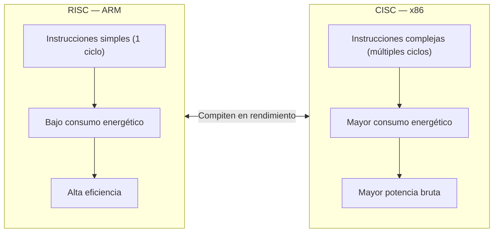
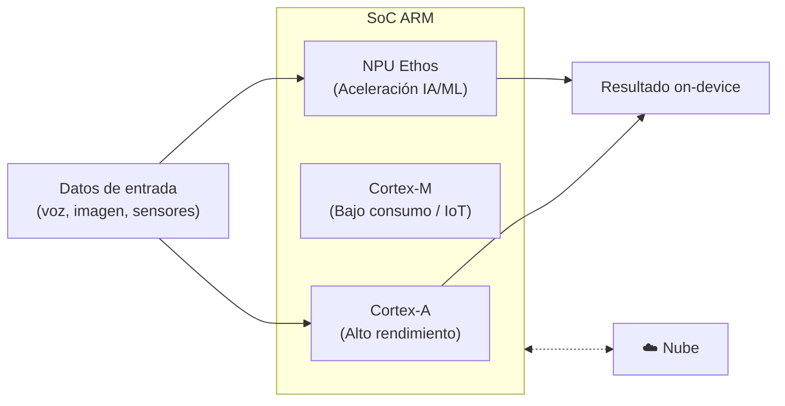

# ARM y dispositivos portátiles de nueva generación

---

## Introducción
Los procesadores ARM son conocidos por su eficiencia energética, bajo consumo y alto rendimiento; por ende, son los preferidos para dispositivos móviles. Esta arquitectura está revolucionando los dispositivos portátiles de nueva generación de manera que permite un rendimiento que puede competir contra arquitecturas tradicionales. Esta investigación analiza cómo ARM influye en la evolución tecnológica de los dispositivos móviles de las recientes generaciones.

---

## ¿Qué es la arquitectura ARM?
Arquitectura de unidad central de procesamiento (CPU), la cual es conocida por su gran eficiencia. En la actualidad, se encuentran en una gama más extensa de dispositivos de procesamiento, como sistemas integrados y dispositivos de IoT hasta servidores, pero en sus inicios eran muy conocidos en dispositivos móviles. Un procesador basado en ARM utiliza una arquitectura de procesamiento con conjuntos de instrucciones reducidos (RISC), los cuales manejan un conjunto más pequeño de instrucciones, además de ser más simples y que se utilizan más rápido, además de que requieren de menos energía, lo cual hace un contraste con los procesadores x86 tradicionales, los cuales manejan arquitecturas de procesamiento con conjuntos de instrucciones complejos (CISC).

### Diagrama: RISC vs CISC

---

## ARM en los dispositivos portátiles de nueva generación
Los dispositivos portátiles de nueva generación (laptops, tablets, relojes inteligentes) manejan una gran eficiencia energética, además de integración de inteligencia artificial, debido a que la arquitectura ARM se encuentra revolucionando y hace que esta nueva generación se caracterice por tener baterías de larga duración y menor generación de calor.

---

## Ventajas de los dispositivos portátiles con ARM

| Ventaja | Descripción |
|---|---|
| **Eficiencia energética y batería** | Consumen menos energía, lo cual provoca una mayor duración en la batería, casi todo el día, lo cual es esencial para dispositivos portátiles |
| **Diseño compacto y fino** | Se crean chips más pequeños, lo cual es de gran ayuda para el diseño de dispositivos más delgados y ligeros |
| **Accesibilidad** | Al manejar un diseño simple, facilita la fabricación y ofrece una mayor relación calidad-precio |
| **Rendimiento** | Se maneja un rendimiento capaz de manejar tareas complejas y multitarea sin sobrecalentarse |

---

## Diferencias contra otras arquitecturas

| Característica | ARM | x86 (Intel/AMD) |
|---|---|---|
| **Filosofía (RISC vs. CISC)** | Instrucciones simples ejecutadas en un ciclo | Instrucciones complejas que pueden requerir múltiples ciclos |
| **Eficiencia energética** | Consumo menor; mayor duración de batería | Mayor consumo; orientado a rendimiento máximo |
| **Modelo de negocio** | Licencia el diseño a fabricantes, promueve la personalización | Intel o AMD fabrican sus propios chips |
| **Uso predominante** | Mercado móvil, embebido y portátiles de consumo | Servidores y escritorio (gaming) |

---

## ARM en laptops de nueva generación
En la actualidad, las laptops son fundamentales por su versatilidad, debido a que permiten trabajar, estudiar, etc.; por ende, se necesita eficiencia energética. Las laptops modernas con arquitectura ARM (equipos con Windows 11 y procesadores Qualcomm Snapdragon) ofrecen eficiencia energética, la cual es de suma importancia en dispositivos portátiles, superando el día de batería, el encendido instantáneo y conectividad móvil de forma constante. Las laptops con este tipo de arquitectura son ideales para productividad, navegación y multitarea productiva, todo al mismo tiempo.

---

## ARM y la inteligencia artificial
La IA se entiende como la capacidad de las máquinas para simular tareas humanas como aprender, razonar y tomar decisiones, utilizando algoritmos para reconocer patrones y datos, permitiendo la solución de problemas y la interacción lingüística, etc.
Arm centra su actividad en llevar la IA de la nube a los dispositivos finales (teléfonos, portátiles, IoT) para procesar datos de manera eficiente.

Arm impulsa la IA en dispositivos portátiles al ofrecer una alta eficiencia energética, esencial para ejecutar modelos de IA (los cuales son muy utilizados en la actualidad) sin agotar la batería.

La arquitectura Armv9 ha sido diseñada para acelerar las cargas de trabajo de IA y aprendizaje automático (ML) directamente en la CPU.

Arm proporciona componentes especializados como procesadores Cortex-A (alto rendimiento), Cortex-M (microcontroladores de bajo consumo) y las unidades de procesamiento neuronal (NPU) Ethos para acelerar tareas de IA.

*ARM impulsando la inteligencia artificial en dispositivos portátiles*

### Diagrama: Componentes de IA en un SoC ARM

---

## Seguridad en ARM
Se basa en un enfoque de hardware y software, diseñado para proteger los dispositivos desde el núcleo hasta la nube. Incluye tecnologías como TrustZone (aislamiento seguro), Memory Tagging Extension (MTE) para prevenir corrupciones de memoria y un ciclo de vida de desarrollo de seguridad (SDL) que mitiga riesgos tempranos en dispositivos IoT.

**Componentes de seguridad en ARM:**

- **TrustZone:** Crea un entorno de ejecución seguro (TEE) separado del sistema operativo principal, protegiendo datos críticos incluso si el SO es vulnerado.
- **Armv8/v9-A:** Hace uso de extensiones criptográficas, protección de memoria (MTE) y virtualización segura para mitigar ataques.
- **Protección del Silicio:** La seguridad de Arm incluye protección física contra manipulaciones, esencial para proteger la propiedad intelectual y los datos del dispositivo.

---

## Conclusión
La arquitectura ARM es la base de los dispositivos portátiles de nueva generación debido a que brinda eficiencia y rendimiento, lo cual los convierte en un elemento indispensable para estos dispositivos de nuevas generaciones. Su diseño basado en RISC permite ejecutar tareas complejas con un consumo reducido, por ende mayor duración de la batería y menor generación de calor, lo que la pone en ventaja sobre las otras arquitecturas.
Hablando desde la eficiencia, seguridad y la capacidad de integrarse con nuevas tecnologías, ARM representa una arquitectura fundamental para el desarrollo de los dispositivos portátiles de nueva generación, ya que ofrece un equilibrio para las demandas tecnológicas actuales y futuras.

---

## Referencias
Herget, S. (2025, 10 septiembre). Lumex instead of Cortex: ARM's new cores for smartphones and tablets. C't Magazin. https://www.heise.de/en/news/Lumex-instead-of-Cortex-ARM-s-new-cores-for-smartphones-and-tablets-10638468.html#:~:text=ARM%20is%20renewing%20its%20range,3%2DA%20architecture.

Peres, A. G. (2026, 16 enero). ARM to Dominate Laptops in 2025 — Here's Why. Nextage Blog. https://nextage.com.br/blog/en/arm-to-dominate-laptops-in-2025/#:~:text=In%20recent%20years%2C%20ARM%20architecture,to%20stay%20in%20the%20game.

Alonso, R. (2025, 20 marzo). Todo lo que necesitas saber sobre los procesadores ARM. HardZone. https://hardzone.es/tutoriales/componentes/procesador-arm/

Geek Review. (2025, 13 noviembre). Chips ARM vs x86 – ¿Quién Domina REALMENTE los Procesadores? [Vídeo]. YouTube. https://www.youtube.com/watch?v=XFwo3o7eUkc

Arm Ltd. (s. f.). Laptop Technologies with Arm CPUs. Arm | The Architecture For The Digital World. https://www.arm.com/markets/consumer-technologies/laptops#:~:text=La%20eficiente%20tecnolog%C3%ADa%20de%20alto,productiva%2C%20todo%20al%20mismo%20tiempo.

Arm Ltd. (s. f.-b). Platform security. Arm | The Architecture For The Digital World. https://www.arm.com/architecture/security-features/platform-security#:~:text=Los%20recursos%20de%20seguridad%20de,por%20Arm%20y%20sus%20socios.
