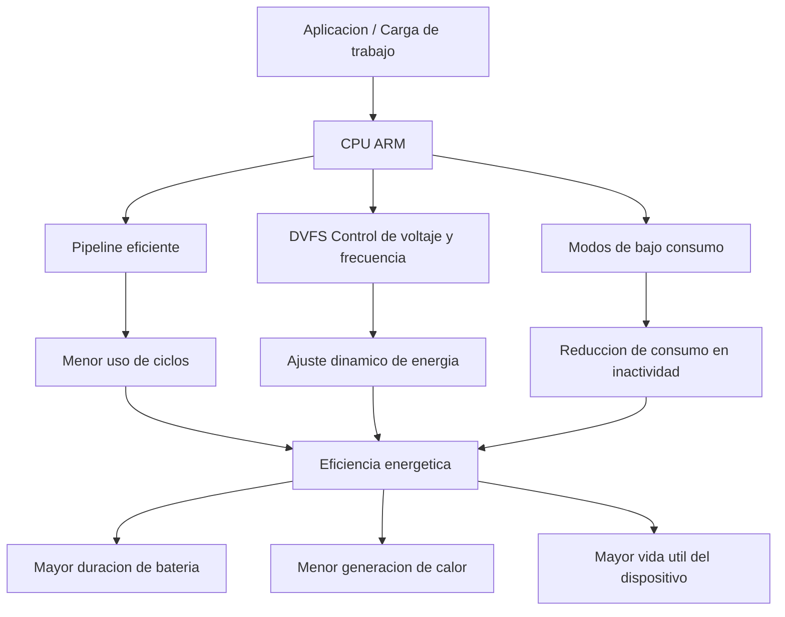

# 📱 ARM y eficiencia energética en dispositivos embebidos

---
---

Materia: Lenguajes de Interfaz.

Profesor: Rene Solis Reyes.

Unidad: 1.

Alumno: Esteves Peña Samuel.

Actividad: 1.3 Investigación.

Título: ARM y eficiencia energetica en dispositivos embebidos.

Fecha: Martes 19 de febrero de 2026.

---
## 📖 Descripción

Este repositorio presenta un análisis sobre la arquitectura ARM y su papel en la eficiencia energética dentro de dispositivos embebidos. Se exploran sus características técnicas, aplicaciones, ventajas, desafíos y tendencias tecnológicas actuales.

La arquitectura ARM destaca por su diseño optimizado para bajo consumo energético y alto rendimiento por watt, lo que la convierte en una opción fundamental para sistemas modernos como IoT, dispositivos médicos y automatización industrial.

---

## 📚 Tabla de contenidos

- [Introducción](#-introducción)
- [¿Qué es ARM?](#-qué-es-la-arquitectura-arm)
- [Importancia de la eficiencia energética](#-importancia-de-la-eficiencia-energética)
- [Características técnicas](#-características-de-arm-que-mejoran-la-eficiencia)
- [Aplicaciones](#-aplicaciones)
- [Ventajas](#-ventajas)
- [Desafíos](#-desafíos)
- [Tendencias](#-tendencias-actuales)
- [Caso de estudio](#-caso-de-estudio)
- [Conclusión](#-conclusión)
- [Referencias](#-referencias)

---

## 📖 Introducción

En el diseño de sistemas embebidos, la eficiencia energética es un factor crítico debido a las limitaciones de recursos y al uso frecuente de baterías. ARM se ha convertido en una arquitectura dominante gracias a su capacidad para equilibrar rendimiento y consumo energético.

---

## ⚙️ ¿Qué es la arquitectura ARM?

ARM es una arquitectura basada en el modelo RISC (Reduced Instruction Set Computing), que utiliza instrucciones simples y eficientes para reducir el consumo energético y mejorar la velocidad de ejecución.

## 🧩 Diagrama — Eficiencia energética en ARM

---

### Características principales

- Bajo consumo de energía
- Alto rendimiento por ciclo
- Diseño simple y escalable
- Amplio ecosistema de desarrollo
---

## 🧠 Qué muestra el diagrama
Representa:

- Flujo desde la carga de trabajo
- Componentes internos ARM
- Técnicas de ahorro energético
- Resultados en el sistema

---

## 🔋 Importancia de la eficiencia energética

La eficiencia energética permite:

- Mayor duración de batería
- Menor generación de calor
- Reducción de costos operativos
- Mayor confiabilidad
- Operación en entornos remotos

---

## 🧠 Características de ARM que mejoran la eficiencia

### ✅ Diseño RISC optimizado
Reduce ciclos de ejecución y consumo energético.

### ✅ Modos de bajo consumo
Incluyen Sleep, Deep Sleep y Standby.

### ✅ DVFS
Ajuste dinámico de voltaje y frecuencia según la carga.

### ✅ Pipeline eficiente
Optimiza la ejecución de instrucciones.

### ✅ Integración SoC
Reduce consumo al integrar múltiples componentes.

---

## 🧩 Aplicaciones

- Internet de las Cosas (IoT)
- Dispositivos médicos
- Sistemas automotrices
- Automatización industrial
- Electrónica de consumo
- Sensores inteligentes

---

## 📊 Comparación conceptual

| Arquitectura | Consumo | Uso |
|-------------|--------|----|
| ARM | Bajo | Embebidos |
| x86 | Alto | PCs |
| RISC-V | Bajo | IoT |

---

## ✅ Ventajas

- Alta eficiencia energética
- Bajo costo
- Escalabilidad
- Amplio soporte
- Menor generación de calor

---
## 📊 Cuadro comparativo — Arquitecturas y eficiencia energética

| Característica | ARM | x86 | RISC-V |
|---------------|-----|-----|-------|
| Tipo de arquitectura | RISC | CISC | RISC |
| Consumo energético | Bajo | Alto | Bajo |
| Rendimiento por watt | Alto | Medio | Alto |
| Complejidad de instrucciones | Baja | Alta | Baja |
| Uso típico | IoT, móviles, embebidos | PCs, servidores | IoT, investigación |
| Modos de bajo consumo | Sí | Limitados | Sí |
| Escalabilidad | Alta | Media | Alta |
| Generación de calor | Baja | Alta | Baja |
| Coste de implementación | Bajo | Alto | Bajo |
| Ecosistema | Muy amplio | Muy amplio | En crecimiento |
| Personalización | Media | Baja | Muy alta |
| Ejemplos de uso | Microcontroladores, smartphones | Computadoras personales | Prototipos, sistemas embebidos |
---
## ⚠️ Desafíos

- Rendimiento limitado en tareas intensivas
- Fragmentación entre fabricantes
- Necesidad de optimización de software

---

## 🚀 Tendencias actuales

- Edge computing
- Inteligencia artificial en dispositivos
- IoT masivo
- Sistemas autónomos
- Seguridad embebida
- Energía ultrabaja

---

## 🔬 Caso de estudio

Un sensor IoT basado en ARM Cortex-M puede operar durante largos periodos con batería gracias a modos de suspensión profunda y procesamiento eficiente.

---

## 📝 Conclusión

ARM es una arquitectura clave en el desarrollo de dispositivos embebidos debido a su eficiencia energética y capacidad de adaptación. Su evolución continuará impulsando innovaciones en sistemas inteligentes y sostenibles.

---

## 📚 Referencias

## 📚 Referencias

- ARM Ltd. — Energy Efficiency Overview  
  https://www.arm.com/why-arm/energy-efficiency

- ARM Developer — Power Management and DVFS Concepts  
  https://developer.arm.com/documentation

- Wikipedia — ARM architecture  
  https://en.wikipedia.org/wiki/ARM_architecture

- Wikipedia — Dynamic voltage scaling (DVFS)  
  https://en.wikipedia.org/wiki/Dynamic_voltage_scaling

- IEEE Xplore — Research papers on low-power processor design  
  https://ieeexplore.ieee.org/

- ARM White Papers — Low power design techniques  
  https://www.arm.com/resources/white-paper

- GeeksforGeeks — ARM Architecture basics  
  https://www.geeksforgeeks.org/arm-architecture/

- ACM Digital Library — Energy efficient computing research  
  https://dl.acm.org/

---

## 📋 Cumplimiento de rúbrica

- ✔ Investigación profunda
- ✔ Organización clara
- ✔ Uso de terminología técnica
- ✔ Análisis crítico
- ✔ Conclusiones fundamentadas

---

## 👨‍💻 Autor Esteves Peña Samuel

Trabajo 1 — Sistemas Embebidos
