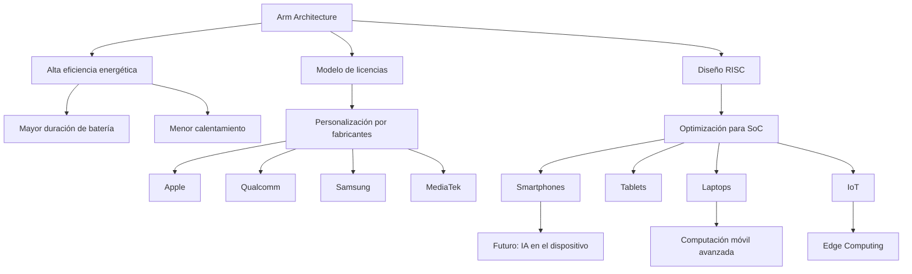

**Ingeniería en sistemas computacionales**

**Materia: Lenguaje de interfaz**

**Camarillo Molina Cristian**

**Horario: 5pm**

**Arm y el futuro de la computacion movil avanzada**

## Introducción
La computación móvil ha evolucionado rápidamente en las últimas décadas, y uno de los actores más importantes en esta transformación es Arm. Su arquitectura de procesadores se ha convertido en la base tecnológica de la mayoría de los dispositivos móviles modernos.

## ¿Qué es Arm?
Arm es una empresa británica que diseña arquitecturas de procesadores basadas en el modelo RISC (Reduced Instruction Set Computing). A diferencia de empresas como Intel y AMD, que fabrican y venden sus propios chips, Arm licencia sus diseños a otras compañías,

Esto permite que empresas como:
- Apple
- Qualcomm
- Samsung Electronics
- MetiaTek
desarrollen procesadores personalizados basados en la arquitectura Arm.

## ¿Por qué Arm domina la computación móvil?
### Arm y su ventaja estructural
El dominio de Arm en la computación móvil no es casualidad. Es el resultado de decisiones de diseño arquitectónico, modelo de negocio y adaptación al mercado móvil desde sus inicios.

### Desventajas de ARM en la computacion movil
- **Menor flexibilidad en hardware:**
  ARM suele integrarse en un System on Chip, donde CPU, GPU y controladores estan en un mismo chip. Esto limita la posibilidad de actualizar o reemplazar componentes
- **Menor rendimiento bruto en tareas intensivas:**
  Al usar instrucciones mas simples (RISC), ARM puede necesitar mas ciclos para operaciones complejas. Esto lo hace menos eficiente en calculos pesados comparado con x86.
- **Problemas de estandarizacion:**
  Cada fabricante adapta la arquitectura ARM a sus necesidades. Esto genera diversidad, asi como problemas de estandarizacion y compatibilidad entre dispositivos.

### Tabla comparativa de ARM contra x86
<table>
  <thead>
    <tr>
      <th>Aspecto</th>
      <th>ARM</th>
      <th>x86</th>
    </tr>
  </thead>
  <tbody>
    <tr>
      <td><b>Consumo energético</b></td>
      <td>Muy bajo, optimizado para dispositivos portatiles.</td>
      <td>Alto, diseñado para PCs/servidores</td>
    </tr>
    <tr>
      <td><b>Rangos de temperatura</b></td>
      <td>Debido a su menor consumo de energia, los procesadores ARM producen menos calor.</td>
      <td>Genera mas calor debido a que requiere de un gran consumo de energia</td>
    </tr>
    <tr>
      <td><b>Diversidad de modelos</b></td>
      <td>ARM licencia su arquitectura a multiples fabricantes (Qualcomm, Apple, Samsung, etc), esto fomenta la innovacion y diversidad de chips.</td>
      <td>Debido a que x86 solo esta enlazada con Intel y AMD, podemos encontrar menos variedad de chips.</td>
    </tr>
    <tr>
      <td><b>Optimizacion para conectividad</b></td>
      <td>ARM integra funciones especificas para redes moviles, 5G y seguridad en hardware.</td>
      <td>Por defecto x86 no cumple con estas funciones ya que fue diseñado para PCs de escritorio.</td>
    </tr>
  </tbody>
</table>

  

## Arquitectura RISC
Arm se basa en la arquitectura RISC
### ¿Qué significa esto?
- Instrucciones más simples
- Menos ciclos por instrucción
- Menor consumo energético
- Diseño más eficiente

En dispositivos móviles, donde la batería es limitada, la efiuciencia energética es más importante que la potencia bruta.

Mientras que arquitecturas tradicionales como las usadas por Intel estaban pensadas originalmente para computadoras de escritorio (alto rendimiento, mayor consumo), Arm fue diseñada desde el inicio para sistemas embebidos y dispositivos de bajo consumo.

## Consumo energético extremadamente bajo
En un smartphone: 
- CPU
- GPU
- 5G
- Pantalla
- Sensores
  
Todo consume energía.

Arm optimiza:
- Estados de reposo avanzados
- Núcleos de alto rendimiento + núcleos eficientes
- Gestión inteligente de energía
  
Lo que permite:

- Mayor duración de la batería
- Menos calentamiento
- Dispositivos más delgados (Menos necesidad de refrigeración)

## Conclusión 
El liderazgo de Arm en la computación móvil avanzada no es casualidad. Su enfoque en la eficiencia energética, desde el diseño mismo de su arquitectura, le permitió adaptarse perfectamente a las necesidades de los dispositivos móviles. En un entorno donde la duración de batería y el rendimiento equilibrado son fundamentales, esta ventaja ha sido decisiva.

Además, su modelo de licencias ha fomentado la innovación, permitiendo que distintos fabricantes desarrollen soluciones personalizadas sin abandonar la misma base tecnológica. Con la creciente integración de inteligencia artificial y el avance hacia dispositivos más potentes y eficientes, todo indica que Arm seguirá siendo un pilar clave en el futuro de la computación móvil.

### Fuentes
[Arm y su arquitectura](https://dredu.mx/principal/intereses/aficiones/computadoras-y-dispositivos-de-procesamiento-de-datos/arquitecturas-de-computo/arquitecturas-arm)

[Arm en dispositivos móviles y rendimiento](https://www.arm.com/markets/mobile-computing)

[Chips Arm](https://www.aeanet.org/what-is-an-arm-chip)
