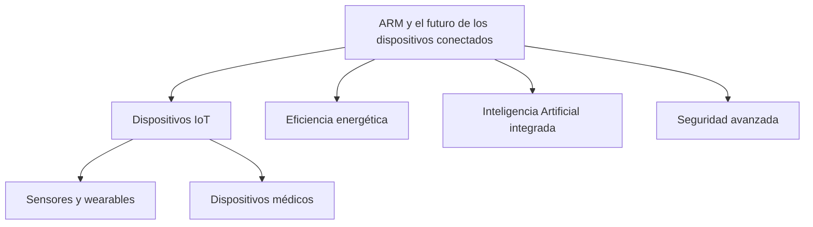

# ARM y el futuro de los dispositivos conectados

## ¿Qué es ARM y por qué es importante?

Arm Holdings es una empresa británica que diseña arquitecturas y conjuntos de instrucciones (ISA) para procesadores basados en RISC (Reduced Instruction Set Computing). A diferencia de otras compañías que fabrican directamente sus propios chips, ARM diseña la arquitectura y la licencia a otras empresas como Apple, Qualcomm y Samsung.

Su principal ventaja competitiva es el bajo consumo energético combinado con buen rendimiento. Esta eficiencia ha permitido que ARM domine el mercado de dispositivos móviles y tenga una presencia creciente en otros sectores tecnológicos.

Actualmente, miles de millones de dispositivos en el mundo utilizan procesadores basados en arquitectura ARM.

---

## ARM y los dispositivos conectados (IoT)

Los dispositivos conectados forman parte del llamado Internet de las Cosas (IoT). Estos incluyen sensores inteligentes, cámaras de vigilancia, relojes inteligentes, dispositivos médicos, sistemas domóticos y equipos industriales.

Para que estos dispositivos funcionen correctamente necesitan procesadores que sean:

- Muy eficientes en consumo energético.
- Capaces de ejecutar tareas de inteligencia artificial.
- Seguros frente a ataques externos.
- Escalables y fáciles de integrar.

ARM ha desarrollado soluciones específicas para este sector, incluyendo microcontroladores y plataformas optimizadas para IoT. Entre ellos destacan:

- Arm Cortex-M85, diseñado para alto rendimiento en dispositivos de bajo consumo con capacidades de aprendizaje automático.
- Arm Corstone, una plataforma preintegrada que acelera el desarrollo de dispositivos personalizados.

Estas soluciones permiten que las empresas desarrollen productos conectados más rápidamente, reduciendo costos y aumentando la seguridad.

---

## ARM y el Edge Computing

Una tendencia clave en el futuro tecnológico es el edge computing o cómputo en el borde. Esto significa que los datos se procesan directamente en el dispositivo en lugar de enviarlos a la nube.

Las ventajas incluyen:

- Menor latencia.
- Mayor privacidad.
- Menor consumo de ancho de banda.
- Respuestas en tiempo real.

ARM ha apostado por integrar capacidades de inteligencia artificial directamente en sus arquitecturas. Esto permite que los dispositivos no solo recolecten datos, sino que los analicen y tomen decisiones de manera autónoma.

Esto es fundamental para aplicaciones como:

- Vehículos autónomos.
- Cámaras inteligentes.
- Robots industriales.
- Dispositivos médicos conectados.

---

## ARM en móviles, computadoras y centros de datos

Aunque ARM comenzó enfocándose en dispositivos de bajo consumo, actualmente domina casi por completo el mercado de smartphones.

Además, ha ganado relevancia en:

- Computadoras personales (por ejemplo, los chips Apple Silicon).
- Servidores y centros de datos, donde la eficiencia energética se ha vuelto crítica.
- Infraestructura de telecomunicaciones y redes 5G.

La arquitectura ARM está evolucionando para soportar cargas de trabajo más complejas, incluyendo inteligencia artificial avanzada y procesamiento gráfico.

---

## Tendencias futuras que favorecen a ARM

| Nº | Tendencia | Descripción |
|----|------------|-------------|
| 1 | Inteligencia artificial en cada dispositivo | La integración de aceleradores de IA en chips pequeños permitirá dispositivos más autónomos. |
| 2 | Dispositivos más inteligentes y autónomos | El IoT evolucionará de simples sensores a sistemas capaces de interpretar datos y tomar decisiones en tiempo real. |
| 3 | Crecimiento de wearables y dispositivos médicos | El bajo consumo energético de ARM lo hace ideal para dispositivos que funcionan con baterías durante largos periodos. |
| 4 | Computación heterogénea | La combinación eficiente de CPU, GPU y aceleradores especializados será clave en el desarrollo de tecnologías como realidad aumentada, ciudades inteligentes y automatización industrial. |

---

## Competencia y desafíos

Uno de los principales competidores emergentes es RISC-V, una arquitectura abierta que permite diseñar procesadores sin pagar licencias. Esto podría representar un desafío en ciertos mercados.

Sin embargo, ARM mantiene una fuerte ventaja debido a:

- Su amplio ecosistema de desarrolladores.
- Compatibilidad de software.
- Años de optimización en eficiencia energética.
- Alianzas estratégicas con grandes fabricantes.

---

## Conclusión

ARM es una pieza fundamental en el desarrollo del futuro tecnológico. Su arquitectura eficiente, segura y escalable la posiciona como líder en el crecimiento de los dispositivos conectados.

El futuro apunta hacia un mundo donde prácticamente todos los dispositivos estarán conectados y tendrán capacidades de inteligencia artificial integrada. En este escenario, ARM seguirá siendo un actor central en la evolución del Internet de las Cosas, el edge computing y la computación eficiente.

## Referencias 
- Magazine. (2022, 27 marzo). _¿Qué son los procesadores ARM?_ Blog de Tecnología. https://ibertronica.es/blog/tutoriales/que-son-los-procesadores-arm/
- Anonymous. (2023, 21 julio). The Path to a Trillion Connected Devices. _Arm Newsroom_. https://newsroom.arm.com/news/the-path-to-a-trillion-connected-devices#:~:text=The%20ARM%20ecosystem%20will%20continue,are%20helping%20to%20deliver%20them.
