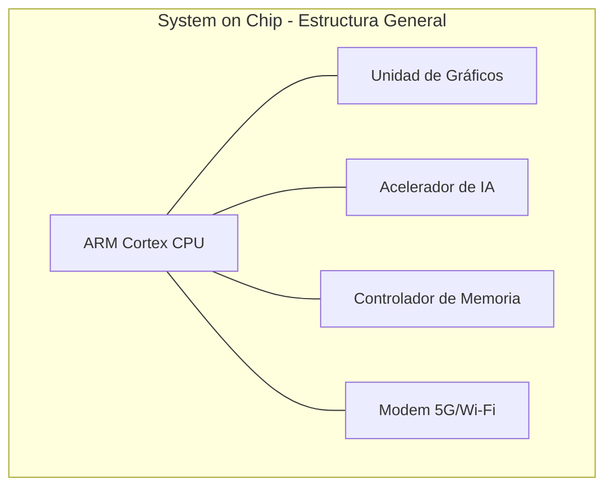
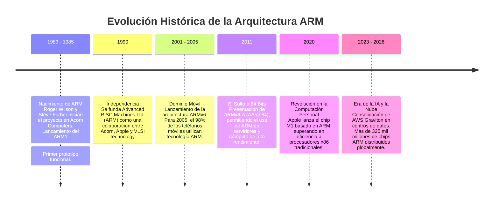

# ARM y la Evolución de los Microprocesadores Móviles

**Autor:** Lopez Mendoza Alejandro - **Grupo:** SC6C

---

## 1. Introducción

La arquitectura ARM (Advanced RISC Machine) es un diseño de microprocesador basado en el paradigma RISC (Conjunto Reducido de Instrucciones). Su objetivo principal es maximizar el **rendimiento por vatio**, lo que la hace ideal para dispositivos portátiles y sistemas embebidos.

A diferencia de otros fabricantes tradicionales, ARM diseña la arquitectura y la licencia a distintas empresas para que fabriquen sus propios sistemas en chip (SoC). Este modelo ha permitido una expansión rápida y una innovación constante en el mercado de dispositivos móviles.

Inicialmente los procesadores ARM se utilizaron en teléfonos móviles básicos y dispositivos portátiles. Con el tiempo, su uso se expandió a smartphones, tablets, dispositivos IoT, servidores eficientes y computadoras personales.

## 2. Fundamentos Técnicos de ARM

### Arquitectura RISC y Eficiencia Energética
La filosofía de diseño RISC permite que los procesadores ARM simplifiquen el hardware al ejecutar instrucciones que requieren, en su mayoría, un solo ciclo de reloj. Esta simplicidad reduce el número de transistores necesarios, lo que se traduce en un consumo eléctrico mínimo y una baja disipación de calor.

- Alto rendimiento por vatio: Ideal para dispositivos alimentados por batería.
- Diseño orientado a la movilidad: Minimiza la necesidad de sistemas de enfriamiento activos.

### El concepto de System on Chip (SoC)
ARM integra la CPU junto con otros componentes críticos en una sola pieza de silicio para optimizar la velocidad y el espacio.

### Familias principales de núcleos
- Cortex-A: Diseñados para aplicaciones de alto rendimiento (smartphones, laptops).
- Cortex-R: Optimizados para sistemas que requieren procesamiento en tiempo real.
- Cortex-M: Especializados para microcontroladores en dispositivos embebidos e IoT.

## 3. Historia y Contexto

El desarrollo de la arquitectura ARM comenzó en la década de 1980 bajo el liderazgo de Roger Wilson y Steve Furber, quienes presentaron el ARM1, el primer prototipo diseñado para computadoras personales. Esta arquitectura se distingue por ser un "contrato" estricto que define la interacción entre el hardware y el software. Gracias a su simplicidad y bajo consumo de energía, se convirtió en la tecnología ideal para la revolución de los dispositivos portátiles; para el año 2005, aproximadamente el 98% de los teléfonos móviles en el mundo integraban al menos un procesador basado en ARM.

### ¿Qué es ARM y para qué se usa?

Hoy en día, ARM es una arquitectura de procesadores que no se presenta de forma aislada, sino que se integra en Sistemas en Chip (SoC). Este diseño combina la CPU con componentes críticos como GPUs, controladores de memoria y módems en una sola pieza de silicio. Su capacidad para ofrecer un alto rendimiento sin sacrificar la eficiencia energética la ha consolidado como la opción dominante en smartphones, tablets y dispositivos del Internet de las Cosas (IoT).

Más allá del sector móvil, la arquitectura ha evolucionado hacia el ecosistema AArch64 (64 bits), lo que ha permitido su incursión en centros de datos y servicios en la nube. Actualmente, ofrece una escalabilidad de núcleos y una eficiencia térmica que la hacen competitiva para cargas de trabajo modernas, como el aprendizaje automático y la gestión de servidores de alto rendimiento como AWS Graviton.

## 4. Evolución del SoC y Procesadores

### Evolución histórica 

La evolución de los procesadores móviles se caracteriza por el aumento de integración, eficiencia energética y especialización funcional.

| Periodo | Características técnicas | Innovaciones | Impacto |
|--------|------------------------|-------------|--------|
| 1990–2005 | Procesadores simples de bajo consumo | Arquitectura RISC eficiente | Teléfonos móviles básicos |
| 2005–2012 | Integración de GPU y multimedia | Aparición del SoC moderno | Smartphones iniciales |
| 2012–2019 | Procesamiento multinúcleo | Arquitectura heterogénea (big.LITTLE) | Mejor rendimiento y batería |
| 2020–Actualidad | Diseños personalizados y IA integrada | Aceleradores neuronales | Expansión a laptops y servidores |

### Especialización de Componentes Internos

| Componente | Generaciones iniciales | Generaciones actuales |
|-----------|----------------------|----------------------|
| CPU | Núcleo único | Núcleos múltiples heterogéneos |
| GPU | Gráficos básicos | Procesamiento paralelo avanzado |
| Memoria | Controladores externos | Integración en chip |
| IA | No disponible | Aceleradores neuronales |
| Energía | Gestión simple | Optimización dinámica |

---

## 5. ARM vs. RISC-V: El Panorama del Mercado

La arquitectura ARM domina el mercado de dispositivos móviles y sistemas embebidos debido a su eficiencia energética, escalabilidad e integración funcional.

Su principal competencia emergente es RISC-V, una arquitectura abierta que busca ofrecer mayor personalización sin costos de licencia.

### Comparación ARM vs RISC-V

| Aspecto | ARM | RISC-V |
|--------|-----|--------|
| Posición en el mercado | Dominante y consolidada | Emergente |
| Licenciamiento | Propietario | Abierto |
| Ecosistema | Amplio y maduro | En crecimiento |
| Eficiencia energética | Muy alta | Variable |
| Personalización | Limitada por licencias | Alta |

---

## 6. Importancia Tecnológica Actual y Conclusión

La arquitectura ARM se ha consolidado como la base de la computación móvil moderna gracias a su enfoque en la eficiencia energética y la integración funcional. Su capacidad para adaptarse desde el sensor más pequeño de IoT hasta servidores de alto rendimiento en la nube (como AWS Graviton) demuestra una escalabilidad sin precedentes.

En conclusión, la evolución hacia diseños que integran Inteligencia Artificial y computación en el borde asegura que ARM seguirá siendo la arquitectura clave para el desarrollo tecnológico contemporáneo, permitiendo una interacción más fluida y eficiente entre los usuarios y sus dispositivos digitales.

---

## 7. Bibliografía 

Arquitectura ARM — Wikipedia  
https://es.wikipedia.org/wiki/Arquitectura_ARM

Sistema en chip — Wikipedia  
https://es.wikipedia.org/wiki/Sistema_en_chip

¿Qué es ARM y para qué sirve? — Geeknetic  
https://www.geeknetic.es/ARM/que-es-y-para-que-sirve

Historia de la arquitectura ARM — Xataka  
https://www.xataka.com.mx/aplicaciones/que-es-la-arquitectura-arm

¿Qué son los procesadores ARM? — Oracle Cloud  
https://www.oracle.com/es/cloud/compute/arm/what-is-arm/

Evolución reciente de ARM en móviles — El Español  
https://www.elespanol.com/elandroidelibre/noticias-y-novedades/20230529/proxima-revolucion-moviles-oficial-arm-potentes-historia/767423455_0.html
