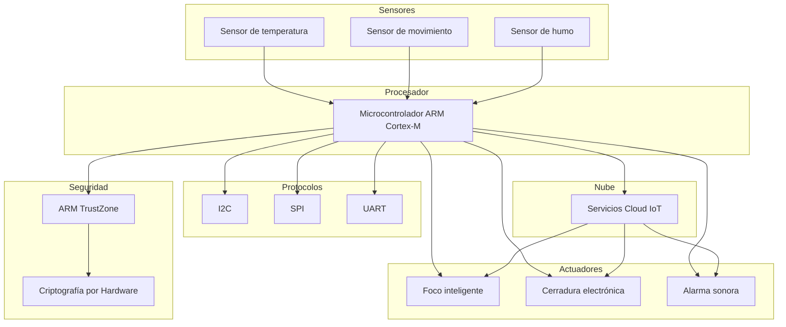

# ARM y la automatización del hogar

## Información del Estudiante

- **Nombre:** Torres Sanchez Luka Leonardo Jesus  
- **Horario:** 4:00 PM  
- **Título del tema:** ARM y la automatización del hogar  

---

## Introducción

En el hogar en los últimos años se han implementado herramientas que nos ayudan a la automatización gracias al desarrollo de sistemas embebidos cada vez más eficientes, compactos y de bajo consumo energético.  
La arquitectura ARM se ha convertido en una de las plataformas más utilizadas para el diseño de dispositivos inteligentes, debido a la filosofía RISC, su eficiencia energética y su amplia adopción en microcontroladores y sistemas en chip.  
Los procesadores de la familia Cortex, específicamente el modelo **Cortex-M**, son empleados en aplicaciones de domótica como sistemas de iluminación inteligente, control de temperatura, cerraduras electrónicas, sensores ambientales y dispositivos de seguridad.  
Estas aplicaciones requieren no solo capacidad de procesamiento eficiente, sino también manejo de periféricos, comunicación con sensores y actuadores, respuesta en tiempo real y mecanismos robustos.  

---

## Fundamentos de la Arquitectura ARM en sistemas Embebidos

### Filosofía RISC

La arquitectura ARM se basa en los principios de RISC, lo cual es la clave de su éxito en la domótica.  
A diferencia de las arquitecturas CISC (x86 de Intel), donde una sola instrucción puede realizar múltiples operaciones complejas, RISC simplifica el diseño para ganar velocidad y eficiencia.  

### Familias Cortex
ARM no fabrica chips, sino que diseña **IP cores** para la automatización del hogar, dividiendo sus diseños en tres perfiles según la tarea que se quiere lograr:

1. **Cortex-A Application**  
   Diseñados para sistemas operativos complejos como Linux, Android o iOS.  
   En la domótica son el cerebro de la casa, presentes en pantallas inteligentes (Google Nest), asistentes de voz (Alexa) y estaciones de seguridad.  

2. **Cortex-R Real-Time**  
   Procesamiento de alta velocidad donde el tiempo de respuesta debe ser exacto.  
   Es menos común en el hogar, pero se usan en controladores de discos duros (NAS caseros) o sistemas de frenado y seguridad en casas inteligentes.  

3. **Cortex-M Microcontroladores**  
   Los más utilizados, diseñados para ser económicos y consumir muy poca energía.  
   Ejemplos: focos inteligentes, sensores de temperatura, enchufes Wi-Fi y detectores de humo.  

---

### Arquitectura de Registros
ARM tiene una estructura de registros que facilita la programación en ensamblador.  

- **Registros de Propósito General (R0 - R12):**  
  Son 13 registros que el programador puede usar libremente para cálculos, mover datos de sensores o manipular estados de luces.  

- **Registros Especiales:**  
  - **R13 - Stack Pointer (SP):** Apunta a una pila para guardar temporalmente los datos cuando el procesador recibe una interrupción.  
  - **R14 - Link Register (LR):** Guarda la dirección de retorno cuando el código salta a una subrutina (ejemplo: enviar un dato por Wi-Fi).  
  - **R15 - Program Counter (PC):** Contiene la dirección de memoria de la instrucción que se está ejecutando actualmente.  

---

## Seguridad y Privacidad en el Hogar

### Tecnología ARM TrustZone

Es una extensión de seguridad que crea un entorno de ejecución seguro (**Secure World**).  
Incluso si un hacker logra entrar a la red Wi-Fi de la casa, no podrá acceder a la memoria donde se guardan las huellas digitales o las claves de la cerradura, porque el hardware de ARM bloquea físicamente ese acceso.  

### Criptografía por Hardware
Muchos procesadores ARM para domótica incluyen un motor de aceleración criptográfica (AES, SHA).  
Esto permite cifrar los datos de las cámaras de seguridad sin que el procesador principal se ralentice, garantizando que el video viaje seguro por internet.  

---

## Comunicación y Protocolos de Bajo Nivel

- **I2C:** Ideal para sensores ambientales.  
- **SPI:** Usado en pantallas OLED y lectores RFID.  
- **UART:** Comunicación con módulos externos como Bluetooth y Zigbee.  

---

## Otros Puntos Importantes

### Conectividad con la Nube
Los dispositivos ARM en domótica suelen conectarse a servicios en la nube (AWS IoT, Azure IoT Hub, Google Cloud IoT).  
Esto permite:
- Control remoto desde aplicaciones móviles.  
- Actualizaciones OTA (Over-The-Air) para mejorar seguridad y funciones.  
- Integración con asistentes virtuales como Alexa o Google Assistant.  

### Eficiencia Energética
Uno de los mayores beneficios de ARM es su bajo consumo energético.  
- Permite que sensores funcionen con baterías durante meses o años.  
- Es clave en dispositivos portátiles y sistemas que requieren autonomía prolongada.  

### Escalabilidad
La arquitectura ARM se adapta desde pequeños microcontroladores hasta procesadores más potentes.  
Esto significa que:
- Un mismo ecosistema puede manejar desde un foco inteligente hasta un servidor doméstico.  
- Facilita la integración de múltiples dispositivos en un sistema centralizado.  

### Futuro de ARM en la Domótica
- **Inteligencia Artificial en el borde (Edge AI):** ARM ya soporta librerías optimizadas para ejecutar modelos de IA directamente en el dispositivo.  
- **Automatización predictiva:** Los sistemas podrán anticipar necesidades del usuario (ejemplo: ajustar la temperatura antes de que llegues a casa).  
- **Mayor seguridad:** Se espera que TrustZone y nuevas extensiones de hardware refuercen la protección contra ataques cada vez más sofisticados.  

---

## Flujo en un Hogar Inteligente

---

## Referencias Bibliográficas

* **Arquitectura ARM: descubre los procesadores ARM.** (2025, 8 de abril). *IONOS Digital Guide*. [https://www.ionos.mx/digitalguide/servidores/know-how/arquitectura-arm/](https://www.ionos.mx/digitalguide/servidores/know-how/arquitectura-arm/)
  
* **Materials.** (2023, 4 de diciembre). *¿Qué es la domótica en la arquitectura?* ArchDaily México. [https://www.archdaily.mx/mx/903363/que-es-la-domotica-y-cual-es-el-impacto-de-la-automatizacion-en-la-arquitectura](https://www.archdaily.mx/mx/903363/que-es-la-domotica-y-cual-es-el-impacto-de-la-automatizacion-en-la-arquitectura)
  
* **Deusto Formación.** (2025, 26 de septiembre). *¿Qué es la arquitectura domótica?* Deusto. [https://www.deustoformacion.com/blog/diseno-arquitectonico/que-es-arquitectura-domotica](https://www.deustoformacion.com/blog/diseno-arquitectonico/que-es-arquitectura-domotica)

---
