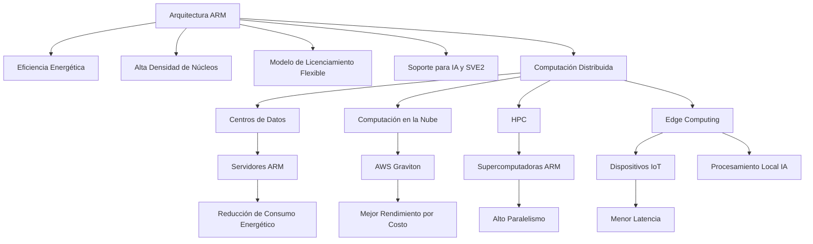
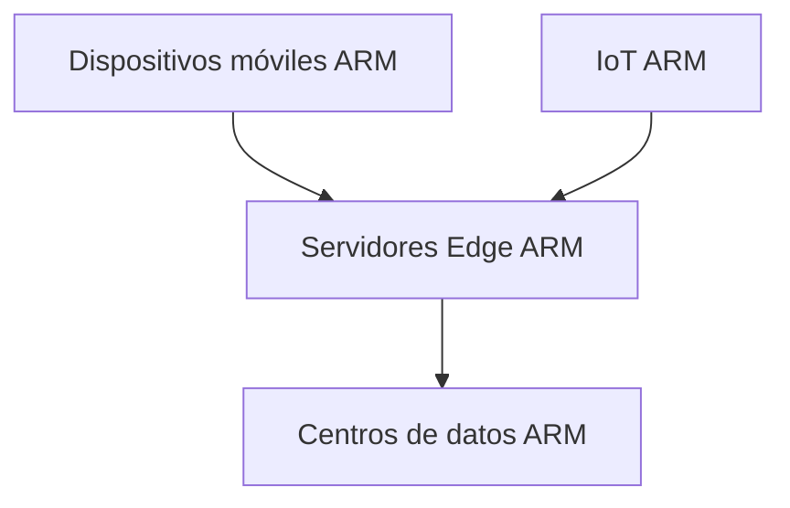
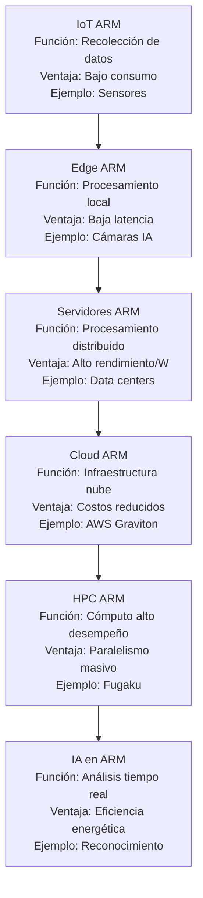

# ARM y la Computación Distribuida de Nueva Generación

- Alumno: Juan David Fernández Hernández
- Materia: Lenguajes de Interfaz
- Horario: 5 PM

## 1. Introducción

La arquitectura ARM (Advanced RISC Machine) es una familia de diseños de procesadores basada en el paradigma RISC (Reduced Instruction Set Computing). Durante décadas ha dominado el mercado de dispositivos móviles gracias a su alta eficiencia energética. Sin embargo, en los últimos años su presencia se ha expandido hacia servidores, centros de datos, computación en la nube, edge computing y supercomputación.

Esta evolución ha convertido a ARM en un elemento clave dentro de la computación distribuida de nueva generación, caracterizada por infraestructuras escalables, nodos heterogéneos y cargas de trabajo intensivas como inteligencia artificial (IA), análisis de grandes datos y servicios en tiempo real.

---

## 2. Fundamentos de la Arquitectura ARM

ARM es una arquitectura de conjunto reducido de instrucciones (RISC), lo que implica:

- Instrucciones simples y optimizadas.
- Bajo consumo energético.
- Alto rendimiento por vatio.
- Diseño modular y licenciable.

A diferencia de otros fabricantes, ARM no produce directamente la mayoría de sus procesadores; en su lugar, licencia la arquitectura a empresas como Apple, Qualcomm, NVIDIA y fabricantes de chips para centros de datos.

### 2.1 Evolución Reciente

- ARMv8: Introducción de arquitectura de 64 bits ampliamente adoptada en servidores.
- ARMv9: Mejoras en seguridad (Confidential Compute Architecture), capacidades avanzadas de IA y extensiones vectoriales SVE2.
- Arquitectura Neoverse: Diseñada específicamente para infraestructura de nube y centros de datos.

---

## 3. ARM en la Computación Distribuida

La computación distribuida consiste en múltiples sistemas interconectados que cooperan para resolver problemas complejos. ARM ha ganado relevancia en este entorno debido a su eficiencia energética y escalabilidad.

### 3.1 Centros de Datos y Nube

Empresas como Amazon Web Services han desarrollado procesadores propios basados en ARM, como AWS Graviton, optimizados para cargas en la nube. Estos procesadores ofrecen:

- Mejor rendimiento por costo.
- Reducción del consumo energético.
- Alta densidad de núcleos por servidor.

En los últimos años, proveedores como AWS, Microsoft Azure y Google Cloud han incrementado la adopción de instancias basadas en ARM para cargas empresariales.

### 3.2 HPC (High Performance Computing)

ARM también ha ingresado al ámbito de la supercomputación. Un ejemplo destacado es la supercomputadora Fugaku en Japón, basada en procesadores ARM A64FX, que alcanzó el primer lugar en el ranking TOP500 en 2020.

La combinación de eficiencia energética y alto paralelismo permite que ARM sea competitivo en entornos HPC distribuidos.

---

## 4. ARM y la Inteligencia Artificial Distribuida

Las cargas de trabajo modernas de IA requieren infraestructuras distribuidas y heterogéneas. ARM contribuye en dos niveles:

### 4.1 Edge Computing

En el edge computing, los dispositivos procesan datos localmente en lugar de enviarlos completamente a la nube. ARM domina este sector gracias a su bajo consumo energético.

Beneficios:
- Menor latencia.
- Reducción del tráfico en red.
- Mayor privacidad de datos.

### 4.2 Centros de Datos con Aceleradores

Procesadores como NVIDIA Grace combinan arquitectura ARM con aceleradores GPU para cargas de IA en centros de datos distribuidos. Esto permite sistemas heterogéneos donde CPU y GPU trabajan de manera coordinada.

---

## 5. Ventajas de ARM en Computación Distribuida

1. Eficiencia energética: Ideal para grandes clusters donde el consumo eléctrico es un factor crítico.
2. Escalabilidad: Alta densidad de núcleos.
3. Personalización: Modelo de licenciamiento flexible.
4. Integración con IA: Soporte para extensiones vectoriales avanzadas.
5. Reducción de costos operativos en centros de datos.

---

## 6. Desafíos y Consideraciones

- Compatibilidad de software legado diseñado para arquitecturas x86.
- Migración de aplicaciones empresariales.
- Necesidad de optimización específica para ARM en algunos entornos.

Sin embargo, el ecosistema de software (Linux, contenedores, Kubernetes, lenguajes modernos) ha mejorado significativamente el soporte multiplataforma.

---

## 7. Impacto en la Nueva Generación de Infraestructura

La computación distribuida moderna se caracteriza por:

- Infraestructura como servicio (IaaS).
- Contenedores y microservicios.
- Computación serverless.
- Inteligencia artificial distribuida.
- Edge + Cloud híbrido.

ARM se posiciona como una arquitectura estratégica para este modelo híbrido, permitiendo desde microdispositivos IoT hasta grandes centros de datos interconectados.

---

## 8. Conclusión

La arquitectura ARM ha evolucionado de ser una solución dominante en dispositivos móviles a convertirse en un componente fundamental de la computación distribuida de nueva generación. Su eficiencia energética, escalabilidad y capacidad de integración con tecnologías de inteligencia artificial la convierten en una alternativa sólida frente a arquitecturas tradicionales en centros de datos.

A medida que la demanda de procesamiento distribuido, IA y servicios en la nube continúa creciendo, ARM desempeñará un papel cada vez más relevante en la infraestructura tecnológica global.

---

## 9. Referencias

- ARM Ltd. Documentación oficial de arquitectura.
- Amazon Web Services. Familia de procesadores Graviton.
- TOP500 Supercomputer Sites.
- NVIDIA. Arquitectura Grace CPU.
- Documentación técnica ARMv9 y Neoverse.

## Diagrama: ARM en la Computación Distribuida de Nueva Generación

## Diagrama Infraestructura distribuida moderna

## Diagrama: Componentes de ARM en la Computación Distribuida

