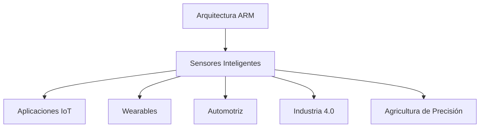

**Nombre:** Angel Cassiel Neyra Mendez  
**Matrícula:** 23212030  
**Fecha:** 11-Febrero-2026

---

## 📌 Introducción

La arquitectura ARM (Advanced RISC Machine) se ha consolidado como la tecnología dominante en el ámbito de los dispositivos móviles y sistemas embebidos, especialmente en aplicaciones que requieren integración con sensores inteligentes. Esta investigación explora la sinergia entre los procesadores ARM y los sensores inteligentes, fundamentales en el desarrollo del Internet de las Cosas (IoT), dispositivos wearables, sistemas automotrices y automatización industrial.

Los sensores inteligentes modernos no solo capturan datos del entorno físico, sino que también incorporan capacidades de procesamiento local, permitiendo análisis en tiempo real y reducción del consumo energético. La arquitectura ARM, con su filosofía de bajo consumo y alta eficiencia, se presenta como la plataforma ideal para estas aplicaciones.

---

## 🏗️ Arquitectura ARM: Fundamentos

### ¿Qué es ARM?

ARM es una arquitectura de conjunto de instrucciones reducido (RISC) diseñada originalmente por Acorn Computers en 1985. A diferencia de otras arquitecturas, ARM Holdings licencia sus diseños a fabricantes de semiconductores, permitiendo una amplia diversificación y optimización para aplicaciones específicas.

### Características principales

- **Eficiencia energética:** Consumo reducido de energía, ideal para dispositivos alimentados por batería
- **Diseño RISC:** Conjunto de instrucciones simplificado que permite ejecución rápida
- **Escalabilidad:** Desde microcontroladores simples (Cortex-M) hasta procesadores de alto rendimiento (Cortex-A)
- **Arquitectura de 32 y 64 bits:** Soporte para ARMv7 (32-bit) y ARMv8/ARMv9 (64-bit)

### Familias de procesadores ARM

#### Cortex-M (Microcontroladores)
- **Cortex-M0/M0+:** Ultra bajo consumo, aplicaciones sencillas
- **Cortex-M3/M4:** Mayor rendimiento, DSP integrado
- **Cortex-M7:** Alto rendimiento para aplicaciones en tiempo real
- **Cortex-M33/M55:** Seguridad mejorada y soporte para ML

#### Cortex-R (Tiempo Real)
- Diseñados para sistemas críticos que requieren respuestas determinísticas
- Aplicaciones automotrices, médicas e industriales

#### Cortex-A (Aplicaciones)
- Procesadores de alto rendimiento para smartphones, tablets y sistemas embebidos complejos
- Soporte para sistemas operativos completos (Linux, Android)

---

## 🔬 Sensores Inteligentes: Conceptos Clave
### Definición

Un sensor inteligente es un dispositivo que combina:
1. **Elemento sensor:** Detecta variables físicas (temperatura, presión, aceleración, luz, etc.)
2. **Acondicionamiento de señal:** Amplificación, filtrado y conversión analógico-digital
3. **Procesamiento local:** Microcontrolador o procesador que interpreta datos
4. **Interfaz de comunicación:** Protocolos digitales (I²C, SPI, UART, Bluetooth, Wi-Fi)

### Ventajas de los sensores inteligentes

- **Reducción de carga en el sistema principal:** Procesamiento distribuido
- **Calibración automática:** Corrección de errores y drift
- **Comunicación digital:** Mayor inmunidad al ruido
- **Funciones avanzadas:** Detección de eventos, filtrado, fusión de datos
- **Eficiencia energética:** Modos de bajo consumo y activación por eventos

### Tipos comunes de sensores

| Tipo | Aplicación | Ejemplos |
|------|-----------|----------|
| **Acelerómetros/Giroscopios** | Detección de movimiento | MPU6050, LSM6DS3 |
| **Temperatura/Humedad** | Monitoreo ambiental | DHT22, BME280 |
| **Presión** | Altimetría, meteorología | BMP280, MS5611 |
| **Proximidad/Luz** | Interacción humana | APDS9960, VL53L0X |
| **Gas/Calidad del aire** | Seguridad, salud | MQ-135, CCS811 |
| **Biométricos** | Salud, deportes | MAX30102, AD8232 |

---

## 💡 Casos de Uso y Aplicaciones

### 1. Internet de las Cosas (IoT)

**Descripción:** Dispositivos conectados que recopilan y transmiten datos ambientales.

**Ejemplo: Estación meteorológica inteligente**
- **Procesador:** ARM Cortex-M4 (STM32F4)
- **Sensores:**
  - BME280: Temperatura, humedad, presión
  - VEML7700: Luminosidad
  - Anemómetro digital
- **Conectividad:** Wi-Fi (ESP32) o LoRa
- **Características:** Análisis local de tendencias, alertas, transmisión de datos a la nube

### 2. Dispositivos Wearables

**Descripción:** Tecnología vestible para monitoreo de salud y actividad física.

**Ejemplo: Smartwatch con monitoreo cardíaco**
- **Procesador:** ARM Cortex-M33 con TrustZone
- **Sensores:**
  - MAX30102: Pulso cardíaco y SpO2
  - LSM6DS3: Acelerómetro y giroscopio
  - Sensor de temperatura corporal
- **Procesamiento:** Detección de arritmias, conteo de pasos, análisis de sueño
- **Comunicación:** BLE para sincronización con smartphone

### 3. Sistemas Automotrices

**Descripción:** Electrónica avanzada para seguridad, asistencia al conductor y vehículos autónomos.

**Ejemplo: Sistema ADAS (Advanced Driver Assistance Systems)**
- **Procesador:** ARM Cortex-R52 para tiempo real crítico
- **Sensores:**
  - Cámaras (procesamiento de imagen)
  - Radar (detección de objetos)
  - Lidar (mapeo 3D)
  - Sensores ultrasónicos (estacionamiento)
- **Funciones:** Frenado automático, mantenimiento de carril, control de crucero adaptativo

### 4. Domótica e Industria 4.0

**Descripción:** Automatización de edificios y procesos industriales.

**Ejemplo: Sistema de gestión energética inteligente**
- **Procesador:** ARM Cortex-A53 (Raspberry Pi)
- **Sensores:**
  - Sensores de corriente/voltaje (medición energética)
  - PIR (detección de presencia)
  - Sensores de apertura de puertas/ventanas
- **Procesamiento:** Machine Learning para predicción de consumo, optimización automática
- **Conectividad:** Wi-Fi, Zigbee para red mesh

### 5. Agricultura de Precisión

**Descripción:** Optimización de cultivos mediante monitoreo continuo.

**Ejemplo: Nodo sensor para cultivos**
- **Procesador:** ARM Cortex-M0+ (ultra bajo consumo)
- **Sensores:**
  - Humedad del suelo
  - pH y nutrientes
  - Temperatura y humedad ambiental
- **Energía:** Panel solar + batería
- **Comunicación:** LoRaWAN para largo alcance
- **Autonomía:** Varios meses sin mantenimiento

---

---

## 🛠️ Desarrollo de Aplicaciones: Herramientas y Frameworks

### Entornos de Desarrollo Integrado (IDEs)

#### Keil MDK
- IDE oficial de ARM
- Depuración avanzada y simulación
- Soporte completo para Cortex-M/R

#### STM32CubeIDE
- Basado en Eclipse
- Gratuito, para microcontroladores STM32
- Herramientas de configuración gráfica (CubeMX)

#### Arduino IDE / PlatformIO
- Simplicidad para prototipos rápidos
- Gran ecosistema de librerías
- Soporte para placas ARM (Due, Zero, Teensy)

#### Mbed OS
- Sistema operativo de código abierto para IoT
- APIs de alto nivel para sensores
- Soporte nativo para ARM Cortex-M

### Frameworks de Machine Learning

#### TensorFlow Lite Micro
- Versión ultra-ligera de TensorFlow
- Optimizada para microcontroladores ARM
- Inferencia en dispositivo sin conectividad

#### CMSIS-NN
- Biblioteca de redes neuronales optimizada para ARM Cortex-M
- Funciones de bajo nivel para operaciones de ML
- Eficiencia energética y de memoria

**Aplicación:** Reconocimiento de gestos con acelerómetro, clasificación de audio, detección de anomalías

---

## 📊 Comparativa: ARM vs Otras Arquitecturas

| Característica | ARM Cortex-M | AVR (Arduino) | x86 (Intel) | RISC-V |
|----------------|--------------|---------------|-------------|---------|
| **Consumo energético** | Muy bajo | Bajo | Alto | Muy bajo |
| **Rendimiento** | Medio-Alto | Bajo-Medio | Muy alto | Variable |
| **Ecosistema** | Extenso | Amplio | Limitado (embebidos) | Creciente |
| **Costo** | Bajo-Medio | Muy bajo | Alto | Bajo |
| **Soporte ML** | Excelente (CMSIS-NN) | Limitado | Excelente | Emergente |
| **Escalabilidad** | Alta (M0 a A76) | Baja | Media | Alta |
| **Licenciamiento** | Comercial | Propietario | Propietario | Open Source |

**Conclusión:** ARM ofrece el mejor balance entre rendimiento, consumo y ecosistema para aplicaciones con sensores inteligentes.

---

## 🔮 Tendencias Futuras

### 1. Edge AI (Inteligencia Artificial en el borde)
- Procesamiento de ML directamente en sensores ARM
- Reducción de latencia y dependencia de la nube
- Privacidad mejorada (datos no salen del dispositivo)

### 2. Sensores multimodales integrados
- Fusión de múltiples tipos de sensores en un solo chip
- Procesadores ARM con sensores embebidos
- Ejemplo: Bosch BMI270 (IMU con reconocimiento de contexto)

### 3. Redes neuronales especializadas
- NPUs (Neural Processing Units) integradas en SoCs ARM
- ARM Ethos-U para aceleración de ML
- Inferencia ultrarrápida con mínimo consumo

### 4. Comunicación 5G y NB-IoT
- Sensores conectados a redes celulares
- Baja latencia para aplicaciones críticas
- Cobertura global sin infraestructura local

### 5. Computación cuántica híbrida
- Sensores clásicos (ARM) + procesadores cuánticos
- Optimización de rutas, criptografía post-cuántica
- Aplicaciones experimentales en investigación

### 6. Sostenibilidad y energía
- Harvesting energético (solar, vibración, térmica)
- Sensores autoalimentados sin baterías
- Arquitecturas ARM aún más eficientes

---

## 🎯 Conclusiones
La convergencia de ARM, sensores inteligentes y algoritmos de inteligencia artificial está creando una nueva generación de dispositivos capaces de percibir, interpretar y actuar sobre el mundo físico con autonomía sin precedentes. Esta tecnología será fundamental en la construcción de ciudades inteligentes, medicina personalizada, vehículos autónomos y la próxima generación del Internet de las Cosas.

---

## 📚 Referencias

1. ARM Holdings. (2024). *ARM Cortex-M Processor Technical Reference Manual*. https://developer.arm.com/

2. Yiu, J. (2023). *The Definitive Guide to ARM Cortex-M Microcontrollers*. Newnes.

3. STMicroelectronics. (2024). *STM32 Reference Manuals and Application Notes*. https://www.st.com/

4. ARM. (2024). *CMSIS-NN Documentation - Neural Network Kernels for Cortex-M*. https://github.com/ARM-software/CMSIS-NN

5. TensorFlow. (2024). *TensorFlow Lite for Microcontrollers Guide*. https://www.tensorflow.org/lite/microcontrollers

6. IoT Analytics. (2024). *State of IoT - Market Report*. https://iot-analytics.com/

7. Embedded Computing Design. (2024). *Edge AI and Sensor Fusion Trends*. https://www.embedded-computing.com/

---
