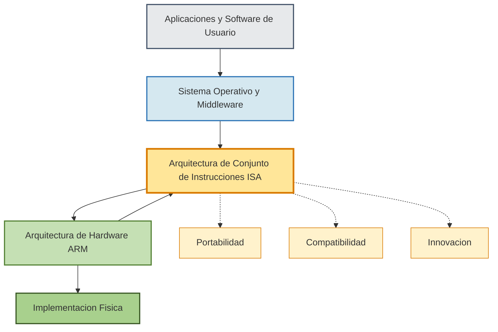

# ARM y la interoperabilidad Hardware-Software

## Introducción

La arquitectura ARM (Advanced RISC Machine) representa uno de los pilares fundamentales de la computación moderna. Con más de 325 mil millones de dispositivos 
basados en chips ARM, esta arquitectura ha demostrado ser la piedra angular del ecosistema de computación más grande del mundo. ARM define un conjunto de reglas
que dictan cómo funciona el hardware cuando se ejecuta una instrucción particular, estableciendo un contrato entre el hardware y el software que define cómo 
interactúan entre sí.

La interoperabilidad entre hardware y software es crucial en el ecosistema ARM, ya que permite que el software escrito conforme a las especificaciones ARM se 
ejecute de manera consistente en cualquier procesador o chipset basado en ARM. Esta característica fundamental garantiza la portabilidad y compatibilidad que 
sustentan todo el ecosistema ARM.

## Arquitectura de Conjunto de Instrucciones (ISA)

La Arquitectura de Conjunto de Instrucciones (ISA) es la interfaz abstracta entre el hardware del procesador y el software que ejecuta. La ISA especifica tanto 
lo que el procesador es capaz de hacer como la manera en que lo hace. Actúa como un contrato entre el hardware y el software, definiendo:

-   El conjunto completo de instrucciones soportadas por el procesador
-   Los formatos de instrucción y modos de direccionamiento
-   Los registros disponibles (propósito general, punto flotante, función especial)
-   Los tipos de datos soportados (enteros, punto flotante, vectores)
-   La arquitectura de memoria, incluyendo modos de direccionamiento y memoria virtual

La ISA de ARM ha evolucionado continuamente para satisfacer las demandas de la computación moderna, incluyendo el auge de la Inteligencia Artificial (IA), 
Machine Learning (ML), la adopción de chiplets y las crecientes amenazas de seguridad. En 2024, ARM introdujo Armv9.6-A, que incluye extensiones significativas
para mejorar el rendimiento, la eficiencia y la seguridad en software habilitado para IA.

## Arquitecturas del sistema ARM

### Especificaciones gratuitas y abiertas

ARM ofrece especificaciones de arquitectura de sistema gratuitas que guían el diseño de sistemas seguros y eficientes. Estas incluyen definiciones en componentes
de hardware, firmware y software, permitiendo la interoperabilidad y adopción en todo el ecosistema. Las arquitecturas clave incluyen:

-   **Base System Architecture (BSA)**: Define requisitos mínimos de hardware y firmware
-   **Base Boot Requirements (BBR)**: Especifica requisitos de arranque
-   **Base Boot Security Requirements (BBSR)**: Define seguridad en el arranque

Estas especificaciones son co-desarrolladas por ARM y sus socios en el System Architecture Advisory Committee (SystemArchAC), asegurando que satisfagan las 
necesidades reales del mercado.

### Programa ARM SystemReady

ARM SystemReady es un programa de cumplimiento que ayuda a garantizar la interoperabilidad de un sistema operativo en hardware basado en ARM. Los desarrolladores
pueden construir software una vez y desplegarlo en cualquier chip ARM compatible. El programa se divide en dos bandas principales:

| Característica | SystemReady Band | SystemReady Devicetree Band |
|----------------|------------------|------------------------------|
| **Enfoque** | Entornos ACPI (Advanced Configuration and Power Interface) | Sistemas embebidos con Devicetree |
| **Objetivo** | SO genéricos en hardware nuevo o antiguo sin modificación | Optimizar instalación y arranque con compatibilidad futura |
| **Aplicaciones** | Servidores, Windows, VMware | Linux embebido, BSD, IoT | 

## Arquitectura de Sistema de Chiplets (CSA)

La Arquitectura de Sistema de Chiplets (CSA) de ARM aborda la partición de un sistema basado en ARM en múltiples chiplets, incluyendo sus propiedades de alto nivel,
para definir tipos de chiplets que pueden ser estandarizados y reutilizados. Esta iniciativa es fundamental para acelerar el movimiento hacia un mercado 
multi-vendedor que proporciona chiplets especializados e interoperables.

### Foundation Chiplet System Architecture (FCSA)

En 2025, ARM donó la Foundation Chiplet System Architecture (FCSA) al Open Compute Project (OCP), posicionándola junto a otras iniciativas de OCP destinadas a 
reducir la complejidad del sistema y acelerar el despliegue en centros de datos. ARM también se unió al consejo directivo de OCP, donde ahora se sienta junto a 
AMD, Nvidia y otros miembros alineados con hyperscalers.

El objetivo de FCSA es establecer el estándar para centros de datos de AI abiertos y convergentes, donde los tiles de computación desagregados pueden mezclarse y 
combinarse sin requerir SoCs monolíticos o stacks verticales fuertemente acoplados. FCSA proporciona un vocabulario compartido para definir interfaces entre 
chiplets y complementa estándares existentes como UCIe o BoW, especificando cómo los chiplets interoperan a nivel de sistema.

Con más de 50 socios tecnológicos trabajando en CSA, ARM espera que más se unan como parte de este creciente impulso hacia la estandarización en el mercado de 
chiplets. La combinación de estándares será más importante que nunca, ya que permitirá que diferentes hardwares de diferentes vendedores trabajen juntos sin 
problemas.

## Seguridad y computación confidencial

### Arquitectura de Cómputo Confidencial (CCA)

La Arquitectura de Cómputo Confidencial (CCA) de ARM aprovecha tanto hardware como software para proteger datos y aplicaciones en uso. Armv9.1-A introdujo la 
Realm Management Extension (RME), que crea un mundo computacional separado en el dispositivo para ejecutar y proteger aplicaciones y datos. El uso de un realm 
previene ataques de software que se ejecuta en niveles de privilegio más altos.

### Extensión de Etiquetado de Memoria (MTE)

Las extensiones de 2023 y 2024 incluyen características de seguridad avanzadas como Checked Pointer Arithmetic, que se basa en el soporte existente para 
ARM Memory Tagging Extension (MTE). Esto permite a los desarrolladores detectar violaciones de seguridad de memoria rápidamente, ahorrándoles costos y tiempo
durante el desarrollo de aplicaciones.

## Soporte para IA y Machine Learning

ARM ha enfocado consistentemente la innovación arquitectónica para preparar su vasto ecosistema para los requisitos de computación en constante cambio y el futuro
de la IA. ARM ha evolucionado proactivamente las capacidades de IA de sus CPUs durante dos décadas con características como:

-   **Neon**: Extensiones SIMD para procesamiento multimedia
-   **Helium**: Tecnología de procesamiento vectorial para Cortex-M
-   **Scalable Vector Extension (SVE y SVE2)**: Para procesamiento vectorial escalable
-   **Scalable Matrix Extension (SME y SME2)**: Para operaciones matriciales eficientes

Las extensiones de 2023 introdujeron un nuevo formato de punto flotante de 8 bits llamado FP8, que ya está viendo una rápida adopción en redes neuronales. Las 
características más recientes de la arquitectura Armv9 están impulsando un mayor rendimiento de computación, junto con un menor consumo de energía para cargas de
trabajo de IA.

## Ecosistema de software e interoperabilidad

### Soporte de sistemas operativos

El soporte para Armv8-A fue fusionado en el kernel Linux versión 3.7 a finales de 2012. La arquitectura ARM es compatible con una amplia gama de sistemas 
operativos, incluyendo:

-   **Linux** (múltiples distribuciones)
-   **Windows 10 y 11** (con soporte para aplicaciones ARM64 nativas y emulación x86/x86-64)
-   **Android** (desde Lollipop 5.0)
-   **iOS y iPadOS** (solo 64-bit desde iOS 11)
-   **BSD** (FreeBSD, OpenBSD, NetBSD)
-   **HarmonyOS** (desarrollado específicamente para procesadores ARM desde 2024)

### Colaboración con el ecosistema

ARM trabaja estrechamente con Linaro y una multitud de otros socios para habilitar la ISA de ARM en las comunidades de software upstream más utilizadas, como el 
kernel de Linux y las distribuciones, para ayudar a entregar el ecosistema de desarrolladores más amplio del planeta. Esta colaboración profunda asegura que las 
nuevas características arquitectónicas estén habilitadas en software de código abierto tan pronto como el hardware esté disponible.

Asociaciones clave incluyen colaboraciones con Red Hat para soluciones de infraestructura energéticamente eficientes, con soporte de virtualización en plataformas 
ARM de 64 bits en Red Hat Enterprise Linux, permitiendo mayor flexibilidad de desarrollo y despliegue a través de arquitecturas.

## Aplicaciones y segmentos de mercado

La arquitectura ARM prevalece en múltiples mercados, habilitando la innovación de socios en diversas áreas:

| Segmento de mercado | Aplicaciones principales |
|---------------------|--------------------------|
| **Móvil** | Smartphones, tablets, wearables. La mayoría de smartphones del mundo |
| **IoT** | Dispositivos embebidos, sensores, dispositivos edge, sistemas industriales |
| **Infraestructura** | Servidores de centros de datos, redes, almacenamiento, cloud computing |
| **Automotriz** | Vehículos definidos por software, ADAS, infoentretenimiento, arquitectura zonal |
| **Machine Learning** | Inferencia AI en dispositivos edge, procesamiento ML eficiente en energía |

## Capas de interoperabilidad Hardware-Software

**Descripción del diagrama:**
- **Capa A**: Aplicaciones (Android, iOS, Windows, Linux, HarmonyOS)
- **Capa B**: Sistema Operativo (Kernel, Drivers, Bibliotecas, Frameworks)
- **Capa C**: ISA - Contrato entre Hardware y Software
- **Capa D**: Arquitectura Hardware (CPU Cores, Cache, MMU)
- **Capa E**: Implementación Física (Cortex-A, Cortex-R, Cortex-M, Neoverse, Chiplets)
- **F, G, H**: Beneficios de la interoperabilidad

## Tendencias futuras y perspectivas 2025-2026

### IA en el Edge

En 2024 se vio un número creciente de cargas de trabajo de IA ejecutándose en el edge (en el dispositivo) en lugar de procesarse en grandes centros de datos.
Esto significa ahorro de energía y costos, así como beneficios de privacidad y seguridad para consumidores y empresas. 2025 verá probablemente la emergencia de
arquitecturas híbridas de IA sofisticadas que separan tareas de IA entre dispositivos edge y la nube.

### Estandarización de chiplets

Con la emergencia de chiplets que integran diferentes componentes de computación, los estándares serán más importantes que nunca, ya que permitirán que diferentes
hardwares de diferentes vendedores trabajen juntos sin problemas. ARM ya está trabajando con más de 50 socios tecnológicos en la Arquitectura de Sistema de Chiplets
(CSA) y espera que más se unan.

### Vehículos definidos por software

En la industria automotriz, esto se combinará con SOAFEE (Scalable Open Architecture for Embedded Edge) que tiene como objetivo desacoplar hardware y software 
en vehículos definidos por software (SDVs), llevando a mayor flexibilidad e interoperabilidad entre componentes de computación y ciclos de desarrollo más rápidos.

## Conclusiones

La arquitectura ARM ha demostrado ser un pilar fundamental en el ecosistema de computación global, con una interoperabilidad hardware-software que permite 
portabilidad sin precedentes. La ISA de ARM actúa como un contrato claro entre hardware y software, asegurando que las aplicaciones funcionen consistentemente 
a través de diferentes implementaciones de hardware.

Los programas como ARM SystemReady y las iniciativas de la Arquitectura de Sistema de Chiplets demuestran el compromiso continuo de ARM con la estandarización y la 
interoperabilidad. A medida que el ecosistema evoluciona hacia chiplets, IA en el edge y vehículos definidos por software, la arquitectura ARM continúa 
adaptándose para satisfacer las demandas emergentes.

Con más de 325 mil millones de dispositivos impulsados por ARM y un ecosistema de socios sin paralelo, ARM está posicionado de manera única para liderar la próxima
era de la computación, donde la colaboración profunda del ecosistema y los estándares abiertos son esenciales para el éxito.

## Referencias

1. Arm Holdings. (2024). *Arm A-Profile Architecture Developments 2024*. Arm Developer Community. https://community.arm.com/arm-community-blogs/b/architectures-and-processors-blog/posts/arm-a-profile-architecture-developments-2024

2. Linaro Limited. (2024). *Linaro: Arm Solutions at Lightspeed*. https://www.linaro.org/

3. Red Hat, Inc. (2024). *ARM vs x86: What's the difference?* https://www.redhat.com/en/topics/linux/ARM-vs-x86

4. Arm Holdings. (2025). *Arm Opens Access to Chiplet Architectures and AI Platforms*. All About Circuits. https://www.allaboutcircuits.com/

5. Arm Holdings. (2024). *System Architecture Design*. https://www.arm.com/architecture/system-architectures

6. Arm Holdings. (2024). *Arm SystemReady Compliance Program*. Arm Developer. https://developer.arm.com/

7. Microcontroller Tips. (2021). *RISC-V vs. ARM vs. x86 – What's the difference?* https://www.microcontrollertips.com/risc-v-vs-arm-vs-x86-whats-the-difference/

8. Arm Holdings. (2024). *What is Instruction Set Architecture (ISA)?* https://www.arm.com/glossary/isa

9. Arm Developer Community. (2016). *Linux Support for the ARM Architecture*. https://developer.arm.com/

