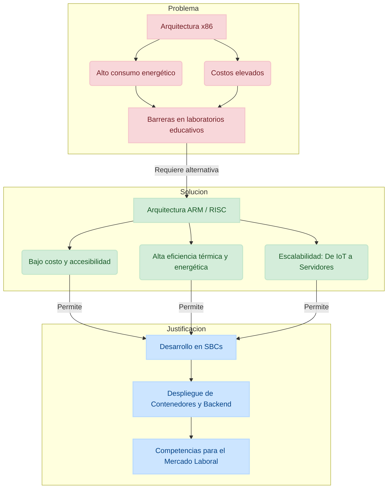
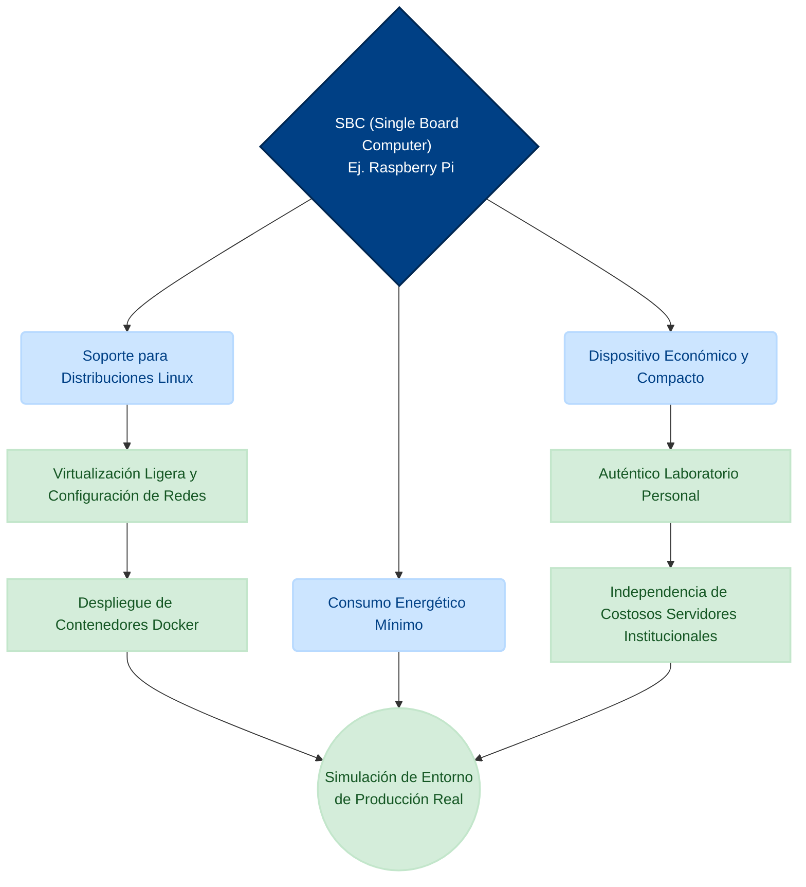
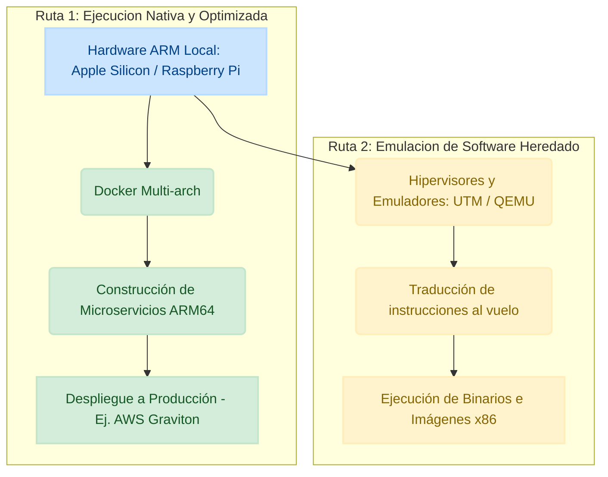
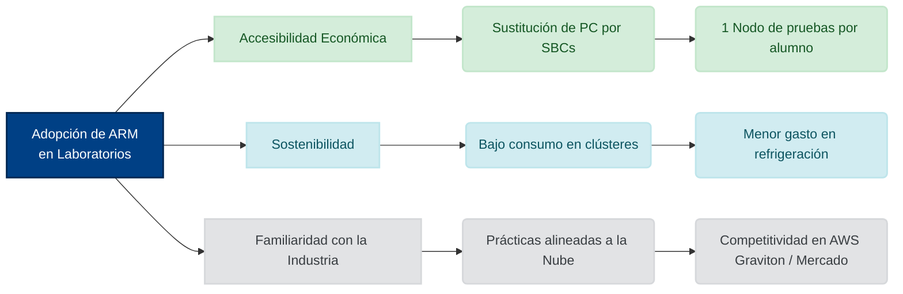
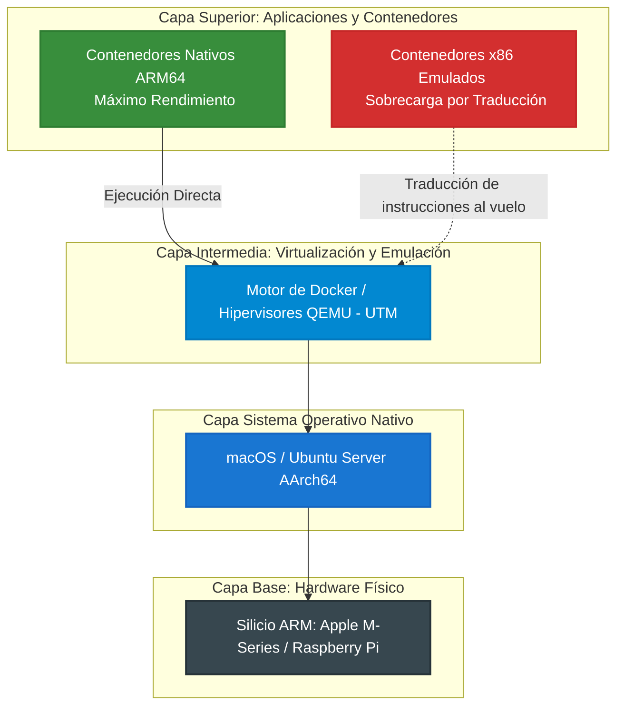

# ARM y su adopción en sistemas educativos tecnológicos 

### **I. Introducción**

**Contextualización de la Arquitectura ARM**

La arquitectura ARM (Advanced RISC Machine) especifica un conjunto de reglas que dictan el funcionamiento del hardware al ejecutar una instrucción, actuando como un contrato estricto que define cómo interactúan el hardware y el software. En la actualidad, ARM es la piedra angular del ecosistema informático más grande del mundo. Con más de 325 mil millones de dispositivos que utilizan chips basados en sus licencias, esta tecnología ha evolucionado de manera acelerada: pasó de dominar predominantemente el mercado móvil de smartphones a impulsar la innovación en múltiples sectores, abarcando desde sistemas IoT (Internet de las Cosas) muy simples hasta sofisticadas aplicaciones de aprendizaje automático. Su ecosistema global garantiza portabilidad, estandarización de seguridad y compatibilidad comprobada.

**Planteamiento del Problema**

Históricamente, la arquitectura x86 ha mantenido un dominio absoluto en el sector de las computadoras personales y los servidores tradicionales. Sin embargo, este paradigma presenta limitaciones importantes en entornos educativos y de experimentación técnica. Los equipos basados en x86 suelen implicar un alto consumo energético y costos de adquisición elevados, lo que dificulta el acceso a infraestructura de pruebas. Ante esto, existe una creciente necesidad de integrar hardware de bajo costo y alta eficiencia energética en las aulas y laboratorios. Los estudiantes requieren plataformas accesibles que les permitan compilar código, simular redes y desplegar servicios sin enfrentarse a las barreras financieras de la infraestructura tradicional.

**Justificación**

ARM se posiciona como la base tecnológica indispensable para el futuro de los estudiantes de ingeniería, particularmente para aquellos enfocados en el desarrollo web y los sistemas embebidos. Comprender esta arquitectura permite realizar una transición fluida entre la programación de microcomputadoras asequibles —ideales para levantar contenedores y configurar servidores de prueba— y el desarrollo en sistemas operativos modernos de alto rendimiento que ya han migrado a procesadores RISC. Al dominar el ecosistema ARM, los futuros ingenieros no solo aprenden a optimizar recursos y garantizar la seguridad desde el diseño, sino que adquieren competencias directas para un mercado laboral que exige soluciones de software portátiles, escalables y eficientes.

### II. Fundamentos Técnicos de ARM

**Arquitectura RISC vs. CISC**

La diferencia fundamental entre la arquitectura ARM y los procesadores tradicionales x86 radica en su filosofía de diseño. ARM se basa en el modelo RISC (Reduced Instruction Set Computer), el cual utiliza un conjunto de instrucciones altamente optimizado donde cada instrucción es lo suficientemente simple como para ejecutarse en un solo ciclo de reloj. Por el contrario, la arquitectura CISC (Complex Instruction Set Computer), utilizada por x86, cuenta con instrucciones complejas que pueden requerir múltiples ciclos y mayor lógica de decodificación en el hardware. Al utilizar RISC, los procesadores ARM simplifican enormemente el diseño del silicio, trasladando gran parte de la complejidad lógica al compilador del software. Esto permite incluir un mayor número de registros de propósito general en el chip, acelerando el acceso a los datos y haciendo que la ejecución del código sea sumamente eficiente.

```mermaid
graph TD
    %% Estilos
    classDef cisc fill:#f8d7da,stroke:#f5c6cb,stroke-width:2px,color:#721c24
    classDef risc fill:#d4edda,stroke:#c3e6cb,stroke-width:2px,color:#155724

    subgraph ArquitecturaCISC [Filosofía CISC - Ej. x86]
        C1[Instrucciones Complejas]:::cisc --> C2(Requieren Múltiples Ciclos de Reloj):::cisc
        C2 --> C3(Mayor Complejidad Lógica en el Hardware):::cisc
    end

    subgraph ArquitecturaRISC [Filosofía RISC - Ej. ARM]
        R1[Instrucciones Simples y Optimizadas]:::risc --> R2(Ejecución en 1 Solo Ciclo de Reloj):::risc
        R2 --> R3(Hardware Simplificado / Complejidad al Compilador):::risc
        R3 --> R4(Mayor Número de Registros de Propósito General):::risc
        R4 --> R5(Acceso a Datos Acelerado y Altamente Eficiente):::risc
    end
```

**Eficiencia Energética y Térmica**

Gracias a la simplicidad inherente del diseño RISC, los procesadores ARM requieren significativamente menos transistores para su funcionamiento básico, lo que se traduce en un consumo eléctrico mínimo y una disipación de calor casi nula en comparación con la competencia. Esta característica resulta invaluable para el diseño de dispositivos portátiles, pero adquiere una relevancia especial en los laboratorios escolares y entornos de experimentación personal. Para los estudiantes de ingenierías, esta eficiencia térmica y energética permite operar microcomputadoras de placa reducida sin necesidad de costosos sistemas de refrigeración activa. Levantar entornos de prueba completos, como clústeres de bases de datos o el despliegue de contenedores de software de forma ininterrumpida, se vuelve una realidad accesible y silenciosa que no impacta drásticamente el consumo eléctrico del hogar o la institución.

**Ecosistema AArch64**

El verdadero punto de inflexión para ARM en la computación de alto rendimiento fue la introducción de la arquitectura ARMv8 y su estado de ejecución de 64 bits, conocido como AArch64. Este salto tecnológico eliminó las limitaciones de direccionamiento de memoria de los 32 bits y amplió la capacidad de procesamiento de datos complejos, permitiendo a ARM competir directamente en el terreno de los servidores y las estaciones de trabajo. Hoy en día, el ecosistema AArch64 cuenta con un soporte maduro y nativo en sistemas operativos de grado de producción como Ubuntu Server y Android, e incluso es la base de los modernos entornos de desarrollo basados en macOS. Para un desarrollador, esto significa que el código, los servicios y los entornos virtualizados construidos sobre esta arquitectura son completamente robustos, escalables y directamente portables a la infraestructura de la nube moderna.

### III. Dispositivos ARM en el Ámbito Educativo

**SBC (Single Board Computers)**

Las computadoras de placa única (SBC), siendo la Raspberry Pi su máximo exponente, han democratizado el acceso a la infraestructura de hardware en el ámbito universitario. Estos dispositivos económicos y compactos funcionan como auténticos laboratorios personales para los estudiantes, permitiendo realizar prácticas avanzadas sin depender de costosos servidores institucionales.

Al soportar distribuciones completas de Linux, resultan ideales para experimentar con la virtualización ligera, levantando contenedores de Docker o configurando redes locales de prueba. De esta forma, el alumno puede simular un entorno de producción real y desplegar arquitecturas complejas desde su propio escritorio con un consumo energético mínimo.

**Laptops y Dispositivos Móviles**

La penetración de ARM en el cómputo personal ha redefinido las herramientas de desarrollo profesional y educativo, demostrando que ya no es exclusivo de teléfonos móviles. Por un lado, las Chromebooks ofrecen una puerta de entrada económica y basada en la nube para estudiantes, mientras que la transición hacia Apple Silicon (procesadores M1, M2 y M3) ha revolucionado las estaciones de trabajo de alto rendimiento. Para un desarrollador, utilizar el sistema operativo macOS sobre esta arquitectura RISC garantiza compilar proyectos masivos o ejecutar entornos locales de manera fluida y silenciosa. Este ecosistema nativo facilita la creación de aplicaciones modernas con una eficiencia térmica que x86 difícilmente puede igualar.

**Sistemas Embebidos y Robótica**

En el campo de la automatización y la electrónica educativa, la familia de microcontroladores ARM Cortex-M se ha consolidado como el estándar absoluto de la industria para la enseñanza de sistemas embebidos. A diferencia de los procesadores de aplicación general, estos chips están diseñados para el control en tiempo real, operando con un consumo ultra bajo y ofreciendo respuestas inmediatas a eventos físicos.

Su integración en placas de desarrollo accesibles permite a los estudiantes interactuar directamente con sensores, actuadores y protocolos de comunicación a bajo nivel de hardware. Dominar esta rama específica de la arquitectura dota al futuro ingeniero de las bases analíticas necesarias para desarrollar soluciones sólidas en el creciente ecosistema del Internet de las Cosas (IoT).

### IV. Software y Herramientas de Desarrollo sobre ARM

**Sistemas Operativos**

La consolidación de la arquitectura ARM en el ámbito de los servidores y el desarrollo profesional ha impulsado la creación de versiones nativas de los sistemas operativos más utilizados en la industria. Distribuciones de Linux de grado empresarial y comunitario, como la reciente versión Ubuntu Noble Numbat (24.04), ofrecen compilaciones AArch64 que garantizan un rendimiento óptimo sin requerir capas de traducción. Para un estudiante, esto significa la posibilidad de configurar servidores web, bases de datos y entornos de despliegue exactamente iguales a los que encontrará en plataformas en la nube como AWS Graviton. Utilizar un sistema operativo nativo maximiza la eficiencia del hardware, aprovechando al límite los recursos de dispositivos compactos como una Raspberry Pi.

**Programación de Bajo Nivel**

El estudio de la programación a bajo nivel en lenguaje ensamblador ARM64 es una competencia técnica invaluable en la formación académica de cualquier ingeniero. La filosofía RISC, al utilizar instrucciones de tamaño fijo y una estructura lógica simplificada, permite a los estudiantes comprender directamente la gestión de registros y el ciclo de ejecución del procesador. Dominar el ensamblador no solo es fundamental para desarrollar compiladores u optimizar rutinas críticas, sino que establece las bases para áreas avanzadas como la ingeniería inversa y la ciberseguridad. Entender cómo interactúa el silicio con el software otorga al futuro desarrollador una ventaja analítica innegable al depurar código complejo.

**Virtualización y Contenedores**

El auge del desarrollo local sobre hardware ARM ha traído consigo nuevos desafíos en la virtualización, especialmente al intentar interactuar con imágenes o binarios diseñados históricamente para la arquitectura x86. Afortunadamente, herramientas de contenerización como Docker han integrado soporte multiplataforma (multi-arch), permitiendo a los desarrolladores construir y desplegar microservicios que corren de manera nativa y ligera en procesadores ARM.

Cuando es estrictamente necesario ejecutar sistemas operativos o software heredado de otras arquitecturas, hipervisores y emuladores como UTM (muy popular en macOS) o QEMU logran traducir las instrucciones al vuelo mediante software. Dominar estas tecnologías puente es hoy un requisito indispensable para garantizar que el código escrito en un equipo con Apple Silicon o una placa educativa funcione perfectamente en cualquier servidor de producción.

### V. Ventajas de la Adopción en Instituciones (Caso ITT/Sistemas)

**Accesibilidad Económica**

La implementación de la arquitectura ARM representa una solución financieramente viable para modernizar los laboratorios de ingeniería. Al sustituir las tradicionales y costosas torres de escritorio por computadoras de placa única (SBC), como la Raspberry Pi, se democratiza el acceso a la tecnología para toda la comunidad estudiantil. Esta reducción drástica en los costos de adquisición de hardware permite que cada alumno cuente con su propio nodo de pruebas físico para compilar código, configurar servidores y experimentar libremente sin agotar los presupuestos académicos.

**Sostenibilidad**

Más allá del ahorro en la compra inicial, la transición hacia esta arquitectura impacta positivamente en el gasto operativo a través de una reducción sustancial en el consumo eléctrico de la infraestructura institucional. Desplegar clústeres educativos basados en procesadores RISC para alojar bases de datos o levantar decenas de contenedores de Docker requiere apenas una fracción de la energía que demandan los servidores x86 convencionales. Esta eficiencia energética no solo disminuye la huella de carbono del campus, sino que elimina la necesidad de mantener ruidosos y costosos sistemas de aire acondicionado en los centros de datos universitarios.

**Familiaridad con la Industria**

Finalmente, integrar esta arquitectura en las prácticas de laboratorio alinea las competencias de los estudiantes directamente con las exigencias del mercado laboral tecnológico, especialmente en el ámbito del desarrollo. Acostumbrar a los futuros ingenieros a desplegar aplicaciones en entornos ARM los prepara para la transición masiva que domina la computación en la nube, impulsada por instancias de alto rendimiento como AWS Graviton. Conocer las particularidades de este ecosistema garantiza que el egresado dominará desde la programación eficiente de dispositivos hasta el despliegue de infraestructura verdaderamente moderna y escalable.

### VI. Desafíos y Limitaciones

**Compatibilidad de Software Heredado**

A pesar de los múltiples beneficios de la arquitectura ARM, el mayor obstáculo técnico sigue siendo la compatibilidad con el software heredado o legacy. Durante décadas, la industria compiló herramientas, librerías y sistemas de misión crítica de forma exclusiva para procesadores x86, lo que significa que estos binarios no pueden ejecutarse nativamente en entornos RISC. Aunque existen emuladores y capas de traducción en tiempo real, estos procesos añaden una fuerte sobrecarga computacional que penaliza el rendimiento. Para un ingeniero, esto representa un reto ineludible al intentar migrar bases de datos antiguas o integrar aplicaciones empresariales monolíticas en servidores ARM modernos.

**Curva de Aprendizaje**

La transición masiva hacia esta tecnología también impone una pronunciada curva de aprendizaje, forzando la adaptación acelerada de los planes de estudio tradicionales. Históricamente, las materias universitarias de arquitectura de computadoras y lenguajes de interfaz se han centrado de forma casi dogmática en el conjunto de instrucciones complejo (CISC) de Intel y AMD.

Modificar este paradigma educativo requiere actualizar profundamente la bibliografía, las prácticas de laboratorio y la mentalidad analítica del estudiante para dominar la filosofía RISC. Este esfuerzo adicional es vital, ya que comprender el silicio actual exige desaprender vicios fuertemente ligados al ecosistema x86 para poder escribir código verdaderamente optimizado.

**Limitaciones de Rendimiento en Virtualización**

Finalmente, la virtualización de sistemas operativos presenta barreras de rendimiento muy notorias cuando se intenta cruzar arquitecturas de hardware distintas. Un ejemplo crítico es la inoperancia de hipervisores tradicionales, como VirtualBox, en los modernos equipos de Apple con silicio ARM, ya que estas herramientas requieren acceso a instrucciones x86 que físicamente no existen en el chip. Levantar máquinas virtuales completas mediante emulación por software resulta en una lentitud extrema y caídas constantes del sistema operativo invitado. Como desarrollador, este desafío obliga a depender casi exclusivamente de contenedores ligeros multiplataforma o de instancias en la nube para probar código sin sacrificar velocidad.

### VII. Conclusiones y Futuro

**Tendencias**

La trayectoria evolutiva de la arquitectura ARM demuestra de manera contundente que ha dejado de ser una tecnología restringida exclusivamente a teléfonos móviles y dispositivos de ultra bajo consumo. Las tendencias de la industria confirman su irreversible consolidación tanto en las estaciones de trabajo de escritorio modernas como en la infraestructura de servidores de alto rendimiento que sostiene la nube. Para un ingeniero, ignorar esta transición hacia ecosistemas como AWS Graviton o Apple Silicon equivale a quedar tecnológicamente rezagado en un mercado sumamente competitivo. El futuro del desarrollo exigirá, de forma casi obligatoria, dominar la compilación y el despliegue nativo en AArch64 para construir plataformas verdaderamente escalables y eficientes.

**Impacto Educativo**

En el terreno académico, el impacto de esta arquitectura trasciende el aspecto puramente técnico para convertirse en un poderoso catalizador de la democratización educativa a nivel global. Al ofrecer un equilibrio excepcional entre costo accesible, tamaño reducido y gran capacidad de procesamiento, dispositivos como las computadoras de placa única permiten a cualquier estudiante construir y administrar clústeres reales en su propio escritorio. Esta accesibilidad elimina las históricas barreras financieras de las carreras de ingeniería, otorgando a las nuevas generaciones la libertad de experimentar con contenedores, bases de datos y redes sin depender de costosos laboratorios institucionales. En conclusión, adoptar la filosofía ARM en la formación universitaria garantiza que el talento tecnológico se desarrolle impulsado por el conocimiento y no frenado por las limitaciones del hardware tradicional.

#### Bibliografías

Patterson, D. A., & Hennessy, J. L. (2016). Computer Organization and Design ARM Edition: The Hardware Software Interface. Morgan Kaufmann.

Yiu, J. (2013). The Definitive Guide to ARM Cortex-M3 and Cortex-M4 Processors (3ra ed.). Newnes.

Severance, C. (2013). Eben Upton: Raspberry Pi. Computer, 46(10), 14-16. IEEE Computer Society.

Arm Limited. (2026). Arm Architecture Reference Manual for A-profile architecture. Arm Developer Documentation. Recuperado de https://developer.arm.com

Amazon Web Services. (2026). AWS Graviton Processors: Arm-based processors built for the cloud. AWS Documentation. Recuperado de https://aws.amazon.com/ec2/graviton/

Raspberry Pi Foundation. (2026). Raspberry Pi Documentation: Linux and the Raspberry Pi OS. Recuperado de https://www.raspberrypi.com/documentation/
