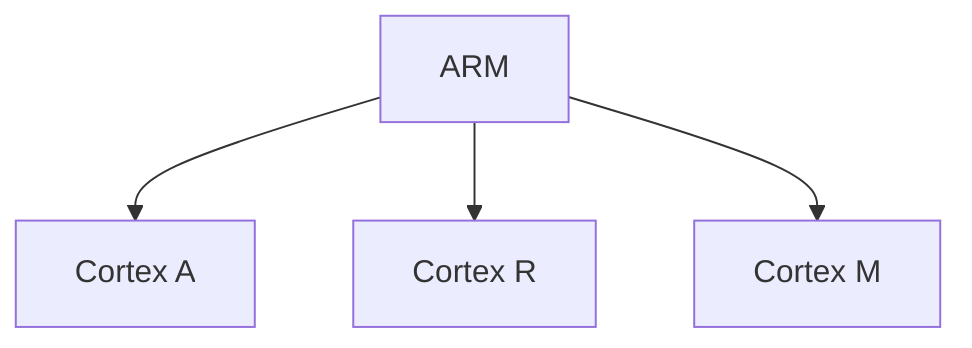

# ARM y su impacto en la industria electrónica

  

---

## Información académica

**Alumno:** Irene Ramírez Bautista  
**Número de Control:** 23212049  
**Asignatura:** Lenguajes de Interfaz  
**Horario:** 4:00 PM  
**Docente:** Rene Solis Reyes  
**Fecha de Entrega:** 24 de febrero de 2026

---
## Resumen

### ¿Qué es ARM?

La arquitectura ARM es una tecnología ampliamente utilizada en la industria electrónica moderna, especialmente en dispositivos móviles, sistemas embebidos y equipos electrónicos inteligentes. Esta arquitectura se basa en el modelo RISC (Reduced Instruction Set Computing), el cual permite ejecutar instrucciones de manera más eficiente, reduciendo el consumo energético sin comprometer el rendimiento del sistema.

Actualmente, ARM se ha convertido en una de las arquitecturas más importantes dentro del sector tecnológico debido a su capacidad de ofrecer alto rendimiento con bajo consumo de energía, lo cual resulta esencial en dispositivos electrónicos que dependen de baterías o requieren eficiencia térmica.

El presente trabajo tiene como objetivo analizar el impacto que ha tenido la arquitectura ARM en la industria electrónica, así como sus principales características, ventajas frente a otras arquitecturas como x86 y su aplicación en distintos sectores tecnológicos.

---

## Introducción

La arquitectura ARM (Advanced RISC Machine) fue desarrollada originalmente por Acorn Computers en la década de 1980 y posteriormente licenciada por ARM Holdings. Desde entonces, ha evolucionado hasta convertirse en una de las arquitecturas de procesadores más utilizadas en dispositivos electrónicos a nivel mundial.

A diferencia de otras arquitecturas como x86, ARM se basa en el paradigma RISC, el cual utiliza un conjunto reducido de instrucciones que permite una ejecución más rápida y eficiente. Esta característica ha permitido que los procesadores ARM se integren en dispositivos electrónicos que requieren bajo consumo de energía, como smartphones, tablets, electrodomésticos inteligentes, sistemas IoT y dispositivos portátiles.

Gracias a su eficiencia energética y capacidad de procesamiento, ARM ha tenido un impacto significativo en el desarrollo de la industria electrónica moderna.
## Marco Teórico

### Arquitectura RISC

La arquitectura ARM está fundamentada en el paradigma RISC (Reduced Instruction Set Computing), el cual utiliza un conjunto de instrucciones simples que permiten realizar operaciones de manera más rápida y eficiente. Esto reduce el consumo de energía y mejora el rendimiento general del sistema.

A diferencia de arquitecturas como CISC, que utilizan instrucciones más complejas, RISC permite que los procesadores ejecuten tareas utilizando menos ciclos de reloj, lo que se traduce en mayor eficiencia energética y menor generación de calor.

### Comparativa ARM vs x86

| Característica | ARM | x86 |
|--------------|-----|-----|
| Tipo de arquitectura | RISC | CISC |
| Consumo energético | Bajo | Alto |
| Rendimiento por vatio | Alto | Medio |
| Generación de calor | Baja | Alta |
| Uso en dispositivos móviles | Amplio | Limitado |

### Núcleos Cortex

ARM organiza sus procesadores en distintas familias de núcleos conocidas como Cortex:

- **Cortex-A:** Orientados al alto rendimiento, utilizados en smartphones y tablets.
- **Cortex-R:** Diseñados para sistemas en tiempo real.
- **Cortex-M:** Utilizados en microcontroladores y dispositivos IoT debido a su bajo consumo energético.

### Arquitectura big.LITTLE

La arquitectura big.LITTLE combina núcleos de alto rendimiento con núcleos de bajo consumo energético dentro del mismo procesador. Esto permite que el sistema utilice únicamente los recursos necesarios dependiendo de la tarea que se esté ejecutando, optimizando el consumo de energía sin afectar el rendimiento.
## Desarrollo

### Aplicaciones de ARM en la Industria Electrónica

Los procesadores basados en arquitectura ARM se utilizan en una gran variedad de dispositivos electrónicos debido a su eficiencia energética y buen rendimiento. Actualmente, esta arquitectura se encuentra presente en:

- Smartphones  
- Tablets  
- Dispositivos IoT  
- Sistemas embebidos  
- Dispositivos portátiles  
- Electrodomésticos inteligentes  
- Equipos médicos electrónicos  

Gracias a su bajo consumo de energía, ARM permite que estos dispositivos funcionen de manera eficiente sin generar exceso de calor, lo que resulta fundamental en equipos que dependen de baterías.

### System on Chip (SoC)

Un System on Chip (SoC) es un circuito integrado que reúne en un solo chip varios componentes esenciales de un sistema electrónico como:

- CPU  
- GPU  
- Memoria  
- Módulos de conectividad  

Esto permite que los dispositivos electrónicos sean más compactos, eficientes y económicos, facilitando su integración en distintos tipos de tecnología como teléfonos inteligentes, dispositivos IoT y sistemas electrónicos industriales.

### Impacto en la Industria Electrónica

La arquitectura ARM ha tenido un impacto significativo en la industria electrónica debido a su capacidad de ofrecer un equilibrio entre rendimiento y consumo energético. Su implementación ha permitido el desarrollo de dispositivos más pequeños, ligeros y con mayor duración de batería.

Además, ARM ha facilitado la innovación en áreas como:

- Computación móvil  
- Internet de las cosas (IoT)  
- Electrónica de consumo  
- Sistemas automatizados  
- Dispositivos inteligentes  

Gracias a estas ventajas, ARM se ha convertido en una tecnología fundamental para el desarrollo de nuevos productos electrónicos, permitiendo mejorar el desempeño de los sistemas sin incrementar el consumo de energía.
## Conclusión

La arquitectura ARM ha revolucionado la industria electrónica gracias a su eficiencia energética y su capacidad de ofrecer alto rendimiento en dispositivos de bajo consumo. Su diseño basado en el paradigma RISC permite optimizar el funcionamiento de dispositivos electrónicos modernos, desde smartphones hasta sistemas embebidos e IoT.

Debido a estas características, ARM se ha convertido en una tecnología fundamental en el desarrollo de nuevos dispositivos electrónicos, contribuyendo al avance de la industria tecnológica y facilitando la creación de sistemas más eficientes y compactos.
 Microcontroladores

###🧠 Diagrama — Familias Cortex
---
### 📊 Diagrama — Filosofía RISC

---

---
## Referencias

- https://es.wikipedia.org/wiki/Arquitectura_ARM  
- https://www.arm.com/  
- https://www.geeksforgeeks.org/computer-organization-architecture/arm-processor-and-its-features/  
- https://www.techtarget.com/searchmobilecomputing/definition/ARM-processor  
- https://developer.arm.com/
