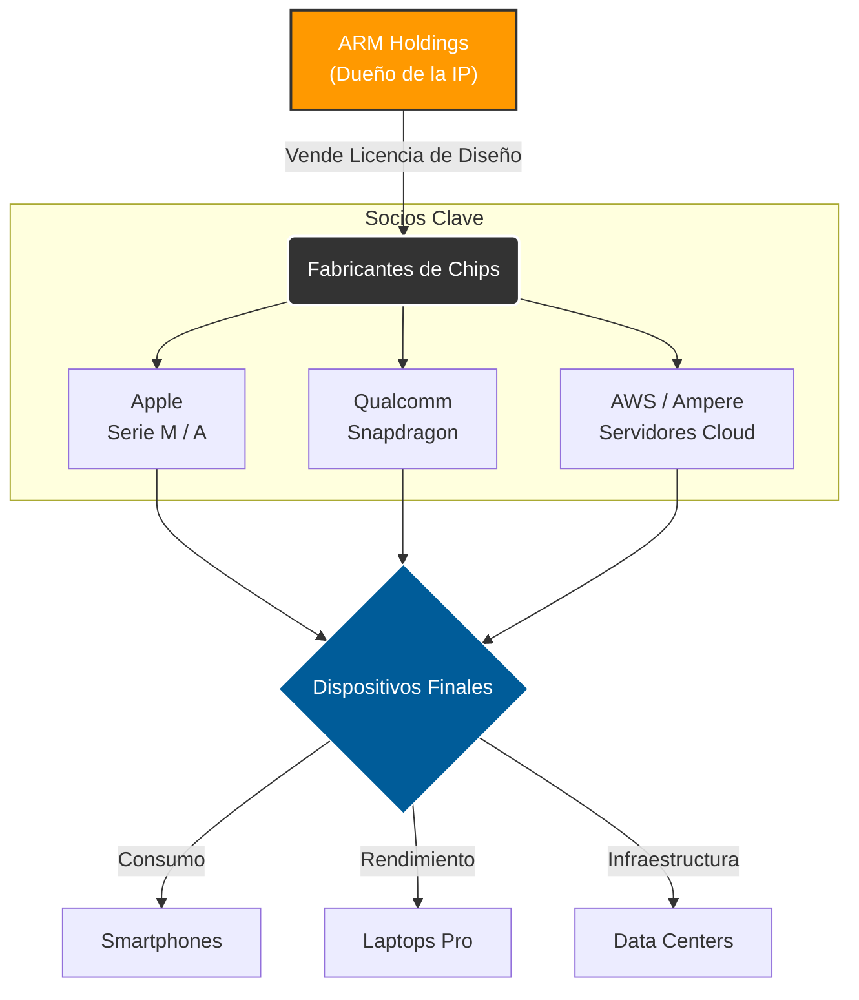

# ARM y su Impacto en la Industria Tecnológica Global

- **Autor:** Torres Moreno Diego Antonio
- **Matrícula:** 23212077
- **Materia:** Lenguajes de Interfaz
- **Horario:** 5pm 

---

## 1. Introducción
La arquitectura ARM (Advanced RISC Machine) ha pasado de ser una tecnología de bajo consumo para dispositivos móviles a convertirse en el pilar fundamental de la computación moderna global. A diferencia del modelo tradicional de manufactura de chips (como Intel o AMD), ARM opera bajo un modelo de **Licenciamiento de Propiedad Intelectual (IP)**. Esto ha permitido una democratización en el diseño de semiconductores, permitiendo que empresas como Apple, Qualcomm, Samsung y AWS diseñen sus propios procesadores a la medida.

Para entender el impacto de ARM, es necesario contrastarlo con la arquitectura tradicional x86 (usada por Intel/AMD). La siguiente tabla resume sus diferencias clave:

| Característica | Arquitectura ARM (RISC) | Arquitectura x86 (CISC) |
| :--- | :--- | :--- |
| **Significado** | *Reduced Instruction Set Computing* (Conjunto de Instrucciones Reducido) | *Complex Instruction Set Computing* (Conjunto de Instrucciones Complejo) |
| **Filosofía** | Ejecutar instrucciones simples en un solo ciclo de reloj. | Ejecutar instrucciones complejas que pueden tomar varios ciclos. |
| **Eficiencia Energética** | **Muy Alta:** Ideal para baterías y centros de datos verdes. | **Media/Baja:** Prioriza la potencia bruta sobre el consumo. |
| **Uso Principal** | Smartphones, Tablets, IoT, Servidores Cloud, Apple Macs. | PC Gaming, Workstations, Servidores Tradicionales. |
| **Modelo de Negocio** | Venta de licencias (IP) a terceros. | Venta de chips físicos manufacturados. |

## 2. El Modelo de Negocio que Cambió el Mundo
El impacto global de ARM se debe a su flexibilidad. No fabrican chips; venden los planos. Esto ha generado un ecosistema donde la innovación no depende de una sola fábrica.

* **Eficiencia Energética:** La arquitectura RISC permite ejecutar instrucciones con menos transistores, generando menos calor y consumiendo menos batería.
* **Personalización:** Los socios pueden agregar sus propios módulos (NPU para IA, GPUs potentes) sobre la base ARM.

## 3. Sectores de Impacto Crítico

### A. Dispositivos Móviles (Dominio Total)
Actualmente, más del **99% de los smartphones** del mundo (Android e iOS) corren sobre arquitectura ARM. La eficiencia por watt es imbatible en este sector.

### B. Computación de Alto Rendimiento (HPC) y Nube
Históricamente dominado por x86, el sector de servidores ha sido irrumpido por ARM.
* **AWS Graviton:** Amazon demostró que los servidores ARM reducen costos en un 40%.
* **Supercomputadora Fugaku:** Basada en ARM, fue catalogada como la más rápida del mundo, demostrando que ARM sirve para cálculos científicos complejos.

### C. La Revolución de Apple Silicon
La transición de Apple de Intel a sus propios chips **M1/M2/M3 (basados en ARM)** validó la arquitectura para el mercado de laptops y desktops profesionales, forzando a la industria de PC a buscar alternativas similares (como Windows on ARM).

---

## 4. Diagrama del Ecosistema ARM (Mermaid)
Este diagrama ilustra cómo fluye la propiedad intelectual de ARM hacia los diferentes sectores industriales.

## 5. El Futuro: ARM en la Industria Automotriz

El próximo gran impacto de ARM está en los Vehículos Definidos por Software (SDV). Los coches modernos, especialmente los eléctricos y autónomos, requieren procesar terabytes de datos de sensores y cámaras en tiempo real sin agotar la batería del auto. ARM domina este sector gracias a su plataforma ARM Automotive, utilizada por marcas como Tesla y NVIDIA para la conducción autónoma.

## 6. Conclusión
El impacto de ARM en la industria global es irreversible. Al separar el diseño de la arquitectura de la fabricación física, ARM permitió la explosión del IoT y la computación móvil. Hoy, con la integración de Inteligencia Artificial (NPU) directamente en los chips, ARM está lista para definir la próxima década tecnológica, desplazando a arquitecturas antiguas en casi todos los frentes.

## 7. Referencias Bibliográficas

1.  **Rodrigo Alonso (Hardzone.es).** *Todo lo que necesitas saber sobre los procesadores ARM*
    * (https://hardzone.es/tutoriales/componentes/procesador-arm/)

2.  **Amazon Web Services (AWS Oficial).** *Procesadores AWS Graviton: La mejor relación precio-rendimiento para cargas de trabajo en la nube.*
    * (https://aws.amazon.com/es/ec2/graviton/)

3.  **Redhat.** *ARM vs. x86: What's the difference?*
    * (https://www.redhat.com/en/topics/linux/ARM-vs-x86)

4.  **Microsoft Learn.** *Windows en ARM: Documentación técnica.*
    * (https://learn.microsoft.com/es-es/windows/arm/)
  
5.  **Mefics.org.** *Qué es la arquitectura RISC y CISC con sus ventajas y desventajas*
    * (https://mefics.org/es/qué-es-la-arquitectura-risc-y-cisc-con-sus-ventajas-y-desventajas/)
