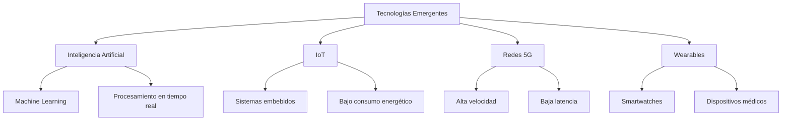

# ARM y tecnologías emergentes en dispositivos portátiles 📱⚡

**Alumna:** Monjaraz Torres Allyson Fernanda

**Número de control:** 23210630

**Horario:** 5:00-6:00pm

**Materia:** Lenguaje de interfaz

## Introducción 🔎

El crecimiento acelerado de la tecnología móvil ha impulsado el desarrollo de dispositivos portátiles cada vez más potentes, compactos y eficientes. Smartphones, relojes inteligentes, tabletas y dispositivos IoT requieren arquitecturas capaces de ofrecer alto rendimiento con bajo consumo energético. En este contexto, la arquitectura ARM se ha convertido en un pilar fundamental para el funcionamiento de estos dispositivos.  
  
Las tecnologías emergentes se han transformado de la manera en que interactuamos con la información, integrando inteligencia artificial, conectividad avanzada y procesamiento eficiente en equipos de tamaño reducido.

# Definición de ARM 📖

ARM (**Advanced RISC Machine**) es una arquitectura de procesador basada en un modelo de computación con conjunto de instrucciones reducido (RISC). Prioriza la eficiencia mediante la ejecución de instrucciones más sencillas, lo que resulta en un menor consumo de energía y menor generación de calor.

## Características principales de ARM 💡

 **1.** Eficiencia Energética y Rendimiento
 **2.** Diseño RISC
 **3.** Licenciamento de IP
 **4.** Escalabilidad
 **5.** Ejecución Condicional
 **6.** Multinúcleo (Multicore)

La arquitectura ARM es un diseño de procesador basado en el conjunto de instrucciones  **RISC  (Reduced Instruction Set Computer)**, caracterizado por su alta eficiencia energética, bajo consumo, alto rendimiento por vatio y escalabilidad. Es la arquitectura líder en dispositivos móviles, embebidos e IoT debido a que produce menos calor y optimiza la duración de la batería 🔋.

# Tecnologías emergentes en dispositivos portátiles 💻👩‍💻

## Ventajas de ARM en dispositivos portátiles ✅

| Ventaja | Descripción |
|----------|-------------|
| Bajo consumo energético | Optimiza el uso de energía, lo que prolonga la duración de la batería. |
| Alto rendimiento por watt | Ofrece buen desempeño sin requerir gran cantidad de energía. |
| Menor generación de calor | Reduce la necesidad de sistemas de enfriamiento complejos. |
| Diseño escalable | Puede adaptarse a diferentes tipos de dispositivos, desde IoT hasta smartphones. |
| Integración eficiente | Permite incorporar GPU, NPU y otros módulos en un solo chip (SoC). |
| Amplia adopción | Gran compatibilidad con sistemas como Android y otros entornos móviles. |

## Desafíos y limitaciones ❌
## 6. Desafíos y limitaciones

| Desafío / Limitación | Descripción |
|----------------------|-------------|
| Compatibilidad con software x86 | Algunos programas diseñados para arquitecturas x86 pueden no funcionar de manera nativa. |
| Dependencia de fabricantes | ARM licencia su arquitectura, por lo que el rendimiento depende del diseño del fabricante. |
| Rendimiento en tareas extremas | Puede ser menos potente que CPUs de escritorio en cargas de trabajo muy intensivas. |
| Fragmentación del ecosistema | Diferentes implementaciones pueden generar variaciones en rendimiento y compatibilidad. |
| Optimización específica | Algunas aplicaciones requieren adaptación para aprovechar al máximo la arquitectura ARM. |

## Aplicaciones prácticas 🛡️📲
- Smartphones.  
- Tabletas.  
- Relojes inteligentes.  
- Dispositivos médicos portátiles.  
- Sensores inteligentes en hogares y ciudades inteligentes.

# Conclusión ✍️
La arquitectura ARM ha revolucionado el desarrollo de dispositivos portátiles al ofrecer un equilibrio ideal entre rendimiento y eficiencia energética. Su integración con tecnologías emergentes como la inteligencia artificial, el IoT y el 5G la posiciona como una de las arquitecturas más importantes en la actualidad.  
  
A medida que la tecnología continúa evolucionando, ARM seguirá desempeñando un papel clave en el diseño de soluciones innovadoras para dispositivos inteligentes y portátiles.

## Fuentes ✒️

_Arquitectura ARM: descubre los procesadores ARM_. (2025, 8 abril). IONOS Digital Guide. https://www.ionos.mx/digitalguide/servidores/know-how/arquitectura-arm/

Arm Ltd. (s. f.). _ARM Architecture_. Arm | The Architecture For The Digital World. https://www.arm.com/architecture

_Tecnologías Emergentes que Transformarán el Futuro - Post Grados Universitarios | Empower Talent_. (2025, 6 febrero). Empower Talent. https://empowertalent.com/tecnologias-emergentes/

_Tecnologías emergentes - Ferrovial_. (2020, 21 abril). Ferrovial. https://www.ferrovial.com/es/innovacion/digital-hub/tecnologias-emergentes/

