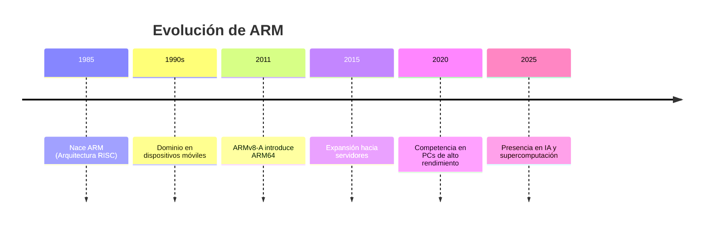
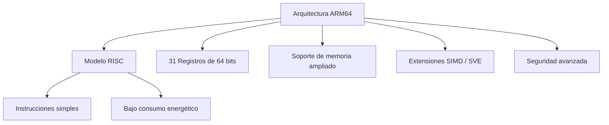
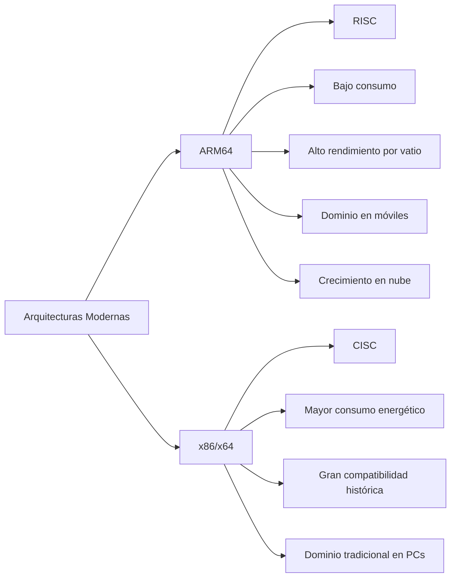
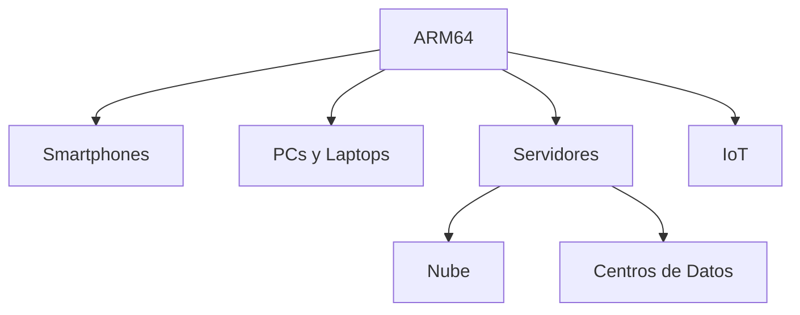
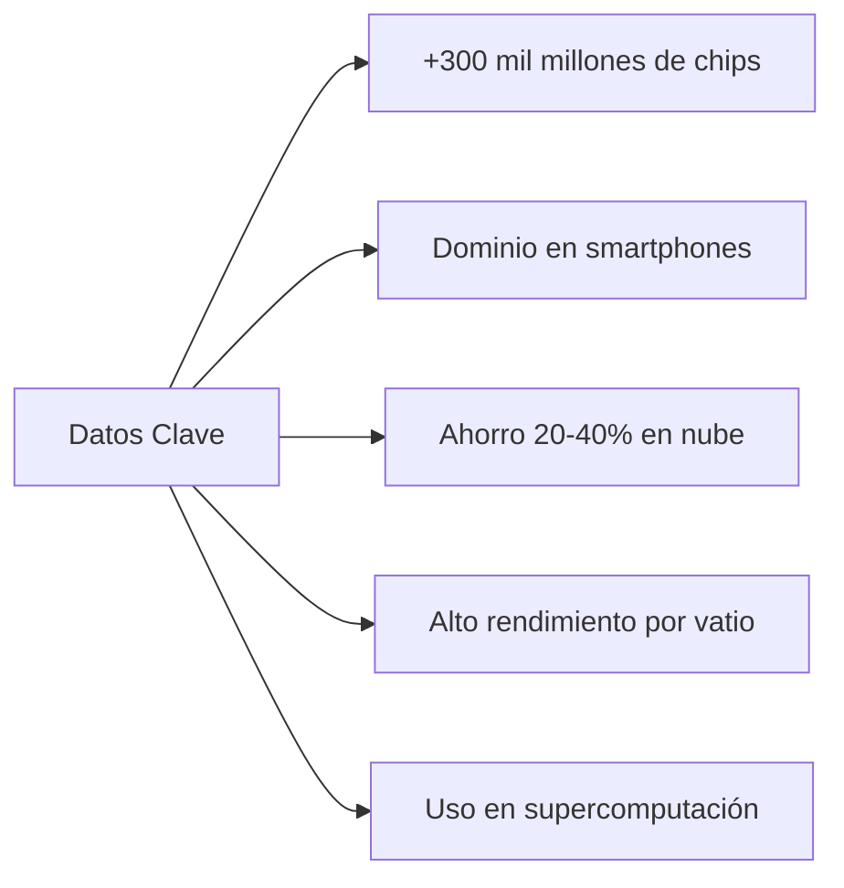
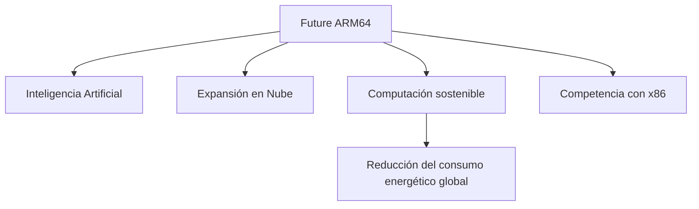

# Datos Personales
 
Alumno: Alfaro Guerra Juan Jesus 

Horario: 5:00pm

Materia: Lenguajes de Interfaz

# ARM64 y la Evolución del Cómputo Eficiente en Dispositivos Modernos

## 1. Introducción

ARM64, también conocido como **AArch64**, es la versión de 64 bits de la arquitectura desarrollada por Arm Ltd. Esta arquitectura pertenece al modelo **RISC (Reduced Instruction Set Computing)**, el cual utiliza instrucciones simples y optimizadas para reducir el consumo energético y mejorar el rendimiento por vatio.

La introducción de ARM64 representó un avance significativo en la industria tecnológica, ya que permitió que dispositivos móviles, computadoras personales y servidores alcanzaran altos niveles de eficiencia energética sin sacrificar potencia de procesamiento.

Actualmente, la arquitectura ARM está presente en más de **300 mil millones de dispositivos** en todo el mundo, consolidándose como una de las arquitecturas más utilizadas en la historia del cómputo.

---

## 2. Evolución Histórica

La arquitectura ARM nació en 1985 con el objetivo principal de crear procesadores de bajo consumo energético. Durante las décadas de 1990 y 2000 dominó el mercado de dispositivos móviles y sistemas embebidos.

En 2011 se presentó **ARMv8-A**, que incorporó el modo de ejecución **AArch64**, permitiendo procesamiento de 64 bits, mayor direccionamiento de memoria y nuevas capacidades de seguridad.

La transición a 64 bits permitió que ARM dejara de ser una arquitectura exclusivamente móvil y comenzara a competir en sectores como la computación en la nube y los centros de datos.

---

## 3. Fundamentos Técnicos de ARM64

ARM64 mantiene la filosofía RISC, basada en simplicidad y eficiencia. Sus principales características técnicas incluyen:

- 31 registros generales de 64 bits.
- Instrucciones de tamaño fijo.
- Mayor espacio de direccionamiento de memoria.
- Extensiones SIMD y SVE para procesamiento vectorial.
- Mecanismos avanzados de seguridad.
- Alto rendimiento por vatio.

Gracias a estas características, ARM64 logra mantener un equilibrio entre potencia y eficiencia, lo que resulta esencial en dispositivos modernos donde el consumo energético es un factor crítico.

---

## 4. Comparación con x86/x64

La arquitectura x86 ha dominado históricamente el mercado de computadoras personales y servidores. Sin embargo, ARM64 ha ganado terreno debido a su eficiencia energética y rendimiento por vatio.

Mientras x86 ofrece gran compatibilidad histórica, ARM64 destaca por su eficiencia térmica y energética, lo que lo convierte en una opción estratégica en centros de datos modernos y dispositivos portátiles.

---

## 5. Impacto en Dispositivos Modernos

ARM64 ha transformado múltiples sectores tecnológicos:

- **Smartphones y tablets**: mayor duración de batería.
- **Laptops y PCs**: mejor rendimiento con menor consumo energético.
- **Servidores y nube**: reducción de costos operativos.
- **IoT (Internet of Things)**: dispositivos más pequeños y eficientes.

Empresas tecnológicas han adoptado arquitecturas ARM64 en soluciones de alto rendimiento, demostrando que esta arquitectura puede competir con sistemas tradicionales basados en x86.

---

## 6. Datos Interesantes

- Más de **300 mil millones** de chips ARM han sido distribuidos mundialmente.
- ARM domina prácticamente el mercado global de smartphones.
- En la nube, instancias basadas en ARM pueden reducir costos entre **20 % y 40 %** dependiendo de la carga de trabajo.
- ARM64 es clave en el desarrollo de soluciones de inteligencia artificial debido a sus extensiones vectoriales.
- Su eficiencia energética contribuye a reducir el impacto ambiental en centros de datos.

---

## 7. Tendencias Futuras

El crecimiento de la inteligencia artificial, la computación en la nube y la necesidad de eficiencia energética impulsan la expansión de ARM64 más allá del mercado móvil.

ARM64 ya no es solo una arquitectura para dispositivos móviles, sino una plataforma completa capaz de escalar desde microcontroladores hasta servidores de alto rendimiento y supercomputadoras.

---

## 8. Conclusión

ARM64 representa una evolución fundamental en la historia del cómputo moderno. Su diseño basado en simplicidad, eficiencia energética y escalabilidad le ha permitido expandirse desde dispositivos móviles hasta centros de datos e infraestructura de inteligencia artificial.

En un contexto donde el consumo energético global es una preocupación creciente, ARM64 se posiciona como una arquitectura estratégica para el presente y el futuro tecnológico.

## Referencias

Polimetro. (2025, 2 octubre). *¿Qué es la arquitectura ARM? Historia, funcionamiento, ventajas y usos actuales*. Polimetro. https://www.polimetro.com/que-es-la-arquitectura-arm/  

HardZone. (2025). *ARM en procesadores: qué es y cómo funciona esta arquitectura*. HardZone. https://hardzone.es/tutoriales/componentes/procesador-arm/ 

Google Cloud. (s. f.). *¿Qué son los procesadores basados en ARM?* Google Cloud. https://cloud.google.com/discover/what-are-arm-based-processors?hl=es 

Revista Cloud. (s. f.). *ARM: la evolución más allá de los móviles*. Revista Cloud. https://revistacloud.com/arm-evolucion-moviles/  
