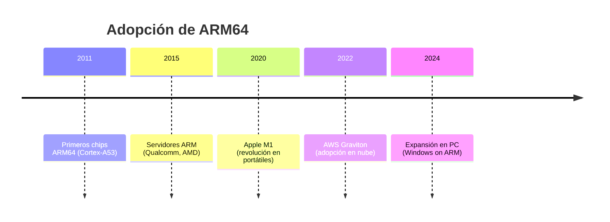

# ARM64 y la transición hacia arquitecturas eficientes

Autor: Aguilar Saavedra Oliver 23211899

Materia: Lenguajes de Interfaz - TECNM Campus ITT

Grupo: 26b4pm

Fecha: 11/02/2026

Descripción: Investigacion ARM64 y la transición global hacia arquitecturas eficientes

## Introducción

**ARM** son las siglas de **Advanced RISC Machines**, un tipo de arquitectura utilizada comúnmente en dispositivos móviles. El enfoque de la arquitectura ARM es la eficiencia y el bajo consumo, al emplear computación de instrucciones reducidas (**RISC**). Gracias a estas tecnologías es posible aumentar el rendimiento de las baterías de dispositivos móviles y disminuir el tamaño de los chips, mejorando la portabilidad de los dispositivos.

## ARM64 frente a x86-64: Historia de dos arquitecturas

Aunque ARM64 está ganando impulso, la arquitectura **x86-64**, otra arquitectura de 64 bits, ha sido durante mucho tiempo la dominante en el ámbito de los ordenadores personales.

| Característica       | ARM64                                                                 | x86-64                                                                 |
|----------------------|-----------------------------------------------------------------------|------------------------------------------------------------------------|
| Filosofía del diseño | RISC (conjunto reducido de instrucciones)                             | CISC (Complex Instruction Set Computing)                               |
| Consumo de energía   | Generalmente inferior                                                 | Generalmente superior                                                  |
| Conjunto de instrucciones | AArch64                                                            | x86-64                                                                 |
| Registros            | 31 registros de propósito general de 64 bits                          | Varía en función de la generación del procesador                       |
| Aplicaciones comunes | Dispositivos móviles, ordenadores portátiles, servidores (emergentes) | Ordenadores de sobremesa, portátiles y servidores (dominante)          |

## Diferencias entre RISC y CISC

| RISC                                                                 | CISC                                                                 |
|----------------------------------------------------------------------|----------------------------------------------------------------------|
| Diseñado para enfocarse en el *software*                             | Diseñado para enfocarse en el *hardware*                             |
| Los conjuntos de instrucciones son simples y fáciles de decodificar | Los conjuntos de instrucciones son complejos y difíciles de decodificar |
| Debido al método de una instrucción = una tarea, se requiere un código más grande para las tareas | Debido al método de una instrucción = múltiples tareas, el tamaño del código es pequeño |
| Una instrucción puede completarse en un ciclo de reloj               | Una instrucción necesita más de un ciclo de reloj                     |
| Debido a que cada instrucción realiza menos trabajo, el consumo de energía es bajo | Debido a que cada instrucción realiza más trabajo, el consumo de energía es alto |
| Necesita más registros para procesar las instrucciones               | Necesita menos registros para procesar las instrucciones              |
| Necesita más RAM para procesar                                       | Necesita menos RAM para procesar                                      |

## Línea de tiempo de la adopción de ARM64

## Ventajas de ARM64

La adopción de ARM solo está creciendo y, debido a eso, su futuro está más que garantizado. Estos son algunos de los varios factores que contribuyen a su dominio potencial:

- Mejoras en el rendimiento
- Eficiencia de la batería
- Crecimiento del ecosistema de software
- Aplicaciones emergentes (IA, ML)
- Teléfonos plegables y dispositivos móviles
- PC siempre conectadas
- Juegos en la nube

## Adopción de ARM64 por Apple

En la conferencia WWDC 2020, Apple anunció que abandonaría los procesadores x86 para adoptar la arquitectura RISC licenciada por ARM. Cuando Apple introdujo ARM64 con su chip **M1**, este movimiento solidificó el futuro de la arquitectura ARM64. Apple cuenta con su propio ecosistema de desarrolladores, que adoptan y avanzan la arquitectura mientras Apple siga usando ARM64. Gracias a estos cambios, Apple logró posicionar sus dispositivos en una clase propia en términos de velocidad, eficiencia, rendimiento gráfico y, lo más importante, mayor duración de la batería. Es muy posible que en el futuro otras compañías sigan los pasos de Apple y la arquitectura ARM64 supere a x86.

## Factor Económico y Energético

La transición hacia arquitecturas eficientes no está ocurriendo por casualidad. Los centros de datos del mundo consumen una cantidad enorme de electricidad aproximadamente el 1% del total global y esa cifra sigue aumentando con la inteligencia artificial, el *streaming* y los servicios en la nube. Mantener todo eso funcionando es caro. ARM64 puede hacer más cosas con menos energía en comparación con x86. Para una empresa con miles de servidores, esto significa facturas de luz más bajas y menos necesidad de sistemas de refrigeración.

**Amazon Web Services** ha declarado que al migrar parte de su infraestructura a sus propios procesadores ARM (los **Graviton**) han logrado ahorros de hasta el **40% en costes operativos**. Con resultados como estos, es muy lógico que las empresas y los desarrolladores estén adoptando la arquitectura ARM.

## Conclusión

ARM64 no es solo una evolución de la arquitectura ARM. Representa un cambio significativo en la informática. Su capacidad para ofrecer un rendimiento excepcional manteniendo la eficiencia energética la convierte en una opción convincente para una amplia gama de dispositivos, desde aparatos móviles hasta potentes servidores. A medida que el ecosistema de software siga madurando y los desarrolladores aprovechen el potencial de ARM64, podemos esperar que esta arquitectura desempeñe un papel aún más destacado en la configuración del futuro de la informática.

---

## Referencias

- [¿Qué es ARM64? - ThreatDown por Malwarebytes](https://www.threatdown.com/es/glosario/what-is-arm64/) (2025, 9 diciembre). ThreatDown de Malwarebytes.
- Sharma, A., & Sharma, A. (2025, 26 agosto). [x86 or ARM64: Making Sense of the Architectural Variations](https://www.tothenew.com/blog/x86-or-arm64-making-sense-of-the-architectural-variations/#:~:text=Why%20ARM64%20now?,the%20general%20x86%2Dbased%20processors). TO THE NEW BLOG.
- Pastor, J. (2020, 2 julio). [Nuevo chip, nueva era: mitos y realidades del salto de Apple a los Mac ARM (Despeja la X #101)](https://www.xataka.com/xataka/nuevo-chip-nueva-era-mitos-realidades-salto-apple-a-mac-arm-despeja-x-101). Xataka.
- [Level Up Compute Workloads with AWS Graviton](https://aws.amazon.com/cn/ec2/graviton/level-up-with-graviton/?advocacy_source=everyonesocial&trk=global_employee_advocacy&sc_channel=sm&es_id=3c9df0fcbf). Amazon Web Services, Inc.
