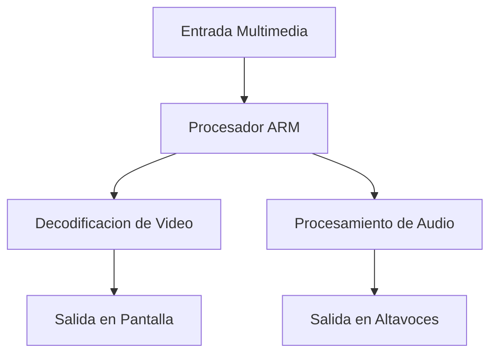

---  
Gomez Cuevas Carlos	#23210592
## Introducción
### ¿Qué es la arquitectura ARM?
ARM (Advanced RISC Machine) es una arquitectura de procesador basada en un modelo de computación por conjunto reducido de instrucciones (RISC). Enfatiza la eficiencia ejecutando instrucciones más sencillas, lo que resulta en un menor consumo de energía y menos generación de calor. Los chips ARM se utilizan ampliamente en dispositivos móviles, tabletas y portátiles con IA debido a su diseño compacto, escalabilidad y alta relación rendimiento por vatio.

### ¿Cuál es su diferencia contra la arquitectura x86?
Los procesadores ARM usan RISC, lo que significa que ejecutan menos instrucciones y más simples por ciclo, mientras que x86 utiliza un conjunto de instrucciones complejo (CISC). Este diseño proporciona a los procesadores ARM una eficiencia energética superior, un espacio más reducido y una menor salida térmica, lo que los hace ideales para dispositivos ligeros y portátiles. En cambio, los chips x86 suelen ofrecer un rendimiento bruto superior para escritorios y servidores.

<table border="1" align="center" width="80%">  <tr>  <th>Aspecto</th>  <th>ARM (RISC)</th>  <th>x86 (CISC)</th>  </tr>  <tr>  <td>Filosofía</td>  <td>RISC: instrucciones simples y rápidas</td>  <td>CISC: instrucciones complejas</td>  </tr>  <tr>  <td>Consumo de energía</td>  <td>Bajo, ideal para móviles y embebidos</td>  <td>Alto, más común en PCs y servidores</td>  </tr>  <tr>  <td>Rendimiento</td>  <td>Optimizado para eficiencia</td>  <td>Optimizado para potencia bruta</td>  </tr>  <tr>  <td>Escalabilidad</td>  <td>Desde microcontroladores hasta SoCs</td>  <td>Principalmente PCs y servidores</td>  </tr>  <tr>  <td>Aplicaciones típicas</td>  <td>Smartphones, tablets, IoT, multimedia</td>  <td>Computadoras de escritorio, laptops</td>  </tr>  <tr>  <td>Licenciamiento</td>  <td>ARM licencia su arquitectura a terceros</td>  <td>Intel/AMD diseñan y fabrican x86</td>  </tr>  <tr>  <td>Compatibilidad</td>  <td>Gran soporte en móviles y sistemas embebidos</td>  <td>Amplio soporte en software de PC</td>  </tr>  </table>

### Características
- Eficiencia energética: ideal para dispositivos móviles y sistemas embebidos.
- Estabilidad: desde microcontroladores hasta procesadores de alto rendimiento.
- Extensiones multimedia como Neon para procesamiento de gráficos y señales.

### ARM en sistemas multimedia
- Procesadores como los NXP i.MX6 y i.MX8 están diseñados para aplicaciones multimedia: video HD, audio avanzado y gráficos complejos, lo que lo hace ideal para sistemas embebidos como reproductores multimedia, camaras digitales y dispositivos portátiles.
- ARM también ofrece GPU Mali e Immortalis, usadas en smartphones y Smart TVs para gráficos inmersivos y vision por computadora 

### Ejemplos de dispositivos multimedia con ARM
- Smartphones: iPhone (chips Apple A-series), Android (Snapdragon, Exynos).
- Consolas portátiles: Nintendo DS, Game boy Advance.
- Automotriz y sistemas embebidos: ARM se aplica en pantallas de infoentretenimiento, camaras de asistencia y sistemas de vision artificial.
- Smart TVs y camaras digitales.
- Raspberry PI y otros SBC para proyectos multimedia.

## En conclusión
Las arquitecturas ARM han demostrado ser un pilar fundamental en el desarrollo de sistemas multimedia modernos. Su diseño les permite ofrecer un equilibrio optimo entre rendimiento y eficiencia energética, lo que puede resultar en algo importante en dispositivos móviles, Smart TVs, consolas portátiles y sistemas embebidos.

Para finalizar, ARM ha transformado de un modo la forma en que interactuamos con contenido multimedia y aparte de eso ha marcado un rumbo con sistemas más eficientes, accesibles y adaptables, llegando a ser a futuro una prometedora arquitectura de la computación multimedia.

## Referencias
- _What is ARM architecture | ARM Processor Architecture | Lenovo US_. (2023, 28 mayo). https://www.lenovo.com/us/en/glossary/what-is-arm-architecture/?orgRef=https%253A%252F%252Fwww.google.com%252F
- *Wikipedia contributors. (2026, 4 febrero). _ARM architecture family_. Wikipedia.* https://en.wikipedia.org/wiki/ARM_architecture_family?utm_source=copilot.com
- *Author. (2025, 11 agosto). _Exploring the NXP i.MX6: An ARM-Based SoC for Multimedia Applications_. Diverse Daily.* https://diversedaily.com/exploring-the-nxp-i-mx6-an-arm-based-soc-for-multimedia-applications/?utm_source=copilot.com
- *ARM vs x86 (2026 Complete Architecture Comparison Guide)_. (2025, 14 octubre). Of Zen And Computing.* https://www.ofzenandcomputing.com/arm-vs-x86/?utm_source=copilot.com
- *List of products using ARM processors_. (s. f.). Grokipedia.* https://grokipedia.com/page/List_of_products_using_ARM_processors?utm_source=copilot.com
- *Wikipedia contributors. (2025, 24 noviembre). _List of products using ARM processors_. Wikipedia.* https://en.wikipedia.org/wiki/List_of_products_using_ARM_processors?utm_source=copilot.com
