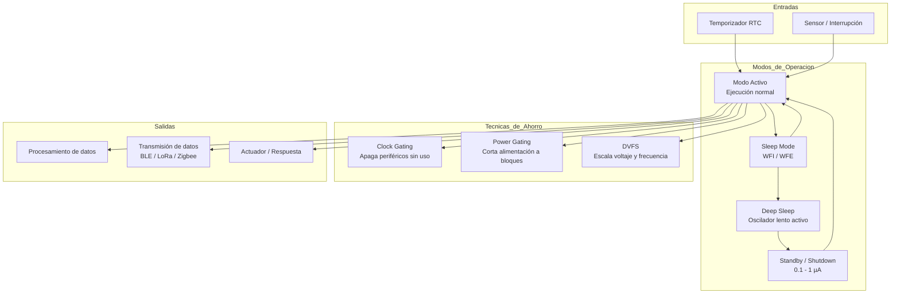

#Arquitecturas ARM para Bajo Consumo Energético

## Información del Estudiante

- *Nombre:* Maldonado Morales Francisco Eliud  
- *Horario:* 4:00 PM  
- *Título del tema:* Arquitecturas ARM para bajo consumo energético  

---

## Introducción

El consumo energético es uno de los retos más críticos en el diseño de sistemas embebidos y dispositivos electrónicos modernos. A medida que el mundo se conecta a través de millones de sensores, wearables, nodos IoT y dispositivos autónomos, la necesidad de procesadores que hagan más con menos energía se vuelve fundamental.

La arquitectura ARM nació precisamente con esta filosofía. Desde sus primeras versiones en los años 80, ARM diseñó sus procesadores con la eficiencia energética como prioridad, no como característica secundaria. Hoy, esa decisión la convierte en la arquitectura dominante en cualquier escenario donde la energía sea un recurso limitado.

Desde sensores agrícolas que funcionan con una sola pila AA durante años, hasta marcapasos cardíacos y nodos de redes mesh industriales, los procesadores de la familia *Cortex-M* y *Cortex-A* de ARM ofrecen un ecosistema completo de herramientas para el diseño de sistemas de bajo consumo. Comprender cómo lo logran, a nivel de arquitectura y hardware, es el objetivo de esta investigación.

---

## Fundamentos: ¿Por Qué ARM Consume Menos?

### La Raíz en RISC

La arquitectura ARM se fundamenta en la filosofía *RISC (Reduced Instruction Set Computer)*. A diferencia de las arquitecturas CISC como x86, donde instrucciones complejas pueden requerir múltiples ciclos y activar grandes bloques del procesador, RISC define instrucciones simples que:

- Se ejecutan en *un solo ciclo de reloj*.
- Activan una *menor cantidad de transistores* por operación.
- Permiten pipelines más simples y predecibles.

Cada transistor que se activa consume energía. Cada ciclo de reloj que se ahorra reduce el calor generado. Esta simplicidad tiene un efecto acumulativo enorme: en un sensor que ejecuta millones de instrucciones al día, la diferencia entre RISC y CISC puede significar meses de vida útil en batería.

### Transistores, Voltaje y Frecuencia

El consumo de potencia en un procesador sigue aproximadamente la relación:

P = α · C · V² · f

Donde:
- *α* = actividad de los transistores (fracción que conmuta)
- *C* = capacitancia del circuito
- *V* = voltaje de operación
- *f* = frecuencia de reloj

ARM optimiza todos estos factores: reduce α con instrucciones simples, minimiza C con diseños compactos, permite operar a voltajes muy bajos (hasta 0.6V en algunos Cortex-M) y escala la frecuencia dinámicamente según la necesidad.

---

## La Familia Cortex-M: Diseñada para el Bajo Consumo

La familia *Cortex-M* es la propuesta de ARM específicamente orientada a microcontroladores de bajo consumo. No está diseñada para correr sistemas operativos complejos, sino para ejecutar firmware eficiente en aplicaciones embebidas, industriales y de consumo.

### Miembros de la Familia y su Perfil Energético

| Procesador | Perfil | Consumo típico | Caso de uso |
|---|---|---|---|
| Cortex-M0 | Ultra bajo costo y consumo | ~10 µA/MHz | Sensores básicos, control simple |
| Cortex-M0+ | Más eficiente que M0 | ~9 µA/MHz | IoT, wearables básicos |
| Cortex-M3 | Rendimiento medio | ~32 µA/MHz | Control industrial, actuadores |
| Cortex-M4 | DSP integrado | ~44 µA/MHz | Audio, procesamiento de señales |
| Cortex-M7 | Alto rendimiento embebido | ~50 µA/MHz | Control de motores, automoción |
| Cortex-M33 | Seguridad + eficiencia | ~15 µA/MHz | IoT seguro, edge computing |
| Cortex-M55 | IA en el borde | ~20 µA/MHz | Inferencia ML en microcontroladores |

El *Cortex-M0+* es el procesador de 32 bits más eficiente energéticamente del mundo en su clase, con una arquitectura de dos etapas de pipeline que minimiza el consumo incluso durante la ejecución activa.

### Instrucciones Thumb y Thumb-2

Una característica clave del Cortex-M es el uso del conjunto de instrucciones *Thumb*, una versión comprimida del ISA ARM donde las instrucciones ocupan 16 bits en lugar de 32. Esto reduce:

- El tamaño del firmware en memoria Flash (que también consume energía al leerse).
- Los accesos a memoria, que son una de las operaciones más costosas energéticamente.
- La frecuencia necesaria para el mismo nivel de trabajo.

*Thumb-2* combina instrucciones de 16 y 32 bits, ofreciendo la densidad de Thumb con la potencia de ARM completo.

---

## Modos de Bajo Consumo en ARM Cortex-M

Uno de los aspectos más importantes para el bajo consumo no es lo que el procesador hace cuando trabaja, sino lo que hace cuando *no trabaja*. ARM Cortex-M define múltiples modos de bajo consumo que el firmware puede aprovechar:

### Sleep Mode (WFI / WFE)

El procesador detiene la ejecución de instrucciones pero mantiene sus registros y el estado del sistema. Se reactiva con cualquier interrupción.

- Instrucción *WFI* (Wait For Interrupt): entra a sleep y espera una interrupción.
- Instrucción *WFE* (Wait For Event): similar, pero se despierta con eventos de hardware o señales entre núcleos.

El ahorro de energía respecto al modo activo puede ser del 50–80% dependiendo del microcontrolador.

### Deep Sleep Mode

El procesador apaga la mayoría de sus bloques internos: PLL, osciladores de alta frecuencia, periféricos no esenciales. Solo queda activo un oscilador de baja frecuencia (típicamente 32 kHz) y el controlador de interrupciones (NVIC).

El tiempo de reactivación es mayor (microsegundos a milisegundos), pero el consumo puede bajar a 1–5 µA.

### Standby / Shutdown

El estado más agresivo de ahorro. El procesador apaga casi todo, incluyendo la RAM (los datos se pierden o se guardan en una pequeña RAM de retención). Solo queda activo el módulo de reinicio y un temporizador de bajo consumo (RTC).

Consumo típico: 0.1–1 µA. Utilizado en dispositivos que se "despiertan" una vez por hora para tomar una medición.

---

## Técnicas de Gestión Energética por Hardware

### DVFS: Dynamic Voltage and Frequency Scaling

ARM soporta el escalado dinámico de voltaje y frecuencia. El principio es simple: si la tarea actual no requiere máximo rendimiento, ¿por qué gastar la energía de máximo rendimiento?

Un microcontrolador que normalmente opera a 64 MHz y 3.3V puede reducirse a 4 MHz y 1.8V para procesar una lectura de sensor, ahorrando energía de forma cuadrática (el voltaje aparece al cuadrado en la fórmula de consumo).

### Clock Gating

ARM y los fabricantes de microcontroladores implementan *clock gating*: desactivar la señal de reloj de bloques específicos del chip cuando no se usan. Sin reloj, los transistores no conmutan y no consumen energía dinámica.

Por ejemplo, si el firmware no usa el módulo SPI, su reloj se apaga completamente mediante registros de control, ahorrando decenas de µA sin afectar el resto del sistema.

### Power Gating

Más agresivo que el clock gating: se corta completamente la alimentación a un bloque del chip. ARM Cortex-M33 y superiores soportan esta técnica a nivel de dominio de poder, permitiendo apagar la NPU, el DSP o bloques de memoria que no se necesiten.

---

## Cortex-A y Bajo Consumo: big.LITTLE

En el contexto de procesadores de aplicación (Cortex-A), ARM desarrolló la arquitectura *big.LITTLE* para equilibrar rendimiento y eficiencia:

- Los núcleos *LITTLE* (Cortex-A55, A510) operan a baja frecuencia y voltaje, ideales para tareas en segundo plano.
- Los núcleos *big* (Cortex-A710, A715) se activan solo cuando la carga de trabajo lo exige.

El scheduler del sistema operativo migra procesos entre tipos de núcleo de forma transparente. Esto permite que un smartphone use sus núcleos grandes solo durante videojuegos o edición de video, mientras que para notificaciones, mensajes y música, los núcleos LITTLE son más que suficientes, ahorrando batería de forma significativa.

La evolución a *DynamIQ* (2017) refinó esto permitiendo mezclas más flexibles (hasta 8 núcleos en un solo clúster de distintos tipos) y mejor coordinación con la GPU y la NPU.

---

## El Rol del Proceso de Fabricación

El consumo energético no depende solo del diseño arquitectónico de ARM, sino también del *nodo de fabricación* del chip:

| Nodo | Año referencia | Voltaje mínimo | Consumo relativo |
|---|---|---|---|
| 28 nm | 2012 | 0.9V | Base |
| 16/14 nm | 2015 | 0.8V | ~40% menos |
| 7 nm | 2018 | 0.75V | ~60% menos |
| 5 nm | 2020 | 0.7V | ~70% menos |
| 3 nm | 2022 | 0.65V | ~80% menos |

Cada salto de nodo permite transistores más pequeños, que conmutan con menos energía y a mayor velocidad. ARM diseña sus IP cores para ser portables a los últimos nodos de fabricación, maximizando el beneficio de cada generación tecnológica.

---

## Aplicaciones Reales de ARM en Bajo Consumo

### IoT y Sensores Inteligentes

Los nodos IoT (temperatura, humedad, calidad del aire, detección de movimiento) usan Cortex-M0/M0+ para:
- Tomar mediciones periódicas (cada 10 minutos o cada hora).
- Procesar localmente el dato.
- Transmitirlo vía LoRaWAN, Zigbee o BLE.
- Volver al modo Standby.

Con este patrón de operación, una batería de 3V CR2032 puede durar más de 2 años.

### Wearables y Dispositivos Médicos

Relojes inteligentes, parches de monitoreo cardíaco y glucómetros continuos usan Cortex-M33 o M4 para procesar señales biométricas. El desafío es mantener sensores activos 24/7 con una batería de menos de 300 mAh.

Técnicas usadas: modo always-on con sensores de bajo consumo, procesamiento en el edge para no transmitir datos crudos, y activación de la radio BLE solo al sincronizar.

### Dispositivos de Borde (Edge Computing)

El *Cortex-M55* con el coprocesador *Ethos-U55* de ARM permite ejecutar modelos de machine learning directamente en el microcontrolador, sin necesidad de enviar datos a la nube. Esto no solo reduce la latencia, sino que elimina el consumo de la radio de comunicación para cada inferencia, que suele ser el componente más costoso energéticamente en un nodo IoT.

---

## Diagrama: Gestión de Energía en un Sistema ARM Cortex-M

---

## Otros Puntos Importantes

### Comparativa de Consumo ARM vs Otras Arquitecturas

Comparado con otras opciones del mercado embebido:

- *ARM Cortex-M0+ vs AVR (Microchip):* ARM logra el mismo trabajo con hasta 30% menos energía gracias a su pipeline más eficiente.
- *ARM Cortex-A55 vs Intel Atom:* ARM consume entre 5 y 10 veces menos energía para cargas de trabajo equivalentes.
- *ARM vs MIPS (IoT):* ARM ha desplazado a MIPS en la mayoría de aplicaciones IoT por su mejor ecosistema de herramientas y menor consumo en standby.

### Herramientas de ARM para Optimización Energética

ARM ofrece un ecosistema completo para desarrolladores que buscan optimizar el consumo:

- *CMSIS (Cortex Microcontroller Software Interface Standard):* Librería estándar que abstrae el manejo de modos de bajo consumo.
- *ARM Energy Probe:* Herramienta hardware para medir el consumo real de un sistema en tiempo real.
- *Keil MDK con Energy Measurement:* Entorno de desarrollo que permite visualizar el consumo energético durante la depuración.

### Futuro: ARM y la Eficiencia Extrema

- *ARMv8-M con TrustZone y bajo consumo:* Combinar seguridad hardware con eficiencia energética es clave para IoT seguro.
- *Cortex-M85:* El más reciente de la familia, con soporte para instrucciones Helium (M-Profile Vector Extension) que acelera operaciones de señal e IA con mayor eficiencia que NEON en aplicaciones embebidas.
- *Chip-stacking y memorias embebidas:* Integrar SRAM directamente sobre el núcleo ARM reduce la distancia física que recorre la señal eléctrica, reduciendo el consumo de acceso a memoria.

---

## Referencias Bibliográficas

- Lenovo. (2024). ¿Qué es la arquitectura ARM?  
  Recuperado de: [https://www.lenovo.com/us/en/glossary/what-is-arm-architecture/](https://www.lenovo.com/us/en/glossary/what-is-arm-architecture/)

- Profesional Review. (2025). ARM: Qué es y para qué sirven sus procesadores.  
  Recuperado de: [https://www.profesionalreview.com/guias/arm-que-es-y-para-que-sirven/](https://www.profesionalreview.com/guias/arm-que-es-y-para-que-sirven/)

- IONOS. (2024). Arquitectura ARM: características y ventajas.  
  Recuperado de: [https://www.ionos.mx/digitalguide/servidores/know-how/arquitectura-arm/](https://www.ionos.mx/digitalguide/servidores/know-how/arquitectura-arm/)

- Arm Developer. (2024). Cortex-M Series: Low Power Design Guide.  
  Recuperado de: [https://developer.arm.com/documentation/](https://developer.arm.com/documentation/)

---
