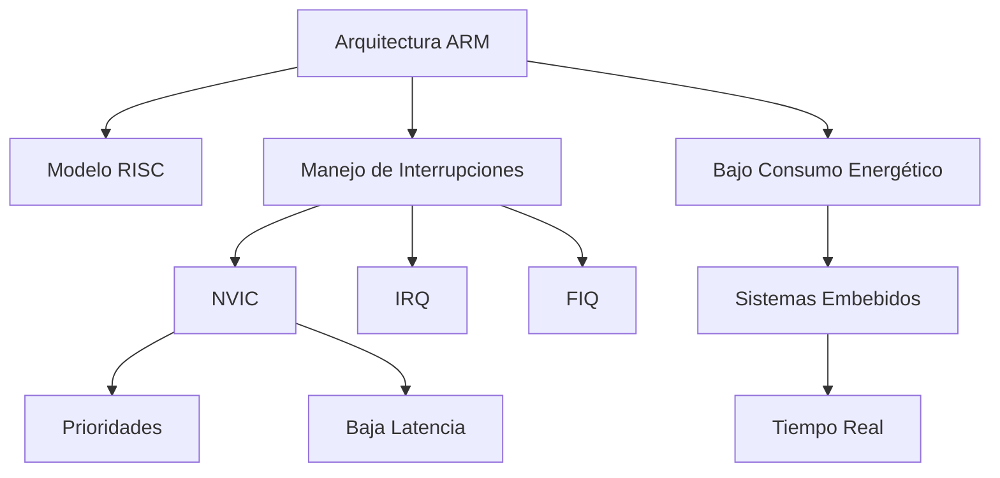
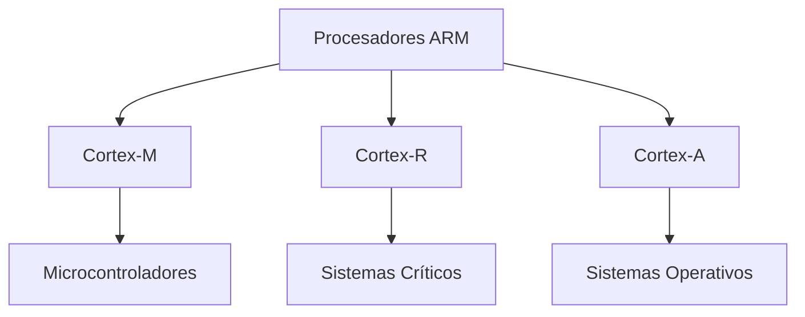
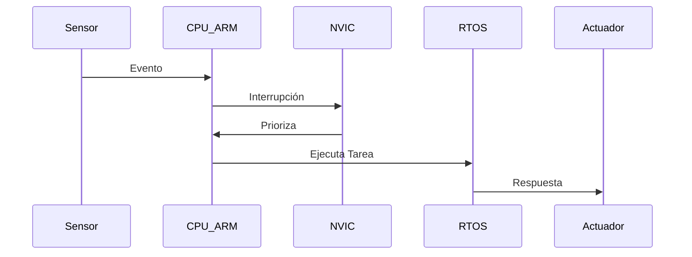

# 

**Materia:** Lenguajes de Interfaz  
**Alumno:** Diaz Enciso Sergio  
**Fecha:** 16/02/26  
**Profesor:** RENE SOLIS REYES  

---

# 1. 

La arquitectura ARM es una de las más utilizadas en sistemas embebidos y dispositivos electrónicos actuales. Su diseño eficiente, bajo consumo energético y alto rendimiento la hacen ideal para aplicaciones donde la rapidez y la confiabilidad son esenciales.

En los sistemas en tiempo real, el procesador debe responder dentro de un tiempo límite específico. ARM cumple con estos requisitos gracias a su arquitectura optimizada y su eficiente manejo de interrupciones.

---

# 2. 

## 2.1 

ARM es una arquitectura basada en el modelo RISC (Reduced Instruction Set Computer). Fue desarrollada por la empresa británica Arm Ltd., que diseña núcleos de procesamiento licenciados a distintos fabricantes.

Su principal ventaja es ofrecer alto rendimiento con bajo consumo energético, lo que la hace ideal para microcontroladores y sistemas críticos.

---

## 2.2 

Un sistema en tiempo real es aquel que debe responder a eventos dentro de un tiempo determinado. Si no cumple ese tiempo, puede producirse un fallo.

Existen tres tipos:

- Tiempo real duro  
- Tiempo real blando  
- Tiempo real firme  

---

# 3. 

## 3.1 

El modelo RISC utiliza instrucciones simples y de tamaño fijo, lo que permite:

- Mayor velocidad de ejecución  
- Menor consumo energético  
- Mayor previsibilidad  

Esto es fundamental en aplicaciones donde el tiempo de respuesta es crítico.

---

## 3.2 

Las principales familias son:

- Cortex-M: Microcontroladores y bajo consumo.  
- Cortex-R: Sistemas críticos en tiempo real.  
- Cortex-A: Sistemas operativos avanzados.  

Las series Cortex-M y Cortex-R son las más utilizadas en sistemas en tiempo real.

---

## 3.3 

ARM incorpora el NVIC (Nested Vectored Interrupt Controller), que permite:

- Múltiples niveles de prioridad  
- Baja latencia  
- Respuesta rápida a eventos externos  

Esto garantiza un comportamiento determinista.

---

# 4. 

La arquitectura ARM en sistemas en tiempo real se utiliza en:

- Sistemas automotrices  
- Equipos médicos  
- Robótica industrial  
- Dispositivos IoT  
- Sistemas aeroespaciales  

---

# 5. 

- Bajo consumo energético  
- Alta eficiencia  
- Buena gestión de interrupciones  
- Amplio ecosistema de desarrollo  

---

# 6. 

## 6.1 

## 6.2 

## 6.3 

