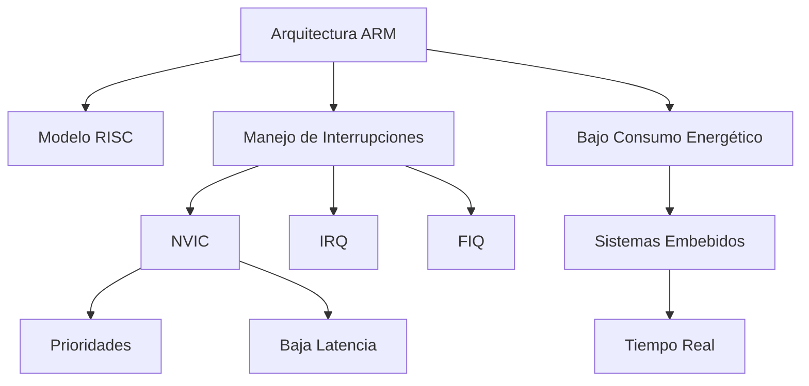
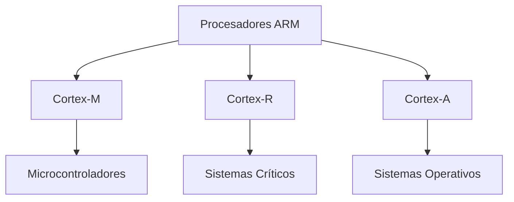
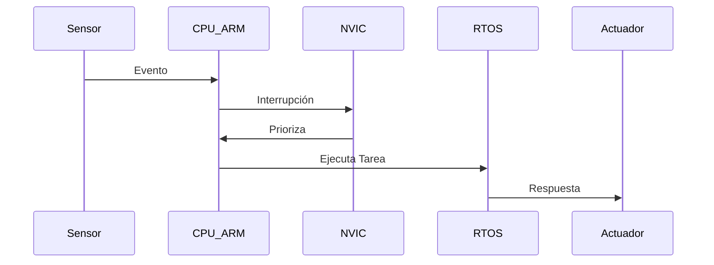

# Arquitectura ARM en Sistemas en Tiempo Real

**Materia:** Lenguajes de Interfaz  
**Alumno:** Diaz Enciso Sergio  
**Fecha:** 16/02/26  
**Profesor:** RENE SOLIS REYES  

---

# 1. Introducción

La arquitectura ARM es una de las más utilizadas en sistemas embebidos y dispositivos electrónicos actuales. Su diseño eficiente, bajo consumo energético y alto rendimiento la hacen ideal para aplicaciones donde la rapidez y la confiabilidad son esenciales.

En los sistemas en tiempo real, el procesador debe responder dentro de un tiempo límite específico. ARM cumple con estos requisitos gracias a su arquitectura optimizada y su eficiente manejo de interrupciones.

---

# 2. Marco Teórico

## 2.1 Arquitectura ARM

ARM es una arquitectura basada en el modelo RISC (Reduced Instruction Set Computer). Fue desarrollada por la empresa británica Arm Ltd., que diseña núcleos de procesamiento licenciados a distintos fabricantes.

Su principal ventaja es ofrecer alto rendimiento con bajo consumo energético, lo que la hace ideal para microcontroladores y sistemas críticos.

---

## 2.2 Sistemas en Tiempo Real

Un sistema en tiempo real es aquel que debe responder a eventos dentro de un tiempo determinado. Si no cumple ese tiempo, puede producirse un fallo.

Existen tres tipos:

- **Tiempo real duro:** El incumplimiento del plazo produce un fallo catastrófico.
- **Tiempo real blando:** Se tolera cierto retardo sin consecuencias graves.
- **Tiempo real firme:** El resultado fuera de plazo no tiene utilidad, pero no causa fallo.

---

# 3. Características de ARM para Sistemas en Tiempo Real

## 3.1 Modelo RISC

El modelo RISC utiliza instrucciones simples y de tamaño fijo, lo que permite:

- Mayor velocidad de ejecución
- Menor consumo energético
- Mayor previsibilidad

Esto es fundamental en aplicaciones donde el tiempo de respuesta es crítico.

---

## 3.2 Familias de Procesadores ARM

Las principales familias son:

- **Cortex-M:** Microcontroladores y bajo consumo.
- **Cortex-R:** Sistemas críticos en tiempo real.
- **Cortex-A:** Sistemas operativos avanzados.

Las series Cortex-M y Cortex-R son las más utilizadas en sistemas en tiempo real.

---

## 3.3 Manejo de Interrupciones

ARM incorpora el NVIC (Nested Vectored Interrupt Controller), que permite:

- Múltiples niveles de prioridad
- Baja latencia
- Respuesta rápida a eventos externos

Esto garantiza un comportamiento determinista.

---

# 4. Aplicaciones

La arquitectura ARM en sistemas en tiempo real se utiliza en:

- Sistemas automotrices
- Equipos médicos
- Robótica industrial
- Dispositivos IoT
- Sistemas aeroespaciales

---

# 5. Ventajas

- Bajo consumo energético
- Alta eficiencia
- Buena gestión de interrupciones
- Amplio ecosistema de desarrollo

---

# 6. Diagramas

## 6.1 Diagrama de Componentes ARM en Tiempo Real

## 6.2 Familias de Procesadores ARM

## 6.3 Flujo de Respuesta en un Sistema en Tiempo Real con ARM

---

# 7. Conclusión

La arquitectura ARM representa una solución sólida y eficiente para el desarrollo de sistemas en tiempo real. Gracias a su modelo RISC, su sistema de interrupciones mediante el NVIC y sus distintas familias de procesadores (Cortex-M, Cortex-R y Cortex-A), es posible diseñar sistemas que respondan de manera determinista y confiable ante eventos críticos.

Su bajo consumo energético, combinado con un amplio ecosistema de herramientas de desarrollo, la posiciona como una de las arquitecturas más relevantes en aplicaciones embebidas, automotrices, médicas e industriales. En definitiva, ARM continúa siendo una opción preferida para ingenieros y desarrolladores que buscan equilibrar rendimiento, eficiencia y confiabilidad en entornos de tiempo real.
