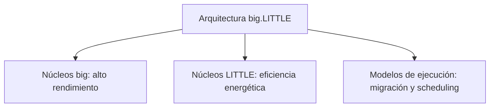
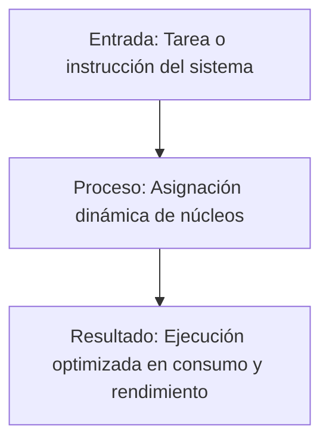
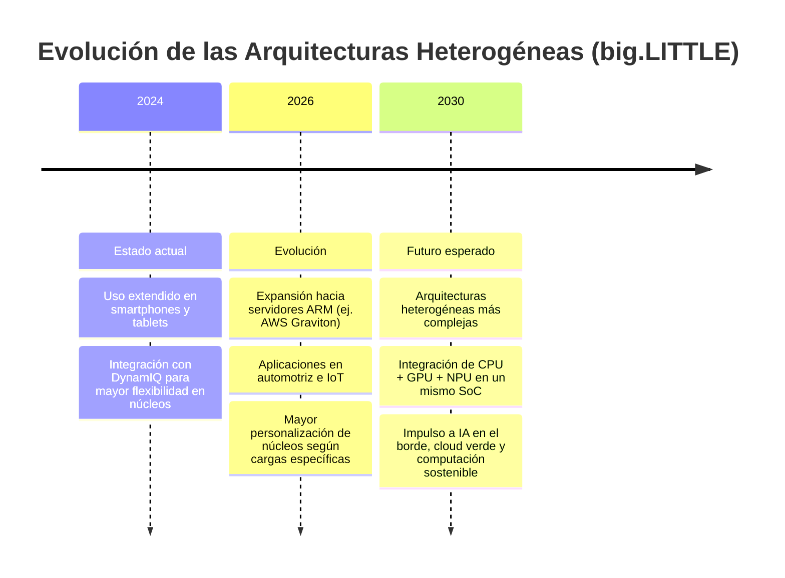

# Arquitecturas heterogéneas: big.LITTLE y su impacto

## Análisis del rendimiento y eficiencia energética en sistemas modernos

**Autor:** Samuel Valentin Alvarado Valenzo  
**Materia:** Lenguaje de Interfaz  
**Grupo:** 6B – 4:00 PM  
**Docente:** Rene Solis Reyes

## Resumen

La presente investigación analiza la arquitectura heterogénea big.LITTLE desarrollada por Arm y su impacto en el rendimiento y la eficiencia energética de los dispositivos modernos. Este modelo integra núcleos de alto rendimiento y núcleos de bajo consumo dentro de un mismo procesador, permitiendo que las tareas se distribuyan de acuerdo con su nivel de exigencia. De esta manera, los procesos que demandan mayor potencia se ejecutan en los núcleos más rápidos, mientras que las actividades simples o en segundo plano se asignan a los núcleos más eficientes en consumo energético.

La importancia de este tema radica en la necesidad actual de optimizar el desempeño sin comprometer la duración de la batería ni generar un sobrecalentamiento excesivo. En un entorno donde los teléfonos inteligentes, tablets y computadoras portátiles forman parte esencial de la vida cotidiana, resulta fundamental contar con arquitecturas que equilibren potencia y eficiencia.

Actualmente, la mayoría de los dispositivos móviles emplean procesadores basados en diseños de Arm, donde la combinación de núcleos grandes y pequeños se ha convertido en una práctica común. Esta estrategia permite un mejor aprovechamiento de los recursos del sistema y una gestión energética más inteligente.

En conclusión, la arquitectura big.LITTLE representa una solución efectiva dentro de la computación heterogénea, ya que mejora la eficiencia energética sin sacrificar el rendimiento. Además, ha servido como base para el desarrollo de tecnologías posteriores orientadas a perfeccionar la administración de recursos en los procesadores actuales.

## Preguntas de Investigación

### ¿Qué se analiza?

Se analiza el funcionamiento de la arquitectura heterogénea big.LITTLE y su influencia en el rendimiento y en la eficiencia energética de los dispositivos modernos, especialmente en aquellos basados en procesadores Arm.

### ¿Por qué es importante?

Es importante porque permite que los dispositivos ofrezcan alto rendimiento cuando se requiere mayor potencia de procesamiento, y al mismo tiempo reduzcan el consumo de energía en tareas simples. Esto contribuye a mejorar la duración de la batería, disminuir el sobrecalentamiento y optimizar el uso de los recursos del sistema.

### ¿Qué se concluye?

Se concluye que la arquitectura heterogénea big.LITTLE mejora el equilibrio entre rendimiento y eficiencia energética, convirtiéndose en una solución efectiva en el diseño de procesadores actuales y en una base para tecnologías más avanzadas de gestión de núcleos.

### ¿Cuál es el contexto general?

Actualmente, la mayoría de los dispositivos móviles utilizan procesadores basados en arquitecturas Arm, donde la combinación de núcleos de alto rendimiento y bajo consumo se ha vuelto un estándar. Este enfoque responde a la creciente demanda de dispositivos más potentes, pero también más eficientes energéticamente.

## 1. Introducción

Las arquitecturas heterogéneas, como big.LITTLE y su evolución hacia DynamIQ, representan un cambio fundamental en el diseño de procesadores modernos. Se trata de una estrategia que combina núcleos de alto rendimiento (“big”) con núcleos de bajo consumo (“LITTLE”) dentro de un mismo sistema en chip (SoC). Esta configuración permite que los dispositivos móviles y otros sistemas ajusten dinámicamente su capacidad de cómputo según la demanda, equilibrando eficiencia energética y potencia de procesamiento.

Su relevancia radica en que responde a una tensión constante: los usuarios exigen cada vez más rendimiento en aplicaciones como videojuegos, inteligencia artificial o realidad aumentada, mientras que la capacidad de las baterías y los avances en miniaturización no crecen al mismo ritmo. La arquitectura heterogénea ofrece una solución práctica al distribuir las tareas entre núcleos especializados, logrando extender la autonomía sin sacrificar la experiencia de uso.

El problema que resuelve es doble: por un lado, la necesidad de eficiencia energética en dispositivos portátiles; por otro, la demanda de alto rendimiento sostenido en aplicaciones intensivas. Al permitir que el sistema operativo asigne tareas de manera inteligente a los núcleos adecuados, se optimiza el consumo y se mejora la respuesta del dispositivo.

Actualmente, su importancia es mayor que nunca. La proliferación de aplicaciones basadas en inteligencia artificial, el auge de los dispositivos conectados (IoT, wearables y automóviles inteligentes) y la transición hacia arquitecturas más seguras y escalables hacen que tecnologías como big.LITTLE y DynamIQ sean esenciales para el futuro de la computación. Además, la tendencia hacia la computación heterogénea en toda la industria confirma que este enfoque no solo es una solución para dispositivos móviles, sino un paradigma que impacta servidores, sistemas embebidos y plataformas de alto rendimiento.

# 2. Fundamentos Teóricos  

## 2.1 Conceptos Clave  

### • Definición 1 – Arquitectura heterogénea  
Es un modelo de diseño de procesadores que combina núcleos de diferente capacidad y consumo energético dentro de un mismo chip. En el caso de big.LITTLE, se integran núcleos “big” (alto rendimiento) y núcleos “LITTLE” (eficiencia energética), permitiendo un balance dinámico entre potencia y ahorro de energía.

### • Definición 2 – Núcleos big y LITTLE  
Los núcleos big están diseñados para tareas intensivas como videojuegos, navegación web o aplicaciones de inteligencia artificial, mientras que los núcleos LITTLE se encargan de procesos ligeros como mensajería, reproducción de audio o tareas en segundo plano. Esta dualidad optimiza la experiencia del usuario y extiende la autonomía de los dispositivos.

### • Definición 3 – Modelos de ejecución (Cluster Migration, CPU Migration, Global Task Scheduling)  
Son estrategias de asignación de tareas que determinan cómo se distribuye la carga de trabajo entre los núcleos.  

- **Cluster Migration:** mueve toda la carga de un grupo de núcleos a otro.  
- **CPU Migration:** permite que tareas individuales cambien entre núcleos según la demanda.  
- **Global Task Scheduling (GTS):** asigna tareas individuales al núcleo más adecuado en tiempo real, maximizando eficiencia y rendimiento.

---

## 2.2 Arquitectura / Modelo / Estructura  

# 3. Funcionamiento Técnico  

El flujo básico de big.LITTLE puede representarse así:

## Descripción paso a paso

### • Entrada (A)

El sistema recibe una tarea (ejemplo: abrir una app, reproducir video o ejecutar un cálculo intensivo).

---

### • Proceso (B)

El *scheduler* del sistema operativo analiza la carga de trabajo.

- Si la tarea es ligera (ej. notificaciones o música en segundo plano), se asigna a los núcleos **LITTLE** (eficientes y de bajo consumo).
- Si la tarea es pesada (ej. videojuegos o renderizado), se asigna a los núcleos **big** (alto rendimiento).
- En arquitecturas modernas como **DynamIQ**, incluso se pueden mezclar núcleos en paralelo para balancear rendimiento y eficiencia.

---

### • Resultado (C)

El sistema logra un equilibrio entre:

- Bajo consumo energético en tareas simples.
- Alto rendimiento en tareas exigentes.
- Mayor autonomía de batería sin sacrificar la experiencia del usuario.

# 4. Comparacion Tecnica

| Característica    | Tecnología A: Núcleos Homogéneos                   | Tecnología B: big.LITTLE                    |
| ----------------- | -------------------------------------------------- | ------------------------------------------- |
| **Consumo**       | Alto en cargas ligeras (todos los núcleos activos) | Bajo, gracias a núcleos LITTLE eficientes   |
| **Rendimiento**   | Consistente pero poco flexible                     | Escalable: núcleos big para cargas pesadas  |
| **Costo**         | Menor complejidad de diseño                        | Mayor inversión en diseño y validación      |
| **Escalabilidad** | Limitada: difícil balancear cargas                 | Alta: adaptable a distintos perfiles de uso |

## 
La arquitectura homogénea es más simple y económica, pero resulta menos eficiente en dispositivos móviles porque mantiene todos los núcleos con características similares activos, incluso cuando no se requiere tanta potencia.

En cambio, **big.LITTLE** ofrece un diseño más complejo pero optimizado para eficiencia energética y flexibilidad. Esto ha sido clave en smartphones y tablets modernos, donde el equilibrio entre batería y rendimiento es fundamental.

Con la evolución hacia **DynamIQ**, ARM ha permitido configuraciones aún más granulares, mejorando la escalabilidad y el rendimiento multinúcleo.

# 5. Aplicaciones Actuales

-  **Dispositivos móviles:** Smartphones y tablets, donde la eficiencia energética es crítica.  
-  **Telecomunicaciones:** Routers, estaciones base y equipos de red que requieren balance entre rendimiento y bajo consumo.  
-  **Industria:** Sistemas embebidos en automatización, robótica y control industrial.  
-  **Automotriz:** Unidades de control en vehículos inteligentes, sistemas de infotainment y conducción asistida.  
-  **Computación de escritorio / servidores:** Aunque menos común, se utiliza en servidores ARM y plataformas de cloud computing para optimizar cargas mixtas.  

---

# 6. Impacto y Beneficios

## Beneficios Técnicos

Mayor eficiencia energética en cargas ligeras  
Escalabilidad dinámica según la tarea  
Mejor experiencia de usuario (fluidez sin sacrificar batería)  

## Beneficios Económicos

 Reducción de costos operativos por menor consumo energético  
 Mayor vida útil de dispositivos móviles y servidores  

## Impacto Ambiental

 Menor huella de carbono en dispositivos masivos  
 Contribución a la sostenibilidad en centros de datos  

---

# 7. Casos Reales / Implementaciones

## Ejemplo 1: Qualcomm Snapdragon

Ampliamente usado en smartphones Android, combina núcleos big y LITTLE para ofrecer alto rendimiento gráfico y eficiencia energética.

## Ejemplo 2: Samsung Exynos

Integra big.LITTLE en sus SoCs para balancear multitarea y autonomía de batería.

## Ejemplo 3: Arm Neoverse (Cloud/Server)

Aplicado en servidores como Amazon AWS Graviton, optimiza cargas de trabajo en la nube con un enfoque en eficiencia energética.

# 8. Tendencias Futuras

# Conclusión

## Qué aprendí

- Que **big.LITTLE** es una arquitectura heterogénea que asigna tareas a núcleos grandes o pequeños según la carga de trabajo, optimizando el rendimiento y el consumo energético.  
- Que su evolución hacia **DynamIQ** y **Neoverse** ha permitido escalar más allá de dispositivos móviles hacia servidores y plataformas de cloud computing.  

---

## Qué demuestra la investigación

- Que la eficiencia energética es el motor principal de la innovación en procesadores modernos.  
- Que la heterogeneidad ya es un estándar en la industria tecnológica, no una excepción.  

---

## Impacto a largo plazo

- **Tecnológico:** Mayor integración de unidades de cómputo especializadas (CPU, GPU, NPU).  
- **Económico:** Reducción de costos operativos en centros de datos y dispositivos masivos.  
- **Ambiental:** Contribución a la sostenibilidad mediante menor consumo energético global.  

---

## Opinión técnica fundamentada

La arquitectura **big.LITTLE** marcó un antes y un después en el diseño de procesadores. Su impacto no se limita a dispositivos móviles; actualmente está redefiniendo la forma en que se concibe la computación eficiente y escalable.  

A largo plazo, la tendencia es clara: los sistemas serán cada vez más heterogéneos, integrando múltiples tipos de núcleos y aceleradores especializados. Esto permitirá mantener un equilibrio entre potencia, eficiencia energética y sostenibilidad tecnológica.

## Referencias

ACM Queue. (2018). *Energy efficiency and heterogeneous architectures*. https://queue.acm.org  

AnandTech. (2013). *ARM’s big.LITTLE technology explained*. https://www.anandtech.com  

Arm Ltd. (s.f.). *Arm big.LITTLE technology: The future of mobile*. https://www.arm.com/technologies/big-little  

Arm Ltd. (s.f.). *Arm Cortex-A series programmer’s guide*. https://developer.arm.com/documentation  

Arm Ltd. (s.f.). *Arm DynamIQ technology overview*. https://www.arm.com/technologies/dynamiq  

IEEE Spectrum. (2019). *The rise of heterogeneous computing in modern processors*. https://spectrum.ieee.org  

