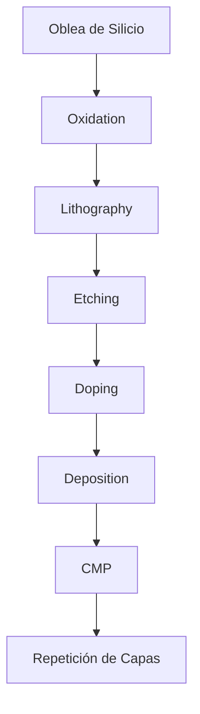
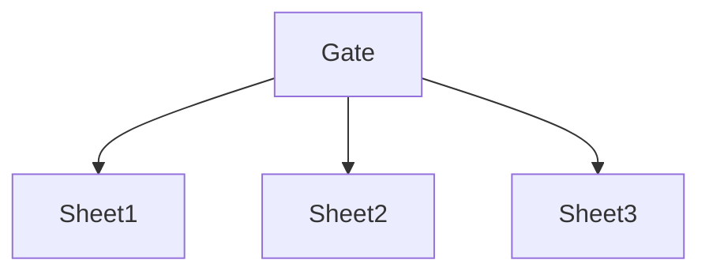

<!-- ========================================================= -->
<!--   FABRICACIÓN AVANZADA DE SEMICONDUCTORES (5 nm, 3 nm, EUV) -->
<!-- ========================================================= -->

# 🔬 Fabricación Avanzada de Semiconductores  
## ⚙️ Nodos de 5 nm, 3 nm y Litografía EUV

> La tecnología moderna —desde smartphones hasta supercomputadoras— depende de la capacidad de fabricar transistores a escala nanométrica con precisión casi atómica.

---

# 1️⃣ Introducción: La Carrera por la Miniaturización

La industria de los semiconductores ha seguido durante décadas la tendencia conocida como Ley de Moore: duplicar la cantidad de transistores aproximadamente cada dos años.

Hoy, nodos como **5 nm y 3 nm** representan la frontera tecnológica, donde los desafíos ya no son solo de ingeniería, sino también de física fundamental.

Empresas líderes en fabricación avanzada:

- TSMC  
- Samsung Electronics  
- Intel  

Estas compañías invierten decenas de miles de millones de dólares en fábricas avanzadas (fabs) para producir chips cada vez más pequeños, rápidos y eficientes.

---

# 2️⃣ ¿Qué significa realmente “5 nm” y “3 nm”?

El nombre del nodo ya no representa una dimensión física específica del transistor. Actualmente es un **término comercial y generacional** que agrupa mejoras en:

- Densidad de transistores  
- Eficiencia energética  
- Rendimiento  
- Tecnología de interconexión  

## 📊 Comparación técnica

| Nodo | Densidad (aprox.) | Tipo de transistor | Litografía |
|------|------------------|-------------------|------------|
| 7 nm | ~90 MTr/mm² | FinFET | DUV múltiple |
| 5 nm | ~170 MTr/mm² | FinFET mejorado | EUV parcial |
| 3 nm | 250+ MTr/mm² | GAAFET / Nanosheet | EUV extendido |

> MTr/mm² = millones de transistores por milímetro cuadrado.

---

# 3️⃣ Proceso General de Fabricación

La fabricación de un chip puede requerir **más de 1,000 pasos de proceso** y puede tardar varias semanas desde la oblea inicial hasta el chip terminado.

### Etapas clave:

- **Oxidación**: formación de capas dieléctricas  
- **Litografía**: definición del patrón  
- **Grabado (etching)**: eliminación selectiva de material  
- **Implantación iónica (doping)**: modificación eléctrica del silicio  
- **Deposición**: aplicación de nuevas capas conductoras o aislantes  
- **CMP (Chemical Mechanical Planarization)**: nivelado nanométrico de la superficie  

Cada capa debe alinearse con precisión de pocos nanómetros.

---

# 4️⃣ Litografía EUV: Tecnología Crítica

La litografía EUV (Extreme Ultraviolet) utiliza una longitud de onda de **13.5 nm**, permitiendo definir estructuras extremadamente pequeñas.

El único fabricante mundial de sistemas EUV es ASML.

Cada máquina EUV:

- Pesa más de 150 toneladas  
- Requiere vacío extremo  
- Utiliza plasma de estaño para generar luz EUV  
- Puede costar más de 150 millones de dólares  

---

## 4.1 Funcionamiento Simplificado

Debido a que la luz EUV es absorbida por casi cualquier material:

- No se usan lentes, sino espejos multicapa de altísima precisión.
- El sistema opera completamente en vacío.
- Las máscaras son reflectivas en lugar de transmisivas.

---

# 5️⃣ Arquitectura de Transistores

---

## 5.1 FinFET (5 nm)

En nodos de 5 nm se emplea principalmente tecnología **FinFET (Fin Field-Effect Transistor)**.

Características:

- Estructura tridimensional en forma de “aleta”.
- Mejor control del canal.
- Reducción de corrientes de fuga.
- Mayor densidad comparado con transistores planos tradicionales.

---

## 5.2 GAAFET / Nanosheet (3 nm)

En nodos de 3 nm se introduce la arquitectura **GAAFET (Gate-All-Around FET)** o nanosheet.

El gate rodea completamente el canal, proporcionando:

- Mejor control electrostático.
- Mayor eficiencia energética.
- Mejor escalabilidad hacia nodos futuros (2 nm y menores).

---

# 6️⃣ Interconexiones y Back-End (BEOL)

Reducir el tamaño del transistor no es suficiente. También es crítico mejorar:

- Capas metálicas multicapa.
- Materiales de baja constante dieléctrica (low-k).
- Reducción de resistencia y capacitancia en interconexiones.

En nodos avanzados, el **back-end-of-line (BEOL)** puede convertirse en el principal limitante del rendimiento.

---

# 7️⃣ Retos Físicos en Escalas Nanométricas

## 7.1 Efectos Cuánticos

A escalas de 3 nm:

- Aumenta el efecto túnel cuántico.
- Las corrientes de fuga se vuelven significativas.
- El control del canal se vuelve extremadamente complejo.

## 7.2 Variabilidad Atómica

A esta escala, diferencias de pocos átomos pueden alterar el comportamiento eléctrico del transistor.

---

# 8️⃣ Costos y Complejidad

| Nodo | Costo aproximado de FAB |
|------|------------------------|
| 7 nm | ~10 mil millones USD |
| 5 nm | ~15–20 mil millones USD |
| 3 nm | 20–25+ mil millones USD |

Además:

- Consumo eléctrico masivo.
- Uso intensivo de agua ultra pura.
- Ambientes de sala limpia con niveles extremos de control de partículas.

La barrera de entrada es tan alta que solo unas pocas empresas pueden fabricar en estos nodos.

---

# 9️⃣ Impacto en Aplicaciones

Los nodos avanzados permiten:

- Procesadores móviles más eficientes.
- GPUs para inteligencia artificial.
- Chips para centros de datos.
- Computación de alto rendimiento (HPC).

## Comparación de mejoras

| Métrica | 5 nm | 3 nm |
|----------|------|------|
| Rendimiento | +15% vs 7 nm | +10–15% vs 5 nm |
| Consumo energético | -30% | -25–30% |
| Densidad | Alta | Muy alta |

---

# 🔟 Futuro: Más allá de 3 nm

La industria ya investiga:

- 2 nm  
- Arquitecturas RibbonFET  
- Backside Power Delivery  
- Integración 3D (chip stacking)  

La miniaturización enfrenta límites físicos, por lo que la innovación ahora también se enfoca en:

- Empaquetado avanzado.
- Arquitecturas heterogéneas.
- Nuevos materiales semiconductores.

---

# 📌 Conclusión

La fabricación avanzada en 5 nm y 3 nm no es simplemente una reducción geométrica, sino una revolución en:

- Física aplicada  
- Ingeniería óptica extrema  
- Ciencia de materiales  
- Manufactura de precisión  

Fabricar chips a 3 nm implica manipular la materia casi átomo por átomo, representando uno de los mayores logros tecnológicos contemporáneos.

---

## 🔬 El liderazgo tecnológico global depende del dominio de la fabricación nanométrica.

---

# 📚 Bibliografía

1. ASML. (2023). *What is EUV Lithography?*  
   https://www.asml.com/en/technology/all-about-euv  

2. TSMC. (2024). *N5 and N3 Process Technology Overview.*  
   https://www.tsmc.com/english/dedicatedFoundry/technology  

3. Samsung Semiconductor. (2022). *3nm GAA (Gate-All-Around) Technology.*  
   https://semiconductor.samsung.com  

4. Intel. (2023). *Intel 3 and Advanced Process Technologies.*  
   https://www.intel.com/content/www/us/en/silicon-innovations  

5. Semiconductor Industry Association (SIA). (2023). *Semiconductor Industry Overview.*  
   https://www.semiconductors.org  

---
