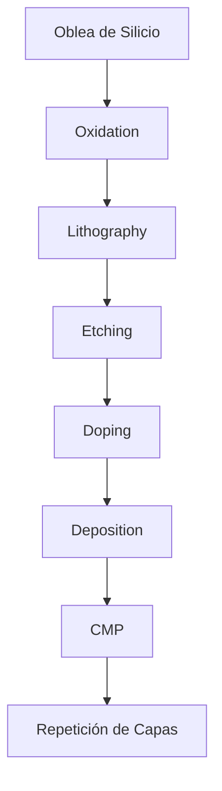

# 🔬 Fabricación Avanzada de Semiconductores
## ⚙️ Nodos de 5 nm, 3 nm y la Revolución de la Litografía EUV

> **Resumen:** La industria de los semiconductores ha trascendido los límites de la ingeniería clásica para adentrarse en la **física cuántica aplicada**. En los nodos de 5 nm y 3 nm, la precisión se mide a nivel atómico.

---

## 1️⃣ Evolución de la Métrica: Del Tamaño a la Densidad

En la actualidad, los términos **"5 nm"** o **"3 nm"** no se refieren a una medida física real de los componentes, sino a una **nomenclatura comercial** que representa una generación de mejora en el **PPAC** (*Power, Performance, Area, and Cost*).

### Líderes del Sector:
* **TSMC:** Pionero en la producción masiva de 3 nm (N3B/N3E) para Apple y Nvidia.
* **Samsung:** El primero en implementar la arquitectura **GAAFET** en su nodo de 3 nm.
* **Intel:** En proceso de despliegue de sus nodos *Intel 3* e *Intel 20A*, introduciendo tecnologías de suministro de energía trasera.

---

## 2️⃣ Comparativa Técnica de Generaciones

A continuación, se presenta una comparativa detallada entre los nodos actuales y la frontera tecnológica:

| Característica | Nodo 7 nm (DUV/EUV) | Nodo 5 nm (EUV) | Nodo 3 nm (GAA/Nanosheet) |
| :--- | :---: | :---: | :---: |
| **Densidad (MTr/mm²)** | ~91.2 | ~173 | **~220 - 290** |
| **Arquitectura** | FinFET | FinFET Optimizado | **GAAFET / Nanosheet** |
| **Voltaje Operativo ($V_{dd}$)** | ~0.75V | ~0.70V | **~0.60V - 0.65V** |
| **Capas EUV** | 1 - 10 | 10 - 15 | **25+** |
| **Mejora de Rendimiento** | Base | +15% vs 7nm | **+10-15% vs 5nm** |
| **Reducción de Consumo** | Base | -30% vs 7nm | **-25-30% vs 5nm** |

---

## 3️⃣ Tecnologías Clave de Próxima Generación

### 3.1 Litografía EUV de Alta Apertura (High-NA)
Para bajar de los 3 nm, la litografía EUV estándar (0.33 NA) alcanza su límite óptico.
* **Innovación:** El sistema **High-NA EUV (0.55 NA)** de ASML permite una mayor resolución de impresión.
* **Impacto:** Evita el uso de exposiciones múltiples (*multi-patterning*), reduciendo defectos y tiempos de ciclo en la fábrica.

### 3.2 Backside Power Delivery (BSPD)
Históricamente, los cables de datos y de energía se fabrican juntos sobre el silicio, compitiendo por espacio.
* **Solución:** Mover toda la red de distribución de energía a la **parte inferior (trasera)** de la oblea.
* **Ventaja:** Reduce la caída de voltaje y permite que los transistores operen a frecuencias más altas sin interferencias.

---

## 4️⃣ Arquitectura de Transistores: El Salto a GAAFET

A escalas de 3 nm, la arquitectura **FinFET** (aletas) presenta fugas de corriente debido a que la compuerta no puede controlar eficientemente el canal.

### ¿Qué es GAAFET (Gate-All-Around)?
1.  **Control de 360°:** La compuerta rodea el canal por los cuatro costados, eliminando casi por completo las fugas de energía.
2.  **Canales de Nanosheets:** El canal se divide en múltiples láminas delgadas apiladas verticalmente.
3.  **Escalabilidad:** Permite seguir reduciendo el tamaño del chip cuando el diseño de "aleta" (Fin) ya no es físicamente viable.

---

## 5️⃣ Desafíos Físicos y Económicos

### Efectos Cuánticos y Estocástica
* **Efecto Túnel:** A 3 nm, los electrones pueden "saltar" a través de barreras aislantes debido a su naturaleza cuántica.
* **Defectos de Fotones:** La luz EUV es tan energética que la variación aleatoria en el número de fotones puede causar errores de impresión (estocástica).

### La Barrera de los 20 Billones
El costo de construir una **GigaFab** de 3 nm se estima en **$20,000 - $25,000 millones de USD**. Esto ha creado un oligopolio donde solo TSMC, Samsung e Intel pueden competir en la vanguardia.

---

## 6️⃣ Aplicaciones Impactadas

* **Inteligencia Artificial:** Entrenamiento de LLMs con GPUs de altísima densidad.
* **Computación de Alto Rendimiento (HPC):** Supercomputadoras con eficiencia energética crítica.
* **Dispositivos Móviles:** Autonomía de batería extendida a pesar del aumento de potencia de procesamiento.

---

## 📌 Conclusión

La fabricación en 5 nm y 3 nm representa el pináculo de la ingeniería humana. No se trata solo de miniaturización, sino de una reestructuración completa de cómo manejamos la energía y la materia a escalas donde las leyes de la física clásica dejan de funcionar.
