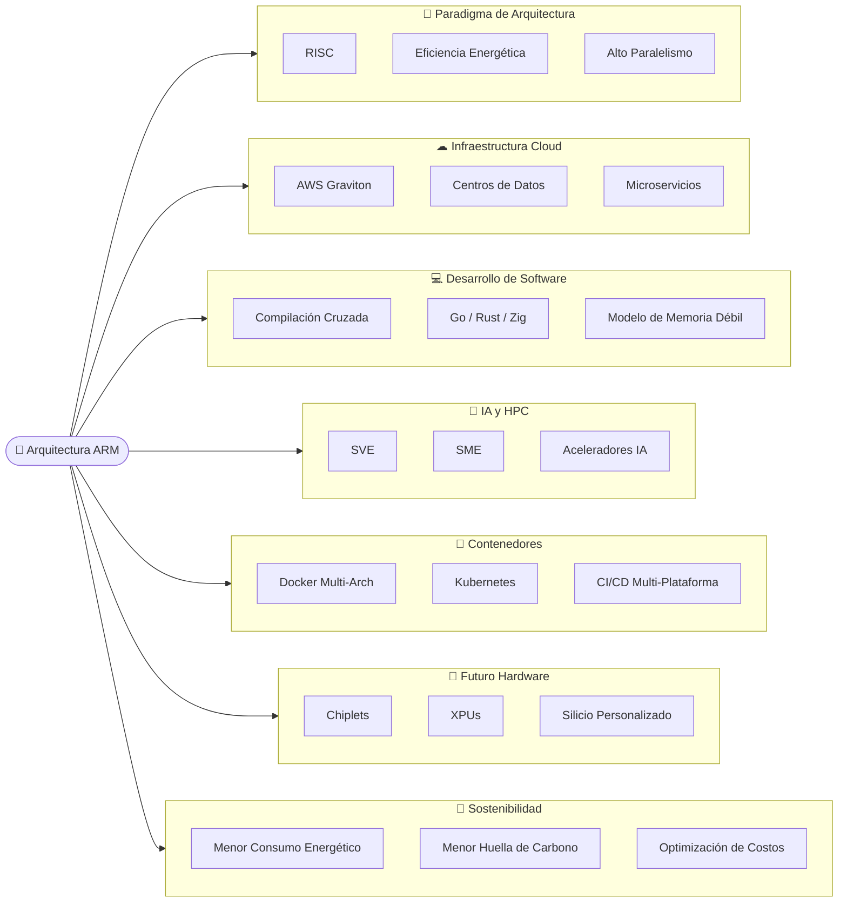

---

# 🚀 El Impacto Transformador de la Arquitectura ARM

## En el Desarrollo de Software Moderno

---

> ⚡ **Resumen Ejecutivo**
> La arquitectura ARM ha evolucionado de su dominio en dispositivos móviles para convertirse en un estándar en centros de datos, inteligencia artificial y computación de alto rendimiento ([Arm Cloud Computing](https://www.arm.com/markets/computing-infrastructure/cloud-computing), [Google Cloud ARM](https://cloud.google.com/discover/what-are-arm-based-processors?hl=es-419)). Este cambio representa una transformación estructural en la forma de diseñar software moderno.
> 

---

# 🧠 1. Cambio de Paradigma: De CISC a RISC

Durante décadas, el ecosistema x86 (CISC) dominó la industria.
ARM introduce un modelo RISC que prioriza eficiencia y simplicidad ([InnoAioT](https://www.innoaiot.com/comparing-x86-and-arm-architectures/), [Medium ARM vs x86](https://medium.com/@TechStoryLines/arm-vs-x86-explained-what-every-developer-should-know-f0a461603656)).

| CISC (x86)               | RISC (ARM)                                                                                                                                           |
| ------------------------ | ---------------------------------------------------------------------------------------------------------------------------------------------------- |
| Instrucciones complejas  | Instrucciones simples y fijas                                                                                                                        |
| Mayor consumo energético | Mayor eficiencia por vatio ([Reddit ARM eficiencia](https://www.reddit.com/r/arm/comments/1bfne6w/why_is_arm_more_efficient_than_x86_architecture/)) |
| Decodificación pesada    | Diseño optimizado para paralelismo                                                                                                                   |
| Compatibilidad histórica | Optimización moderna                                                                                                                                 |

### 🎯 Implicaciones

* Menor consumo energético
* Mayor densidad en centros de datos ([Arm AI-ready Infrastructure](https://newsroom.arm.com/blog/why-cloud-developers-are-moving-to-arm-ai-ready-infrastructure))
* Mejor rendimiento por vatio
* Diseño de silicio personalizado

---

# 🏗 2. ARM en la Infraestructura de Nube

## Evolución de AWS Graviton

| Generación | Arquitectura | Proceso | Enfoque Principal                                                                                                                                                                                                                                                                                                     |
| ---------- | ------------ | ------- | --------------------------------------------------------------------------------------------------------------------------------------------------------------------------------------------------------------------------------------------------------------------------------------------------------------------- |
| Graviton   | Cortex A72   | 16nm    | Inicio de ARM64 en nube ([AWS & Arm](https://www.arm.com/markets/computing-infrastructure/cloud-computing/aws))                                                                                                                                                                                                       |
| Graviton2  | Neoverse N1  | 7nm     | Optimización microservicios                                                                                                                                                                                                                                                                                           |
| Graviton3  | Neoverse V1  | 5nm     | DDR5 + bfloat16                                                                                                                                                                                                                                                                                                       |
| Graviton4  | Neoverse V2  | 5nm     | 73B transistores ([About Amazon – Graviton4](https://www.aboutamazon.es/noticias/aws/el-nuevo-chip-de-computacion-en-la-nube-de-amazon-aws-graviton4-ya-esta-disponible-de-forma-general-echemos-un-vistazo-a-su-evolucion))                                                                                          |
| Graviton5  | Neoverse V3  | 3nm     | 192 núcleos + L3 masiva ([TechRadar Graviton5](https://www.techradar.com/pro/aws-graviton5-is-its-most-powerful-and-efficient-cpu-to-date-and-could-mean-big-changes-for-your-key-cloud-workloads), [Reddit AWS Graviton5](https://www.reddit.com/r/aws/comments/1penqtp/aws_introduces_graviton5the_companys_most/)) |

> 🔥 ARM se consolida como arquitectura dominante para cargas de alta transferencia y baja latencia ([Architecting IT](https://www.architecting.it/blog/aws-graviton4/), [CloudOptimo Workloads](https://www.cloudoptimo.com/blog/7-workloads-that-run-faster-and-are-more-cost-effective-on-aws-graviton/)).

---

# 💰 3. Impacto Económico

Diversos análisis muestran mejoras significativas en costo-rendimiento al migrar a ARM ([AWS Graviton Deep Dive](https://medium.com/@sufleio/aws-graviton-processors-an-in-depth-look-at-awss-arm-based-evolution-02ffc316ef1d), [CloudOptimo 2025](https://www.cloudoptimo.com/blog/aws-vcpu-vs-ecu-vs-arm-choosing-the-right-compute-in-2025/)).

| Empresa    | Ahorro | Mejora Técnica         |
| ---------- | ------ | ---------------------- |
| Pinterest  | 47%    | Reducción de carbono   |
| Vociply AI | 35%    | +15.6% throughput      |
| SAP HANA   | 35%    | Optimización analítica |
| Esankethik | 40%    | -25% latencia          |
| SiteMana   | 25%    | +15% p95               |

### 📌 Nueva realidad

El costo del cómputo depende ahora de:

* Arquitectura elegida
* Nivel de optimización
* Diseño concurrente
* Gestión eficiente de memoria

---

# 🛠 4. Lenguajes y Compilación

La portabilidad multi-arquitectura se vuelve estratégica ([Qt x86 & ARM](https://promwad.com/news/x86-arm-qt-development), [CERN Porting EOS](https://indico.cern.ch/event/948465/contributions/4323992/attachments/2245023/3835816/Porting%20the%20EOS%20from%20X86%20%28Intel%29%20to%20aarch64%20%28ARM%29%20architecture.pdf)).

## Lenguajes de Sistemas

### Go

* Binarios estáticos
* Compilación cruzada simple (`GOARCH=arm64`)

### Rust

* Optimización avanzada vía LLVM
* Retos con dependencias heredadas en C ([Rust Forum](https://users.rust-lang.org/t/cross-compiling-support/135118), [Reddit Rust Cross](https://www.reddit.com/r/rust/comments/1nmq4ae/why_crosscompilation_is_harder_in_rust_than_go/))

### Zig

* Toolchains integradas
* Ideal para CI/CD multi-arquitectura

---

## Entornos Gestionados

### JVM

Optimización significativa en:

* Criptografía
* Manipulación de cadenas
* Operaciones matemáticas
  ([Java en ARM](https://javapro.io/2025/12/05/is-it-worth-to-run-java-on-arm-trust-me-this-is-interesting-question/), [foojay SBC](https://foojay.io/today/java-on-single-board-computers-x86-vs-arm-vs-risc-v/))

### V8 (Node.js / Chrome)

Mejor alineación con ejecución fuera de orden → menor latencia.

---

# ⚙ 5. Modelo de Memoria Débil

ARM permite reordenamiento de operaciones de memoria ([Arm Developer Blog](https://developer.arm.com/community/arm-research/b/articles/posts/concurrent-programming-transactions-and-weak-memory), [ResearchGate ARM Memory Model](https://www.researchgate.net/publication/220939093_Reasoning_about_the_ARM_weakly_consistent_memory_model)).

A diferencia de x86 (TSO), requiere sincronización explícita ([cppreference](https://en.cppreference.com/w/cpp/atomic/memory_order.html), [StackOverflow seq_cst vs acq_rel](https://stackoverflow.com/questions/12340773/how-do-memory-order-seq-cst-and-memory-order-acq-rel-differ)).

### Instrucciones Clave

* `DMB`
* `LDAR`
* `STLR`

> ⚠️ Mayor complejidad para el desarrollador, pero mayor eficiencia global.

---

# 🐳 6. Contenedores y Multi-Arquitectura

ARM impulsó imágenes multi-arquitectura en Docker y Kubernetes ([Docker Docs](https://docs.docker.com/build/building/multi-platform/), [GKE Multi-Arch](https://docs.cloud.google.com/kubernetes-engine/docs/how-to/build-multi-arch-for-arm), [Cycle.io](https://cycle.io/learn/understanding-multi-architecture-container-images)).

## Estrategias CI/CD

1. Emulación con QEMU
2. Nodos ARM nativos
3. Compilación cruzada multi-etapa ([Blacksmith GitHub ARM64](https://www.blacksmith.sh/blog/building-multi-platform-docker-images-for-arm64-in-github-actions))

> 💡 Recomendación: usar **Golden Base Images** compatibles con ambas arquitecturas.

---

# 🤖 7. Inteligencia Artificial y HPC

ARMv9 introduce:

### 🧮 SVE (Scalable Vector Extension)

* Independiente del tamaño de vector
* Escalabilidad automática
  ([Arm SVE Blog](https://developer.arm.com/community/arm-community-blogs/b/mobile-graphics-and-gaming-blog/posts/unlock-the-power-of-sve-and-sme-with-simd-loops))

### 🧠 SME (Scalable Matrix Extension)

* Operaciones GEMM aceleradas
* Alto rendimiento en LLM
  ([arXiv SME GEMM](https://www.arxiv.org/pdf/2512.21473), [University of Bristol SME](https://research-information.bris.ac.uk/en/publications/leveraging-arms-scalable-matrix-extension-to-accelerate-matrix-mu/))

## Ecosistema IA

* KleidiAI
* KleidiCV
* Arm NN
  ([Arm Kleidi Libraries](https://developer.arm.com/ai/kleidi-libraries), [Arm Compute Library](https://www.arm.com/products/development-tools/embedded-and-software/compute-library), [Arm AI Platform](https://developer.arm.com/ai))

Integración optimizada con frameworks modernos ([Arm AI Market](https://www.arm.com/markets/artificial-intelligence/machine-learning)).

---

# 🔄 8. Compatibilidad Híbrida

| Tecnología  | Función                                                                                             |
| ----------- | --------------------------------------------------------------------------------------------------- |
| ARM64X      | Binarios combinados ([Microsoft Learn](https://learn.microsoft.com/es-es/windows/arm/arm64x-build)) |
| Arm64EC     | Migración incremental                                                                               |
| Rosetta 2   | Traducción dinámica                                                                                 |
| binfmt_misc | Contenedores cruzados                                                                               |

---

# 🌱 9. Sostenibilidad

ARM reduce:

* Consumo energético
* Intensidad de carbono
* Costos operativos

La eficiencia energética se convierte en requisito de diseño ([Arm Sustainable Business Report 2024](https://armkeil.blob.core.windows.net/developer/Files/pdf/policies/arm-sustainable-business-report-2024.pdf), [Arm GHG Reporting FYE24](https://armkeil.blob.core.windows.net/developer/Files/pdf/policies/arm-basis-reporting-greenhouse-gas-emissions-fye24.pdf)).

---

# 🧩 10. Futuro: Chiplets y Aceleradores

Tendencias emergentes:

* Arquitecturas modulares
* Integración de XPUs
* Estándares abiertos
* Personalización masiva

([Silicon Reimagined 2025](https://armkeil.blob.core.windows.net/developer/Files/pdf/report/arm-silicon-reimagined-report-2025.pdf), [Arm Newsroom AI Data Centers](https://newsroom.arm.com/news/arm-sets-the-standard-for-open-converged-ai-data-centers))

El desarrollador interactuará con múltiples aceleradores integrados en silicio.

---

# 🚧 11. Desafíos de Migración

### Obstáculos

* Ensamblador x86 heredado
* JNI y extensiones nativas
* Bibliotecas propietarias

### Proceso recomendado

1. Auditoría de dependencias
2. Adaptación de ensamblador
3. Validación mediante test suites

Casos reales de portabilidad muestran viabilidad con planificación adecuada ([CERN EOS Port](https://indico.cern.ch/event/948465/contributions/4323992/attachments/2245023/3835816/Porting%20the%20EOS%20from%20X86%20%28Intel%29%20to%20aarch64%20%28ARM%29%20architecture.pdf)).

---

# 🏁 Conclusión

ARM ha transformado:

* La economía del cómputo
* La ingeniería de compilación
* La infraestructura de nube
* La inteligencia artificial
* La sostenibilidad tecnológica

---

> 🧭 El desarrollo moderno exige software portátil, resiliente y optimizado para hardware especializado.
