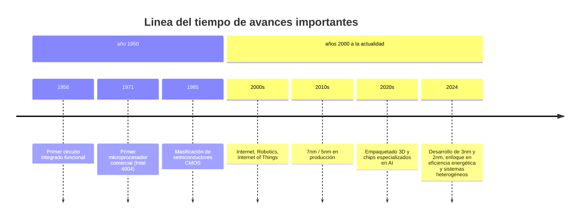
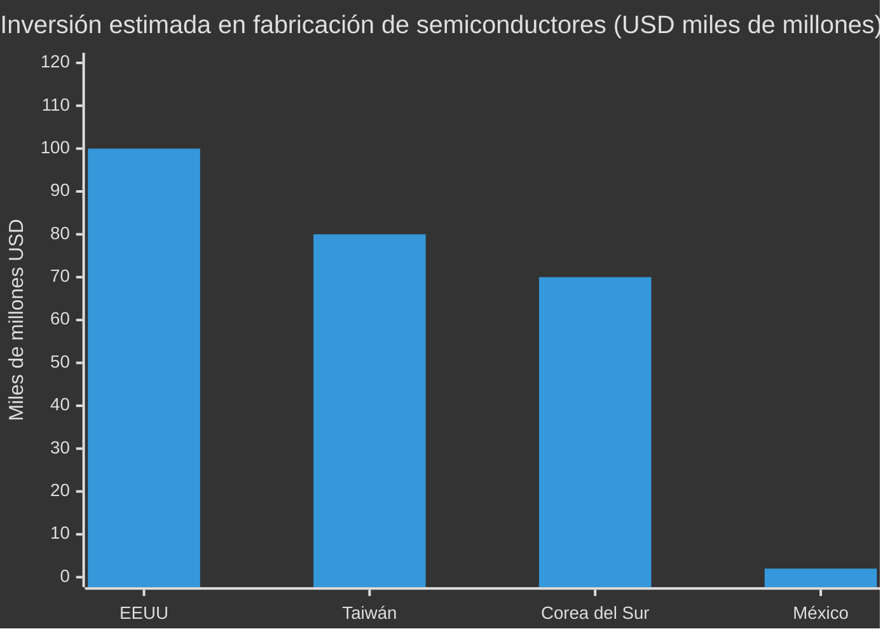

 

> Autor: Mendoza Salgado Jessica

> Materia: Lenguajes de interfaz - TECNM Campus ITT

> Grupo: 26b4

> Fecha: 17/02/2026
> Horario: 4:00 a 5:00

> _Descripcion: Investigación de las recientes innovaciones en diseño de semiconductores_ 

INDICE
----------

1. ¿Que es un semiconductor?
2. ¿Por que es importante la innovacion en los semiconductores?
3. ¿Que significa para las empresas de semiconductores de loT?
4. Innovaciones
5. Linea del tiempo de avances importantes 
6. Tabla comparativa de los 3 paises que invierten en fabricacion de semiconductores comparado con Mexico 
7. Conclusión 
8. Referencias

----------
**1. ¿Que es un semiconductor?**
Un **semiconductor** es un material cuya conductividad eléctrica es intermedia entre la de un conductor y la de un aislante. Esto significa que puede permitir o restringir el paso de corriente dependiendo de factores como temperatura, dopaje y campos eléctricos.
Los semiconductores son esenciales para la electrónica moderna porque permiten construir dispositivos como **transistores, diodos, sensores y circuitos integrados**, que controlan el flujo de electricidad con precisión y eficiencia.

----------
**2. ¿Por que es importante la innovacion en los semiconductores?** 
La innovación en semiconductores impulsa el avance tecnológico en múltiples industrias. Algunas razones clave son:

- **Mejor rendimiento y eficiencia energética:** Dispositivos más rápidos y con menor consumo.
- **Miniaturización:** Permite más poder de procesamiento en menos espacio (por eso los smartphones son cada vez más potentes).
- **Nuevas capacidades:** Habilita tecnologías emergentes como inteligencia artificial, 5G/6G, IoT y computación cuántica.
- **Competitividad económica:** Países y empresas que lideran en semiconductores dominan cadenas globales de valor tecnológico.

----------
**3. ¿Que significa para las empresas de semiconductores de loT?**
Los **semiconductores para IoT (Internet of Things)** son chips diseñados específicamente para conectividad eficiente, bajo consumo y procesamiento en dispositivos distribuidos (sensores, wearables, electrodomésticos inteligentes, etc.).

- **Nuevas oportunidades de mercado:** IoT está creciendo en todos los sectores (industrial, doméstico, salud, transporte).
- **Diseños optimizados:** Chips que priorizan bajo consumo, conectividad inalámbrica y seguridad incorporada.
- **Modelos de negocio diferenciados:** Fabricantes pueden ofrecer soluciones completas (hardware + software + conectividad).
- **Ecosistemas complejos:** Integración con plataformas en la nube, análisis de datos y estándares interoperables.

-----------
**4. Innovaciones**
| Innovación                               | Descripción                                                 |
| ---------------------------------------- | ----------------------------------------------------------- |
| **Nodos de proceso avanzados (3nm, 2nm)**|Permiten más transistores por área, mayor rendimiento y menor consumo. |
| **Empaquetado 3D y chiplets**      | Integración de múltiples componentes en un mismo paquete para mejorar rendimiento y flexibilidad.|
| **Semiconductores especializados (AI/ML)**     | Chips optimizados para inteligencia artificial y aprendizaje automático (ej. tensor cores).  |
|**Materiales avanzados (SiC, GaN)**|Nuevos semiconductores para alta frecuencia y eficiencia (muy útiles en energía y RF). |
|**Tecnologías de interconexión de alta velocidad**|Mejores conexiones internas y entre chips para transferencias de datos más rápidas.|
|**Diseño con EDA + IA**|Herramientas de automatización apoyadas en inteligencia artificial que aceleran el diseño y reducen errores.|

-----------
**5. Linea del tiempo de avances importantes**
---

---

----------
**6. Tabla comparativa de los 3 paises que invierten en fabricacion de semiconductores vs Mexico** 

----------
**7. Conclusión** 
La innovación en el diseño de semiconductores es un motor clave de la transformación tecnológica mundial. Los avances en miniaturización, nuevos materiales, empaquetado 3D y semiconductores especializados están redefiniendo lo que es posible en computación, comunicaciones y energía.

Aunque México no es actualmente un centro principal de producción avanzada, existe una **oportunidad estratégica** para crecer en nichos específicos dentro de la cadena de valor, como el empaquetado, pruebas y aplicaciones IoT.
**8. Referencias**

- Semiconductor Industry Association. (2024). 2024 state of the U.S. semiconductor industry. https://www.semiconductors.org
- McKinsey & Company. (2023). The semiconductor decade: A trillion-dollar industry. https://www.mckinsey.com
- Intel Corporation. (2024). Intel annual report (Form 10-K) 2023. https://www.intel.com
- OECD. (2023). Semiconductors and global value chains: Policy perspectives. https://www.oecd.org

