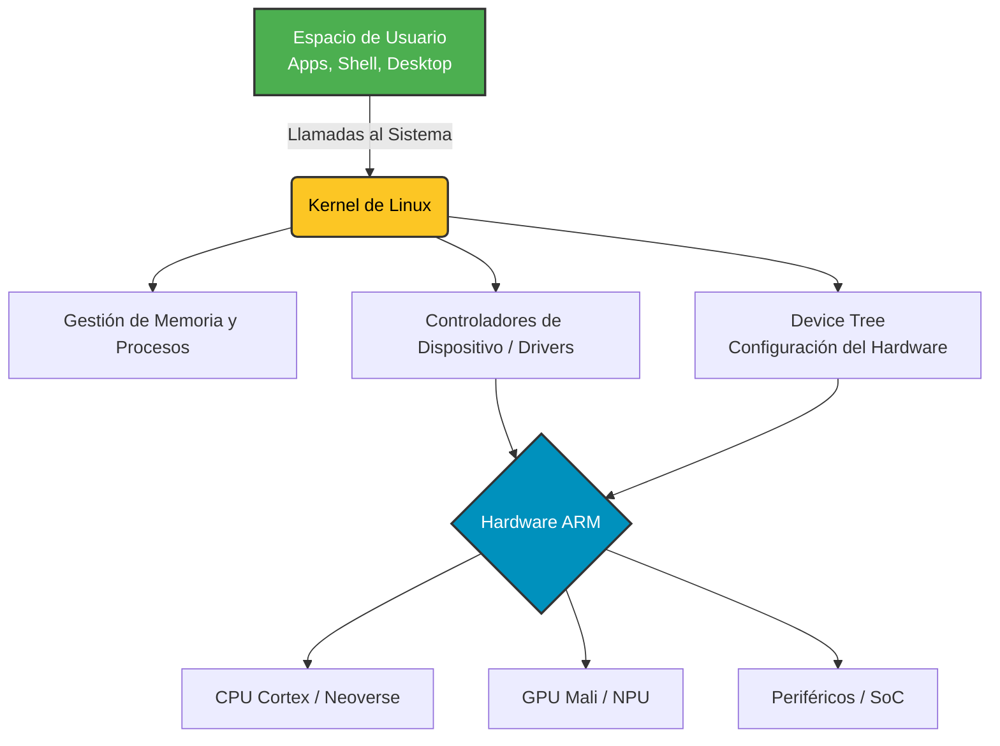
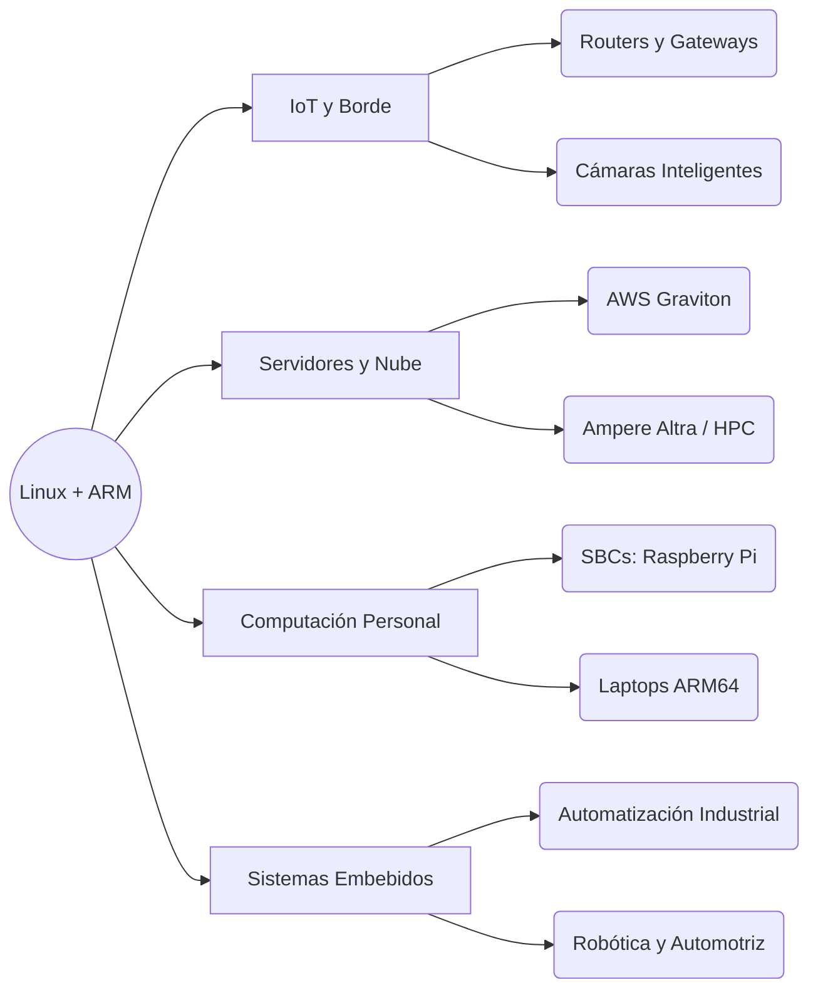

# 🐧 Linux sobre ARM: Innovación en Sistemas Operativos

> Una exploración profunda sobre cómo la sinergia entre el kernel de Linux y la arquitectura ARM está redefiniendo la computación moderna, desde el Edge Computing hasta los centros de datos de alto rendimiento.

---

## 📑 Contenido

- [Introducción](#-introducción)
- [Arquitectura ARM](#️-arquitectura-arm)
- [Linux en ARM](#-linux-en-arm)
- [Ventajas Tecnológicas](#-ventajas-tecnológicas)
- [Desafíos Actuales](#️-desafíos-actuales)
- [Aplicaciones](#-aplicaciones-prácticas)
- [Conclusión](#-conclusión)
- [Referencias](#-referencias)

---

## 📘 Introducción

La combinación del sistema operativo Linux con la arquitectura ARM representa una de las alianzas tecnológicas más potentes de la actualidad. Esta integración permite crear dispositivos altamente eficientes y adaptables. Al ser modular, el kernel de Linux ha impulsado el salto de ARM hacia servidores de alto rendimiento y portátiles de consumo masivo.

---

## ⚙️ Arquitectura ARM

ARM (*Advanced RISC Machine*) se basa en el modelo **RISC** (*Reduced Instruction Set Computer*), diseñado para ejecutar instrucciones con el menor consumo energético posible.

### Características Principales
* **Eficiencia Térmica:** Menor generación de calor por ciclo de instrucción.
* **Alto Rendimiento por Watt:** Optimización máxima de la energía consumida.
* **Escalabilidad:** Capacidad de adaptarse desde sensores IoT hasta supercomputadoras.

---

## 🐧 Linux en ARM

El kernel de Linux es modular por diseño, lo que facilita su compilación para el conjunto de instrucciones de ARM (AArch64/ARMv8/v9).

### Pila de Arquitectura del Sistema

### Innovación en Arquitectura y Rendimiento

-   **Adopción de Armv9-A:** Esta nueva arquitectura base ofrece mayor rendimiento, seguridad mejorada por hardware y extensiones específicas para acelerar cargas de trabajo de Inteligencia Artificial (IA).
    
-   **Computación de Alto Rendimiento (HPC):** Procesadores como Ampere Altra o el Snapdragon X Elite ofrecen una relación rendimiento-vatio muy superior a la arquitectura x86, volviéndose el nuevo estándar de eficiencia en centros de datos.
    
-   **Total Design de Arm:** Iniciativa que proporciona subsistemas de cómputo pre-validados (incluyendo núcleos Neoverse), permitiendo a los fabricantes crear SoCs (_System on a Chip_) personalizados rápidamente.
    

### Ecosistema de Escritorio y Desarrollo

-   **Soporte de Distribuciones:** Existen versiones nativas y optimizadas de **Ubuntu ARM**, **Debian ARM**, **Fedora ARM** y **Arch Linux ARM**.
    
-   **Gaming y Gráficos:** El soporte de drivers gráficos (como Panfrost para Mali) está mejorando rápidamente, abriendo las puertas al _gaming_ eficiente.
    
-   **Desarrollo Embebido:** Plataformas como Raspberry Pi o NVIDIA Jetson, sumadas a herramientas de compilación cruzada como el **Proyecto Yocto**, facilitan la creación de sistemas Linux altamente personalizados.
    

----------

## 🚀 Ventajas Tecnológicas

**Ventaja**

**Descripción**

**🔋 Eficiencia Energética**

Reduce drásticamente el consumo eléctrico y los costos de enfriamiento en servidores.

**💻 Accesibilidad**

El hardware suele ser más económico, democratizando proyectos educativos (ej. SBCs como Raspberry Pi).

**☁️ Cloud Computing**

Proveedores como AWS (Graviton) están migrando instancias a ARM por su excelente costo-beneficio.

**🔧 Flexibilidad Open Source**

El código abierto permite compilar y modificar el kernel a la medida exacta del hardware (SoC) utilizado.

----------

## ⚠️ Desafíos Actuales

A pesar de sus enormes beneficios, la transición y adopción masiva enfrentan ciertos obstáculos:

-   **Compatibilidad x86:** Mucho software privativo y juegos antiguos aún requieren traducción de instrucciones (ej. Rosetta 2 o Box64), lo que puede mermar el rendimiento.
    
-   **Fragmentación del Hardware:** A diferencia de x86, cada SoC ARM suele tener configuraciones de hardware muy específicas, requiriendo _Device Trees_ a la medida en el kernel de Linux.
    
-   **Soporte de Drivers:** Algunos fabricantes de chips ARM no liberan código abierto para sus GPUs o NPU (Unidades de Procesamiento Neuronal), dificultando la integración en Linux.
    

----------

## 🌎 Aplicaciones Prácticas

La implementación de Linux sobre ARM está presente en nuestro día a día, dominando múltiples sectores de la industria tecnológica:

Fragmento de código

1.  **Educación tecnológica:** Laboratorios de informática de bajo costo y experimentación con hardware abierto.
    
2.  **Automatización industrial:** Controladores lógicos programables (PLCs) y robótica de precisión.
    
3.  **Hogar Inteligente (IoT):** Nodos de red, electrodomésticos conectados y asistentes virtuales.
    
4.  **Ciberseguridad:** Dispositivos de red avanzados, firewalls por hardware y análisis de tráfico en tiempo real.
    

----------

## 🧠 Conclusión

Linux sobre ARM ha dejado de ser un experimento para sistemas integrados y se ha consolidado como una evolución disruptiva en la informática moderna. Su combinación de eficiencia energética, flexibilidad y bajo costo fomenta la innovación transversal. A medida que el ecosistema de software madura y soluciona la compatibilidad con el legado x86, el impacto de esta arquitectura dominará la próxima década del desarrollo tecnológico.

----------

## 📚 Referencias

-   [Red Hat — Procesadores ARM y arquitectura RISC](https://www.redhat.com/es/topics/linux/what-is-arm-processor)
    
-   [IONOS — Servidores ARM y fundamentos técnicos](https://www.ionos.mx/digitalguide/servidores/know-how/servidores-arm/)
    
-   [SUSE — Linux Enterprise Server para ARM](https://www.suse.com/products/arm/)
    
-   [Proyecto Yocto — Sistemas Linux para dispositivos embebidos](https://www.yoctoproject.org/)
    
-   [Ubuntu Wiki — Arquitecturas soportadas (ARM)](https://wiki.ubuntu.com/ARM)
