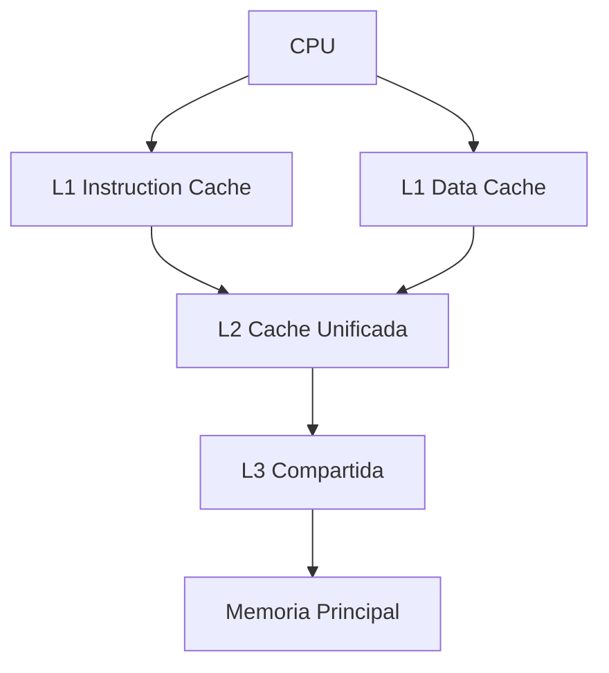
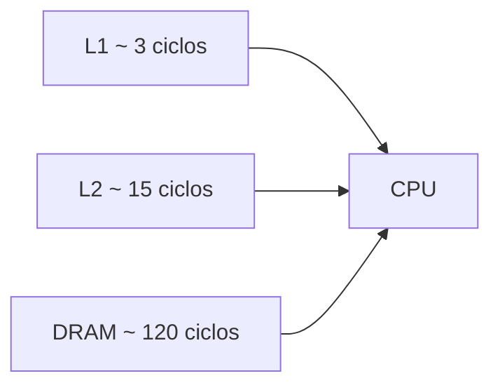
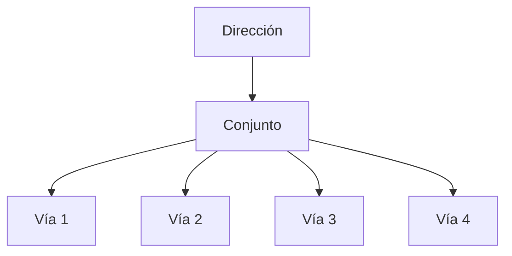
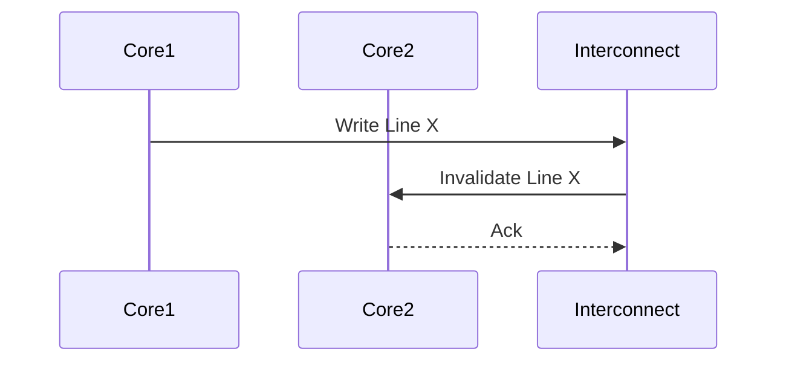
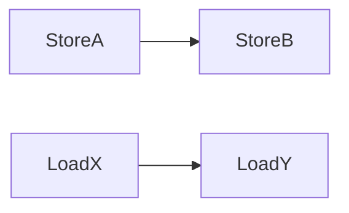
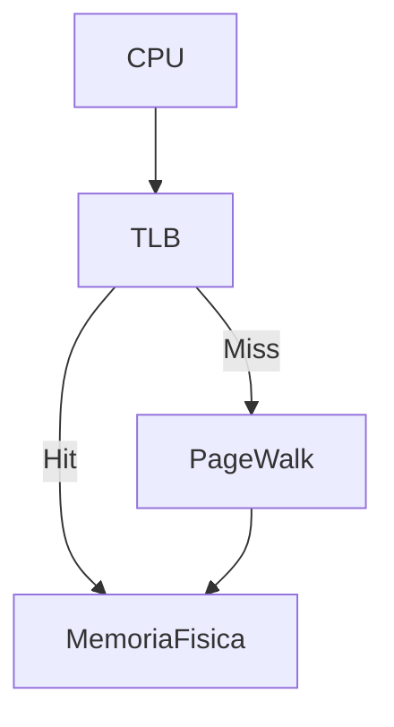

<div align="center">

#  Microarquitectura ARM  
##  Caché y Memoria para Alto Rendimiento


</div>

---

#  Introducción: Por qué la memoria define el rendimiento

En procesadores ARM modernos, especialmente desde **ARMv8 en adelante**, el rendimiento real del sistema no está determinado principalmente por la capacidad de las unidades aritméticas, sino por la eficiencia del **subsistema de memoria**.

La latencia de acceso a memoria principal es órdenes de magnitud mayor que la latencia de ejecución de una instrucción aritmética simple. Por esta razón, el diseño de:

-  La jerarquía de caché  
-  El modelo de coherencia  
-  El sistema de traducción de direcciones  

son elementos críticos en la microarquitectura.

ARM nació con un enfoque en **eficiencia energética**, pero en implementaciones modernas como **Cortex-A** y **Neoverse**, también compite en **rendimiento absoluto**. Para aprovechar completamente estos procesadores, el desarrollador debe entender cómo interactúa su código con la jerarquía de memoria.


---

##  Impacto real de la latencia

| Operación | Latencia Aproximada | Orden de Magnitud |
|------------|--------------------|-------------------|
| Suma entera | 1 ciclo | Muy baja |
| Acceso L1 | 3–4 ciclos | Baja |
| Acceso L2 | 10–20 ciclos | Media |
| Acceso DRAM | 100+ ciclos | Muy alta |

> 🔎 Incluso con ejecución fuera de orden, el procesador no puede ocultar completamente latencias profundas si el patrón de acceso es impredecible o altamente disperso.

---

#  Jerarquía de Memoria en ARM

## 2.1 Arquitectura Harvard Modificada

ARM utiliza una arquitectura **Harvard modificada**.

En el nivel L1 existen dos cachés separadas:

- 📘 L1I → Instrucciones  
- 📗 L1D → Datos  

Esto permite realizar **fetch de instrucciones y acceso a datos en paralelo**, evitando conflictos estructurales.



### Organización típica

- L1: privada por núcleo  
- L2: usualmente privada por núcleo  
- L3: compartida entre múltiples núcleos  

Esta organización reduce la frecuencia de accesos a memoria principal y mejora la **escalabilidad multi-core**.

---

## 2.2 Latencias relativas y su impacto



La diferencia de latencia implica que el rendimiento está fuertemente condicionado por la **tasa de fallos de caché**.

---

#  Diseño y Funcionamiento de la Caché

---

## 3.1 Tamaño de línea y localidad espacial

En ARMv8, el tamaño típico de línea de caché es:

>  **64 bytes**

Cuando se accede a una dirección de memoria, se carga la línea completa que contiene ese dato.

### Acceso secuencial (eficiente)

```
| A | B | C | D |   ← misma línea de 64 bytes
```

### Acceso disperso (ineficiente)

```
| A |       | B |       | C |
(Fallo)     (Fallo)     (Fallo)
```

 Si los datos están contiguos, la línea cargada contendrá información que será utilizada en accesos posteriores.

 La **localidad espacial** es uno de los principios más importantes para optimizar en ARM.


---

## 3.2 Asociatividad y conflictos

Las cachés son **asociativas por conjuntos**.

Cada dirección de memoria puede ubicarse solo en un conjunto específico dentro de varias vías posibles.



⚠️ Si múltiples direcciones compiten por el mismo conjunto, pueden expulsarse entre sí aunque la caché no esté llena.

Este fenómeno puede generar degradaciones de rendimiento difíciles de detectar.

---

## 3.3 Políticas de escritura

La mayoría de implementaciones utilizan:

>  **Write-back + Write-allocate**

| Política | Funcionamiento | Impacto |
|------------|---------------|----------|
| Write-through | Escribe directo en memoria | Más tráfico |
| Write-back | Modifica primero en caché | Menos tráfico |
| Write-allocate | Trae línea al escribir | Mejor promedio |

Este enfoque reduce tráfico hacia DRAM, pero aumenta la complejidad del sistema de coherencia.

---

#  Coherencia de Caché en Sistemas Multi-Core

---

## 4.1 Protocolos de coherencia

En sistemas multi-core, cada núcleo mantiene su propia caché privada.

Para mantener consistencia se emplean protocolos derivados de:

- MESI  
- MOESI  

Implementados mediante interconexiones como:

- AMBA ACE  
- AMBA CHI  



Cuando un núcleo modifica una línea compartida, se envían **invalidaciones** a otros núcleos.

---

## 4.2 False Sharing

El *false sharing* ocurre cuando dos hilos modifican variables distintas dentro de la misma línea de 64 bytes.

```
| Var A | Var B | padding |
```

Aunque no estén relacionadas, la línea completa se invalida en cada escritura.

⚠️ Puede reducir drásticamente la escalabilidad.

### ✔ Solución: Alineamiento

```c
struct {
    int varA;
    char padding[60];
};
```

---

#  Modelo de Memoria en ARM

---

## 5.1 Modelo débil y reordenamiento

ARM permite reordenamiento de cargas y almacenamientos cuando no existen dependencias explícitas.



Esto mejora eficiencia del pipeline y paralelismo interno.

⚠️ El orden en el código no siempre coincide con el orden observado por otros núcleos.

---

## 5.2 Barreras y sincronización

ARM proporciona instrucciones como:

| Instrucción | Función |
|------------|---------|
| DMB | Data Memory Barrier |
| DSB | Data Synchronization Barrier |
| ISB | Instruction Synchronization Barrier |

En programación moderna se usan mediante primitivas atómicas con semánticas:

- Acquire  
- Release  

Comprender el modelo débil es esencial para código concurrente correcto.

---

#  TLB y Traducción de Direcciones

---

## 6.1 Funcionamiento del TLB

El TLB almacena traducciones de direcciones virtuales a físicas.



Un fallo de TLB implica múltiples accesos adicionales y puede impactar el rendimiento de forma comparable a un fallo profundo de caché.

---

## 6.2 Páginas grandes

ARMv8 soporta:

| Tamaño | Ventaja |
|--------|----------|
| 4KB | Estándar |
| 2MB | Reduce presión TLB |
| 1GB | Minimiza fallos |

En aplicaciones con grandes regiones contiguas, usar páginas grandes mejora la estabilidad del rendimiento.

---

#  Patrones de Acceso y Diseño Orientado a Datos

El rendimiento en ARM depende en gran medida de cómo se organizan los datos en memoria.

## Comparación de estructuras

| Diseño | Comportamiento |
|--------|---------------|
| Lista enlazada | Muchos fallos de caché |
| Arreglo contiguo | Alta localidad |
| Structure of Arrays | Máxima densidad útil |

### Ejemplo disperso

```c
node->next->next->value;
```

### Ejemplo contiguo

```c
for(int i=0;i<N;i++)
    sum += arr[i];
```

El diseño orientado a datos propone estructurar la memoria según el patrón real de acceso.

Optimizar en ARM implica diseñar pensando en la jerarquía de memoria, no únicamente en la abstracción lógica del problema.

---

#  Conclusión

En microarquitectura ARM moderna, el subsistema de memoria es el **factor dominante en el rendimiento**.

Para desarrollar software eficiente es esencial:

- Minimizar fallos de caché  
-  Reducir presión sobre el TLB  
-  Evitar false sharing  
-  Comprender el modelo de memoria débil  
-  Diseñar estructuras con alta localidad  

---

<div align="center">

##  Rendimiento = Algoritmo + Organización de Datos + Interacción con la Memoria

**Dominar la jerarquía de memoria es dominar el rendimiento en ARM.**

</div>
