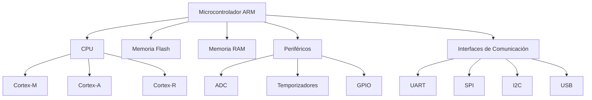
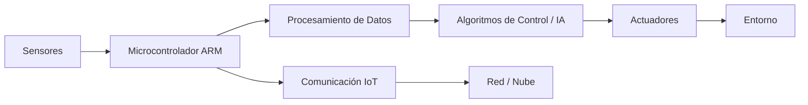

# Microcontroladores ARM y Sistemas Inteligentes

---

## 📌 Datos del Alumno

| Dato | Información |
|------|------------|
| **Nombre** | SANTOS ABRAHAM SANTOYO TORRES |
| **Número de Control** | 23212072 |
| **Grupo** | SC6C |
| **Materia** | Lenguajes de Interfaz |
| **Profesor** | RENE SOLIS REYES |

---

# 1. Introducción

Los microcontroladores ARM son dispositivos electrónicos basados en arquitectura RISC (Reduced Instruction Set Computer) diseñados para ofrecer alto rendimiento con bajo consumo energético. Son ampliamente utilizados en sistemas embebidos y representan una base fundamental en el desarrollo de sistemas inteligentes modernos.

Actualmente, los microcontroladores ARM se encuentran en dispositivos IoT, sistemas automotrices, robots, dispositivos médicos y aplicaciones industriales.

---

# 2. Arquitectura ARM

La arquitectura ARM se caracteriza por:

- Diseño RISC
- Bajo consumo energético
- Alta eficiencia por ciclo de reloj
- Arquitectura modular y escalable

## Arquitectura del Cortex-M3

*Figura 1. Diagrama interno de un microcontrolador ARM Cortex-M3.*

# 3. Componentes de un Microcontrolador ARM

Un microcontrolador ARM integra en un solo chip:

- CPU (Cortex-M, Cortex-A o Cortex-R)
- Memoria Flash
- Memoria RAM
- Periféricos digitales y analógicos
- Temporizadores
- Interfaces de comunicación (UART, SPI, I2C, USB)

### 📊 Tabla de Componentes

| Componente | Función |
|------------|----------|
| CPU | Procesamiento de instrucciones |
| Flash | Almacenamiento del programa |
| RAM | Memoria temporal |
| ADC | Conversión analógica-digital |
| UART/SPI/I2C | Comunicación |

---

# 4. Familias de Procesadores ARM

## 🔹 Cortex-M (Microcontroladores)

Diseñados para sistemas embebidos y aplicaciones de tiempo real.

Ejemplos:
- Cortex-M0
- Cortex-M3
- Cortex-M4
- Cortex-M7

## 🔹 Cortex-A

Orientados a aplicaciones de alto rendimiento (ej. smartphones).

## 🔹 Cortex-R

Aplicaciones críticas en tiempo real (automotriz, aeroespacial).

---

# 5. Comparación de Núcleos ARM

| Núcleo | Uso Principal | Consumo | Potencia |
|--------|--------------|----------|----------|
| Cortex-M0 | Dispositivos simples | Muy Bajo | Baja |
| Cortex-M4 | Procesamiento DSP | Bajo | Alta |
| Cortex-A53 | Sistemas avanzados | Medio | Muy Alta |

---

# 6. Sistemas Inteligentes

Un sistema inteligente es aquel capaz de:

- Procesar información
- Analizar datos
- Tomar decisiones
- Adaptarse al entorno

Se componen generalmente de:

- Sensores
- Microcontrolador
- Actuadores
- Algoritmos de control o IA

---

# 7. Aplicaciones de ARM en Sistemas Inteligentes

## 🌐 Internet de las Cosas (IoT)

Aplicaciones:
- Casas inteligentes
- Monitoreo ambiental
- Redes de sensores

---

## 🤖 Robótica

- Control de motores
- Procesamiento de señales
- Navegación autónoma

---

## 🚗 Automotriz

- Sistemas ABS
- Control electrónico del motor
- Sistemas de asistencia al conductor

---

# 8. ARM y Machine Learning (TinyML)

Los microcontroladores ARM modernos permiten ejecutar modelos de aprendizaje automático optimizados, conocidos como TinyML.

Esto permite:

- Reconocimiento de voz
- Detección de patrones
- Clasificación de datos
- Edge Computing (procesamiento local)

---

# 9. Ventajas de ARM en Sistemas Inteligentes

- Bajo consumo energético
- Alta eficiencia
- Escalabilidad
- Amplio soporte industrial
- Gran comunidad de desarrollo

---

# Diagramas 
Arquitectura General de un Microcontrolador ARM

Estructura de un Sistema Inteligente con ARM

# 10. Conclusión

Los microcontroladores ARM representan una tecnología clave en el desarrollo de sistemas inteligentes. Su arquitectura eficiente, bajo consumo energético y capacidad de procesamiento los convierten en la mejor opción para aplicaciones modernas como IoT, robótica y sistemas automotrices.

Gracias a su capacidad para integrar procesamiento, comunicación y control en un solo chip, los ARM permiten crear dispositivos inteligentes autónomos capaces de tomar decisiones en tiempo real.

---

# 📚 Referencias

1. ARM Ltd. (2023). *ARM Architecture Reference Manual*. Disponible en: https://developer.arm.com/documentation  
2. STMicroelectronics. (2023). *STM32 Microcontroller Documentation*. Disponible en: https://www.st.com  
3. NXP Semiconductors. (2023). *ARM Cortex-M Based Microcontrollers*. Disponible en: https://www.nxp.com  
4. Texas Instruments. (2023). *Embedded Systems with ARM Cortex*. Disponible en: https://www.ti.com  
5. Banzi, M., & Shiloh, M. (2014). *Getting Started with Arduino*. O’Reilly Media.  
6. Rajovic, N., et al. (2016). "Taming the Microcontroller Beast: TinyML on ARM Cortex-M". IEEE Embedded Systems Letters.

---
