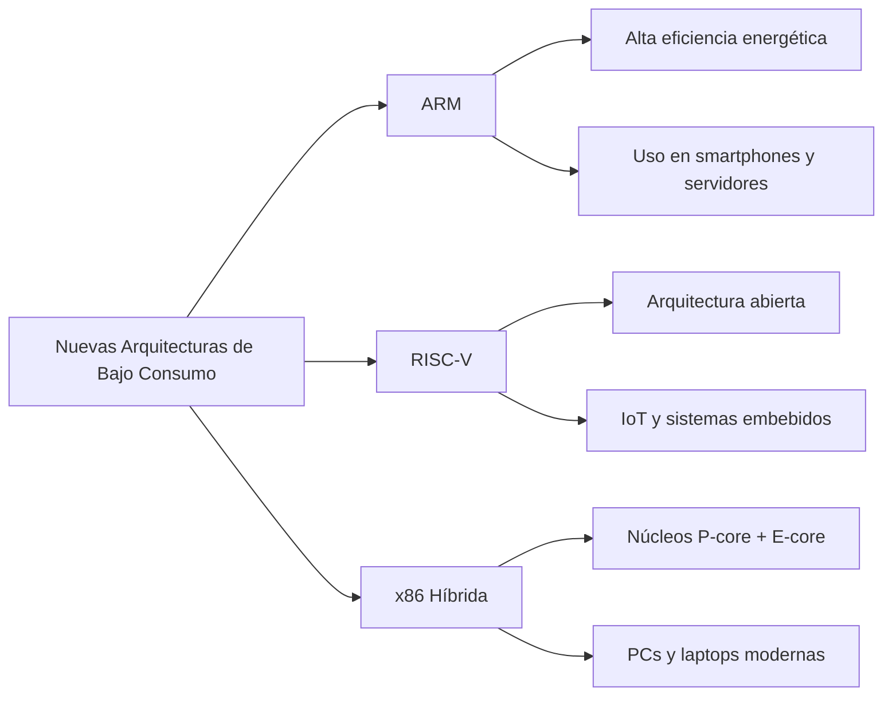

**Nombre:** Constantino Alto Hernández

**Matricula:** 23210541

**Fecha:** 12/02/2026

Las nuevas arquitecturas de procesadores orientadas a bajo consumo energético están transformando el diseño de dispositivos móviles, IoT, laptops ultraligeras e incluso centros de datos eficientes. En este trabajo te mencionare algunas de ellas.
##

En la actualidad, el diseño de procesadores está cada vez más enfocado en reducir el consumo de energía sin afectar demasiado el rendimiento. Esto se debe al crecimiento de dispositivos móviles, sistemas embebidos y equipos portátiles, donde la eficiencia energética es un factor fundamental.

Para lograrlo, las empresas han desarrollado nuevas arquitecturas más optimizadas, como las propuestas por Arm Ltd y RISC-V International, además de los diseños híbridos implementados por compañías como Intel y Advanced Micro Devices.
##

La arquitectura desarrollada por **Arm Ltd.** es una de las más utilizadas en dispositivos móviles.
### Características principales:
-   Basada en arquitectura **RISC** (instrucciones simples y eficientes).
-   Bajo consumo energético.
-   Diseño **big.LITTLE** (núcleos de alto rendimiento y núcleos de alta eficiencia).
-   Amplio uso en smartphones, tablets y microcontroladores.
    
Su eficiencia se debe a que el ISA está diseñado para ser simple, lo que reduce la complejidad interna del procesador y el consumo por instrucción.

## 

La arquitectura promovida por **RISC-V International** es un estándar abierto basado también en principios RISC. Su principal ventaja es que permite diseñar procesadores personalizados agregando únicamente las extensiones necesarias, lo que favorece el bajo consumo.

Es muy utilizada en investigación, IoT y sistemas de ultra bajo consumo.

### Características principales:
-   ISA **abierto y libre de licencias**.
-   Diseño **modular** (extensiones opcionales).
-   Posibilidad de eliminar funciones innecesarias para ahorrar energía.
-   Alta escalabilidad (desde microcontroladores hasta servidores).
-   Ideal para sistemas embebidos y dispositivos IoT.
-   Menor complejidad del hardware.

#

Empresas tradicionales como **Intel** y **Advanced Micro Devices** han adaptado la arquitectura x86 para mejorar su eficiencia energética mediante diseños híbridos.

Un ejemplo es **Alder Lake**, que combina núcleos de alto rendimiento con núcleos de eficiencia para optimizar el consumo según la carga de trabajo.

### Características principales:

-   Combinación de **núcleos P (Performance)** y **núcleos E (Efficiency)**.
-   Mejor distribución de tareas según demanda energética.
-   Mantienen compatibilidad con software x86 tradicional.
-   Gestión avanzada de energía y control térmico.
-   Uso frecuente en laptops modernas y PCs eficientes.

##

| Característica              | ARM                              | RISC-V                           | x86 Híbrida                          |
|----------------------------|----------------------------------|-----------------------------------|--------------------------------------|
| Tipo de ISA                | RISC                             | RISC (abierta)                    | CISC con diseño híbrido              |
| Filosofía de diseño        | Eficiencia energética nativa     | Modular y personalizable          | Núcleos P-core + E-core              |
| Enfoque de bajo consumo    | Alto rendimiento por watt        | Ajustable según implementación    | Uso de núcleos eficientes (E-cores)  |
| Modelo de licenciamiento   | Licencia propietaria             | Código abierto                    | Propietario                          |
| Nivel de consumo energético| Muy bajo                         | Muy bajo (según diseño)           | Medio-bajo                           |
| Compatibilidad software    | Alta (Android, Linux, macOS)     | En crecimiento                    | Muy alta (Windows, Linux)            |
| Ecosistema                 | Muy maduro                       | En expansión                      | Muy maduro                           |
| Dispositivos típicos       | Smartphones, tablets, servidores | IoT, embebidos, edge computing    | PCs, laptops modernas                |
| Ventaja principal          | Máxima eficiencia energética     | Flexibilidad total                | Compatibilidad tradicional           |
| Desventaja principal       | Dependencia de licencias         | Menor adopción global             | Mayor consumo base que ARM           |

##

##

En conclusión comprendí que las nuevas arquitecturas de procesadores se enfocan principalmente en mejorar la eficiencia energética. ARM, RISC-V y x86 híbrida buscan ofrecer buen rendimiento con menor consumo de energía, adaptándose a las necesidades actuales. En general, el futuro de los procesadores está orientado a ser más eficientes, inteligentes y optimizados.

## 

Revisión sistemática de tecnologías actuales de microprocesadores: https://portal.amelica.org/ameli/journal/368/3685133004/html/?utm_source=chatgpt.com

Análisis de técnicas de ahorro de energía en procesadores modernos (Repositorio UPS): https://dspace.ups.edu.ec/handle/123456789/29551
