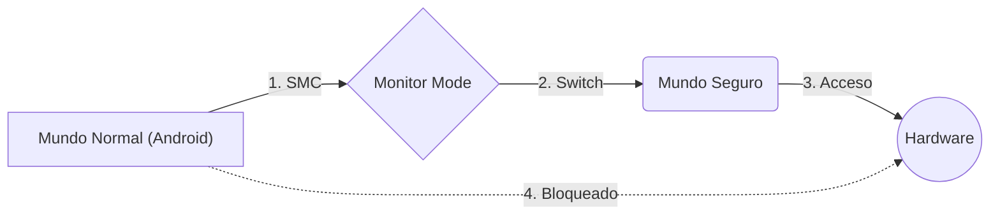

# Seguridad por hardware en arquitecturas ARM

Desde sus inicios, el ecosistema **ARM** ha sido pionero en seguridad informática. **ARM** colabora activamente con su ecosistema global de socios para analizar y contrarrestar las amenazas a la seguridad mediante el desarrollo y la implementación de una completa gama de funciones de seguridad para la arquitectura. Nuestras arquitecturas permiten una seguridad integrada en todas las plataformas informáticas, desde dispositivos conectados al IoT hasta dispositivos móviles de pantalla grande e infraestructura de servidores en la nube.

Las **CPU** y arquitecturas de sistemas ARM están presentes en casi todas partes y sustentan toda la industria tecnológica, ayudando a reducir la fragmentación, disminuir los costos y mejorar la seguridad. Al incorporar la seguridad en las capas fundamentales de la arquitectura y permitir su certificación independiente, hemos ayudado a nuestros socios a ofrecer miles de millones de experiencias seguras.

  

---

## El Fundamento: ARM TrustZone
El fundamento de la seguridad en el ecosistema ARM es la tecnología **TrustZone**. A diferencia de los enfoques tradicionales que separan procesos mediante software, TrustZone divide el procesador física y lógicamente en dos estados operativos: el "Mundo Normal" (Normal World) y el "Mundo Seguro" (Secure World).

**Diagrama de la TrustZone**

En este esquema, el sistema operativo rico (como Android, iOS o Linux) se ejecuta en el Mundo Normal con privilegios restringidos. Las operaciones críticas, como el manejo de claves criptográficas, la autenticación biométrica y los pagos móviles, ocurren en el Mundo Seguro bajo un Entorno de Ejecución de Confianza (TEE). El cambio entre estos mundos es gestionado por un componente de hardware llamado "Monitor Mode", asegurando que incluso si el sistema operativo principal es comprometido con privilegios de root, el atacante no pueda acceder a la memoria o los registros del entorno seguro.

| Característica | Ventajas (Pros) | Desventajas (Contras) |
| :--- | :--- | :--- |
| **Aislamiento** | Crea un entorno seguro (TEE) separado del SO. | Si el TEE falla, todo el sistema cae. |
| **Rendimiento** | Cambio de modo ultra rápido (por hardware). | Vulnerable a ataques de canal lateral (Side-channel). |
| **Seguridad** | Protege biometría y claves de cifrado. | Implementación muy compleja ("Zero bugs"). |
| **Costo** | Ya incluido en el chip (sin coste extra). | Es una "Caja Negra" (difícil de auditar). |

>### Integridad del Flujo de Control (ARMv8.3 y posteriores) 
>Con la llegada de la arquitectura ARMv8.3, el enfoque se expandió desde el aislamiento macroscópico hacia la protección a nivel de instrucción para mitigar ataques que secuestran el flujo de ejecución del programa.

---
## Autenticación de Punteros (PAC)

La Autenticación de Punteros aborda la vulnerabilidad de la corrupción de punteros en la memoria. Aprovechando que los sistemas de 64 bits no utilizan todos los bits de dirección virtual, PAC inserta una firma criptográfica (un Código de Autenticación de Mensaje o MAC) en los bits superiores de los punteros. Antes de que el procesador utilice una dirección de retorno o un salto, el hardware verifica esta firma. Si un atacante ha intentado modificar el puntero para redirigir el flujo del programa (como en un ataque ROP), la firma no coincidirá y el hardware generará una excepción inmediata, deteniendo la explotación antes de que ocurra.

  

---
## El Futuro: ARM Confidential Compute Architecture (CCA)

Con la introducción de la arquitectura ARMv9, se ha presentado el cambio más significativo desde TrustZone: la Arquitectura de Computación Confidencial (CCA).

El modelo tradicional de TrustZone asume que el hipervisor o el kernel del sistema operativo son entidades confiables. Sin embargo, en entornos de nube, los usuarios no deberían verse obligados a confiar ciegamente en el proveedor de la infraestructura. ARM CCA introduce el concepto de **Realms** (Reinos).

Un Realm es una región de ejecución que está aislada no solo de otras aplicaciones, sino también del propio sistema operativo y del hipervisor que la gestionan. El hardware garantiza que los datos dentro de un Realm sean invisibles e inaccesibles para el software privilegiado. Esto permite ejecutar cargas de trabajo sensibles en la nube pública garantizando que ni el administrador del sistema ni el proveedor de la nube puedan acceder a los datos en uso, logrando un aislamiento total basado en hardware.

## Arquitectura Hardware

> El objetivo principal de la seguridad de esta arquitectura es permitir confidencialidad e integridad de los dispositivos de posibles ataques

### Modo de separación seguro
La idea es que el procesador crea dos entornos diferentes de ejecución, uno es el mundo seguro y el otro es el mundo normal, las aplicaciones tienen permisos de ejecutarse dependiendo si se esta en un modo o en otro y eso es completamente invisible para el usuario. Esto significa que se puede crear una condición que active o desactive el modo seguro como es el acceso a internet y por tanto activar y/o desactivar los permiso de uso de aplicaciones.

---
Gutierrez Morales Oswaldo - 23211978

--- 
### Fuentes de Consulta:

 - _Arch Arquitectura de seguridad de la plataforma ARM IOT (PSA) - programador clic_. (s. f.). https://programmerclick.com/article/76544445549/

- Limited, H. G. (2025, 27 marzo). Sistemas operativos con arquitectura ARM: estado actual y futuro - Hostragons®. _Hostragons®_. https://www.hostragons.com/es/blog/sistemas-operativos-en-arquitectura-arm/

- Prezi, L. A. O. (s. f.). _seguridad de la arquitectura ARM_. prezi.com. https://prezi.com/rlpftszfxtnk/seguridad-de-la-arquitectura-arm/
