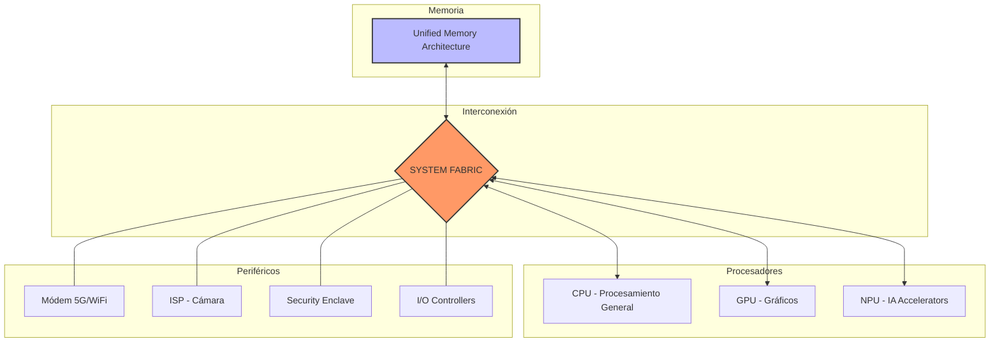

# SoC Modernos: Integración Extrema como Clave de Innovación

## 1. ¿Qué es la Integración Extrema?
La "integración extrema" se refiere a la capacidad de consolidar en una sola oblea de silicio componentes que antes estaban separados físicamente. Esto incluye:
* *CPU:* Procesamiento general.
* *GPU:* Gráficos.
* *NPU:* Inteligencia artificial.
* *Módem:* Conectividad.
* *Memoria Unificada:* Gestión eficiente de datos.

## 2. Componentes Clave en un SoC Moderno
Los módulos que conviven en estos chips incluyen:

* *Unidades de Procesamiento Especializado:* Además de los núcleos de alto rendimiento y eficiencia, incluyen motores neuronales para tareas de IA.
* *Arquitectura de Memoria Unificada (UMA):* Elimina la necesidad de copiar datos entre la memoria de la CPU y la GPU, reduciendo drásticamente la latencia.
* *ISP (Image Signal Processor):* Hardware dedicado exclusivamente al procesado de fotografía y video en tiempo real.
* *Controladores de Seguridad:* Enclaves seguros que manejan el cifrado y datos biométricos a nivel de hardware.

### 2.1 Diagrama de Arquitectura Lógica de un SoC
### 🖥️ Diagrama de Arquitectura de un SoC Moderno

### 2.2 El Rol del Fabric y Heterogeneous Computing
Más allá de los núcleos, la clave es el **System Fabric**. Este bus interno de ultra alta velocidad arbitra el tráfico entre componentes. Al estar integrados, el SoC permite **Heterogeneous Computing**, donde una tarea se fragmenta y se envía al núcleo más eficiente (ej. una tarea de visión a la NPU en lugar de la CPU), optimizando el ciclo de instrucción.

## 3. Ventajas Técnicas: Rendimiento y Eficiencia
La innovación no es solo por espacio, sino por física fundamental. Al estar los componentes más cerca:

1. *Reducción de Latencia:* Los datos viajan distancias más cortas entre registros y memoria.
2. *Eficiencia Energética:* Se requiere menos potencia para mover datos entre componentes ($P=1$ V \cdot I).
3. *Gestión Térmica:* La disipación es más compleja debido a la densidad de transistores, pero permite un control granular de energía por cada bloque funcional.

### Comparativa Expandida: Arquitectura Tradicional vs. SoC Moderno

| Característica | Arquitectura Tradicional (PC) | Arquitectura SoC Moderna |
| :--- | :--- | :--- |
| **Comunicación** | Buses en Placa Base (PCIe, etc.) | Interconexiones internas en silicio |
| **Latencia de Memoria** | Alta (módulos externos) | Muy Baja (Memoria integrada/cercana) |
| **Consumo de Energía** | Elevado (múltiples chips) | Optimizado (un solo chip) |
| **Ancho de Banda** | Limitado por pines físicos | Masivo (vías internas de silicio) |
| **Seguridad** | Vulnerable en buses externos | Protegida por Enclaves Seguros |

## 4. Impacto en los Lenguajes de Interfaz y Firmware
Para la materia de Lenguaje de Interfaz, el SoC representa un cambio de paradigma:

* *Instrucciones Especializadas:* Los compiladores deben aprovechar juegos de instrucciones específicos (como los de la arquitectura ARM64) para explotar la NPU o los aceleradores de video.
* *Manejo de Interrupciones:* En un SoC, el controlador de interrupciones (GIC en ARM) debe gestionar cientos de señales de periféricos integrados en un mismo espacio de direccionamiento.
* *Firmware y Low-Level:* El arranque (Bootloader) debe inicializar cada componente del silicio en un orden estricto para evitar picos de voltaje que dañen la oblea.

### 4.1 Coherencia de Caché y Lenguaje Ensamblador
El programador de sistemas debe gestionar la **L3 Cache** compartida. Esto requiere el uso de barreras de memoria (*DMB - Data Memory Barrier* en ensamblador) para evitar condiciones de carrera cuando la GPU y la CPU acceden al mismo buffer de memoria unificada.

## 5. Casos de Éxito en la Industria
* *Apple Silicon (Serie M):* Redimió el mercado de laptops al demostrar que un SoC puede superar en potencia a CPUs de escritorio consumiendo una fracción de energía.
* *Qualcomm Snapdragon:* Líder en integración de módems 5G y capacidades fotográficas extremas en dispositivos móviles.
* *NVIDIA Grace Hopper:* Llevando la integración extrema al mundo de los servidores y la IA generativa con interconexiones NVLink integradas.

---
### 🛡️ Revisión de Pares (Peer Review)
* **Revisor:** Aguirre Davila Hugo Iram
* **Estado:** Aceptado con mejoras de profundidad técnica, formato y referencias.

## Referencias Bibliográficas

* **Hennessy, J. L., & Patterson, D. A. (2017).** *Computer Architecture: A Quantitative Approach* (6th ed.). Morgan Kaufmann.
* **ARM Limited. (2023).** *Arm® Architecture Reference Manual Armv8*.
* **Stallings, W. (2022).** *Computer Organization and Architecture*. Pearson.
* **Tanenbaum, A. S. (2016).** *Structured Computer Organization*. [Referencia para la jerarquía de buses internos].
