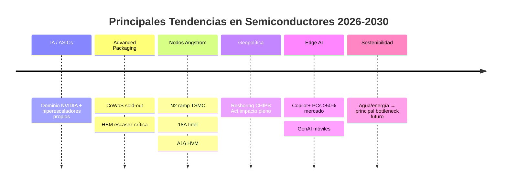

# Tendencias Futuras en Arquitecturas de Semiconductores

Este documento describe las tendencias clave que están definiendo el panorama de los semiconductores en 2026 y hacia la segunda mitad de la década. El enfoque abarca desde la manufactura a nivel *IA* hasta la geopolítica de la cadena de suministro, con énfasis en los bottlenecks impulsados por la explosión de IA.

## 1. Computación de IA y Silicio Personalizado (ASICs)
El paradigma de cómputo ha cambiado definitivamente: de propósito general a cargas de trabajo específicas de IA. Las limitaciones de energía y suministro impulsan a hiperescaladores (Google, Amazon, Microsoft, Meta) a diseñar sus propios chips (TPUs, Trainium, Inferentia, etc.).

**Tendencia principal:** El gasto se inclina masivamente hacia aceleradores dedicados, con NVIDIA manteniendo dominio pero con creciente competencia.

**Datos clave:**
- Ingresos de NVIDIA por Data Center: **$39.1 mil millones** en Q1 FY2026 (+73% interanual), representando ~89% de sus ingresos totales.
- El boom de IA continúa: Q3 FY2026 alcanzó **$51.2 mil millones** en Data Center.

## 2. Chiplets, IC 3D y Empaquetado Avanzado
Con la Ley de Moore ralentizándose, el rendimiento depende cada vez más del *advanced packaging*. La integración heterogénea permite combinar nodos de proceso distintos en un solo paquete.

**Tecnologías clave:** Expansión agresiva de **CoWoS** (TSMC), SoIC, y variantes como CoWoS-L/S.
**Estado actual 2026:** CoWoS sigue siendo el bottleneck principal — oversubscribed y sold-out a través de 2025 y gran parte de 2026. NVIDIA acapara >50-60% de la capacidad.
**Proyecciones:** Capacidad mensual TSMC pasó de ~70-75k obleas fin 2025 a ~115k-130k hacia fin 2026, con demanda global alcanzando ~1 millón de obleas anuales.

## 3. La "Pared de la Memoria": HBM y Arquitecturas Centradas en Datos
La velocidad de procesamiento supera ampliamente el acceso a memoria. **HBM** (*High Bandwidth Memory*) es el recurso más crítico y escaso para entrenamiento e inferencia de LLMs.

**Impacto:** HBM es la "moneda más escasa" en infraestructura IA; toda producción 2026 está pre-vendida.
**Cuota de mercado (TrendForce y datos 2025-2026):**
- Representa >30% de ingresos DRAM en 2025, con tendencia a seguir creciendo en 2026.
- SK hynix lidera (~50-60% share), seguido de Samsung y Micron; HBM3e domina, HBM4 inicia ramp en 2026.

## 4. Semiconductores Automotrices y el Vehículo Definido por Software
El vehículo moderno es un "centro de datos sobre ruedas". La demanda prioriza rendimiento, pero también seguridad funcional y cumplimiento regulatorio.

**Contenido de silicio:** Promedio >**$2,000 por vehículo** en 2025-2026 (más alto en EVs y ADAS avanzados).
**Regulaciones clave:**
- **UE:** Norma GSR II ya vigente para nuevos modelos.
- **EE. UU.:** AEB (Frenado de Emergencia Automático) obligatoria desde septiembre 2029.
   
## 5. Geopolítica y "Relocalización" (Reshoring)
La soberanía en semiconductores es prioridad de seguridad nacional. La cadena global se fragmenta hacia hubs regionales (EE.UU., UE, Japón, etc.).

**Inversión pública EE.UU. (CHIPS Act):**
- Awards totales ~**$33 mil millones** en grants + préstamos a empresas como TSMC, Intel, Samsung, Micron.
- Inversiones anunciadas superan **$640 mil millones** en supply chain (fabs, equipamiento, etc.), con fuerte momentum en 2026.

## 6. Fotónica de Silicio y Computación Cuántica
Superar límites del cobre en transmisión de datos: la industria migra a fotónica para interconexiones ultra-rápidas y bajo consumo.

**Innovación clave:** NVIDIA Spectrum-X Photonics (100-400 Tb/s).
**Futuro:** Alto volumen de *Co-Packaged Optics* (CPO) a partir de 2026-2027, esencial para clusters IA next-gen.

## 7. Edge AI: Inteligencia en el Dispositivo
La inferencia IA migra de nube a borde, impulsando PCs y smartphones con NPUs dedicadas.

**PC:** Línea **Copilot+** de Microsoft establece estándar (≥40 TOPS NPU). Proyección: **AI PCs ~59%** de envíos globales en 2026 (Counterpoint).
**Móvil:** >400 millones de smartphones con GenAI en 2025; adopción acelera en 2026 pese a presiones de memoria.

## 8. Electrónica de Potencia de Banda Prohibida Ancha (WBG)
Reemplazo del silicio por **SiC** (carburo de silicio) y **GaN** (nitruro de galio) en alta eficiencia y alto voltaje.

**Aplicaciones:** Vehículos eléctricos, carga rápida, fuentes para data centers.
**Crecimiento:** Navitas reportó +50% ingresos en 2024 con $450M en nuevos diseños GaN; momentum continúa en 2026.

## 9. Sostenibilidad y Gestión de Recursos
La fabricación de chips tiene huella ecológica masiva. Consumo de agua y energía es el principal cuello de botella futuro.

**Desafío del agua:** Fabs grandes podrían requerir hasta **19 millones de litros de UPW al día** hacia 2035.
**Datos de impacto:**
- Gran fab: >**100,000 MWh** de energía anual.
- TSMC: **101 millones de m³ de agua** en 2023; mejoras en reclaimed water (~17% en 2024), pero expansión presiona recursos.

## Conclusión
En 2026, la industria de semiconductores vive un superciclo impulsado por IA, pero enfrenta bottlenecks críticos en HBM, CoWoS y sostenibilidad. El reshoring y eficiencia energética definirán el liderazgo hacia 2030.

## Fuentes principales
1. NVIDIA Earnings – Q1 FY2026: https://nvidianews.nvidia.com/news/nvidia-announces-financial-results-for-first-quarter-fiscal-2026  
2. TSMC Technology Roadmap (N2/A16): https://www.tsmc.com/english/dedicatedFoundry/technology/logic/l_2nm  
3. DigiTimes / TrendForce – CoWoS capacity 2026: https://www.digitimes.com/news/a20260129PD220/tsmc-packaging-fab-cowos-genai.html  
4. TrendForce – HBM market 2025-2026: https://www.trendforce.com/research/download/RP260204DA3  
5. Counterpoint Research – AI PCs 2026: https://counterpointresearch.com/en/reports/ai-advanced-pcs-to-surpass-half-of-global-shipments-in-2026  
6. SIA / NIST – CHIPS Act investments: https://www.semiconductors.org/chip-supply-chain-investments  
