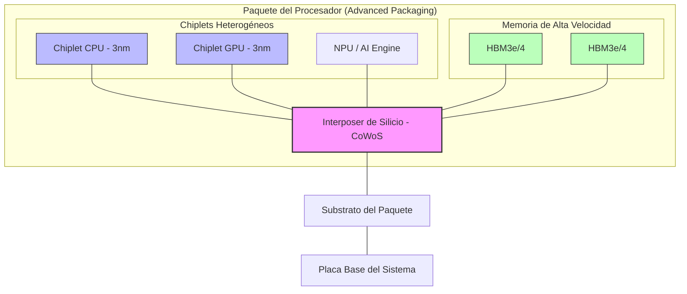
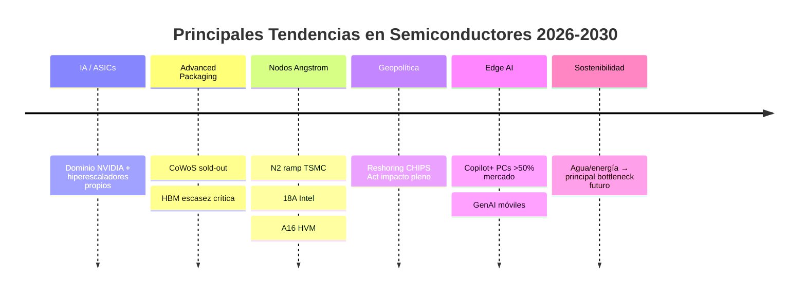

# Tendencias Futuras en Arquitecturas de Semiconductores (Edición 2026)

Este documento describe las tendencias clave que están definiendo el panorama de los semiconductores en 2026 y hacia la segunda mitad de la década. El enfoque abarca desde la manufactura a nivel *IA* hasta la geopolítica de la cadena de suministro, con énfasis en los bottlenecks impulsados por la explosión de Inteligencia Artificial.

---

## 1. Computación de IA y Silicio Personalizado (ASICs)
El paradigma de cómputo ha cambiado definitivamente: de propósito general a cargas de trabajo específicas de IA. Las limitaciones de energía y suministro impulsan a hiperescaladores (Google, Amazon, Microsoft, Meta) a diseñar sus propios chips.

### Comparativa de Aceleradores de IA 2026
| Proveedor | Chip Principal | Enfoque Principal | Estatus de Mercado |
| :--- | :--- | :--- | :--- |
| **NVIDIA** | Blackwell / Rubin | Entrenamiento GenAI / Inferencia | Dominio absoluto (>85% share) |
| **Google** | TPU v6/v7 | Entrenamiento interno y Cloud | Líder en ASICs personalizados |
| **AWS** | Trainium 3 / Inferentia 3 | Optimización de costos en la nube | Alternativa eficiente a GPUs |
| **Microsoft** | Maia 100+ | Cargas de Azure / OpenAI | Reducción de dependencia externa |

**Datos clave:**
* **Ingresos de NVIDIA (Data Center):** **$39.1 mil millones** en Q1 FY2026 (+73% interanual).
* **Hito Q3 FY2026:** El gasto alcanzó **$51.2 mil millones**, consolidando la infraestructura de IA como el motor económico global.

---

## 2. Chiplets, IC 3D y Empaquetado Avanzado
Con la Ley de Moore ralentizándose, el rendimiento depende cada vez más del *advanced packaging*. La integración heterogénea permite combinar nodos de proceso distintos en un solo paquete para maximizar el rendimiento por watt.

**Tecnologías clave:** * **CoWoS (Chip on Wafer on Substrate):** Expansión agresiva de TSMC con variantes CoWoS-L y CoWoS-S.
* **SoIC (System on Integrated Chips):** Apilado directo de chips que permite densidades de interconexión masivas.

**Estado de Capacidad 2026:**
* **Capacidad Mensual TSMC:** Evolución de ~75k obleas (fin 2025) a **~130k obleas** (fin 2026).
* **Bottleneck:** El empaquetado sigue siendo el factor limitante, con NVIDIA acaparando más del 60% de la capacidad mundial disponible.
  
---

## 3. La "Pared de la Memoria": HBM y Arquitecturas Centradas en Datos
La velocidad de procesamiento supera ampliamente el acceso a memoria. **HBM** (*High Bandwidth Memory*) es el recurso más crítico y escaso para el entrenamiento e inferencia de LLMs masivos.

### Cuota de Mercado HBM (Proyección 2026)
| Fabricante | Cuota Est. | Hitos Tecnológicos |
| :--- | :--- | :--- |
| **SK hynix** | 50-55% | Pionero en HBM3e; proveedor preferente de NVIDIA. |
| **Samsung** | 35-40% | Escalado masivo de HBM3e de 12 y 16 capas. |
| **Micron** | 10-15% | Enfoque en eficiencia energética extrema para Edge. |

---

## 4. La Era Angstrom: Nodos de Proceso de Próxima Generación
En 2026, la industria entra en la escala sub-2nm (Angstrom), introduciendo nuevas arquitecturas de transistores.

* **TSMC N2 (2nm):** Inicio de producción masiva con transistores **GAA (Gate-All-Around)**.
* **Intel 18A:** Nodo crítico que introduce **PowerVia** (entrega de energía por la parte trasera) y transistores RibbonFET.
* **A16:** La respuesta de TSMC para 2026, integrando redes de suministro de energía por el lado posterior.

---

## 5. Semiconductores Automotrices y el Vehículo Definido por Software
El vehículo moderno es un "centro de datos sobre ruedas". La demanda prioriza el rendimiento para conducción autónoma y seguridad funcional.

* **Contenido de silicio:** Promedio superior a **$2,000 por vehículo** en 2026.
* **Regulaciones Clave:**
  * **UE:** Norma GSR II vigente para todos los modelos nuevos.
  * **EE. UU.:** Obligatoriedad de AEB (Frenado de Emergencia) para 2029 impulsa sensores de alta gama hoy.

---

## 6. Geopolítica y "Relocalización" (Reshoring)
La soberanía en semiconductores es prioridad de seguridad nacional. La cadena global se fragmenta hacia hubs regionales.

### Impacto del CHIPS Act (EE.UU.)
| Empresa | Grant Estimado | Proyecto Principal |
| :--- | :--- | :--- |
| **Intel** | ~$8.5B | Fabs en Ohio y Arizona |
| **TSMC** | ~$6.6B | Producción de 2nm en Phoenix |
| **Samsung** | ~$6.4B | Ecosistema avanzado en Texas |

---

## 7. Fotónica de Silicio y Computación Cuántica
Para superar los límites de los cables de cobre, la industria está integrando láseres y fibra óptica directamente en el silicio.

* **NVIDIA Spectrum-X:** Uso de fotónica para interconexiones de hasta 400 Tb/s.
* **CPO (Co-Packaged Optics):** Integración óptica en el paquete del procesador, reduciendo el consumo energético de red en un 30% para 2026.

---

## 8. Edge AI: Inteligencia en el Dispositivo
La inferencia IA migra de la nube al borde, impulsando PCs y smartphones con NPUs (unidades de procesamiento neuronal) dedicadas.

* **AI PCs:** Estándar Copilot+ (≥40 TOPS). Proyección: **59% de los envíos globales** en 2026 serán AI PCs.
* **Smartphones:** Más de 400 millones de dispositivos con GenAI nativo circulando para finales de 2026.

---

## 9. Electrónica de Potencia: WBG (Wide Bandgap)
Sustitución del silicio tradicional por materiales que soportan mayores voltajes y temperaturas.

* **SiC (Carburo de Silicio):** Fundamental para la autonomía de los Vehículos Eléctricos modernos.
* **GaN (Nitruro de Galio):** Revolucionando cargadores rápidos y fuentes de alimentación para servidores de IA.

---

## 10. Sostenibilidad y Gestión de Recursos
La fabricación de chips enfrenta límites físicos por el consumo de recursos naturales.

* **Agua:** Una fab grande puede requerir **19 millones de litros al día**.
* **Energía:** Consumo de una gran fab supera los **100,000 MWh anuales**. TSMC ha mejorado su reciclaje de agua al 17% en 2024, pero la expansión presiona los recursos locales.

---

## Conclusión
En 2026, la industria vive un superciclo impulsado por IA, pero enfrenta cuellos de botella críticos en HBM, CoWoS y sostenibilidad. El liderazgo se definirá por la capacidad de asegurar el suministro y la eficiencia energética.

## Fuentes principales
1. NVIDIA Earnings – Q1 FY2026: https://nvidianews.nvidia.com/news/nvidia-announces-financial-results-for-first-quarter-fiscal-2026  
2. TSMC Technology Roadmap (N2/A16): https://www.tsmc.com/english/dedicatedFoundry/technology/logic/l_2nm  
3. DigiTimes / TrendForce – CoWoS capacity 2026: https://www.digitimes.com/news/a20260129PD220/tsmc-packaging-fab-cowos-genai.html  
4. TrendForce – HBM market 2025-2026: https://www.trendforce.com/research/download/RP260204DA3  
5. Counterpoint Research – AI PCs 2026: https://counterpointresearch.com/en/reports/ai-advanced-pcs-to-surpass-half-of-global-shipments-in-2026  
6. SIA / NIST – CHIPS Act investments: https://www.semiconductors.org/chip-supply-chain-investments  
