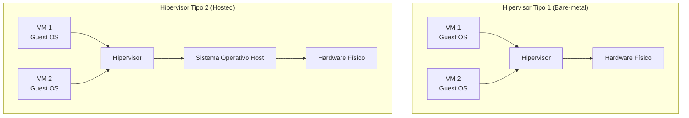
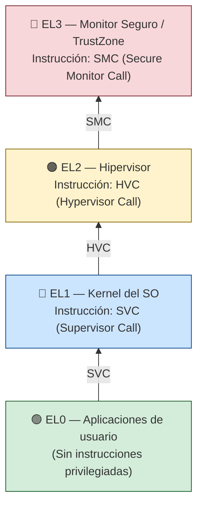
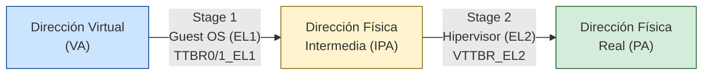
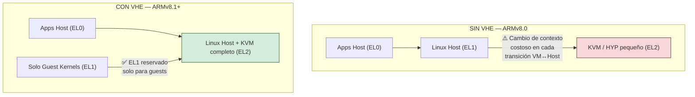
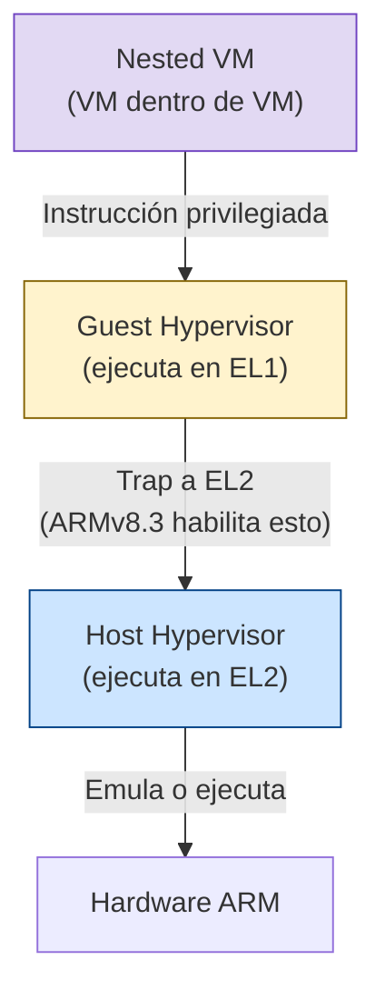
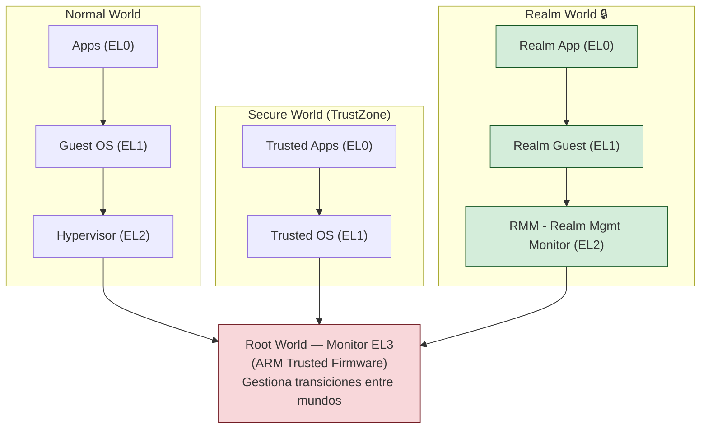
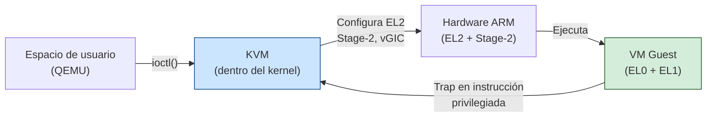
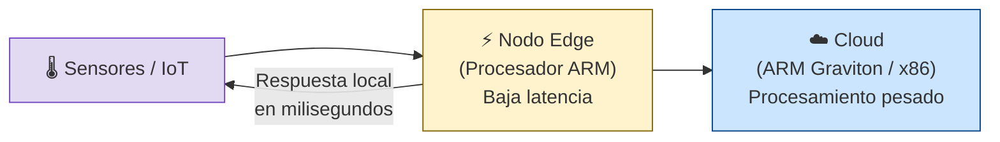
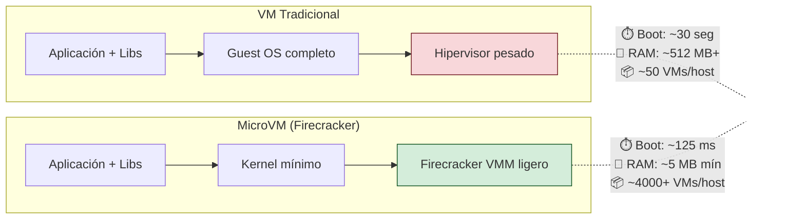
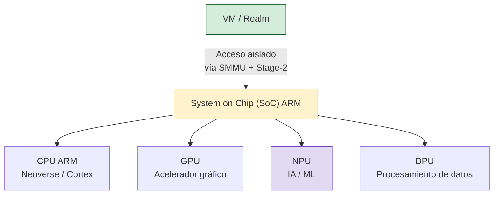

# Virtualización en ARM y Nuevos Modelos de Cómputo

---

> **Instituto Tecnológico de Tijuana**
> 
> **Materia:** Lenguajes de Interfaz  
> **Tema:** Virtualización en ARM y nuevos modelos de cómputo  
> **Nombre:** Stephanie Ariana Medrano Vargas  
> **No. Control:** 23212013  
> **Grupo:** ISC-6C (03:00 pm)  
> **Docente:** M.C. René Solis Reyes  
> **Fecha:** 12/02/2026  
---

## Tabla de Contenidos

1. [Introducción](#1-introducción)
2. [Conceptos base: virtualización y tipos de hipervisores](#2-conceptos-base-virtualización-y-tipos-de-hipervisores)
3. [¿Qué hace especial a la virtualización en ARM?](#3-qué-hace-especial-a-la-virtualización-en-arm)
4. [Extensiones clave de virtualización en ARM](#4-extensiones-clave-de-virtualización-en-arm)
5. [Software real: KVM y Xen en ARM](#5-software-real-kvm-y-xen-en-arm)
6. [ARM en la nube y en el borde](#6-arm-en-la-nube-y-en-el-borde)
7. [Nuevos modelos de cómputo](#7-nuevos-modelos-de-cómputo)
8. [Ejemplo práctico en ensamblador AArch64](#8-ejemplo-práctico-en-ensamblador-aarch64)
9. [Tabla comparativa: virtualización ARM vs x86](#9-tabla-comparativa-virtualización-arm-vs-x86)
10. [Conclusiones](#10-conclusiones)
11. [Referencias](#11-referencias)

---

## 1. Introducción

La virtualización es una tecnología que permite crear entornos de ejecución aislados —máquinas virtuales o "VMs"— sobre un mismo hardware físico, con el objetivo de mejorar el aprovechamiento de recursos, facilitar despliegues y aumentar la seguridad mediante aislamiento. En lugar de dedicar una máquina física por cada servicio, se consolidan múltiples sistemas operativos y aplicaciones en un mismo equipo, administrados por una capa de software llamada **hipervisor** (IBM, s.f.).

Según Amazon Web Services (s.f.), la virtualización es una tecnología que permite crear representaciones virtuales de servidores, almacenamiento, redes y otras máquinas físicas, potenciando los servicios de computación en la nube que ayudan a las organizaciones a administrar la infraestructura de manera más eficaz.

En arquitecturas ARM (especialmente ARMv8-A y ARMv9), la virtualización se ha convertido en una pieza clave porque ARM ya no solo vive en dispositivos móviles: también domina escenarios de **cloud computing, edge computing, IoT industrial y sistemas embebidos críticos**. Esto exige aislamiento fuerte, eficiencia energética y soporte de múltiples cargas de trabajo (Linux, Android, RTOS, contenedores, microVMs, entre otros).

Además, están surgiendo nuevos modelos de cómputo donde la unidad de despliegue puede ser más pequeña que una VM tradicional (por ejemplo, WebAssembly) o más rápida de iniciar (microVMs), y donde la seguridad se refuerza con **confidential computing**. Este documento analiza los mecanismos de virtualización integrados en ARM, su evolución mediante extensiones de hardware, y su papel habilitador en los paradigmas de cómputo emergentes.

---

## 2. Conceptos base: virtualización y tipos de hipervisores

La virtualización consiste en abstraer recursos físicos (CPU, memoria, E/S) para presentarlos como recursos virtuales a uno o varios sistemas invitados (*guest*). Esto lo coordina un **hipervisor**, que puede ser de dos tipos (AWS, s.f.; IBM, s.f.):

**Hipervisor Tipo 1 (bare-metal):** Se ejecuta directamente sobre el hardware físico. Ofrece el mejor rendimiento porque interactúa directamente con los recursos. Ejemplos: Xen, KVM, Microsoft Hyper-V.

**Hipervisor Tipo 2 (hosted):** Se ejecuta como una aplicación dentro de un sistema operativo host. Es más fácil de configurar, pero agrega una capa adicional de abstracción. Ejemplos: VirtualBox, VMware Workstation.



En Linux, el enfoque más utilizado es **KVM (Kernel-based Virtual Machine)**, que integra capacidades de hipervisor dentro del propio kernel Linux y se controla desde espacio de usuario mediante APIs e IOCTLs (kernel.org, s.f.).

---

## 3. ¿Qué hace especial a la virtualización en ARM?

### 3.1 Niveles de Excepción (Exception Levels) y el rol de EL2

A diferencia de x86, que utiliza modos root/non-root (VMX) para la virtualización, ARM introduce el concepto de **Exception Levels (EL)** como modelo jerárquico de privilegios. En ARMv8-A AArch64 existen cuatro niveles (Arm Developer, s.f.; openEuler, 2020):



La virtualización en ARM se apoya fundamentalmente en **EL2**, donde el hipervisor controla qué operaciones del guest se ejecutan directamente y cuáles deben "trapear" al hipervisor para emulación o control. Cuando una VM ejecuta una instrucción privilegiada que debe ser interceptada, el procesador genera una **excepción síncrona** que transfiere el control de EL1 a EL2 (openEuler, 2020).

Las tres instrucciones de llamada entre niveles son:

| Instrucción | Transición | Propósito |
|---|---|---|
| `SVC` | EL0 → EL1 | System call (equivalente a `syscall` en x86) |
| `HVC` | EL1 → EL2 | Hypercall (solicitar servicios al hipervisor) |
| `SMC` | EL1/EL2 → EL3 | Secure Monitor Call (acceso a firmware seguro) |

### 3.2 Traducción de memoria en dos etapas (Stage-2)

Uno de los pilares de la virtualización moderna es el control de memoria. ARM utiliza una **traducción de direcciones en dos etapas** para aislar cada VM (Arm Developer, s.f.):



Este esquema es comparable a las Extended Page Tables (EPT) de Intel o las Nested Page Tables (NPT) de AMD. El guest "cree" que tiene acceso a cierta dirección física, pero Stage-2 puede bloquearla o remapearla, garantizando aislamiento total entre VMs.

Cada VM recibe un **VMID (Virtual Machine Identifier)** que etiqueta las entradas del TLB, permitiendo que traducciones de múltiples VMs coexistan en la caché sin colisiones (Arm Developer, s.f.).

### 3.3 Virtualización de interrupciones (GIC)

No basta con virtualizar CPU y memoria: también hay que virtualizar interrupciones. ARM usa el **Generic Interrupt Controller (GIC)** con extensiones para reducir las salidas del guest (*VM exits*) al manejar IRQs, mejorando el rendimiento. En Linux/KVM se implementa el controlador virtual (**vGIC**) para presentar interrupciones virtuales al guest, incluyendo vIRQs, vFIQs y vSErrors (Arm Developer, s.f.).

---

## 4. Extensiones clave de virtualización en ARM

### 4.1 Virtualization Host Extensions (VHE) – ARMv8.1-A

En ARMv8.0, EL2 fue diseñado para hipervisores Tipo 1 ligeros (como Xen). Sin embargo, hipervisores de Tipo 2 como **KVM** se ejecutan dentro del kernel Linux en EL1, lo que causaba una sobrecarga significativa en cada transición VM↔hipervisor, al requerir cambio completo de contexto entre EL1 y EL2.

Las **Virtualization Host Extensions (VHE)**, introducidas en ARMv8.1-A, resuelven este problema permitiendo que el kernel del host se ejecute directamente en EL2 (Arm Community, 2014; Dall et al., 2017):



Con VHE, se activan dos bits en el registro `HCR_EL2`:

- **`E2H = 1`**: Redirige accesos a registros de EL1 hacia sus equivalentes de EL2 en hardware.
- **`TGE = 1`**: Redirige excepciones de EL0 directamente a EL2.

Las mediciones demuestran que VHE reduce la sobrecarga de virtualización de KVM en ARM a niveles comparables con KVM en x86, especialmente en cargas intensivas en I/O (Dall et al., 2017).

### 4.2 Virtualización Anidada – ARMv8.3-A

ARMv8.3-A introduce soporte para **virtualización anidada**: ejecutar un hipervisor dentro de una VM. Sin este soporte, las instrucciones de hipervisor ejecutadas en EL1 causaban excepciones fatales en lugar de traps hacia EL2.

El proyecto **NEVE** (Nested Virtualization Extensions) demostró que, sin optimización, la virtualización anidada en ARM puede ser hasta 155x más lenta que una VM simple, pero con sus técnicas de reducción de traps se logran sobrecargas aceptables (Mi et al., 2017).



### 4.3 ARM Confidential Compute Architecture (CCA) – ARMv9-A

La **Realm Management Extension (RME)** de ARMv9-A extiende el modelo de seguridad de dos mundos (Normal + Secure/TrustZone) a **cuatro mundos** (Arm, s.f.; Linux Kernel Documentation, s.f.):



Los **Realms** protegen el código y los datos de una VM incluso del hipervisor que la administra. El hipervisor conserva la capacidad de gestionar recursos (CPU, memoria), pero no puede leer ni modificar el contenido del Realm. Esto se implementa mediante:

- **Realm Management Monitor (RMM):** Firmware en Realm world que gestiona el ciclo de vida de los Realms.
- **Granule Protection Tables (GPT):** Tablas en Root world que determinan a qué mundo pertenece cada página de memoria.
- **Attestation remota:** Tokens criptográficos firmados que permiten verificar la integridad del Realm y la plataforma.

---

## 5. Software real: KVM y Xen en ARM

### 5.1 KVM en ARM

**KVM** es la solución de virtualización integrada al kernel Linux. Expone una API basada en `ioctl()` para crear VMs, vCPUs, asignar memoria virtual y configurar dispositivos virtuales, con control desde espacio de usuario a través de **QEMU** (kernel.org, s.f.).

En ARM/arm64, KVM aprovecha EL2 para interceptar operaciones privilegiadas del guest. Con VHE, el kernel Linux completo (incluyendo KVM) opera en EL2, dejando EL1 exclusivamente para los guests. Esto simplifica enormemente la arquitectura y mejora el rendimiento.



### 5.2 Xen en ARM

**Xen** es un hipervisor Tipo 1 ampliamente utilizado en la industria (incluyendo embebidos y automotriz) por su enfoque en aislamiento estricto y diseño de dominios (Dom0/DomU). En ARM, Xen aprovecha las extensiones de virtualización del hardware desde ARMv7-A y ARMv8-A. Su diseño permite transiciones VM→hipervisor más rápidas que KVM en ARMv8.0 (sin VHE), aunque KVM con VHE cierra esta brecha significativamente (Xen Project, s.f.; Dall et al., 2017).

---

## 6. ARM en la nube y en el borde

### 6.1 Cloud sobre ARM

ARM se ha consolidado en centros de datos con procesadores diseñados para eficiencia y relación costo/rendimiento. **AWS Graviton** (basado en ARM Neoverse) ofrece instancias EC2 con hasta un 40% mejor relación precio-rendimiento que las equivalentes x86 (AWS, s.f.). Otros procesadores como **Ampere Altra**, **NVIDIA Grace** y **Huawei Kunpeng** compiten directamente en el mercado de servidores.

Según Google Cloud (s.f.), las instancias ARM en la nube permiten ejecutar cargas de trabajo con arquitectura nativa Arm64, ofreciendo ventajas en eficiencia energética y costos operativos para aplicaciones containerizadas y nativas en la nube.

### 6.2 Edge Computing

En **edge computing**, se procesan datos cerca de donde se generan (sensores, gateways, redes 5G) para reducir latencia y ancho de banda. Según Computer Weekly (2026), entre las tendencias clave para 2026 y más allá están la inferencia de IA en el borde, la convergencia IT/OT, y el uso de procesadores ARM por su bajo consumo para nodos de edge distribuidos.



ARM es la arquitectura dominante en estos nodos, donde se ejecutan contenedores y microservicios con aislamiento mediante virtualización ligera. Aplicaciones típicas incluyen ciudades inteligentes, manufactura industrial predictiva, vehículos autónomos y agricultura de precisión (IBM Developer, 2025).

---

## 7. Nuevos modelos de cómputo

Más allá de la VM clásica, la industria está migrando hacia unidades de cómputo más pequeñas, rápidas, portables y seguras (Computing.es, 2024):

### 7.1 MicroVMs y Serverless

**Firecracker** (open source, creado por AWS) fue diseñado para cargas serverless y multi-tenant: ofrece aislamiento de VM pero con arranques del orden de **~125 milisegundos** y la capacidad de ejecutar miles de microVMs en un solo host (AWS, 2018).



### 7.2 WebAssembly (Wasm)

WebAssembly propone un entorno de ejecución **memory-safe** y **sandboxed**, donde módulos no obtienen acceso al sistema a menos que se les otorgue explícitamente (*capabilities*). Wasm no reemplaza la virtualización tradicional, pero se está volviendo un modelo alterno para ejecutar componentes pequeños con aislamiento fuerte y portabilidad, incluyendo ARM (WebAssembly.org, s.f.).

### 7.3 Confidential Computing con ARM CCA

Como se describió en la sección 4.3, ARM CCA/RME/Realms representa el futuro de la computación confidencial: proteger datos incluso frente a un host comprometido. Esto es especialmente relevante para la **protección de modelos de IA** y datos sensibles en centros de datos de terceros (Arm, 2023).

### 7.4 Cómputo heterogéneo: CPU + aceleradores

La tendencia actual integra múltiples tipos de procesadores (CPU ARM, GPU, NPU, DPU) en un mismo SoC o interconectados mediante **chiplets**. ARM permite que VMs, Realms y aplicaciones utilicen aceleradores sin romper el aislamiento. Los diseños de referencia ARM Helios y Atlas (2025) se enfocan en escalabilidad de interconexión para escenarios de IA en edge y datacenter (Arm, 2024).



---

## 8. Ejemplo práctico en ensamblador AArch64

El siguiente fragmento de ensamblador ARMv8 (AArch64) muestra cómo el kernel Linux verifica la presencia de VHE durante el arranque y configura `HCR_EL2` para activarla. Este código es representativo de cómo la arquitectura se configura a nivel de instrucciones:

```asm
// ============================================================
// Verificación y activación de VHE en el arranque del kernel
// Basado en el código de arch/arm64/kernel/head.S (Linux)
// ============================================================

    // Leer el registro de features de memoria (MMU Features Register 1)
    mrs     x2, id_aa64mmfr1_el1    // Move from System Register
    
    // Extraer campo VH (bits [11:8]) que indica soporte VHE
    ubfx    x2, x2, #8, #4          // Unsigned Bit Field Extract
    
    // Si VH == 0, no hay soporte VHE → saltar
    cbz     x2, sin_vhe             // Compare and Branch if Zero

// --- Ruta CON soporte VHE ---
con_vhe:
    mov     x0, #(1 << 31)          // HCR_RW: EL1 en modo AArch64
    orr     x0, x0, #(1 << 34)      // HCR_E2H: Habilitar VHE
    orr     x0, x0, #(1 << 27)      // HCR_TGE: Trap excepciones EL0→EL2
    msr     hcr_el2, x0             // Move to System Register (EL2)
    isb                              // Instruction Sync Barrier
    b       continuar_boot           // Branch incondicional

// --- Ruta SIN soporte VHE ---
sin_vhe:
    mov     x0, #(1 << 31)          // Solo HCR_RW (64-bit EL1)
    msr     hcr_el2, x0             // Escribir configuración básica
    isb                              // Sincronizar pipeline

continuar_boot:
    // El kernel continúa su inicialización...
```

### Instrucciones clave utilizadas

| Instrucción | Descripción |
|---|---|
| `mrs Xd, <sysreg>` | Lee un registro del sistema hacia un registro general |
| `ubfx Xd, Xn, #lsb, #width` | Extrae un campo de bits sin signo |
| `cbz Xn, label` | Salta a `label` si `Xn` es cero |
| `orr Xd, Xn, #imm` | OR lógico: combina flags de configuración |
| `msr <sysreg>, Xn` | Escribe un registro general hacia un registro del sistema |
| `isb` | Barrera de sincronización de instrucciones |

---

## 9. Tabla comparativa: virtualización ARM vs x86

| Característica | ARM (ARMv8/v9) | x86 (Intel VT-x / AMD-V) |
|---|---|---|
| **Modelo de privilegios** | Exception Levels (EL0–EL3) | Ring 0-3 + Root/Non-root mode |
| **Estructura de contexto** | Sin estructura hardware; el hipervisor decide qué guardar/restaurar | VMCS (Intel) / VMCB (AMD) en memoria |
| **Transición VM↔Hyp** | Trap a EL2 (ligera con VHE) | VM-Exit / VM-Entry (costoso) |
| **Traducción de memoria** | Stage-1 + Stage-2 (VA → IPA → PA) | EPT (Intel) / NPT (AMD) |
| **Extensión para host** | VHE (ARMv8.1) | No necesaria (diseño diferente) |
| **Virtualización anidada** | ARMv8.3 + NEVE | Soporte nativo en VMX/SVM |
| **Computación confidencial** | CCA / Realms (ARMv9) | Intel TDX / AMD SEV-SNP |
| **Eficiencia energética** | Alta (diseño RISC, bajo consumo) | Menor (diseño CISC, mayor consumo) |
| **Ecosistema cloud** | AWS Graviton, Ampere, NVIDIA Grace | Intel Xeon, AMD EPYC |

---

## 10. Conclusiones

La virtualización en ARM ha evolucionado desde un soporte básico en ARMv8.0 hasta un ecosistema maduro que incluye hipervisores tipo 2 eficientes (VHE en ARMv8.1), virtualización anidada (ARMv8.3), y computación confidencial con aislamiento criptográfico (CCA/Realms en ARMv9). Estas extensiones posicionan a ARM como una alternativa competitiva frente a x86 en centros de datos y plataformas cloud.

En software, **KVM y Xen** son los pilares del ecosistema ARM para virtualización en Linux, habilitando desde laboratorios de desarrollo hasta despliegues industriales a gran escala. La adopción masiva en servicios como AWS Graviton demuestra que ARM en la nube es una realidad consolidada.

Los nuevos modelos de cómputo — microVMs (serverless con Firecracker), WebAssembly (sandboxes portables), confidential computing (ARM CCA) y cómputo heterogéneo (CPU+GPU+NPU) — encuentran en ARM una base natural por su eficiencia energética, flexibilidad arquitectónica y soporte robusto de virtualización.

La dirección general es clara: ejecutar más cargas, en más lugares (cloud + edge), con mejores garantías de aislamiento y menor costo, manteniendo ARM como plataforma dominante de la próxima generación de infraestructura computacional.

---

## 11. Referencias

1. Amazon Web Services. (s.f.). *¿Qué es la virtualización?* AWS. https://aws.amazon.com/es/what-is/virtualization/

2. Amazon Web Services. (2018, 26 noviembre). *Firecracker – Lightweight Virtualization for Serverless Computing.* AWS Blog. https://aws.amazon.com/blogs/aws/firecracker-lightweight-virtualization-for-serverless-computing/

3. Amazon Web Services. (s.f.). *AWS Graviton Processors.* AWS. https://aws.amazon.com/ec2/graviton/

4. Arm. (s.f.). *Arm Confidential Compute Architecture.* Arm Developer. https://www.arm.com/architecture/security-features/arm-confidential-compute-architecture

5. Arm. (s.f.). *Armv8-A Virtualization (Learn the Architecture).* Arm Developer. https://developer.arm.com/documentation/102142/0100

6. Arm. (s.f.). *Stage 2 Translation (Learn the Architecture).* Arm Developer. https://developer.arm.com/documentation/101811/latest

7. Arm. (2023, 28 abril). *Arm and Confidential Computing.* Arm Community Blog. https://community.arm.com/

8. Arm. (2024, 1 octubre). *Arm A-profile Architecture Developments 2024.* Arm Community Blog. https://community.arm.com/

9. Arm Community. (2014, 2 diciembre). *The ARMv8-A Architecture and its Ongoing Development.* Arm Developer. https://developer.arm.com/community/arm-community-blogs/

10. Computer Weekly. (2026). *10 tendencias de cómputo de borde a tomar en cuenta en 2026 y a futuro.* https://www.computerweekly.com/es/cronica/10-tendencias-de-computo-de-borde-a-tomar-en-cuenta-en-2026-y-a-futuro

11. Computing.es. (2024, 17 abril). *¿Cuáles son los nuevos modelos de computación?* Computing España. https://www.computing.es/analytics/cuales-son-los-nuevos-modelos-de-computacion/

12. Dall, C., Li, S.-W., Lim, J. T., Nieh, J. & Koloventzos, G. (2017). ARM Virtualization: Performance and Architectural Implications. *ISCA '17.* https://par.nsf.gov/servlets/purl/10310788

13. Google Cloud. (s.f.). *Instancias de ARM en Compute Engine.* https://docs.cloud.google.com/compute/docs/instances/arm-on-compute?hl=es

14. IBM. (s.f.). *¿Qué es una máquina virtual (VM)?* IBM Think. https://www.ibm.com/mx-es/think/topics/virtual-machines

15. IBM Developer. (2025, 27 marzo). *Edge Computing Architecture and Use Cases.* https://developer.ibm.com/

16. Kernel.org. (s.f.). *The Definitive KVM API.* Linux Kernel Documentation. https://docs.kernel.org/virt/kvm/api.html

17. Linux Kernel Documentation. (s.f.). *Arm Confidential Compute Architecture.* https://docs.kernel.org/arch/arm64/arm-cca.html

18. Mi, Z., Li, D., Yang, Z., Wang, X. & Chen, H. (2017). NEVE: Nested Virtualization Extensions for ARM. *SOSP '17.* https://www.cs.columbia.edu/~nieh/pubs/sosp2017_neve.pdf

19. openEuler Community. (2020). *Introduction to the ARMv8 Virtualization System.* https://www.openeuler.org/en/blog/yorifang/2020-10-24-arm-virtualization-overview.html

20. Oracle. (s.f.). *Tecnologías de virtualización.* Oracle Documentation. https://docs.oracle.com/cd/E56339_01/html/E54000/virttechnologies.html

21. Valebyte. (2025, 17 marzo). *¿Virtualización en ARM? ¿Es posible ejecutar máquinas virtuales?* Valebyte Blog. https://valebyte.com/blog/es/virtualizacion-en-arm-es-posible-ejecutar-maquinas-virtuales/

22. WebAssembly. (s.f.). *WebAssembly: Safe, sandboxed execution environment.* https://webassembly.org/

23. Xen Project. (s.f.). *Xen ARM with Virtualization Extensions.* Xen Wiki. https://wiki.xenproject.org/wiki/Xen_ARM_with_Virtualization_Extensions

---

> **Declaración de uso de IA:**  
> Este documento fue elaborado como investigación documental para la materia de Lenguajes de Interfaz. Se utilizó inteligencia artificial (Claude, Anthropic) como herramienta de apoyo para la recopilación y estructuración inicial de información. Posteriormente, el alumno revisó, modificó y ajustó el contenido del documento para asegurar la coherencia, relevancia y calidad de la investigación presentada. La selección de fuentes, la verificación de datos y la redacción final son responsabilidad de la estudiante. Este uso se declara conforme a la guía `AI_GUIDANCE.md` del repositorio del curso.

---

### Prompt utilizado

> Te comparto lo que me pide el documento, de igual forma te comparto una investigación que realicé. Puedes mezclar ambas, hacerlo más acorde a lo que pide el profe (diagramas y fotos entre ellos, en formato markdown) y las referencias preferiría que fueran tomadas de páginas de tecnologia, te dejo algunas de las páginas que estoy utilizanod.
>
> Para los diagramas puedes usar: `mermaid`. De nuevo, asegúrate que la info sea acorde al tema: **Virtualización en ARM y Nuevos Modelos de Cómputo**.
