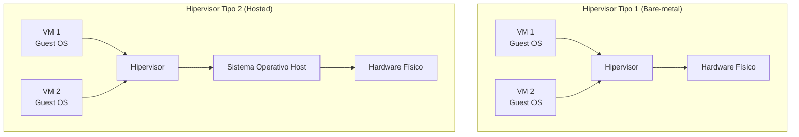
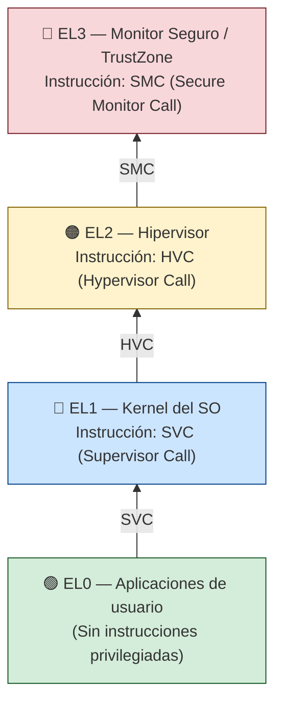
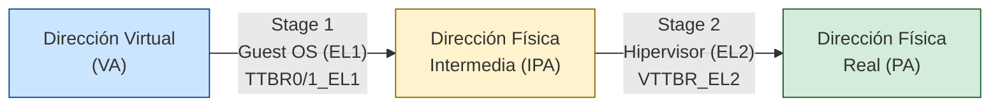
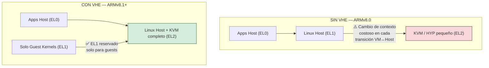
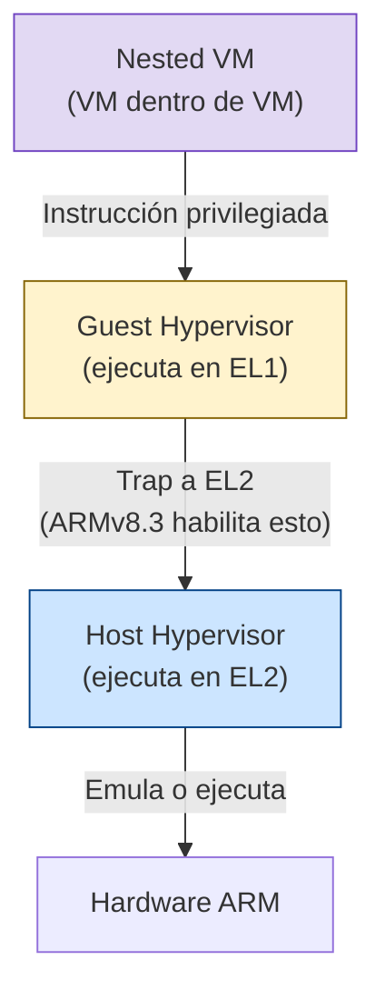
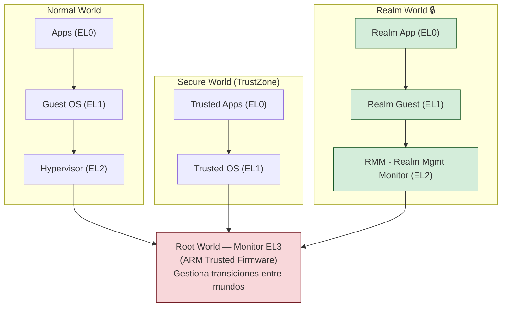
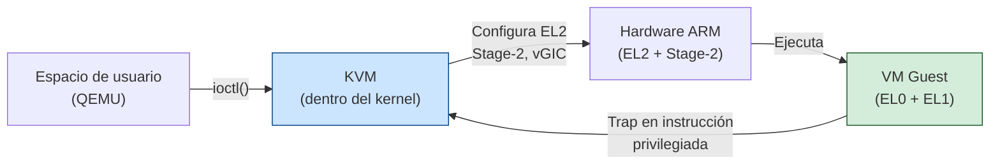
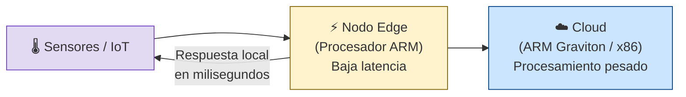
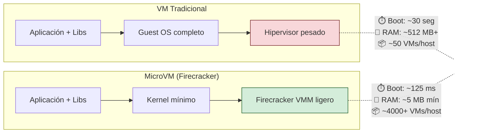
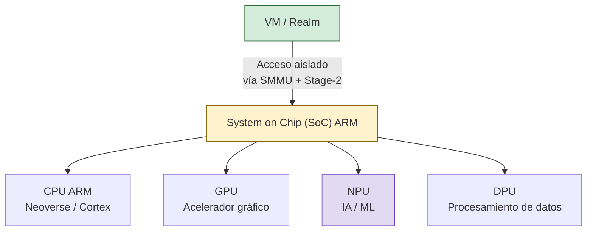

# Virtualización en ARM y Nuevos Modelos de Cómputo

---

> **Materia:** Lenguajes de Interfaz  
> **Tema:** Virtualización en ARM y nuevos modelos de cómputo  
> **Nombre:** Stephanie Ariana Medrano Vargas  
> **No. Control:** 23212013  
> **Grupo:** ISC-6C  
> **Docente:** M.C. René Solis Reyes  
> **Fecha:** 17/02/2026  
> **Instituto Tecnológico de Tijuana**

---

## Tabla de Contenidos

1. [Introducción](#1-introducción)
2. [Conceptos base: virtualización y tipos de hipervisores](#2-conceptos-base-virtualización-y-tipos-de-hipervisores)
3. [¿Qué hace especial a la virtualización en ARM?](#3-qué-hace-especial-a-la-virtualización-en-arm)
4. [Extensiones clave de virtualización en ARM](#4-extensiones-clave-de-virtualización-en-arm)
5. [Software real: KVM y Xen en ARM](#5-software-real-kvm-y-xen-en-arm)
6. [ARM en la nube y en el borde](#6-arm-en-la-nube-y-en-el-borde)
7. [Nuevos modelos de cómputo](#7-nuevos-modelos-de-cómputo)
8. [Ejemplo práctico en ensamblador AArch64](#8-ejemplo-práctico-en-ensamblador-aarch64)
9. [Tabla comparativa: virtualización ARM vs x86](#9-tabla-comparativa-virtualización-arm-vs-x86)
10. [Conclusiones](#10-conclusiones)
11. [Referencias](#11-referencias)

---

## 1. Introducción

Cuando pensamos en virtualización, lo primero que viene a la mente son las máquinas virtuales para probar sistemas operativos o los servidores en la nube. Básicamente, se trata de que un **hipervisor** reparta los recursos de una sola máquina física entre varios sistemas que conviven aislados entre sí (IBM, s.f.; AWS, s.f.).

Lo interesante es que ARM ya no es solo "el procesador del celular". Hoy, arquitecturas como ARMv8-A y ARMv9 están en centros de datos, dispositivos de edge computing y hasta vehículos autónomos, así que la virtualización en ARM tiene que ser eficiente, segura y capaz de correr desde Linux hasta microVMs.

Aparte de eso, están apareciendo modelos de cómputo que van más allá de la VM clásica: microVMs que arrancan en milisegundos, WebAssembly como sandbox ultraligero, y **confidential computing** que protege datos incluso del propio hipervisor. En este documento se analiza cómo ARM maneja todo esto a nivel de hardware y por qué resulta clave en estos nuevos paradigmas.

---

## 2. Conceptos base: virtualización y tipos de hipervisores

La virtualización, en términos simples, consiste en tomar los recursos físicos de una máquina (CPU, memoria, E/S) y repartirlos entre varios sistemas operativos que corren al mismo tiempo sin enterarse unos de otros. El encargado de hacer esto posible es el **hipervisor**, y existen dos tipos principales (AWS, s.f.; IBM, s.f.):

**Hipervisor Tipo 1 (bare-metal):** Va directo sobre el hardware, sin un sistema operativo de por medio. Esto le da mejor rendimiento porque no hay capas extra. Ejemplos conocidos: Xen, KVM, Microsoft Hyper-V.

**Hipervisor Tipo 2 (hosted):** Corre como una aplicación más dentro de un sistema operativo. Es más fácil de instalar y usar, pero al tener esa capa adicional, pierde algo de rendimiento. Ejemplos: VirtualBox, VMware Workstation.


```mermaid
graph TD
    subgraph "Hipervisor Tipo 1 (Bare-metal)"
        A1["VM 1<br/>Guest OS"] --> H1["Hipervisor"]
        A2["VM 2<br/>Guest OS"] --> H1
        H1 --> HW1["Hardware Físico"]
    end

    subgraph "Hipervisor Tipo 2 (Hosted)"
        B1["VM 1<br/>Guest OS"] --> H2["Hipervisor"]
        B2["VM 2<br/>Guest OS"] --> H2
        H2 --> OS2["Sistema Operativo Host"]
        OS2 --> HW2["Hardware Físico"]
    end
```

En el mundo Linux, la opción más popular es **KVM (Kernel-based Virtual Machine)**, que básicamente convierte al propio kernel en un hipervisor. Se controla desde espacio de usuario con herramientas como QEMU, usando llamadas `ioctl()` (kernel.org, s.f.).

---

## 3. ¿Qué hace especial a la virtualización en ARM?

### 3.1 Niveles de Excepción (Exception Levels) y el rol de EL2

Mientras que x86 maneja la virtualización con modos root/non-root (VMX), ARM tiene su propio enfoque: los **Exception Levels (EL)**, que funcionan como una jerarquía de privilegios. En ARMv8-A AArch64 hay cuatro niveles, y cada uno tiene un rol bien definido (Arm Developer, s.f.; openEuler, 2020):


```mermaid
graph BT
    EL0["🟢 EL0 — Aplicaciones de usuario<br/>(Sin instrucciones privilegiadas)"]
    EL1["🔵 EL1 — Kernel del SO<br/>Instrucción: SVC (Supervisor Call)"]
    EL2["🟠 EL2 — Hipervisor<br/>Instrucción: HVC (Hypervisor Call)"]
    EL3["🔴 EL3 — Monitor Seguro / TrustZone<br/>Instrucción: SMC (Secure Monitor Call)"]

    EL0 -->|"SVC"| EL1
    EL1 -->|"HVC"| EL2
    EL2 -->|"SMC"| EL3

    style EL0 fill:#d4edda,stroke:#155724
    style EL1 fill:#cce5ff,stroke:#004085
    style EL2 fill:#fff3cd,stroke:#856404
    style EL3 fill:#f8d7da,stroke:#721c24
```

El nivel clave para virtualización es **EL2**: ahí es donde vive el hipervisor y desde donde se decide qué instrucciones del guest se ejecutan directo en hardware y cuáles necesitan ser interceptadas. Cuando una VM intenta hacer algo privilegiado que no le corresponde, el procesador genera una excepción y le pasa el control al hipervisor en EL2 (openEuler, 2020).

Las instrucciones para moverse entre niveles son estas:

| Instrucción | Transición | Propósito |
|---|---|---|
| `SVC` | EL0 → EL1 | System call (equivalente a `syscall` en x86) |
| `HVC` | EL1 → EL2 | Hypercall (solicitar servicios al hipervisor) |
| `SMC` | EL1/EL2 → EL3 | Secure Monitor Call (acceso a firmware seguro) |

### 3.2 Traducción de memoria en dos etapas (Stage-2)

Otro pilar fundamental es el manejo de memoria. Para que cada VM esté realmente aislada, ARM usa una **traducción de direcciones en dos etapas** (Arm Developer, s.f.):


```mermaid
flowchart LR
    VA["Dirección Virtual<br/>(VA)"]
    IPA["Dirección Física<br/>Intermedia (IPA)"]
    PA["Dirección Física<br/>Real (PA)"]

    VA -->|"Stage 1<br/>Guest OS (EL1)<br/>TTBR0/1_EL1"| IPA
    IPA -->|"Stage 2<br/>Hipervisor (EL2)<br/>VTTBR_EL2"| PA

    style VA fill:#cce5ff,stroke:#004085
    style IPA fill:#fff3cd,stroke:#856404
    style PA fill:#d4edda,stroke:#155724
```

¿Qué significa esto en la práctica? El guest hace su propia traducción de direcciones virtuales a "físicas", pero esas direcciones "físicas" en realidad son intermedias (IPA). Después, el hipervisor en EL2 aplica otra traducción para llegar a la dirección física real. Así, aunque el guest crea que tiene acceso a cierta memoria, Stage-2 puede bloquearla o redirigirla. Es un mecanismo comparable a las Extended Page Tables (EPT) de Intel o las Nested Page Tables (NPT) de AMD.

Para evitar conflictos, cada VM recibe un **VMID (Virtual Machine Identifier)** que etiqueta las entradas del TLB, lo que permite que traducciones de varias VMs convivan en la caché sin pisarse unas a otras (Arm Developer, s.f.).

### 3.3 Virtualización de interrupciones (GIC)

No basta con virtualizar CPU y memoria, también hay que encargarse de las interrupciones. ARM utiliza el **Generic Interrupt Controller (GIC)**, que tiene extensiones para reducir la cantidad de veces que el guest tiene que "salir" hacia el hipervisor al manejar IRQs. En Linux/KVM se implementa un controlador virtual llamado **vGIC** que presenta interrupciones virtuales al guest (vIRQs, vFIQs y vSErrors), lo cual mejora bastante el rendimiento (Arm Developer, s.f.).

---

## 4. Extensiones clave de virtualización en ARM

### 4.1 Virtualization Host Extensions (VHE) – ARMv8.1-A

En la primera versión de ARMv8.0, EL2 estaba pensado para hipervisores Tipo 1 pequeños como Xen. El problema surgió con hipervisores Tipo 2 como **KVM**, que corren dentro del kernel Linux en EL1: cada vez que había una transición entre la VM y el hipervisor, tocaba hacer un cambio completo de contexto entre EL1 y EL2, lo cual era bastante costoso.

Las **Virtualization Host Extensions (VHE)**, que llegaron con ARMv8.1-A, resuelven esto de una forma elegante: permiten que el kernel del host corra directamente en EL2 (Arm Community, 2014; Dall et al., 2017):


```mermaid
graph TD
    subgraph "SIN VHE — ARMv8.0"
        S_EL0A["Apps Host (EL0)"]
        S_EL1["Linux Host (EL1)"]
        S_EL2["KVM / HYP pequeño (EL2)"]
        S_EL0A --> S_EL1
        S_EL1 -->|"⚠️ Cambio de contexto<br/>costoso en cada<br/>transición VM↔Host"| S_EL2
    end

    subgraph "CON VHE — ARMv8.1+"
        C_EL0A["Apps Host (EL0)"]
        C_EL1["Solo Guest Kernels (EL1)"]
        C_EL2["Linux Host + KVM completo (EL2)"]
        C_EL0A --> C_EL2
        C_EL1 -->|"✅ EL1 reservado<br/>solo para guests"| C_EL2
    end

    style S_EL2 fill:#f8d7da,stroke:#721c24
    style C_EL2 fill:#d4edda,stroke:#155724
```

Para activar VHE se configuran dos bits en el registro `HCR_EL2`:

- **`E2H = 1`**: Redirige los accesos a registros de EL1 hacia sus equivalentes en EL2 a nivel de hardware.
- **`TGE = 1`**: Redirige las excepciones de EL0 directamente a EL2.

En las mediciones realizadas, VHE logra reducir la sobrecarga de virtualización de KVM en ARM hasta dejarla en niveles comparables con KVM en x86, sobre todo en cargas con mucho I/O (Dall et al., 2017).

### 4.2 Virtualización Anidada – ARMv8.3-A

A veces se necesita correr un hipervisor dentro de una VM (sí, virtualización dentro de virtualización). ARMv8.3-A agregó soporte para esto, porque antes las instrucciones de hipervisor ejecutadas desde EL1 simplemente causaban excepciones fatales en vez de redirigirse a EL2.

El proyecto **NEVE** (Nested Virtualization Extensions) mostró que sin optimización, la virtualización anidada en ARM podía ser hasta 155 veces más lenta que una VM normal. Sin embargo, con técnicas de reducción de traps lograron llevarla a niveles aceptables (Mi et al., 2017).


```mermaid
flowchart TD
    NVM["Nested VM<br/>(VM dentro de VM)"]
    GH["Guest Hypervisor<br/>(ejecuta en EL1)"]
    HH["Host Hypervisor<br/>(ejecuta en EL2)"]
    HW["Hardware ARM"]

    NVM -->|"Instrucción privilegiada"| GH
    GH -->|"Trap a EL2<br/>(ARMv8.3 habilita esto)"| HH
    HH -->|"Emula o ejecuta"| HW

    style NVM fill:#e2d9f3,stroke:#6f42c1
    style GH fill:#fff3cd,stroke:#856404
    style HH fill:#cce5ff,stroke:#004085
```

### 4.3 ARM Confidential Compute Architecture (CCA) – ARMv9-A

Con ARMv9-A llegó un cambio importante en seguridad. La **Realm Management Extension (RME)** amplió el modelo que antes solo tenía dos mundos (Normal y Secure/TrustZone) a **cuatro mundos** completos (Arm, s.f.; Linux Kernel Documentation, s.f.):


```mermaid
graph TD
    subgraph "Normal World"
        NW_EL0["Apps (EL0)"]
        NW_EL1["Guest OS (EL1)"]
        NW_EL2["Hypervisor (EL2)"]
        NW_EL0 --> NW_EL1 --> NW_EL2
    end

    subgraph "Secure World (TrustZone)"
        SW_EL0["Trusted Apps (EL0)"]
        SW_EL1["Trusted OS (EL1)"]
        SW_EL0 --> SW_EL1
    end

    subgraph "Realm World 🔒"
        RW_EL0["Realm App (EL0)"]
        RW_EL1["Realm Guest (EL1)"]
        RW_EL2["RMM - Realm Mgmt Monitor (EL2)"]
        RW_EL0 --> RW_EL1 --> RW_EL2
    end

    ROOT["Root World — Monitor EL3<br/>(ARM Trusted Firmware)<br/>Gestiona transiciones entre mundos"]

    NW_EL2 --> ROOT
    SW_EL1 --> ROOT
    RW_EL2 --> ROOT

    style ROOT fill:#f8d7da,stroke:#721c24
    style RW_EL2 fill:#d4edda,stroke:#155724
    style RW_EL1 fill:#d4edda,stroke:#155724
    style RW_EL0 fill:#d4edda,stroke:#155724
```

Lo interesante de los **Realms** es que protegen el código y los datos de una VM incluso del hipervisor que la administra. El hipervisor sigue pudiendo gestionar recursos como CPU y memoria, pero no puede leer ni modificar lo que hay dentro del Realm. Esto funciona gracias a tres componentes:

- **Realm Management Monitor (RMM):** Un firmware dentro del Realm world que gestiona el ciclo de vida de cada Realm.
- **Granule Protection Tables (GPT):** Tablas controladas desde el Root world que definen a qué mundo pertenece cada página de memoria.
- **Attestation remota:** Tokens criptográficos firmados que sirven para verificar que el Realm y la plataforma no han sido alterados.

---

## 5. Software real: KVM y Xen en ARM

### 5.1 KVM en ARM

**KVM** es la solución de virtualización que viene integrada directamente en el kernel Linux. Funciona exponiendo una API basada en `ioctl()` con la que se pueden crear VMs, asignar vCPUs, configurar memoria y dispositivos virtuales. Desde espacio de usuario, normalmente se controla con **QEMU** (kernel.org, s.f.).

En ARM/arm64, KVM usa EL2 para interceptar las operaciones privilegiadas del guest. Con VHE habilitado, todo el kernel Linux (incluyendo KVM) corre en EL2, y EL1 queda exclusivamente para los guests. Esto simplifica bastante la arquitectura y se nota en el rendimiento.


```mermaid
flowchart LR
    USER["Espacio de usuario<br/>(QEMU)"] -->|"ioctl()"| KVM["KVM<br/>(dentro del kernel)"]
    KVM -->|"Configura EL2<br/>Stage-2, vGIC"| HW["Hardware ARM<br/>(EL2 + Stage-2)"]
    HW -->|"Ejecuta"| VM["VM Guest<br/>(EL0 + EL1)"]
    VM -->|"Trap en instrucción<br/>privilegiada"| KVM

    style KVM fill:#cce5ff,stroke:#004085
    style VM fill:#d4edda,stroke:#155724
```

### 5.2 Xen en ARM

**Xen** es un hipervisor Tipo 1 que se usa mucho en la industria, incluyendo sistemas embebidos y automotriz, por su enfoque en aislamiento estricto con dominios (Dom0/DomU). En ARM, aprovecha las extensiones de virtualización del hardware desde ARMv7-A y ARMv8-A. Antes de VHE, Xen tenía ventaja sobre KVM en ARM porque su diseño como hipervisor bare-metal le permitía transiciones más rápidas. Con la llegada de VHE, KVM cerró esa brecha de rendimiento de forma significativa (Xen Project, s.f.; Dall et al., 2017).

---

## 6. ARM en la nube y en el borde

### 6.1 Cloud sobre ARM

ARM ya no es ajeno a los centros de datos. Procesadores como **AWS Graviton** (basado en ARM Neoverse) ofrecen instancias EC2 con hasta un 40% mejor relación precio-rendimiento comparado con las equivalentes en x86 (AWS, s.f.). No son los únicos: **Ampere Altra**, **NVIDIA Grace** y **Huawei Kunpeng** también compiten fuerte en el mercado de servidores.

Google Cloud (s.f.) también ofrece instancias ARM, destacando las ventajas en eficiencia energética y costos operativos, especialmente para aplicaciones containerizadas y nativas en la nube.


*Figura 1. Procesador AWS Graviton4, diseñado por Amazon sobre arquitectura ARM para instancias en la nube (Fuente: Amazon).*

### 6.2 Edge Computing

El **edge computing** consiste en procesar datos lo más cerca posible de donde se generan: sensores, gateways, redes 5G, etc. La idea es reducir la latencia y no depender tanto del ancho de banda hacia la nube. Según Computer Weekly (2026), entre las tendencias clave para 2026 están la inferencia de IA en el borde, la convergencia IT/OT, y el uso de procesadores ARM por su bajo consumo en nodos distribuidos.


```mermaid
flowchart LR
    IOT["🌡️ Sensores / IoT"] --> EDGE["⚡ Nodo Edge<br/>(Procesador ARM)<br/>Baja latencia"]
    EDGE --> CLOUD["☁️ Cloud<br/>(ARM Graviton / x86)<br/>Procesamiento pesado"]
    EDGE -->|"Respuesta local<br/>en milisegundos"| IOT

    style IOT fill:#e2d9f3,stroke:#6f42c1
    style EDGE fill:#fff3cd,stroke:#856404
    style CLOUD fill:#cce5ff,stroke:#004085
```

ARM domina en estos escenarios porque permite correr contenedores y microservicios con aislamiento mediante virtualización ligera, sin el consumo energético de un procesador x86. Las aplicaciones van desde ciudades inteligentes y manufactura predictiva hasta vehículos autónomos y agricultura de precisión (IBM Developer, 2025).

---

## 7. Nuevos modelos de cómputo

La industria ya no se limita a la VM tradicional. Están surgiendo unidades de cómputo más pequeñas, más rápidas de iniciar, más portables y con mejor seguridad (Computing.es, 2024):

### 7.1 MicroVMs y Serverless

**Firecracker** (open source, creado por AWS) nació para resolver un problema específico: dar el aislamiento de una VM pero con la velocidad de un contenedor. El resultado son microVMs que arrancan en **~125 milisegundos**, ocupan apenas unos MB de RAM y permiten correr miles de instancias en un solo servidor (AWS, 2018).


```mermaid
graph LR
    subgraph "VM Tradicional"
        T_APP["Aplicación + Libs"]
        T_OS["Guest OS completo"]
        T_HYP["Hipervisor pesado"]
        T_APP --> T_OS --> T_HYP
    end

    subgraph "MicroVM (Firecracker)"
        F_APP["Aplicación + Libs"]
        F_OS["Kernel mínimo"]
        F_HYP["Firecracker VMM ligero"]
        F_APP --> F_OS --> F_HYP
    end

    T_HYP -.-|"⏱️ Boot: ~30 seg<br/>💾 RAM: ~512 MB+<br/>📦 ~50 VMs/host"| COMP[" "]
    F_HYP -.-|"⏱️ Boot: ~125 ms<br/>💾 RAM: ~5 MB mín<br/>📦 ~4000+ VMs/host"| COMP

    style T_HYP fill:#f8d7da,stroke:#721c24
    style F_HYP fill:#d4edda,stroke:#155724
    style COMP fill:#ffffff,stroke:#ffffff
```

### 7.2 WebAssembly (Wasm)

WebAssembly ofrece un entorno de ejecución **memory-safe** y **sandboxed**: los módulos no tienen acceso al sistema salvo que se les otorgue explícitamente mediante *capabilities*. No viene a reemplazar la virtualización tradicional, pero sí se está posicionando como una alternativa ligera para ejecutar componentes pequeños con aislamiento fuerte y portabilidad entre plataformas, incluyendo ARM (WebAssembly.org, s.f.).

### 7.3 Confidential Computing con ARM CCA

Como se explicó en la sección 4.3, ARM CCA/RME/Realms lleva el concepto de aislamiento un paso más allá: protege los datos incluso si el hipervisor del host está comprometido. Esto resulta especialmente relevante cuando se trabaja con **modelos de IA** o datos sensibles en centros de datos de terceros donde no se tiene control total del host (Arm, 2023).

### 7.4 Cómputo heterogéneo: CPU + aceleradores

Hoy el cómputo ya no es solo CPU. La tendencia es integrar múltiples tipos de procesadores (CPU ARM, GPU, NPU, DPU) en un mismo SoC o conectarlos mediante **chiplets**. ARM permite que las VMs, Realms y aplicaciones accedan a estos aceleradores sin romper el aislamiento. Los diseños de referencia ARM Helios y Atlas (2025) apuntan precisamente a esto: escalabilidad de interconexión para escenarios de IA tanto en edge como en datacenter (Arm, 2024).


*Figura 2. Representación de un System on Chip (SoC) moderno con múltiples componentes integrados (Fuente: Red Seguridad).*


```mermaid
graph TD
    SoC["System on Chip (SoC) ARM"]
    CPU["CPU ARM<br/>Neoverse / Cortex"]
    GPU["GPU<br/>Acelerador gráfico"]
    NPU["NPU<br/>IA / ML"]
    DPU["DPU<br/>Procesamiento de datos"]

    SoC --> CPU
    SoC --> GPU
    SoC --> NPU
    SoC --> DPU

    VM["VM / Realm"] -->|"Acceso aislado<br/>vía SMMU + Stage-2"| SoC

    style SoC fill:#fff3cd,stroke:#856404
    style VM fill:#d4edda,stroke:#155724
    style NPU fill:#e2d9f3,stroke:#6f42c1
```

---

## 8. Ejemplo práctico en ensamblador AArch64

El siguiente fragmento de ensamblador ARMv8 (AArch64) muestra cómo el kernel Linux verifica si el procesador soporta VHE durante el arranque y, de ser así, la activa configurando `HCR_EL2`. Es un buen ejemplo de cómo se interactúa con la arquitectura a nivel de instrucciones:

```asm
// ============================================================
// Verificación y activación de VHE en el arranque del kernel
// Basado en el código de arch/arm64/kernel/head.S (Linux)
// ============================================================

    // Leer el registro de features de memoria (MMU Features Register 1)
    mrs     x2, id_aa64mmfr1_el1    // Move from System Register
    
    // Extraer campo VH (bits [11:8]) que indica soporte VHE
    ubfx    x2, x2, #8, #4          // Unsigned Bit Field Extract
    
    // Si VH == 0, no hay soporte VHE → saltar
    cbz     x2, sin_vhe             // Compare and Branch if Zero

// --- Ruta CON soporte VHE ---
con_vhe:
    mov     x0, #(1 << 31)          // HCR_RW: EL1 en modo AArch64
    orr     x0, x0, #(1 << 34)      // HCR_E2H: Habilitar VHE
    orr     x0, x0, #(1 << 27)      // HCR_TGE: Trap excepciones EL0→EL2
    msr     hcr_el2, x0             // Move to System Register (EL2)
    isb                              // Instruction Sync Barrier
    b       continuar_boot           // Branch incondicional

// --- Ruta SIN soporte VHE ---
sin_vhe:
    mov     x0, #(1 << 31)          // Solo HCR_RW (64-bit EL1)
    msr     hcr_el2, x0             // Escribir configuración básica
    isb                              // Sincronizar pipeline

continuar_boot:
    // El kernel continúa su inicialización...
```

### Instrucciones clave utilizadas

| Instrucción | Descripción |
|---|---|
| `mrs Xd, <sysreg>` | Lee un registro del sistema hacia un registro general |
| `ubfx Xd, Xn, #lsb, #width` | Extrae un campo de bits sin signo |
| `cbz Xn, label` | Salta a `label` si `Xn` es cero |
| `orr Xd, Xn, #imm` | OR lógico: combina flags de configuración |
| `msr <sysreg>, Xn` | Escribe un registro general hacia un registro del sistema |
| `isb` | Barrera de sincronización de instrucciones |

---

## 9. Tabla comparativa: virtualización ARM vs x86

| Característica | ARM (ARMv8/v9) | x86 (Intel VT-x / AMD-V) |
|---|---|---|
| **Modelo de privilegios** | Exception Levels (EL0–EL3) | Ring 0-3 + Root/Non-root mode |
| **Estructura de contexto** | Sin estructura hardware; el hipervisor decide qué guardar/restaurar | VMCS (Intel) / VMCB (AMD) en memoria |
| **Transición VM↔Hyp** | Trap a EL2 (ligera con VHE) | VM-Exit / VM-Entry (costoso) |
| **Traducción de memoria** | Stage-1 + Stage-2 (VA → IPA → PA) | EPT (Intel) / NPT (AMD) |
| **Extensión para host** | VHE (ARMv8.1) | No necesaria (diseño diferente) |
| **Virtualización anidada** | ARMv8.3 + NEVE | Soporte nativo en VMX/SVM |
| **Computación confidencial** | CCA / Realms (ARMv9) | Intel TDX / AMD SEV-SNP |
| **Eficiencia energética** | Alta (diseño RISC, bajo consumo) | Menor (diseño CISC, mayor consumo) |
| **Ecosistema cloud** | AWS Graviton, Ampere, NVIDIA Grace | Intel Xeon, AMD EPYC |

---

## 10. Conclusiones

La virtualización en ARM ha recorrido un camino largo: desde un soporte básico en ARMv8.0 hasta contar con VHE para hipervisores eficientes, virtualización anidada en ARMv8.3, y computación confidencial con CCA/Realms en ARMv9. Ya no se trata de una tecnología exclusiva de x86.

En el lado del software, **KVM y Xen** hacen posible todo esto dentro de Linux, y el éxito de servicios como AWS Graviton demuestra que ARM en la nube es una realidad consolidada, no solo una promesa.

Los nuevos modelos de cómputo también encajan de forma natural con ARM: microVMs como Firecracker que arrancan en milisegundos, WebAssembly como alternativa ligera y portable, y ARM CCA que protege datos incluso frente a un hipervisor comprometido. Todo indica que ARM seguirá expandiéndose tanto en cloud como en edge, permitiendo ejecutar más cargas con mejor aislamiento, menor costo y mayor eficiencia energética.

---

## 11. Referencias

1. Amazon Web Services. (s.f.). *¿Qué es la virtualización?* AWS. https://aws.amazon.com/es/what-is/virtualization/

2. Amazon Web Services. (2018, 26 noviembre). *Firecracker – Lightweight Virtualization for Serverless Computing.* AWS Blog. https://aws.amazon.com/blogs/aws/firecracker-lightweight-virtualization-for-serverless-computing/

3. Amazon Web Services. (s.f.). *AWS Graviton Processors.* AWS. https://aws.amazon.com/ec2/graviton/

4. Arm. (s.f.). *Arm Confidential Compute Architecture.* Arm Developer. https://www.arm.com/architecture/security-features/arm-confidential-compute-architecture

5. Arm. (s.f.). *Armv8-A Virtualization (Learn the Architecture).* Arm Developer. https://developer.arm.com/documentation/102142/0100

6. Arm. (s.f.). *Stage 2 Translation (Learn the Architecture).* Arm Developer. https://developer.arm.com/documentation/101811/latest

7. Arm. (2023, 28 abril). *Arm and Confidential Computing.* Arm Community Blog. https://community.arm.com/

8. Arm. (2024, 1 octubre). *Arm A-profile Architecture Developments 2024.* Arm Community Blog. https://community.arm.com/

9. Arm Community. (2014, 2 diciembre). *The ARMv8-A Architecture and its Ongoing Development.* Arm Developer. https://developer.arm.com/community/arm-community-blogs/

10. Computer Weekly. (2026). *10 tendencias de cómputo de borde a tomar en cuenta en 2026 y a futuro.* https://www.computerweekly.com/es/cronica/10-tendencias-de-computo-de-borde-a-tomar-en-cuenta-en-2026-y-a-futuro

11. Computing.es. (2024, 17 abril). *¿Cuáles son los nuevos modelos de computación?* Computing España. https://www.computing.es/analytics/cuales-son-los-nuevos-modelos-de-computacion/

12. Dall, C., Li, S.-W., Lim, J. T., Nieh, J. & Koloventzos, G. (2017). ARM Virtualization: Performance and Architectural Implications. *ISCA '17.* https://par.nsf.gov/servlets/purl/10310788

13. Google Cloud. (s.f.). *Instancias de ARM en Compute Engine.* https://docs.cloud.google.com/compute/docs/instances/arm-on-compute?hl=es

14. IBM. (s.f.). *¿Qué es una máquina virtual (VM)?* IBM Think. https://www.ibm.com/mx-es/think/topics/virtual-machines

15. IBM Developer. (2025, 27 marzo). *Edge Computing Architecture and Use Cases.* https://developer.ibm.com/

16. Kernel.org. (s.f.). *The Definitive KVM API.* Linux Kernel Documentation. https://docs.kernel.org/virt/kvm/api.html

17. Linux Kernel Documentation. (s.f.). *Arm Confidential Compute Architecture.* https://docs.kernel.org/arch/arm64/arm-cca.html

18. Mi, Z., Li, D., Yang, Z., Wang, X. & Chen, H. (2017). NEVE: Nested Virtualization Extensions for ARM. *SOSP '17.* https://www.cs.columbia.edu/~nieh/pubs/sosp2017_neve.pdf

19. openEuler Community. (2020). *Introduction to the ARMv8 Virtualization System.* https://www.openeuler.org/en/blog/yorifang/2020-10-24-arm-virtualization-overview.html

20. Oracle. (s.f.). *Tecnologías de virtualización.* Oracle Documentation. https://docs.oracle.com/cd/E56339_01/html/E54000/virttechnologies.html

21. Valebyte. (2025, 17 marzo). *¿Virtualización en ARM? ¿Es posible ejecutar máquinas virtuales?* Valebyte Blog. https://valebyte.com/blog/es/virtualizacion-en-arm-es-posible-ejecutar-maquinas-virtuales/

22. WebAssembly. (s.f.). *WebAssembly: Safe, sandboxed execution environment.* https://webassembly.org/

23. Xen Project. (s.f.). *Xen ARM with Virtualization Extensions.* Xen Wiki. https://wiki.xenproject.org/wiki/Xen_ARM_with_Virtualization_Extensions

---

> **Declaración de uso de IA:**  
> Este documento fue elaborado como investigación documental para la materia de Lenguajes de Interfaz. Se utilizó inteligencia artificial (Claude, Anthropic) como herramienta de apoyo para la recopilación y estructuración inicial de información. Posteriormente, la autora revisó, modificó y ajustó el contenido del documento para asegurar la coherencia, relevancia y calidad de la investigación presentada. La selección de fuentes, la verificación de datos y la redacción final son responsabilidad de la estudiante. Este uso se declara conforme a la guía `AI_GUIDANCE.md` del repositorio del curso.

