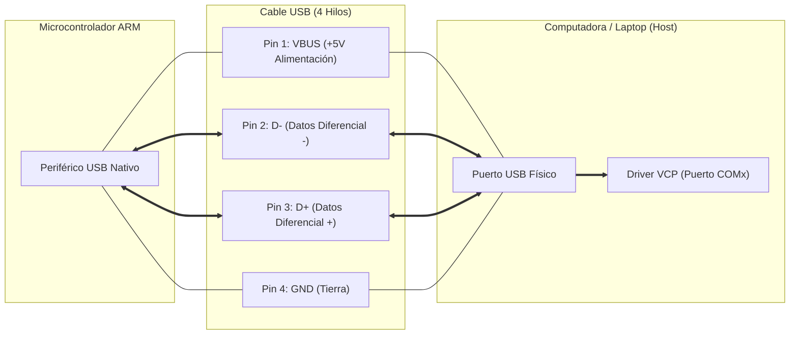

# Comunicación USB CDC (puerto serie virtual) en microcontroladores ARM

## Introducción
En la actualidad, el desarrollo de sistemas embebidos, la transferencia de información entre un microcontrolador y una computadora es necesaria para el monitoreo, la depuración de código y el control de procesos. Naturalmente, esta comunicación se realizaba mediante interfaces serie UART conectadas a circuitos integrados externos (como los chips FT232 o CH340) para convertir la señal al estándar USB de las computadoras actuales.

Sin embargo, los avances en la arquitectura de los microcontroladores ARM han permitido la integración de controladores USB nativos en el propio silicio. La implementación del perfil USB CDC (Communication Device Class) permite que el microcontrolador se programa directamente desde el puerto USB emulando un puerto serie(Virtual COM Port), optimizando costos de diseño, espacio en placa y velocidad de transmisión.

## ¿Qué es un microcontrolador ARM?
Un microcontrolador, según IBM, es esencialmente una computadora pequeña en un solo chip. Está diseñada para realizar diversas funciones, como lectura de sensores, controlar drivers, procesamiento de datos, entre otras, todo esto sin requerir un sistema operativo complejo. 

Los procesadores ARM fueron presentados por primera vez en 1985 por el grupo Acorn, conocidos también como procesadores ARM Risc. Fueron nombrados ARM por Máquina RISC Avanzada, y su popularidad y uso se deben a que sus núcleos se encuentran entre los diseños de procesadores más omnipresentes y con mayor licencia a nivel mundial. 

Por lo tanto, la implementación del procesador ARM en un microcontrolador ha destacado por la gran cantidad de aplicaciones que ofrece por sus capacidades, amplio conjunto de funciones, variedad de integración periférica y sobre todo, un procesamiento de datos eficiente.

## Comunicaciones por USB CDC
El estándar USB (Universal Serial Bus) organiza los dispositivos conectados en "Clases" (Device Classes) según su función técnica (por ejemplo, HID para teclados y ratones, o MSC para almacenamiento masivo). La especificación CDC (Communication Device Class) fue desarrollada originalmente para módems y dispositivos de telecomunicaciones.

Dentro del estándar CDC, la subclase ACM (Abstract Control Model) es la encargada de simular el comportamiento de una línea serie de telecomunicaciones tradicional. A través de este perfil, el sistema operativo de la computadora instala o asigna un controlador de Puerto Serie Virtual (VCP de Virtual COM Port).

## Características del canal físico y lógico
Para entender el funcionamiento de la comunicación USB CDC a nivel interno, se divide el proceso en dos partes: el cableado físico y los canales lógicos por donde viajan los datos.

En la parte física, la comunicación USB nativa únicamente requiere de cuatro hilos en el cable para funcionar. Dos de ellos se encargan de la alimentación (VBUS y GND), mientras que los otros dos (D+ y D-) transportan la información mediante señales diferenciales.

En la parte lógica, el software del microcontrolador organiza la información utilizando canales llamados Endpoints:

- Endpoint 0 (Control): Se utiliza durante la enumeración para identificar el dispositivo y configurar la línea cuando recién conectas el cable.
- Endpoint Interrupt (IN): Envía notificaciones rápidas sobre el estado del dispositivo hacia la computadora.
- Endpoints Bulk (IN y OUT): Son los canales encargados de mover todos los datos pesados en ambas direcciones, es decir, enviar y recibir la información de nuestra aplicación.

Una ventaja importante es la velocidad. A diferencia de un puerto UART tradicional que se queda limitado a velocidades fijas como 115,200 baudios, la transferencia por USB CDC funciona a la velocidad real del bus USB (12 Mbps o  480 Mbps). Por esta razón, no importa qué tasa de baudios selecciones en el programa de la computadora, los datos siempre se van a enviar a la máxima velocidad que aguante el puerto USB.

## Comunicación por USB CDC en microcontroladores ARM
En las familias de microcontroladores ARM Cortex-M (como el RP2040 de Raspberry Pi), la comunicación USB CDC requiere la interacción entre el periférico de hardware nativo y una pila de software (USB Stack).

1. **Código de Aplicación:** El programa ejecuta una instrucción de salida de texto o envío de datos desde el firmware del microcontrolador.
2. **Pila de Software USB:** La librería de software recibe la cadena de datos, la procesa y la empaqueta dentro de los buffers de los Endpoints Bulk.
3. **Periférico USB Nativo:** El controlador USB integrado en el chip ARM toma los paquetes desde la memoria y los convierte en señales eléctricas.
4. **Envío Físico (Pines D+ y D-):** Los datos viajan a través del cable USB usando las líneas de datos diferenciales hasta llegar a la computadora.
5. **Driver VCP en el Sistema Operativo:** El sistema operativo de la computadora recibe las señales y el driver del Puerto Serie Virtual (VCP) las traduce para que parezcan entradas de un puerto COM tradicional.
6. **Terminal:** El programa final en la computadora recibe el texto y lo muestra en pantalla.

Además de este flujo de datos, para que la comunicación pueda establecerse por primera vez, el microcontrolador y la computadora deben realizar un proceso inicial llamado enumeración. En cuanto el cable se conecta al bus USB, la computadora le solicita al microcontrolador sus Descriptores USB, que son pequeñas estructuras de memoria guardadas en el chip ARM con su ID de fabricante, ID de producto y el código de clase 0x02 que corresponde a CDC. Al leer estos datos, el sistema operativo de la computadora reconoce al dispositivo y le asigna el puerto serie virtual.

Finalmente, para garantizar que la información fluya sin interrupciones ni pérdida de bytes durante transmisiones constantes, la pila de software, como por ejemplo TinyUSB, utiliza buffers circulares (Ring Buffers). Esta técnica reserva un espacio en la memoria RAM del microcontrolador que funciona como una bandeja de entrada temporal: el código de la aplicación va depositando allí el texto, mientras que las interrupciones del sistema se encargan de enviarlo en paquetes hacia el periférico USB de forma ordenada, evitando que el microcontrolador se congele o pierda caracteres durante el proceso.

## Conclusiones
La comunicación USB CDC en microcontroladores ARM constituye una herramienta importante en el diseño actual de sistemas embebidos y lenguajes de interfaz. Al permitir que el microcontrolador emule un puerto serie virtual mediante su propio hardware nativo, sin necesidad de componentes de conversión externos, reduciendo el costo, la complejidad del diseño de PCB y el consumo de energía. Entender esta estructura de los descriptores, el proceso de enumeración y la gestión de Endpoints permite al desarrollador aprovechar las máximas velocidades del bus USB para diversas aplicaciones.
